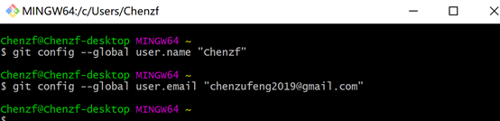
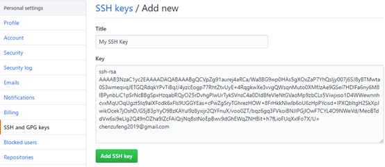
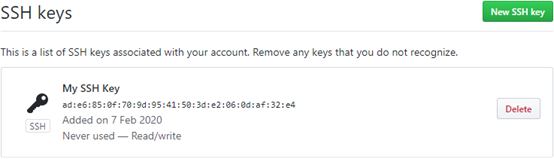
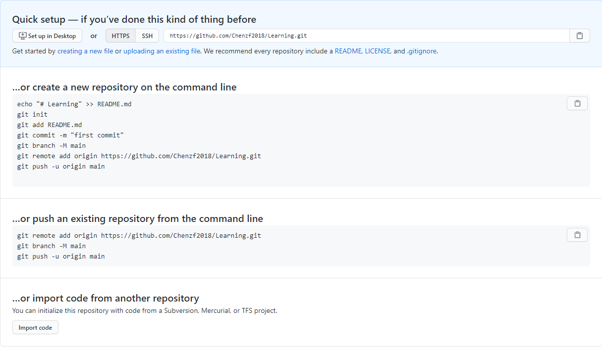

# Git简介

Git是目前世界上最先进的`分布式版本控制系统`。

# 安装与配置Git

在Windows上使用Git，可以从Git官网直接下载安装程序，然后按默认选项安装即可。安装完成后，在开始菜单里找到“Git”—>“Git Bash”，出现一个类似命令行窗口，就说明Git安装成功！

## 配置Git



注意`git confi`g命令的`--global`参数，用了这个参数，表示你这台机器上所有的Git仓库都会使用这个配置，当然也可以对某个仓库指定不同的用户名和Email地址。

## 创建版本库

版本库又名仓库（repository），可以理解成一个目录，这个目录里面的所有文件都可以被Git管理起来，每个文件的修改、删除，Git都能跟踪，以便任何时刻都可以追踪历史，或者在将来某个时刻可以“还原”。

创建一个版本库非常简单，首先，创建一个空目录。然后通过*`git init`*命令把这个目录变成Git可以管理的仓库：

```powershell
Chenzf@Chenzf MINGW64 ~
$ cd /d/LearnSomething

Chenzf@Chenzf MINGW64 /d/LearnSomething
$ ls
Git/  珍藏.md

Chenzf@Chenzf MINGW64 /d/LearnSomething
$ git init
Initialized empty Git repository in D:/LearnSomething/.git/

Chenzf@Chenzf MINGW64 /d/LearnSomething (master)
$ ls -ah
./  ../  .git/  Git/  珍藏.md

```

其中，*`.git`*目录是Git来跟踪管理版本库的。


# 远程仓库

可以找一台电脑充当服务器的角色，每天24小时开机，其他人都从这个“服务器”仓库克隆一份到自己的电脑上，并且把各自的提交推送到服务器仓库里，也从服务器仓库中拉取别人的提交。

GitHub是提供Git仓库托管服务的，所以，只要注册一个GitHub账号，就可以免费获得Git远程仓库。

## SSH Key

由于本地Git仓库和GitHub仓库之间的传输是通过SSH加密的，所以，需要进行设置：

- 创建SSH Key

  - 在用户主目录下，查看`.ssh`目录中*`id_rsa`*和*`id_rsa.pub`*，如果已经存在，可直接跳到下一步。如果没有，打开Shell(Windows下打开`Git Bash`)，创建`SSH Key`：

    ```powershell
    $ ssh-keygen -t rsa -C "chenzufeng2019@gmail.com"
    Generating public/private rsa key pair.
    Enter file in which to save the key (/c/Users/Chenzf/.ssh/id_rsa):
    Created directory '/c/Users/Chenzf/.ssh'.
    Enter passphrase (empty for no passphrase):
    Enter same passphrase again:
    Your identification has been saved in /c/Users/Chenzf/.ssh/id_rsa.
    Your public key has been saved in /c/Users/Chenzf/.ssh/id_rsa.pub.
    The key fingerprint is:
    SHA256:QjgSEnOQWYaD4EGykO80ncaTCR5b/aGYrstL9uaKY8o chenzufeng2019@gmail.com
    ```

  - *`id_rsa`*和*`id_rsa.pub`*是SSH Key的秘钥对，其中*`id_rsa`*是私钥，*`id_rsa.pub`*是公钥。

- 登陆GitHub，打开“Account settings”，“SSH Keys”页面。

  - 点“Add SSH Key”，填上任意Title，在Key文本框里粘贴`id_rsa.pub`文件的内容：

    

  - 

为什么GitHub需要`SSH Key`呢？因为GitHub需要识别出你推送的提交确实是你推送的，而不是别人冒充的。而Git支持`SSH`协议，所以，GitHub只要知道了你的公钥，就可以确认只有你自己才能推送。

`GitHub允许你添加多个Key`。假定你有若干电脑，你一会儿在公司提交，一会儿在家里提交，只要把每台电脑的Key都添加到GitHub，就可以在每台电脑上往GitHub推送了。

使用命令测试连接是否正常：

```powershell
$ ssh -T git@github.com
Hi Chenzf2018! You've successfully authenticated,
```


## 添加远程库

已经在本地创建了一个Git仓库后，又想在GitHub创建一个Git仓库，并且让这两个仓库进行远程同步，这样，`GitHub上的仓库既可以作为备份，又可以让其他人通过该仓库来协作`。

首先，登陆GitHub，然后，在右上角找到`Create a new repo`按钮，创建一个新的仓库。目前，在GitHub上的这个仓库还是空的，GitHub告诉我们，`可以从这个仓库克隆出新的仓库，也可以把一个已有的本地仓库与之关联`，然后，把本地仓库的内容推送到GitHub仓库。



在本地的Repositories仓库下运行命令：`用origin替代git@github.com:Chenzf2018/learningGit.git`

```powershell
Chenzf@Chenzf-desktop MINGW64 /d/Git/Repositories (master)
$ git remote add origin git@github.com:Chenzf2018/learningGit.git 
```

添加后，远程库的名字就是`origin`，这是Git默认的叫法，也可以改成别的，但是`origin`这个名字一看就知道是远程库。


## 推送到远程仓库

把本地库的所有内容推送到远程库上：

```shell
Chenzf@Chenzf-desktop MINGW64 /d/Git/LearningGit (master)
$ git push -u origin master
```

把本地库的内容推送到远程，用`git push`命令，实际上是把当前分支master推送到远程。

由于远程库是空的，我们第一次推送master分支时，加上了`-u`参数，Git不但会把本地的master分支内容推送的远程新的master分支，还会把本地的master分支和远程的master分支关联起来，在以后的推送或者拉取时就可以简化命令。

推送成功后，可以立刻在GitHub页面中看到远程库的内容已经和本地一模一样。从现在起，只要本地作了提交，就可以通过命令：`$ git push origin master`，把本地master分支的最新修改推送至GitHub！


