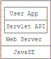
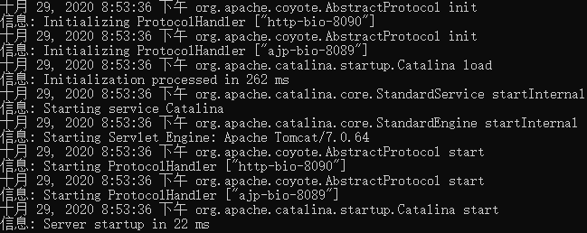
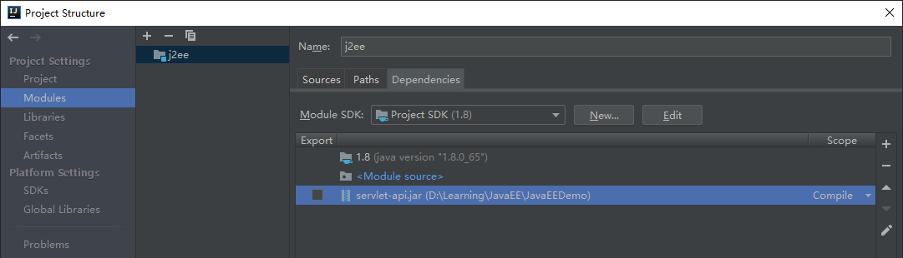
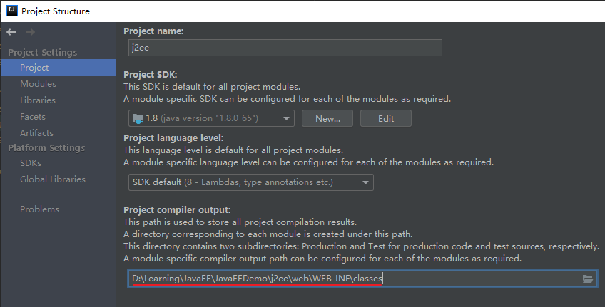
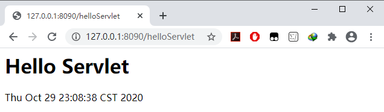

# Web开发

JavaEE是一种软件架构和设计思想，可以把JavaEE看作是在JavaSE的基础上，开发的一系列基于服务器的组件、API标准和通用架构。

JavaEE最核心的组件就是`基于Servlet标准的Web服务器`，开发者编写的应用程序是基于Servlet API并运行在Web服务器内部的：



访问网站，使用App时，都是基于Web的Browser/Server模式，简称BS架构。它的特点是，客户端只需要浏览器，应用程序的逻辑和数据都存储在服务器端。浏览器只需要请求服务器，获取Web页面，并把Web页面展示给用户即可。

Web页面具有极强的交互性。由于Web页面是用HTML编写的，而HTML具备超强的表现力，并且，服务器端升级后，客户端无需任何部署就可以使用到新的版本，因此，BS架构升级非常容易。

# Tomcat

Tomcat是常见的免费的**web服务器**，它不依赖其他插件，**可以独立达到提供web服务的效果**。

不使用tomcat也可以打开html页面，但是可以在浏览器的地址里看到 `file:d:/test.html`这样的格式，是通过**打开本地文件**的形式打开的。

使用tomcat后，可以这样`127.0.0.1:8080/test.html`像访问一个网站似的，访问一个html文件了。这是因为tomcat本身是一个web服务器，**`test.html`部署在了这个web服务器上**，所以就可以这样访问了。

## 启动Tomcat

下载解压后，运行批处理文件：`D:\WinSoftware\Tomcat\bin\startup.bat`，最后显示`信息: Server startup in 37 ms`，就表明启动成功了。Tomcat启动之后，**不要关闭**。关闭了就不能访问了。

## 部署网页

部署一个功能完备的web应用有很多种方式，但是如果只是部署一个`test.html`，很简单：

把`test.html`复制到`D:\WinSoftware\Tomcat\webapps\ROOT`目录下，就可以通过`http://127.0.0.1:8090/test.html`访问了。

## 改端口

tomcat的端口配置相关信息在server.xml中：
`<Connector port="8090" redirectPort="8443" connectionTimeout="20000" protocol="HTTP/1.1"/>`


## Tomcat部署

- 下载`tomcat_8080`，解压，并运行其bin目录下的`startup.bat`

  

- 下载一个J2EE应用来进行测试：`D:\Learning\JavaEE\JavaEEDemo\j2ee`

- 修改`D:\WinSoftware\tomcat_8080\conf\server.xml`中

  ```xml
  <Context path="/" docBase="D:\\Learning\\JavaEE\\JavaEEDemo\\j2ee\\web" debug="0" reloadable="false" />
  ```

  文件路径是**双斜杠**！

- 关闭tomcat，并重新运行`startup.bat`。 然后输入http://127.0.0.1:8090/hello

  

# Servlet

Servlet本身不能独立运行，需要在一个web应用中运行，而一个web应用是部署在tomcat中的。

所以开发一个servlet需要如下几个步骤

- 创建web应用项目
- 编写servlet代码
- 部署到tomcat中


## 创建项目导入servlet-api

创建一个Java项目`D:\Learning\JavaEE\JavaEEDemo\j2ee`，并导入`servlet-api.jar`：



## 编写HelloServlet

```java
import javax.servlet.http.HttpServlet;
import javax.servlet.http.HttpServletRequest;
import javax.servlet.http.HttpServletResponse;
import java.io.IOException;
import java.util.Date;

public class HelloServlet extends HttpServlet {
    public void doGet(HttpServletRequest request, HttpServletResponse response) {
        try {
            response.getWriter().println("<h1>Hello Servlet</h1>");
            response.getWriter().println(new Date());
            
        } catch (IOException e) {
            e.printStackTrace();
        }
    }
}
```

在浏览器中输入地址提交数据的方式是GET，所以该Servlet需要提供一个对应的doGet方法。


## 配置web.xml

创建`j2ee\web\WEB-INF\web.xml`：

```xml
<?xml version="1.0" encoding="UTF-8"?>
<web-app>

    <servlet>
        <servlet-name>HelloServlet</servlet-name>
        <servlet-class>HelloServlet</servlet-class>
    </servlet>

    <servlet-mapping>
        <servlet-name>HelloServlet</servlet-name>
        <url-pattern>/helloServlet</url-pattern>
    </servlet-mapping>

</web-app>
```

**`web.xml`提供路径与servlet的映射关系**——把`/helloServlet`这个路径，映射到`HelloServlet`这个类上！

- `<servlet>` 标签下的`<servlet-name>`与`<servlet-mapping>`标签下的`<servlet-name>`必须一样

- `<servlet-class>`与`<servlet-name>`可以不一样，但是为了便于理解与维护，一般都会写的一样。

## 指定项目输出到classes目录

把项目的class文件输出设置到`j2ee/web/WEB-INF/classes`下：



点击`Build Project`，生成`HelloServlet.class`，将其直接放在`classes`下。

Tomcat启动之后，在默认情况下，会到`WEB-INF/classes`这个目录下去寻找。 所以通过这一步的配置，使得IDEA的class文件输出到`WEB-INF/classes`目录下，就和tomcat兼容了。

## 配置tomcat的server.xml

为了把` j2ee/web`这个目录部署到tomcat中，需要修改`tomcat/conf/sever.xml`：==第2行==

```xml
<Host name="localhost"  appBase="webapps" unpackWARs="true" autoDeploy="true">
    <Context path="/" docBase="D:\\Learning\\JavaEE\\JavaEEDemo\\j2ee\\web" debug="0" reloadable="false" />
    <Valve className="org.apache.catalina.valves.AccessLogValve" directory="logs"
           prefix="localhost_access_log." suffix=".txt"
           pattern="%h %l %u %t &quot;%r&quot; %s %b" />
</Host>
```

`path="/" `就表示直接通过 http://127.0.0.1/helloServlet 就可以访问网页了：

