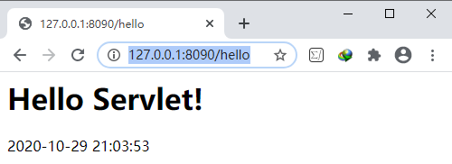
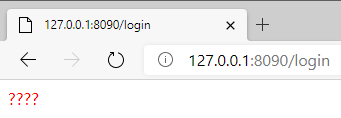

# 参考资料

[how2j](https://how2j.cn/k/servlet/servlet-eclipse/558.html)

# Web开发

JavaEE是一种软件架构和设计思想，可以把JavaEE看作是在JavaSE的基础上，开发的一系列基于服务器的组件、API标准和通用架构。

JavaEE最核心的组件就是`基于Servlet标准的Web服务器`，开发者编写的应用程序是基于Servlet API并运行在Web服务器内部的：


访问网站，使用App时，都是基于Web的Browser/Server模式，简称BS架构。它的特点是，客户端只需要浏览器，应用程序的逻辑和数据都存储在服务器端。浏览器只需要请求服务器，获取Web页面，并把Web页面展示给用户即可。

Web页面具有极强的交互性。由于Web页面是用HTML编写的，而HTML具备超强的表现力，并且，服务器端升级后，客户端无需任何部署就可以使用到新的版本，因此，BS架构升级非常容易。

# Tomcat

Tomcat是常见的免费的**web服务器**，它不依赖其他插件，**可以独立达到提供web服务的效果**。

不使用tomcat也可以打开html页面，但是可以在浏览器的地址里看到 `file:d:/test.html`这样的格式，是通过**打开本地文件**的形式打开的。

使用tomcat后，可以这样`127.0.0.1:8080/test.html`像访问一个网站似的，访问一个html文件了。这是因为tomcat本身是一个web服务器，**`test.html`部署在了这个web服务器上**，所以就可以这样访问了。

## 启动Tomcat

下载解压后，运行批处理文件：`D:\WinSoftware\Tomcat\bin\startup.bat`，最后显示`信息: Server startup in 37 ms`，就表明启动成功了。Tomcat启动之后，**不要关闭**。关闭了就不能访问了。

## 部署网页

部署一个功能完备的web应用有很多种方式，但是如果只是部署一个`test.html`，很简单：

把`test.html`复制到`D:\WinSoftware\Tomcat\webapps\ROOT`目录下，就可以通过`http://127.0.0.1:8090/test.html`访问了。

## 改端口

tomcat的端口配置相关信息在server.xml中：
`<Connector port="8090" redirectPort="8443" connectionTimeout="20000" protocol="HTTP/1.1"/>`


## Tomcat部署

- 下载`tomcat_8080`，解压，并运行其bin目录下的`startup.bat`

  

- 下载一个J2EE应用来进行测试：`D:\Learning\JavaEE\JavaEEDemo\j2ee`

- 修改`D:\WinSoftware\tomcat_8080\conf\server.xml`中

  ```xml
  <Context path="/" docBase="D:\\Learning\\JavaEE\\JavaEEDemo\\j2ee\\web" debug="0" reloadable="false" />
  ```

  文件路径是**双斜杠**！

- 关闭tomcat，并重新运行`startup.bat`。 然后输入http://127.0.0.1:8090/hello

  

# Servlet

Servlet本身不能独立运行，需要在一个web应用中运行，而一个web应用是部署在Tomcat中的。

所以开发一个servlet需要如下几个步骤

- 创建web应用项目
- 编写Servlet代码
- 部署到Tomcat中


## 示例

### 创建项目导入servlet-api

创建一个Java项目`D:\Learning\JavaEE\JavaEEDemo\j2ee`，并导入`servlet-api.jar`：


项目结构：


### 编写HelloServlet

```java
import javax.servlet.http.HttpServlet;
import javax.servlet.http.HttpServletRequest;
import javax.servlet.http.HttpServletResponse;
import java.io.IOException;
import java.util.Date;

public class HelloServlet extends HttpServlet {
    public void doGet(HttpServletRequest request, HttpServletResponse response) {
        try {
            response.getWriter().println("<h1>Hello Servlet</h1>");
            response.getWriter().println(new Date());
            
        } catch (IOException e) {
            e.printStackTrace();
        }
    }
}
```

在浏览器中输入地址提交数据的方式是GET，所以该Servlet需要提供一个对应的doGet方法。


### 配置web.xml

创建`j2ee\web\WEB-INF\web.xml`：

```xml
<?xml version="1.0" encoding="UTF-8"?>
<web-app>

    <servlet>
        <servlet-name>HelloServlet</servlet-name>
        <servlet-class>HelloServlet</servlet-class>
    </servlet>

    <servlet-mapping>
        <servlet-name>HelloServlet</servlet-name>
        <url-pattern>/helloServlet</url-pattern>
    </servlet-mapping>

</web-app>
```

**`web.xml`提供路径与servlet的映射关系——把`/helloServlet`这个路径，映射到`HelloServlet`这个类上**！

- `<servlet>` 标签下的`<servlet-name>`与`<servlet-mapping>`标签下的`<servlet-name>`必须一样

- `<servlet-class>`与`<servlet-name>`可以不一样，但是为了便于理解与维护，一般都会写的一样。

### 指定项目输出到classes目录

把项目的class文件输出设置到`j2ee/web/WEB-INF/classes`下：


点击`Build Project`，生成`HelloServlet.class`，将其直接放在`classes`下。

Tomcat启动之后，在默认情况下，会到`WEB-INF/classes`这个目录下去寻找。 所以通过这一步的配置，使得IDEA的class文件输出到`WEB-INF/classes`目录下，就和tomcat兼容了。

### 配置tomcat的server.xml

为了把` j2ee/web`这个目录部署到tomcat中，需要修改`tomcat/conf/sever.xml`：==第2行==

```xml
<Host name="localhost"  appBase="webapps" unpackWARs="true" autoDeploy="true">
    <Context path="/" docBase="D:\\Learning\\JavaEE\\JavaEEDemo\\j2ee\\web" debug="0" reloadable="false" />
    <Valve className="org.apache.catalina.valves.AccessLogValve" directory="logs"
           prefix="localhost_access_log." suffix=".txt"
           pattern="%h %l %u %t &quot;%r&quot; %s %b" />
</Host>
```

`path="/" `就表示直接通过 http://127.0.0.1/helloServlet 就可以访问网页了：


## Servlet获取参数

本例通过登录行为，演示servlet如何`获取从浏览器提交的账号密码`！

### 创建login.html

`web/login.html`

```html
<!DOCTYPE html>
<html>
    <head>
        <meta charset="UTF-8">
        <title>登录页面</title>
    </head>
    
    <body>
        <form action="login" method="post">
            账号: <input type="text" name="name"> <br>
            密码: <input type="password" name="password"> <br>
            <input type="submit" value="登录">
        </form>
    </body>
</html>
```

在`form`元素中：

- `action="login"`标题会提交到`login路径`，`login路径`在后续步骤会映射到`LoginServlet`
- `method="post"`方式表示提交的密码信息**在浏览器地址栏看不到**


### 创建LoginServlet

```java
import javax.servlet.http.HttpServlet;
import javax.servlet.http.HttpServletRequest;
import javax.servlet.http.HttpServletResponse;

public class LoginServlet extends HttpServlet {
    @Override
    protected void doPost(HttpServletRequest request, HttpServletResponse response) {
        String name = request.getParameter("name");
        String password = request.getParameter("password");
        System.out.println("name: " + name + "; password: " + password);
    }
}
```


### 映射LoginServlet到路径login

在`j2ee\web\WEB-INF\web.xml`中新增映射：

```xml
<?xml version="1.0" encoding="UTF-8"?>
<web-app>

    <servlet>
        <servlet-name>HelloServlet</servlet-name>
        <servlet-class>HelloServlet</servlet-class>
    </servlet>

    <servlet-mapping>
        <servlet-name>HelloServlet</servlet-name>
        <url-pattern>/helloServlet</url-pattern>
    </servlet-mapping>

    <!--映射LoginServlet到路径login-->
    <servlet>
        <servlet-name>LoginServlet</servlet-name>
        <servlet-class>LoginServlet</servlet-class>
    </servlet>
    
    <servlet-mapping>
        <servlet-name>LoginServlet</servlet-name>
        <url-pattern>/login</url-pattern>
    </servlet-mapping>

</web-app>
```


### 测试

- 点击`Build Project`

  

  将`LoginServlet.class`放在`j2ee\web\WEB-INF\classes`下

  

- 启动Tomcat：`‪D:\WinSoftware\tomcat_8080\bin\startup.bat`

- 访问页面：http://127.0.0.1:8090/login.html（注意`.html`）

  

- 输入账号密码，提交。然后**在tomcat的窗口**，就可以看到提交的账号和密码了

  

  

## Servlet返回响应

根据浏览器提交的账号密码**在页面**显示登录成功或者失败！

### 修改LoginServlet

判断账号密码是否为`admin 123`，如果是就打印`success`，否则就打印`fail`。

根据账号密码，创建对应的html字符串。然后通过`response.getWriter().println()`发送到浏览器

```java
import javax.servlet.http.HttpServlet;
import javax.servlet.http.HttpServletRequest;
import javax.servlet.http.HttpServletResponse;
import java.io.IOException;
import java.io.PrintWriter;

public class LoginServlet extends HttpServlet {
    @Override
    protected void doPost(HttpServletRequest request, HttpServletResponse response) {
        try {
            String name = request.getParameter("name");
            String password = request.getParameter("password");

            String html = null;
            if ("admin".equals(name) && "123".equals(password)) {
                html = "<div style='color:green'>success</div>";
            } else {
                html = "<div style='color:red'>fail</div>";
            }

            PrintWriter printWriter = response.getWriter();
            printWriter.println(html);

        } catch (IOException e) {
            e.printStackTrace();
        }
    }
}
```


### 测试

- 点击`Build Project`，将`LoginServlet.class`放在`j2ee\web\WEB-INF\classes`下

- 启动Tomcat：`‪D:\WinSoftware\tomcat_8080\bin\startup.bat`

- 访问页面：http://127.0.0.1:8090/login.html

- 提交数据

  

## Servlet调用流程图


1. 首先访问http://127.0.0.1:8090/login.html

   打开一个静态的html页面，在这个页面中可以通过form，以`post`的形式提交数据

2. /login路径

   在上一步的`login.html`中，用`form`把账号和密码，提交到`/login`这个路径，并且附带`method="post"`

   ```html
   <form action="login" method="post">
       账号: <input type="text" name="name"> <br>
       密码: <input type="password" name="password"> <br>
       <input type="submit" value="登录">
   </form>
   ```

3. 找到对应的Servlet

   tomcat接受到一个新的请求：http://127.0.0.1:8090/login，其路径是`/login`，接着就到[配置文件web.xml](# 配置web.xml)进行匹配，发现`/login`对应的`Servlet类`是 `LoginServlet`。接下来的工作，就会基于这个`LoginServlet`进行。

   ```xml
   <?xml version="1.0" encoding="UTF-8"?>
   <web-app>
   
       <servlet>
           <servlet-name>HelloServlet</servlet-name>
           <servlet-class>HelloServlet</servlet-class>
       </servlet>
   
       <servlet-mapping>
           <servlet-name>HelloServlet</servlet-name>
           <url-pattern>/helloServlet</url-pattern>
       </servlet-mapping>
   
       <!--映射路径/login到LoginServlet-->
       <servlet>
           <servlet-name>LoginServlet</servlet-name>
           <servlet-class>LoginServlet</servlet-class>
       </servlet>
   
       <servlet-mapping>
           <servlet-name>LoginServlet</servlet-name>
           <url-pattern>/login</url-pattern>
       </servlet-mapping>
   
   </web-app>
   ```

4. 实例化Servlet对象

   Tomcat定位到了`LoginServlet`后，发现并没有`LoginServlet`的实例存在，于是就调用`LoginServlet`的public无参构造方法`LoginServlet()`，实例化一个`LoginServlet`对象。

5. 调用doGet或者doPost

   Tomcat从上一步拿到了`LoginServlet`的实例之后，根据页面`login.html`提交信息的时候带的`method="post"`，去调用对应的`doPost`方法。

   ```java
   import javax.servlet.http.HttpServlet;
   import javax.servlet.http.HttpServletRequest;
   import javax.servlet.http.HttpServletResponse;
   import java.io.IOException;
   import java.io.PrintWriter;
   
   public class LoginServlet extends HttpServlet {
       @Override
       protected void doPost(HttpServletRequest request, HttpServletResponse response) {
           try {
               String name = request.getParameter("name");
               String password = request.getParameter("password");
   
               String html = null;
               if ("admin".equals(name) && "123".equals(password)) {
                   html = "<div style='color:green'>success</div>";
               } else {
                   html = "<div style='color:red'>fail</div>";
               }
   
               PrintWriter printWriter = response.getWriter();
               printWriter.println(html);
   
           } catch (IOException e) {
               e.printStackTrace();
           }
       }
   }
   ```

6. request获取参数

   在`doPost`方法中，通过参数`request`，**把页面上传递来的账号和密码信息取出来**！

   ```java
   String name = request.getParameter("name");
   String password = request.getParameter("password");
   ```

7. response设置响应

   接着，根据账号和密码是否正确(判断是否是admin和123)， 创建不同的html字符串。然后**把html字符串通过如下方式，设置在了response对象上**：

   ```java
   PrintWriter printWriter = response.getWriter();
   printWriter.println(html);
   ```

   到这里，Servlet的工作就做完了。

8. tomcat把html传递给浏览器

   在Servlet完成工作之后，**tomcat拿到被Servlet修改过的response，根据这个response生成html字符串**，然后再通过HTTP协议，将html字符串回发给浏览器，浏览器再根据HTTP协议获取这个html字符串，并**渲染**在界面上。


## service()

### doGet()

当浏览器**使用get方式提交数据**的时候，servlet需要提供`doGet()`方法

```java
public void doGet(HttpServletRequest request, HttpServletResponse response) {
    try {
        response.getWriter().println("<h1>Hello Servlet</h1>");
        response.getWriter().println(new Date());
    } catch (IOException e) {
        e.printStackTrace();
    }
}
```


哪些是get方式呢？

- form默认的提交方式
- 如果通过一个超链访问某个地址
- 如果在地址栏直接输入某个地址
- ajax指定使用get方式的时候


### doPost()

当浏览器**使用post方式提交数据**的时候，servlet需要提供`doPost()`方法

```java
    @Override
    protected void doPost(HttpServletRequest request, HttpServletResponse response) {
        try {

            request.setCharacterEncoding("UTF-8");

            String name = request.getParameter("name");
            String password = request.getParameter("password");

            String html = null;
            if ("祖峰".equals(name) && "123".equals(password)) {
                html = "<div style='color:green'>登录成功</div>";
            } else {
                html = "<div style='color:red'>登录失败</div>";
            }

            System.out.println("name: " + name + "; password: " + password);

            response.setContentType("text/html; charset=UTF-8");
            PrintWriter printWriter = response.getWriter();
            printWriter.println(html);

        } catch (IOException e) {
            e.printStackTrace();
        }
    }
```


哪些是post方式呢？

- 在form上显示设置`method="post"`的时候
- ajax指定post方式的时候

```html
<form action="login" method="post">
    账号: <input type="text" name="name"> <br>
    密码: <input type="password" name="password"> <br>
    <input type="submit" value="登录">
</form>
```


### service()

`LoginServlet`继承了`HttpServlet`，同时也继承了一个方法

```java
service(HttpServletRequest, HttpServletResponse)
```

在执行`doGet()`或者`doPost()`之前，都会先执行`service()`，由`service()`方法进行判断，到底该调用`doGet()`还是`doPost()`。

`service()`、`doGet()`、`doPost()` 三种方式的参数列表都是一样的，所以，可以**直接重写service()**方法，在其中提供相应的服务，不用区分是`get`还是`post`了。

比如把前面的登录的`LoginServlet`，改为提供`service`方法，也可以达到相同的效果


## Servlet中文问题

### 获取中文的参数


1. 修改`login.html`：添加

   ```html
   <meta http-equiv="Content-Type" content="text/html; charset=UTF-8">
   ```

   

2. 在servlet进行解码和编码：==第12行==

   ```java
   import javax.servlet.http.HttpServlet;
   import javax.servlet.http.HttpServletRequest;
   import javax.servlet.http.HttpServletResponse;
   import java.io.IOException;
   import java.io.PrintWriter;
   
   public class LoginServlet extends HttpServlet {
       @Override
       protected void service(HttpServletRequest request, HttpServletResponse response) {
           try {
               
               request.setCharacterEncoding("UTF-8");
               
               String name = request.getParameter("name");
               String password = request.getParameter("password");
   
               String html = null;
               if ("陈祖峰".equals(name) && "123".equals(password)) {
                   html = "<div style='color:green'>success</div>";
               } else {
                   html = "<div style='color:red'>fail</div>";
               }
   
               System.out.println("name: " + name + "; password: " + password);
               
               PrintWriter printWriter = response.getWriter();
               printWriter.println(html);
   
           } catch (IOException e) {
               e.printStackTrace();
           }
       }
   }
   ```


3. 输出结果


### 返回中文的响应



在Servlet中，加上

```java
response.setContentType("text/html; charset=UTF-8");
```


```java
import javax.servlet.http.HttpServlet;
import javax.servlet.http.HttpServletRequest;
import javax.servlet.http.HttpServletResponse;
import java.io.IOException;
import java.io.PrintWriter;

public class LoginServlet extends HttpServlet {
    @Override
    protected void service(HttpServletRequest request, HttpServletResponse response) {
        try {

            request.setCharacterEncoding("UTF-8");

            String name = request.getParameter("name");
            String password = request.getParameter("password");

            String html = null;
            if ("祖峰".equals(name) && "123".equals(password)) {
                html = "<div style='color:green'>登录成功</div>";
            } else {
                html = "<div style='color:red'>登录失败</div>";
            }

            System.out.println("name: " + name + "; password: " + password);

            response.setContentType("text/html; charset=UTF-8");
            PrintWriter printWriter = response.getWriter();
            printWriter.println(html);

        } catch (IOException e) {
            e.printStackTrace();
        }
    }
}
```


结果：


## Servlet生命周期

一个Servlet的生命周期由[实例化](# 实例化)，[初始化](# 初始化)，[提供服务](# 提供服务)，[销毁](# 销毁)，[被回收](# 被回收)几个步骤组成：


### 实例化

当用户**通过浏览器输入一个路径**，这个路径对应的servlet被调用的时候，该Servlet就会被实例化！

为`LoginServlet`显式提供一个构造方法`LoginServlet()`

```java
public class LoginServlet extends HttpServlet {

    public LoginServlet() {
        System.out.println("LoginServlet构造方法被调用。。。");
    }

    @Override
    protected void service(HttpServletRequest request, HttpServletResponse response) {
        // 略
    }
}

```


然后通过浏览器访问http://127.0.0.1:8090/login.html，就可以观察到：


无论访问了多少次`LoginServlet`，`LoginServlet构造方法`**只会执行一次**，所以Servlet是**单实例的**！


### 初始化

`LoginServlet`继承了`HttpServlet`，同时也继承了`init(ServletConfig)`方法！

```java
public class LoginServlet extends HttpServlet {

    public LoginServlet() {
        System.out.println("LoginServlet构造方法被调用。。。");
    }

    @Override
    public void init() {
        System.out.println("LoginServlet继承了init(ServletConfig)方法！");
    }

    @Override
    protected void service(HttpServletRequest request, HttpServletResponse response) {
        // 略
    }
}

```


`init`方法是一个实例方法，所以会在构造方法执行后执行。


无论访问了多少次`LoginSerlvet`，`init初始化`**只会执行一次**。


### 提供服务

接下来就是执行`service()`方法，然后通过浏览器传递过来的信息进行判断，是调用`doGet()`还是`doPost()`方法

在service()中就会编写我们的**业务代码**，在本例中就是判断用户输入的账号和密码是否正确

```java
import javax.servlet.http.HttpServlet;
import javax.servlet.http.HttpServletRequest;
import javax.servlet.http.HttpServletResponse;
import java.io.IOException;
import java.io.PrintWriter;

public class LoginServlet extends HttpServlet {

    public LoginServlet() {
        System.out.println("LoginServlet构造方法被调用。。。");
    }

    @Override
    public void init() {
        System.out.println("LoginServlet继承了init(ServletConfig)方法！");
    }

    @Override
    protected void service(HttpServletRequest request, HttpServletResponse response) {
        try {

            request.setCharacterEncoding("UTF-8");

            String name = request.getParameter("name");
            String password = request.getParameter("password");

            String html = null;
            if ("祖峰".equals(name) && "123".equals(password)) {
                html = "<div style='color:green'>登录成功</div>";
            } else {
                html = "<div style='color:red'>登录失败</div>";
            }

            System.out.println("name: " + name + "; password: " + password);

            response.setContentType("text/html; charset=UTF-8");
            PrintWriter printWriter = response.getWriter();
            printWriter.println(html);

        } catch (IOException e) {
            e.printStackTrace();
        }
    }
}
```


### 销毁

在如下几种情况下，会调用`destroy()`

1. 该Servlet所在的web应用重新启动
   在Tomcat的`conf/server.xml`中配置该web应用的时候用到了

   ```xml
   <Context path="/" docBase="D:\\Learning\\JavaEE\\JavaEEDemo\\j2ee\\web" debug="0" reloadable="false" />
   ```

   如果把`reloadable="false"`改为`reloadable="true"`就表示有任何类发生的更新，web应用会**自动重启**。当web应用自动重启的时候，`destroy()`方法就会被调用。

2. 关闭tomcat的时候`destroy()`方法会被调用，但是这个一般都发生的很快，不易被发现。

### 被回收

当该Servlet被销毁后，就满足垃圾回收的条件了。 当下一次垃圾回收GC来临的时候，就有可能被回收。


## Servlet跳转

页面跳转是开发一个web应用经常会发生的事情，比如登录成功或是失败后，分别会跳转到不同的页面。

跳转的方式有两种，**服务端跳转**和**客户端跳转**。

在web目录下准备两个页面`success.html`、`fail.html`分别用于显示登录成功或者登录失败。

==第29、31行==

```java
import javax.servlet.http.HttpServlet;
import javax.servlet.http.HttpServletRequest;
import javax.servlet.http.HttpServletResponse;
import java.io.IOException;
import java.io.PrintWriter;

public class LoginServlet extends HttpServlet {

    public LoginServlet() {
        System.out.println("LoginServlet构造方法被调用。。。");
    }

    @Override
    public void init() {
        System.out.println("LoginServlet继承了init(ServletConfig)方法！");
    }

    @Override
    protected void service(HttpServletRequest request, HttpServletResponse response) {
        try {

            request.setCharacterEncoding("UTF-8");

            String name = request.getParameter("name");
            String password = request.getParameter("password");

            String html = null;
            if ("祖峰".equals(name) && "123".equals(password)) {
                request.getRequestDispatcher("success.html").forward(request, response);
            } else {
                response.sendRedirect("fail.html");
            }

            System.out.println("name: " + name + "; password: " + password);

            response.setContentType("text/html; charset=UTF-8");
            PrintWriter printWriter = response.getWriter();
            printWriter.println(html);

        } catch (Exception e) {
            e.printStackTrace();
        }
    }
}
```


### 服务端跳转

在Servlet中进行服务端跳转的方式：

```java
HttpServletRequest.getRequestDispatcher("success.html").forward(request, response);
```


服务端跳转可以看到浏览器的地址依然是`/login`路径，并不会变成`success.html`！

### 客户端跳转

在Servlet中进行客户端跳转的方式：

```java
HttpServletResponse.sendRedirect("fail.html");
```


可以观察到，**浏览器地址发生了变化**！


### 服务端跳转与客户端跳转图示


## Servlet自启动

有的时候tomcat一启动，就需要执行一些初始化的代码，比如校验数据库的完整性等。但是`Servlet的生命周期是在用户访问浏览器对应的路径开始的`。如果没有用户的第一次访问，就无法执行相关代码。

这个时候，就需要**Servlet实现自启动**。即，伴随着tomcat的启动，自动启动初始化，在初始化方法`init()`中，就可以进行一些业务代码的工作了。

### load-on-startup

在`web.xml`中，配置`HelloServlet`的地方，增加

```xml
<load-on-startup>10</load-on-startup>
```

**`10`**表示启动顺序（取值范围是1-99），**如果有多个Servlet都配置了自动启动，数字越小，启动的优先级越高**。

```xml
<?xml version="1.0" encoding="UTF-8"?>
<web-app>

    <!--映射HelloServlet到路径helloServlet-->
    <servlet>
        <servlet-name>HelloServlet</servlet-name>
        <servlet-class>HelloServlet</servlet-class>
        <load-on-startup>10</load-on-startup>
    </servlet>

    <servlet-mapping>
        <servlet-name>HelloServlet</servlet-name>
        <url-pattern>/helloServlet</url-pattern>
    </servlet-mapping>

    <!--映射LoginServlet到路径login-->
    <servlet>
        <servlet-name>LoginServlet</servlet-name>
        <servlet-class>LoginServlet</servlet-class>
    </servlet>

    <servlet-mapping>
        <servlet-name>LoginServlet</servlet-name>
        <url-pattern>/login</url-pattern>
    </servlet-mapping>

</web-app>
```


表明该Servlet会随着Tomcat的启动而初始化，同时，为`HelloServlet`提供一个`init(ServletConfig)`方法，验证自启动。

```java
import javax.servlet.ServletConfig;
import javax.servlet.http.HttpServlet;
import javax.servlet.http.HttpServletRequest;
import javax.servlet.http.HttpServletResponse;
import java.io.IOException;
import java.util.Date;

public class HelloServlet extends HttpServlet {
    
    public void init(ServletConfig config) {
        System.out.println("init of HelloServlet");
    }
    
    @Override
    public void doGet(HttpServletRequest request, HttpServletResponse response) {
        try {
            response.getWriter().println("<h1>Hello Servlet</h1>");
            response.getWriter().println(new Date());

        } catch (IOException e) {
            e.printStackTrace();
        }
    }
}
```


启动Tomcat：


## request方法

### 常用方法

- **`request.getRequestURL()`**：浏览器发出请求时的完整URL，包括协议、主机名、端口
- **`request.getRequestURI()`**：浏览器发出请求的资源名部分，去掉了协议和主机名
- **`request.getQueryString()`**：请求行中的参数部分，只能显示以get方式发出的参数，post方式的看不到
- **`request.getRemoteAddr()`**：浏览器所处于的客户机的IP地址
- **`request.getRemoteHost()`**：浏览器所处于的客户机的主机名
- **`request.getRemotePort()`**：浏览器所处于的客户机使用的网络端口
- **`request.getLocalAddr()`**：服务器的IP地址
- **`request.getLocalName()`**：服务器的主机名
- **`request.getMethod()`**：得到客户机请求方式一般是GET或者POST


在`web.xml`中添加

```xml
    <!--映射TestRequest到路径testRequest-->
    <servlet>
        <servlet-name>TestRequest</servlet-name>
        <servlet-class>TestRequest</servlet-class>
    </servlet>

    <servlet-mapping>
        <servlet-name>TestRequest</servlet-name>
        <url-pattern>/testRequest</url-pattern>
    </servlet-mapping>
```

创建`TestRequest`：

```java
import javax.servlet.http.HttpServlet;
import javax.servlet.http.HttpServletRequest;
import javax.servlet.http.HttpServletResponse;
import java.io.IOException;
import java.io.PrintWriter;

public class TestRequest extends HttpServlet {
    @Override
    protected void service(HttpServletRequest request, HttpServletResponse response) {
        try {
            String name = request.getParameter("name");
            String password = request.getParameter("password");

            System.out.println("浏览器发出请求时的完整URL：" + request.getRequestURL());
            System.out.println("浏览器发出请求的资源名部分：" + request.getRequestURI());
            System.out.println("请求行中的参数部分：" + request.getQueryString());
            System.out.println("浏览器所处于的客户机的IP地址：" + request.getRemoteAddr());
            System.out.println("浏览器所处于的客户机的主机名：" + request.getRemoteHost());
            System.out.println("浏览器所处于的客户机使用的网络端口：" + request.getRemotePort());
            System.out.println("服务器的IP地址：" + request.getLocalAddr());
            System.out.println("服务器的主机名：" + request.getLocalName());
            System.out.println("得到客户机请求方式：" + request.getMethod());

            String html;
            if ("admin".equals(name) && "123".equals(password)) {
                html = "<div style='color:green'>登录成功</div>";
            } else {
                html = "<div style='color:red'>登录失败</div>";
            }

            response.setContentType("text/html; charset=UTF-8");
            PrintWriter printWriter = response.getWriter();
            printWriter.println(html);

        } catch (IOException e) {
            e.printStackTrace();
        }
    }
}
```

`Build Project`；将`TestReauest.class`文件至于`web/WEB-INF/classes`下；启动Tomcat；

访问地址：http://127.0.0.1:8090/testRequest?name=chenzf&password=123


### 获取参数

- **`request.getParameter()`**：是常见的方法，用于获取单值的参数
- **`request.getParameterValues()`**：用于获取具有多值的参数，比如注册时候提交的 "hobits"，可以是多选的。
- **`request.getParameterMap()`**：用于遍历所有的参数，并返回Map类型。


创建`j2ee\web\register.html`

```html
<!DOCTYPE html>

<meta http-equiv="Content-Type" content="text/html; charset=UTF-8">

<html>

<head>
    <meta charset="UTF-8">
    <title>登录页面</title>
</head>

<body>
<form action="registerServlet" method="get">
	账号 ：<input type="text" name="name"> <br>
    爱好 ：LOL<input type="checkbox" name="hobbies" value="lol">
           DOTA<input type="checkbox" name="hobbies" value="dota"> <br>
    <input type="submit" value="注册">
</form>
</body>

</html>
```


创建`RegisterServlet`

```java
import javax.servlet.http.HttpServlet;
import javax.servlet.http.HttpServletRequest;
import javax.servlet.http.HttpServletResponse;
import java.util.Arrays;
import java.util.Map;
import java.util.Set;

public class RegisterServlet extends HttpServlet {
    @Override
    public void service(HttpServletRequest request, HttpServletResponse response) {
        System.out.println("获取单值参数name：" + request.getParameter("name"));

        String[] hobbies = request.getParameterValues("hobbies");
        System.out.println("获取具有多值的参数hobbies: " + Arrays.asList(hobbies));

        System.out.println("通过getParameterMap遍历所有参数：");
        Map<String, String[]> parameters = request.getParameterMap();

        Set<String> parameterNames = parameters.keySet();
        for (String parameterName : parameterNames) {
            String[] value = parameters.get(parameterName);
            System.out.println(parameterName + " : " + Arrays.asList(value));
        }
    }
}
```


修改`web/WEB-INF/web.xml`

```xml
   <!--映射路径registerServlet到RegisterServlet-->
    <servlet>
        <servlet-name>RegisterServlet</servlet-name>
        <servlet-class>RegisterServlet</servlet-class>
    </servlet>

    <servlet-mapping>
        <servlet-name>RegisterServlet</servlet-name>
        <url-pattern>/registerServlet</url-pattern>
    </servlet-mapping>
```

`Build Project`；将`TestReauest.class`文件至于`web/WEB-INF/classes`下；启动Tomcat；

访问地址：http://127.0.0.1:8090/register.html


点击注册：`<form action="registerServlet" method="get">`

浏览器跳转至http://127.0.0.1:8090/registerServlet?name=chenzf&hobbies=lol


### 获取头信息

- **`request.getHeader()`**：获取浏览器传递过来的头信息。
  比如`getHeader("user-agent")`可以获取浏览器的基本资料，这样就能判断是firefox、IE、chrome、或者是safari浏览器
- **`request.getHeaderNames()`**：获取浏览器所有的**头信息名称**，根据头信息名称就能遍历出所有的头信息

修改`HelloServlet`，使其获取头信息。访问`HelloServlet`获取如下头信息：

- host: 主机地址
- user-agent：浏览器基本资料
- accept：表示浏览器接受的数据类型
- accept-language：表示浏览器接受的语言
- accept-encoding：表示浏览器接受的**压缩方式**，并非编码
- connection：是否保持连接
- cache-control：缓存时限


```java
import javax.servlet.ServletConfig;
import javax.servlet.http.HttpServlet;
import javax.servlet.http.HttpServletRequest;
import javax.servlet.http.HttpServletResponse;
import java.io.IOException;
import java.util.Date;
import java.util.Enumeration;

public class HelloServlet extends HttpServlet {

    @Override
    public void init(ServletConfig config) {
        System.out.println("init of HelloServlet");
    }

    @Override
    public void doGet(HttpServletRequest request, HttpServletResponse response) {

        Enumeration<String> headerNames = request.getHeaderNames();
        while (headerNames.hasMoreElements()) {
            String header = headerNames.nextElement();
            String value = request.getHeader(header);
            System.out.printf("%s\t%s%n", header, value);
        }
        
        try {
            response.getWriter().println("<h1>Hello Servlet</h1>");
            response.getWriter().println(new Date());

        } catch (IOException e) {
            e.printStackTrace();
        }
    }
}
```


`Build Project`；将`TestReauest.class`文件至于`web/WEB-INF/classes`下；启动Tomcat；

访问地址：http://127.0.0.1:8090/helloServlet


### setAttribute和getAttribute

`setAttribute`和`getAttribute`可以用来在进行`服务端跳转`的时候，`在不同的Servlet之间进行数据共享`。

在[MVC](https://how2j.cn/k/mvc/mvc-tutorials/561.html)章节会详细介绍这两个方法的用途。


## response用法

### 设置响应内容

```java
PrintWriter printWriter = response.getWriter();
printWriter.println("<h1>Hello Servlet</h1>");
```

通过`response.getWriter()`获取一个`PrintWriter`对象，可以使用`println()、append()、write()、format()`等等方法设置返回给浏览器的`html`内容。


### 设置响应格式

```java
response.setContentType("text/html; charset=UTF-8");
```

`text/html`的意思是将文件的`content-type`设置为`text/html`的形式，**浏览器在获取到这种文件时会自动调用`html`的解析器对文件进行相应的处理**。

在[request获取头信息](# 获取头信息)中对应`request.getHeader("accept")`。

`text/html`存在，浏览器可以识别这种格式，如果换一个其他的格式， 比如"text/htm" ，浏览器不能识别，那么打开此servlet就会弹出一个下载的对话框：


创建`TestResponse`

```java
import javax.servlet.http.HttpServlet;
import javax.servlet.http.HttpServletRequest;
import javax.servlet.http.HttpServletResponse;
import java.io.IOException;
import java.io.PrintWriter;

public class TestResponse extends HttpServlet {
    @Override
    protected void doGet(HttpServletRequest request, HttpServletResponse response) throws IOException {
        PrintWriter printWriter = response.getWriter();
        printWriter.println("<h1>Hello Servlet</h1>");
        response.setContentType("xxx");
    }
}

```


在`web.xml`中配置：

```xml
    <!--映射TestResponse到路径testResponse-->
    <servlet>
        <servlet-name>TestResponse</servlet-name>
        <servlet-class>TestResponse</servlet-class>
    </servlet>

    <servlet-mapping>
        <servlet-name>TestResponse</servlet-name>
        <url-pattern>/testResponse</url-pattern>
    </servlet-mapping>
```


`Build Project`；将`TestReauest.class`文件至于`web/WEB-INF/classes`下；启动Tomcat；

使用IE浏览器访问地址：http://127.0.0.1:8090/testResponse


### 设置响应编码

设置响应编码有两种方式：

```java
response.setContentType("text/html; charset=UTF-8");
response.setCharacterEncoding("UTF-8");
```

这两种方式都**需要在`response.getWriter`调用之前执行才能生效**。

他们的区别在于：

```java
response.setContentType("text/html; charset=UTF-8");
```

不仅**发送到浏览器的内容会使用UTF-8编码**，而且还通知**浏览器使用UTF-8编码方式进行显示**。所以总能正常显示中文！

```java
response.setCharacterEncoding("UTF-8");
```

仅仅是**发送的浏览器的内容是UTF-8编码**的，至于**浏览器是用哪种编码方式显示不管**。 所以当浏览器的显示编码方式不是UTF-8的时候，就会看到乱码，需要手动再进行一次设置。


### 301和302客户端跳转

客户端有两种跳转

- 302 表示**临时**跳转
- 301 表示永久性跳转

302就是前面在[客户端跳转](# 客户端跳转)章节用到过：`LoginServlet`

```java
HttpServletResponse.sendRedirect("fail.html");
```

301要使用：

```java
response.setStatus(301);
response.setHeader("Location", "fail.html");
```

301和302的区别主要在搜索引擎对页面排名的时候有影响。

```java
import javax.servlet.http.HttpServlet;
import javax.servlet.http.HttpServletRequest;
import javax.servlet.http.HttpServletResponse;
import java.io.PrintWriter;

public class LoginServlet extends HttpServlet {

    public LoginServlet() {
        System.out.println("LoginServlet构造方法被调用。。。");
    }

    @Override
    public void init() {
        System.out.println("LoginServlet继承了init(ServletConfig)方法！");
    }

    @Override
    protected void service(HttpServletRequest request, HttpServletResponse response) {
        try {

            request.setCharacterEncoding("UTF-8");

            String name = request.getParameter("name");
            String password = request.getParameter("password");

            String html = null;
            if ("祖峰".equals(name) && "123".equals(password)) {
                request.getRequestDispatcher("success.html").forward(request, response);
            } else {
                response.setStatus(301);
                response.sendRedirect("fail.html");
            }

            System.out.println("name: " + name + "; password: " + password);

            response.setContentType("text/html; charset=UTF-8");
            PrintWriter printWriter = response.getWriter();
            printWriter.println(html);

        } catch (Exception e) {
            e.printStackTrace();
        }
    }
}
```


`Build Project`；将`LoginServlet.class`文件至于`web/WEB-INF/classes`下；启动Tomcat；

访问地址：http://127.0.0.1:8090/login


### 设置不使用缓存

使用缓存可以加快页面的加载，降低服务端的负担。但是也可能看到过时的信息，可以通过如下手段通知浏览器不要使用缓存

```java
response.setDateHeader("Expires",0 );
response.setHeader("Cache-Control","no-cache");
response.setHeader("pragma","no-cache");
```


# CRUD

`CRUD`是常见的页面功能，即增删改查：

- C - Creation 增加
- R - Retrieve 查询
- U - Update 修改
- D - DELETE 删除

本章节将介绍如何与JDBC结合，通过servlet查询数据库，根据查询结果，得到一个html页面，显示数据库中的内容。

项目地址：`D:\Learning\JavaEE\JavaEEDemo\JavaEECURD`

## 查询

### 创建实体类

创建`bean.Hero`

```java
package bean;

public class Hero {
    public int id;
    public String name;
    public float hp;
    public int damage;

    public int getId() {
        return id;
    }

    public void setId(int id) {
        this.id = id;
    }

    public String getName() {
        return name;
    }

    public void setName(String name) {
        this.name = name;
    }

    public float getHp() {
        return hp;
    }

    public void setHp(float hp) {
        this.hp = hp;
    }

    public int getDamage() {
        return damage;
    }

    public void setDamage(int damage) {
        this.damage = damage;
    }
}
```


### 创建DAO类

准备一个`HeroDAO`，提供增加，删除，修改，查询等常规数据库操作方法：

```java
package dao;

import bean.Hero;

import java.sql.*;
import java.util.ArrayList;
import java.util.List;

public class HeroDAO {

    public HeroDAO() {
        try {
            Class.forName("com.mysql.jdbc.Driver");
        } catch (ClassNotFoundException e) {
            e.printStackTrace();
        }
    }

    public Connection getConnection() throws SQLException {
        return DriverManager.getConnection("jdbc:mysql://127.0.0.1:3306/javaeecurd?characterEncoding=UTF-8",
                                                                        "root", "admin");
    }

    public int getTotal() {
        int total = 0;
        try(Connection connection = getConnection(); Statement statement = connection.createStatement();) {
            String sql = "SELECT COUNT(*) FROM hero";
            ResultSet resultSet = statement.executeQuery(sql);
            while (resultSet.next()) {
                total = resultSet.getInt(1);
            }
            System.out.println("Total: " + total);
            
        } catch (SQLException e) {
            e.printStackTrace();
        }
        
        return total;
    }
    
    public void add(Hero hero) {
        String sql = "INSERT INTO hero VALUES(null, ?, ?, ?)";
        try(Connection connection = getConnection(); PreparedStatement preparedStatement = connection.prepareStatement(sql)) {
            preparedStatement.setString(1, hero.name);
            preparedStatement.setFloat(2, hero.hp);
            preparedStatement.setInt(3, hero.damage);
            
            preparedStatement.execute();
            
            ResultSet resultSet = preparedStatement.getGeneratedKeys();
            if (resultSet.next()) {
                int id = resultSet.getInt(1);
                hero.id = id;
            }
        } catch (SQLException e) {
            e.printStackTrace();
        }
    }
    
    public void delete(int id) {
        try(Connection connection = getConnection(); Statement statement = connection.createStatement();) {
            String sql = "DELETE FROM hero WHERE id = " + id;
            statement.execute(sql);
        } catch (SQLException e) {
            e.printStackTrace();
        }
    }
    
    public void update(Hero hero) {
        String sql = "UPDATE hero SET name = ?, hp = ?, damage = ? WHERE id = ?";
        try(Connection connection = getConnection(); PreparedStatement preparedStatement = connection.prepareStatement(sql);) {
            preparedStatement.setString(1, hero.name);
            preparedStatement.setFloat(2, hero.hp);
            preparedStatement.setInt(3, hero.damage);
            preparedStatement.setInt(4, hero.id);
            
            preparedStatement.execute();
            
        } catch (SQLException e) {
            e.printStackTrace();
        }
    }
    
    public Hero get(int id) {
        Hero hero = null;
        try(Connection connection = getConnection(); Statement statement = connection.createStatement();) {
            String sql = "SELECT * FROM hero WHERE id = " + id;
            ResultSet resultSet = statement.executeQuery(sql);
            if (resultSet.next()) {
                hero = new Hero();
                String name = resultSet.getString(2);
                float hp = resultSet.getFloat("hp");
                int damage = resultSet.getInt(4);
                
                hero.name = name;
                hero.hp = hp;
                hero.damage = damage;
                hero.id = id;
            }
        } catch (SQLException e) {
            e.printStackTrace();
        }
        
        return hero;
    }
    
    public List<Hero> list() {
        return list(0, Short.MAX_VALUE);
    }
    
    public List<Hero> list(int start, int count) {
        List<Hero> heroes = new ArrayList<>();
        String sql = "SELECT * FROM hero ORDER BY id DESC LIMIT ?, ?";
        try(Connection connection = getConnection(); PreparedStatement preparedStatement = connection.prepareStatement(sql);) {
            preparedStatement.setInt(1, start);
            preparedStatement.setInt(2, count);
            
            ResultSet resultSet = preparedStatement.executeQuery();
            while (resultSet.next()) {
                Hero hero = new Hero();
                int id = resultSet.getInt(1);
                String name = resultSet.getString(2);
                float hp = resultSet.getFloat("hp");
                int damage = resultSet.getInt(4);
                
                hero.id = id;
                hero.name = name;
                hero.hp = hp;
                hero.damage = damage;
                heroes.add(hero);
            }
        } catch (SQLException e) {
            e.printStackTrace();
        }
        
        return heroes;
    }
}
```


### 创建数据库及表

```mysql
CREATE DATABASE `JavaEECURD` CHARACTER SET 'utf8';
```


```mysql
DROP TABLE IF EXISTS `hero`;
 
CREATE TABLE `hero` (
	`id` INT ( 11 ) NOT NULL AUTO_INCREMENT,
	`name` VARCHAR ( 30 ) DEFAULT NULL,
	`hp` FLOAT DEFAULT NULL,
	`damage` INT ( 11 ) DEFAULT NULL,
PRIMARY KEY ( `id` ) 
) ENGINE = INNODB AUTO_INCREMENT = 1 DEFAULT CHARSET = utf8;
```


### 为web应用导入mysql-jdbc

将`mysql-jdbc`放在`WEB-INF/lib`目录下。

### 导入servlet-api

[创建项目导入servlet-api](# 创建项目导入servlet-api)

### 编写 HeroListServlet

做一个Hero的维护页面需要一些通用的操作，比如增加，删除，编辑，修改，查询等。

每个不同的操作，都需要一个对应的Servlet，除了做Hero之外，还会做到其他的一些表的相关操作，所以好的规范会对将来的维护更有好处。

一般会这样命名，以查询为例`HeroListServlet`：`[表][行为]Servlet`这样一种命名规则。

所以对于Hero而言就会如此命名：

- 增加`HeroAddServlet`
- 删除`HeroDeleteServlet`
- 编辑`HeroEditServlet`
- 修改`HeroUpdateServlet`
- 查询`HeroListServlet`

在`HeroListServlet`中，会使用`HeroDAO`把数据查询出来，然后拼接成一个table用于显示其内容：

```java
package servlet;

import bean.Hero;
import dao.HeroDAO;

import javax.servlet.http.HttpServlet;
import javax.servlet.http.HttpServletRequest;
import javax.servlet.http.HttpServletResponse;
import java.io.IOException;
import java.util.List;

public class HeroListServlet extends HttpServlet {
    @Override
    protected void service(HttpServletRequest request, HttpServletResponse response) {
        try {
            response.setContentType("text/html; charset=UTF-8");

            List<Hero> heroes = new HeroDAO().list();

            StringBuffer stringBuffer = new StringBuffer();
            stringBuffer.append("<table align='center' border='1' cellspacing='0'>");
            stringBuffer.append("<tr><td>id</td><td>name</td><td>hp</td><td>damage</td></tr>");
            String strFormat = "<tr><td>%d</td><td>%s</td><td>%f</td><td>%d</td></tr>";

            for (Hero hero : heroes) {
                String string = String.format(strFormat, hero.getId(), hero.getName(), hero.getHp(), hero.getDamage());
                stringBuffer.append(string);
            }

            stringBuffer.append("</table>");
            
            response.getWriter().write(stringBuffer.toString());
            
        } catch (IOException e) {
            e.printStackTrace();
        }
    }
}
```


### 配置web.xml

在`JavaEECURD\web\WEB-INF\web.xml`中把路径`listHero`映射到`HeroListServlet`上：

```xml
<?xml version="1.0" encoding="UTF-8"?>
<web-app>
    
    <servlet>
        <servlet-name>HeroListServlet</servlet-name>
        <servlet-class>servlet.HeroListServlet</servlet-class>
    </servlet>

    <servlet-mapping>
        <servlet-name>HeroListServlet</servlet-name>
        <url-pattern>/listHero</url-pattern>
    </servlet-mapping>

</web-app>
```


### 测试

[指定项目输出到classes目录](# 指定项目输出到classes目录)；`Build Project`；将`xxx.class`文件至于`web/WEB-INF/classes`下；启动Tomcat；

访问地址：http://127.0.0.1:8090/listHero


## 增加

### addHero.html

在**web目录下**增加`addHero.html`：

```html
<!DOCTYPE html>
<html lang="en">
<head>
    <meta http-equiv="Content-Type" content="text/html; charset=UTF-8">
    <title>Add Hero</title>
</head>

<body>
<form action="addHero" method="post">
    名字 ： <input type="text" name="name"> <br>
    血量 ： <input type="text" name="hp"> <br>
    伤害： <input type="text" name="damage"> <br>
    <input type="submit" value="增加 ">
</form>
</body>

</html>
```


### 编写HeroAddServlet

`HeroAddServlet`中根据浏览器传过来的参数，创建一个Hero对象。 接着通过HeroDAO把该对象保存到数据库中。最后使用客户端跳转到`listHero`查看所有的Hero，就能看到新加入的Hero对象了：

```java
package servlet;

import bean.Hero;
import dao.HeroDAO;

import javax.servlet.http.HttpServlet;
import javax.servlet.http.HttpServletRequest;
import javax.servlet.http.HttpServletResponse;

public class HeroAddServlet extends HttpServlet {

    @Override
    protected void service(HttpServletRequest request, HttpServletResponse response) {
        try {
            // 使用UTF-8的方式获取浏览器传过来的中文
            request.setCharacterEncoding("UTF-8");

            Hero hero = new Hero();
            hero.setName(request.getParameter("name"));
            hero.setHp(Float.parseFloat(request.getParameter("hp")));
            hero.setDamage(Integer.parseInt(request.getParameter("damage")));

            new HeroDAO().add(hero);

            response.sendRedirect("/listHero");

        } catch (Exception e) {
            e.printStackTrace();
        }
    }
}
```


### 配置web.xml

在web.xml中设置路径addHero对应HeroAddServlet

```xml
    <servlet>
        <servlet-name>HeroAddServlet</servlet-name>
        <servlet-class>servlet.HeroAddServlet</servlet-class>
    </servlet>

    <servlet-mapping>
        <servlet-name>HeroAddServlet</servlet-name>
        <url-pattern>/addHero</url-pattern>
    </servlet-mapping>
```


### 测试

`Build Project`；将`xxx.class`文件至于`web/WEB-INF/classes`下；启动Tomcat；

访问地址：http://127.0.0.1:8090/addHero.html


## 删除

### 修改HeroListServlet

为table新增加一列delete，对于每条hero数据，增加一个`delete`超链：

```java
stringBuffer.append("<tr><td>id</td><td>name</td><td>hp</td><td>damage</td><td>delete</td></tr>");
String strFormat = "<tr><td>%d</td><td>%s</td><td>%f</td><td>%d</td><td><a href='deleteHero?id=%d'>delete</a></td></tr>";

for (Hero hero : heroes) {
    String string = String.format(strFormat, hero.getId(), hero.getName(), hero.getHp(), hero.getDamage(), hero.getId());
    stringBuffer.append(string);
}
```


### 配置web.xml

配置`web.xml`把`/deleteHero`指向`HeroDeleteServlet`：

```xml
    <servlet>
        <servlet-name>HeroDeleteServlet</servlet-name>
        <servlet-class>servlet.HeroDeleteServlet</servlet-class>
    </servlet>

    <servlet-mapping>
        <servlet-name>HeroDeleteServlet</servlet-name>
        <url-pattern>/deleteHero</url-pattern>
    </servlet-mapping>
```


### 编写HeroDeleteServlet

首先获取参数`id`，然后通过`HeroDAO`根据`id`删除该对象，最后客户端跳转到`/listHero`：

```java
package servlet;

import dao.HeroDAO;

import javax.servlet.http.HttpServlet;
import javax.servlet.http.HttpServletRequest;
import javax.servlet.http.HttpServletResponse;
import java.io.IOException;

public class HeroDeleteServlet extends HttpServlet {
    @Override
    protected void service(HttpServletRequest request, HttpServletResponse response) {
        try {
            int id = Integer.parseInt(request.getParameter("id"));
            new HeroDAO().delete(id);
            response.sendRedirect("/listHero");
            
        } catch (IOException e) {
            e.printStackTrace();
        }
    }
}
```


### 测试

`Build Project`；将`xxx.class`文件至于`web/WEB-INF/classes`下；启动Tomcat；

访问地址：http://127.0.0.1:8090/listHero：


点击`delete`删除数据：


## 更新

### 修改数据

#### 修改HeroListServlet

新增加一列`edit`，里面放上指向`/editHero`的超链：

```java
stringBuffer.append("<tr><td>id</td><td>name</td><td>hp</td><td>damage</td><td>edit</td><td>delete</td></tr>");
String strFormat = "<tr><td>%d</td><td>%s</td><td>%f</td><td>%d</td><td><a href='editHero?id=%d'>edit</a></td><td><a href='deleteHero?id=%d'>delete</a></td></tr>";

for (Hero hero : heroes) {
    String string = String.format(strFormat, hero.getId(), hero.getName(), hero.getHp(), hero.getDamage(), hero.getId(), hero.getId());
    stringBuffer.append(string);
}
```


#### 配置web.xml

在`web.xml`中把`/editHero`路径映射到`HeroEditServlet`类上：

```xml
    <servlet>
        <servlet-name>HeroEditServlet</servlet-name>
        <servlet-class>servlet.HeroEditServlet</servlet-class>
    </servlet>

    <servlet-mapping>
        <servlet-name>HeroEditServlet</servlet-name>
        <url-pattern>/editHero</url-pattern>
    </servlet-mapping>
```


#### 创建HeroEditServlet

`HeroEditServlet`根据浏览器传过来的`id`获取一个`hero`对象，然后根据这个`hero`对象，准备一个类似`add.html`的页面，不同之处在于每个输入框都是有值的。

最后提供一个`type="hidden"`的`input`，用于提交`id`到路径`/updateHero`：

```java
package servlet;

import bean.Hero;
import dao.HeroDAO;

import javax.servlet.http.HttpServlet;
import javax.servlet.http.HttpServletRequest;
import javax.servlet.http.HttpServletResponse;
import java.io.IOException;

public class HeroEditServlet extends HttpServlet {
    @Override
    protected void service(HttpServletRequest request, HttpServletResponse response) {
        try {
            int id = Integer.parseInt(request.getParameter("id"));
            Hero hero = new HeroDAO().get(id);

            StringBuffer stringBuffer = new StringBuffer();
            response.setContentType("text/html; charset=UTF-8");

            stringBuffer.append("<!DOCTYPE html>");
            stringBuffer.append("<form action='updateHero' method='post'>");
            stringBuffer.append("名字：<input type='text' name='name' value='%s' > <br>");
            stringBuffer.append("血量：<input type='text' name='hp'  value='%f' > <br>");
            stringBuffer.append("伤害：<input type='text' name='damage'  value='%d' > <br>");
            stringBuffer.append("<input type='hidden' name='id' value='%d'>");
            stringBuffer.append("<input type='submit' value='更新'>");
            stringBuffer.append("</form>");
            
            String html = String.format(stringBuffer.toString(), hero.getName(), hero.getHp(), hero.getDamage(), hero.getId());
            response.getWriter().write(html);
            
        } catch (IOException e) {
            e.printStackTrace();
        }
    }
}
```


### 更新数据

#### 编写HeroUpdateServlet

`HeroUpdateServlet`根据浏览器提交的`id、name、hp、damage`创建一个`Hero`对象，然后调用`HeroDAO`的`update`进行更新。

更新结束后，客户端跳转到`/listHero`：

```java
package servlet;

import bean.Hero;
import dao.HeroDAO;

import javax.servlet.http.HttpServlet;
import javax.servlet.http.HttpServletRequest;
import javax.servlet.http.HttpServletResponse;

public class HeroUpdateServlet extends HttpServlet {
    @Override
    protected void service(HttpServletRequest request, HttpServletResponse response) {
        try {
            request.setCharacterEncoding("UTF-8");

            Hero hero = new Hero();
            hero.setId(Integer.parseInt(request.getParameter("id")));
            hero.setName(request.getParameter("name"));
            hero.setHp(Float.parseFloat(request.getParameter("hp")));
            hero.setDamage(Integer.parseInt(request.getParameter("damage")));

            new HeroDAO().update(hero);

            response.sendRedirect("/listHero");
            
        } catch (Exception e) {
            e.printStackTrace();
        }
    }
}
```


#### 配置web.xml

新增对路径`/updateHero`的映射：

```xml
    <servlet>
        <servlet-name>HeroUpdateServlet</servlet-name>
        <servlet-class>servlet.HeroUpdateServlet</servlet-class>
    </servlet>

    <servlet-mapping>
        <servlet-name>HeroUpdateServlet</servlet-name>
        <url-pattern>/updateHero</url-pattern>
    </servlet-mapping>
```


### 测试

`Build Project`；将`xxx.class`文件至于`web/WEB-INF/classes`下；启动Tomcat；

访问地址：http://127.0.0.1:8090/listHero：


点击`edit`：


修改后更新：


# JSP

通过[Servlet](# Servlet)进行整个网站的开发是可以的，不过在Servlet中输出html代码，特别是稍微复杂一点的html代码会很麻烦。

JSP能够直接使用html代码，然后在html中写java代码。

