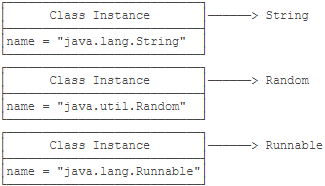
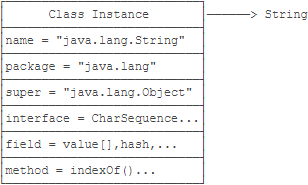
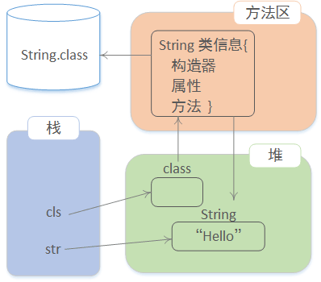

# 参考资料

https://mrbird.cc/Java-%E5%8F%8D%E5%B0%84%E6%9C%BA%E5%88%B6.html

[参考资料——廖雪峰](https://www.liaoxuefeng.com/wiki/1252599548343744/1255945147512512)


# 类装载器

类装载器就是**寻找类的节码文件**并**构造出类在JVM内部表示对象**的组件。在Java中，**类装载器把一个类装入JVM中**， 需要经过以下步骤：

- 装载：查找和导入Class文件
- 链接：执行校验、准备和解析步骤，其中解析步骤是可以选择的
  - 校验：检查载入Class文件数据的正确性
  - 准备：给类的静态变量分配存储空间
  - 解析： 将符号引用转换成直接引用
- 初始化： 对类的静态变量、静态代码块执行初始化工作

# 反射机制

Java反射机制是在`运行状态中`

- 对于任意一个类，都能够知道这个类的所有属性和方法；
- 对于任意一个对象，都能够调用它的任意一个方法和属性；

这种`动态获取信息`以及`动态调用对象的方法`的功能称为Java语言的反射机制。


## Class类

[Java语言允许通过程序化的方式间接对Class进行操作。Class文件由类装载器装载后，在JVM中将形成一份描述Class结构的元信息对象，通过该元信息对象可以获知Class的结构信息，如构造函数、属性和方法等。Java允许用户借由这个与Class相关的元信息对象间接调用Class对象的功能，这就为使用程序化方式操作Class对象开辟了途径。](精通Spring 企业应用开发实战)

除了`int`等<font color=red>基本类型</font>外，Java的其他类型全部都是`class(包括interface)`。例如：`String, Object, Runnable, Exception...`。`class(包括interface)`的本质是**数据类型(Type)**。<font color=red>无继承关系的数据类型之间无法赋值</font>：

```java
Number n = new Double(123.456); // OK
String s = new Double(123.456); // compile error!
```

而`class`是由JVM在执行过程中动态加载的。JVM在第一次读取到一种class类型时，将其加载进内存。<font color=red>每加载一种class，JVM就为其创建一个Class类型的实例，并关联起来</font>。注意：这里的`Class类型`是一个名叫`Class`的`class`：

```java
public final class Class
{
  private Class() {}
}
```

以`String`类为例，当JVM加载`String`类时，它首先读取`String.class`文件到内存，然后，为`String`类创建一个`Class`实例并关联起来：`Class cls = new Class(String);`。这个`Class`实例是JVM内部创建的，如果我们查看JDK源码，可以发现`Class`类的构造方法是`private`，只有JVM能创建`Class`实例，我们自己的Java程序是无法创建Class实例的。所以，JVM持有的每个`Class`实例都指向一个数据类型(class或interface)：



一个`Class`实例包含了该`class`的所有完整信息：



<font color=red>由于JVM为每个加载的`class`创建了对应的`Class`实例，并在实例中保存了该`class`的所有信息，包括类名、包名、父类、实现的接口、所有方法、字段等，因此，如果获取了某个`Class`实例，我们就可以通过这个`Class`实例获取到该实例对应的`class`的所有信息。<u>这种通过`Class`实例获取`class`信息的方法称为反射(Reflection)</u>。</font>


### 获取类信息方法

Java有3种方法可以获取Class信息
* `类名.class` 获取类信息(静态)
  * 直接通过一个`class`的静态变量`class`获取：`Class cls = String.class;`。
* `Class.forName("类名")` 获取类信息 (动态)
  * 如果知道一个`class`的完整类名，可以通过静态方法`Class.forName()`获取：`Class cls = Class.forName("类名");`。
* `obj.getClass()` 获取类信息。运行期间，通过当前对象获取类信息
  * 如果有一个实例变量，可以通过该实例变量提供的`getClass()`方法获取：`String s = "Hello"; Class cls = s.getClass();`。


因为`Class实例`在JVM中是唯一的，所以，上述方法获取的`Class实例`是同一个实例。可以用`==`比较两个`Class`实例：

```java
Class cls1 = String.class;

String s = "Hello";
Class cls2 = s.getClass();

boolean sameClass = cls1 == cls2; // true
```

注意一下`Class`实例比较和`instanceof`的差别：

```java
Integer n = new Integer(123);

boolean b1 = n instanceof Integer; // true，因为n是Integer类型
boolean b2 = n instanceof Number; // true，因为n是Number类型的子类

boolean b3 = n.getClass() == Integer.class; // true，因为n.getClass()返回Integer.class
boolean b4 = n.getClass() == Number.class; // false，因为Integer.class!=Number.class
```

用`instanceof`**不但匹配指定类型，还匹配指定类型的子类**。而用`==`判断`class实例`可以精确地判断数据类型，但`不能作子类型比较`。

通常情况下，我们应该用`instanceof`判断数据类型，因为面向抽象编程的时候，我们不关心具体的子类型。只有在需要精确判断一个类型是不是某个`class`的时候，我们才使用`==`判断`class`实例。


## 动态加载类到方法区

**JVM在执行Java程序的时候，并不是一次性把所有用到的`class`全部加载到内存，而是第一次需要用到`class`时才加载**。例如：

```java
// Main.java
public class Main
{
    public static void main(String[] args)
    {
        if (args.length > 0) {create(args[0]);}
    }

    static void create(String name) {Person p = new Person(name);}
}
```

当执行`Main.java`时，由于用到了`Main`，因此，JVM首先会把`Main.class`加载到内存。然而，并不会加载`Person.class`，除非程序执行到`create()`方法，JVM发现需要加载`Person`类时，才会首次加载`Person.class`。如果没有执行`create()`方法，那么`Person.class`根本就不会被加载。这就是JVM`动态加载class`的特性。

`动态加载class`的特性对于Java程序非常重要。<font color=red>利用JVM`动态加载class`的特性，我们才能在运行期根据条件加载不同的实现类</font>。


```java
package reflection;


import java.lang.reflect.Method;

public class TestReflection {

    public static void main(String[] args) {
        test();
    }

    public static void test() {
        String str = new String("Hello");
        Class cls = String.class;
        // 动态获取String类型的方法信息：
        Method[] all = cls.getDeclaredMethods();
        // Method代表方法的信息；method.getName可以获取方法的名称
        for (Method method : all) {
            System.out.println(method.getName());
        }
    }
}
```

输出结果：

```
equals
toString
hashCode
compareTo
compareTo
indexOf
...
toCharArray
toLowerCase
toLowerCase
toUpperCase
toUpperCase
trim
```


- Java 将类加载到方法区（自动完成）
- 利用类创建对象。内存中有一个String对象，方法区中还有类的信息！通过Class对象可以获取类的相关信息。



`Foo`类（`package：reflection`）：

```java
package reflection;

/**
 * 编译以后是 reflection.Foo.class
 * 类的全名是 reflection.Foo
 */

public class Foo {
    
    int id;
    String name;
    double salary;

    public Foo() {
        
    }
    
    public Foo(int id, String name, double salary) {
        this.id = id;
        this.name = name;
        this.salary = salary;
    }

    public int test() {
        return 5;
    }

    public double test1() {
        return 5D;
    }
}
```


## 动态获取类的信息——名字

### 动态获取类的方法信息

动态获取`Foo`类的方法：

```java
// 动态加载类
Class cls = Class.forName(className);
// 动态获取类的方法信息
Method[] all = cls.getDeclaredMethods();
```


```java
package reflection;

import java.lang.reflect.Method;

public class TestReflection {

    public static void main(String[] args) {
        testClassForName();
    }

    /**
     * 动态获取类的方法信息
     *
     * 动态的加载类信息到方法区，并且返回对应的Class对象！
     * Class对象可以访问类的全部信息！
     *
     * 将className对应的类文件，从磁盘中加载
     * 内存方法区，返回这个类的信息
     */

    public static void testClassForName() {

        String className = "reflection.Foo";
        try {
            // 动态加载类
            Class cls = Class.forName(className);
            // 动态获取类的方法信息
            Method[] all = cls.getDeclaredMethods();
            for (Method method : all) {
                System.out.println(method.getName());
            }
        } catch (ClassNotFoundException e) {
            e.printStackTrace();
        }
    }
}
```

输出：

```
test
test1
```


### 动态获取类的属性信息

```java
// 动态加载类
Class cls = Class.forName(className);
// 动态获取类声明的属性信息
Field[] all = cls.getDeclaredFields();
```


```java
/**
* 动态获取一个类的全部属性信息
* 1 动态加载一个类到方法区
* 2 动态获取类的属性信息
*/

public static void testField() {
    String className = "reflection.Foo";
    try {
        // 动态加载类
        Class cls = Class.forName(className);
        // 动态获取类声明的属性信息
        Field[] all = cls.getDeclaredFields();
        for (Field field : all) {
            // getName() 获取属性的名字
            System.out.print(field.getName() + " ");
        }
    } catch (ClassNotFoundException e) {
        e.printStackTrace();
    }
}
```

输出：

```
id name salary 
```


### 动态获取类的构造器信息

```java
/**
* 动态获取类的构造器信息
*/

public static void testConstructor() {
    String className = "reflection.Foo";
    try {
        // 动态加载类
        Class cls = Class.forName(className);
        // 动态获取类构造器
        Constructor[] all = cls.getDeclaredConstructors();
        for (Constructor constructor : all) {
            System.out.println(constructor.getName());
            
            // 获取构造器的参数类型列表：Class[]代表所有参数的类型列表
            Class[] types = constructor.getParameterTypes();
            System.out.println(Arrays.toString(types));
        }
    
    } catch (ClassNotFoundException e) {
        e.printStackTrace();
    }
}
```

输出：

```
reflection.Foo
[]
reflection.Foo
[int, class java.lang.String, double]
```


## 动态创建对象

### 调用无参构造器创建对象

如果没有无参数构造器，将发生异常！Class 提供了方法` newInstance()`。

```java
// 动态加载类：java.lang.ClassNotFoundException
Class cls = Class.forName(className);
// cls.newInstance()调用无参数构造器创建对象
// java.lang.InstantiationException, java.lang.IllegalAccessException
Object obj = cls.newInstance();
```


```java
/**
* 动态调用无参数构造器创建对象
* 1 动态加载类
* 2 利用class 的方法 newInstance 执行无参数构造器创建对象
* 注意：类必须有无参数，否则出异常
*/
public static void testNewInstance() {
    String className = "java.util.Date";
    try {
        // 动态加载类：java.lang.ClassNotFoundException
        Class cls = Class.forName(className);
        // cls.newInstance()调用无参数构造器创建对象
        // java.lang.InstantiationException, java.lang.IllegalAccessException
        Object obj = cls.newInstance();
        System.out.println(obj);

        // 静态的创建对象！编译已经就固定了！
        Date date = new Date();
        System.out.println(date);

    } catch (Exception e) {
        e.printStackTrace();
    }
}
```

输出

```
Tue Oct 27 13:58:52 CST 2020
Tue Oct 27 13:58:52 CST 2020
```


### 调用有参构造器创建对象

如果没有对应有参数构造器，将发生异常！参数传递错误，将发生异常！

```java
// 动态加载类，java.lang.ClassNotFoundException
Class cls = Class.forName(className);
// 动态获取指定参数类型的构造器，java.lang.NoSuchMethodException
Constructor constructor = cls.getDeclaredConstructor(paramTypes);
// 执行构造器 c.newInstance() 方法，创建对象
Object obj = constructor.newInstance(params);
```


```java
   /**
     * 调用有参构造器创建对象：className + paramTypes 共同决定调用哪个构造器！
     * @param className 调用className类名对应的类的有参数构造器
     * @param paramTypes 代表对应构造器的参数列表
     * @param params 执行构造器还需要具体的参数params，为构造器参数列表赋值
     * @return 创建的对象
     */
    public static Object create(String className, Class[] paramTypes, Object[] params) {
        try {
            // 动态加载类，java.lang.ClassNotFoundException
            Class cls = Class.forName(className);
            // 动态获取指定参数类型的构造器，java.lang.NoSuchMethodException
            Constructor constructor = cls.getDeclaredConstructor(paramTypes);
            // 执行构造器 c.newInstance() 方法，创建对象
            // java.lang.InstantiationException, IllegalAccessException, java.lang.reflect.InvocationTargetException
            Object obj = constructor.newInstance(params);

            return obj;

        } catch (Exception e) {
            e.printStackTrace();
        }

        return null;
    }

    /**
     * 调用有参构造器创建对象
     */
    public static void testCreate() {
        String className = "java.util.Date";
        // paramTypes类型列表：Class类型的数组
        Class[] paramTypes = {long.class};
        // 实际参数列表：params
        Object[] params = {1000L*60*60*24*365};

        Object obj = create(className, paramTypes, params);
        System.out.println(obj);

        /*
         * 动态调用 new String("Hello");
         * {} 只能用在声明变量时候直接初始化，不能用于赋值语句！
         * 赋值语句可以使用 new Object[]{"Hello"}
         */
        className = "java.lang.String";
        paramTypes = new Class[]{String.class};
        params = new Object[]{"Hello"};
        obj = create(className, paramTypes, params);
        System.out.println(obj);

        /*
         * 动态调用 new String(byte[],"utf-8");
         */
        obj = create("java.lang.String",
                new Class[]{byte[].class, String.class},
                new Object[]{new byte[]{65, 66, 67, 68}, "UTF-8"});
        System.out.println(obj);
    }
```

输出

```
Fri Jan 01 08:00:00 CST 1971
Hello
ABCD
```


## 动态获取类的属性值

实现过程（如何利用`反射API`实现动态属性访问）：

- 找到对象的类型信息（方法区）
- 在信息中找属性信息（Field）
- 在对象上获取属性的值！


```java
    /**
     * 获取obj对象的 fieldName 对应属性的值
     * @param object 对象
     * @param fieldName 属性
     * @return 属性值
     */
    public static Object getField(Object object, String fieldName) {
        try {
            /*
             * 1 获取类信息
             *
             * Java有3种方法可以获取Class信息
             * 1. 类名.class 获取类信息(静态)
             * 2. Class.forName("类名") 获取类信息 (动态)
             * 3. obj.getClass() 获取类信息。运行期间，通过当前对象获取类信息
             */
            Class cls = object.getClass();

            /*
             * 2 找到属性
             *
             * getDeclaredField 按照属性名在cls中查找类信息。
             * 当属性没有找到时候，抛出异常！
             *
             * java.lang.NoSuchFieldException
             */
            Field field = cls.getDeclaredField(fieldName);

            /*
             * 在对象上获取属性的值
             *
             * get方法：在一个对象上获取属性的值，对象上没有对应的属性，抛出异常
             *
             * java.lang.IllegalAccessException
             */
            Object value = field.get(object);

            return value;

        } catch (Exception e) {
            e.printStackTrace();
        }

        return null;
    }

    /**
     * 动态获取属性的值
     */
    public static void testGetField() {
        Foo foo = new Foo(1, "chenzf", 20000);
        Object id = getField(foo, "id");
        Object name = getField(foo, "name");
        Object salary = getField(foo, "salary");
        System.out.println(id + " " + name + " " + salary);
    }
```

输出：

```
1 chenzf 20000.0
```


## 动态调用类的方法

```java
    /**
     * 动态调用类的方法
     */
    public static void testInvoke() {
        List<String> list = new ArrayList<>();
        list.add("chen");
        list.add("zufeng");

        try {
            // 动态获取类信息
            Class cls = list.getClass();
            // 通过方法名和参数类型找到对应的方法
            Method method = cls.getDeclaredMethod("remove", new Class[]{int.class});
            // 调用方法，传递对象和具体参数
            Object value = method.invoke(list, new Object[]{0});
            System.out.println(value);

        } catch (Exception e) {
            e.printStackTrace();
        }
    }
```

输出：

```
chen
```


## 实例

[参考资料——HOW2J](https://how2j.cn/k/reflection/reflection-class/108.html)

在学习了Spring的`依赖注入`，`反转控制`之后，才会对反射有更好的理解。

### 业务类

首先准备两个业务类，这两个业务类很简单，就是各自都有一个业务方法，分别打印不同的字符串：

```java
package reflection;

public class Service1 {
    public void doService1() {
        System.out.println("业务1");
    }
}

package reflection;

public class Service2 {
    public void doService2() {
        System.out.println("业务2");
    }
}
```


### 非反射方式

当需要`从第一个业务方法切换到第二个业务方法`的时候，使用非反射方式，必须修改代码，并且重新编译运行，才可以达到效果：

```java
package reflection;
 
public class Test {
    public static void main(String[] args) {
        // new Service1().doService1();
        new Service2().doService2();
    }
}
```


### 反射方式

使用反射方式，首先准备一个**配置文件**`spring.txt`，放在`src`目录下。里面存放的是**类的名称**，和要**调用的方法名**。

```xml
class=reflection.Service1
method=doService1
```

在测试类Test中，首先`取出类名称和方法名`，然后通过反射去调用这个方法。

当需要从调用第一个业务方法，切换到调用第二个业务方法的时候，不需要修改一行代码，也不需要重新编译，**只需要修改配置文件**`spring.txt`，再运行即可。

```java
package reflection;

import java.io.File;
import java.io.FileInputStream;
import java.lang.reflect.Constructor;
import java.lang.reflect.Method;
import java.util.Properties;

public class Test {
    public static void main(String[] args) {
        try {
            // 从spring.txt中获取类名称和方法名称
            File springConfigFile = new File("D:\\Learning_Java\\Java_Code\\Test\\src\\spring.txt");
            Properties springConfig = new Properties();
            springConfig.load(new FileInputStream(springConfigFile));
            // springConfig.get("class")是Object
            String className = (String) springConfig.get("class");
            String methodName = (String) springConfig.get("method");

            //根据类名称获取类对象
            Class class1 = Class.forName(className);
            //根据方法名称，获取方法对象
            Method method = class1.getMethod(methodName);
            //获取构造器
            Constructor constructor = class1.getConstructor();
            //根据构造器，实例化出对象
            Object service = constructor.newInstance();
            //调用对象的指定方法
            method.invoke(service);
            
        } catch (Exception e) {
            e.printStackTrace();
        }
    }
}
```

输出

```
业务1
```


