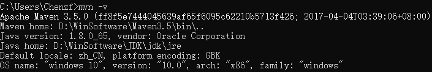
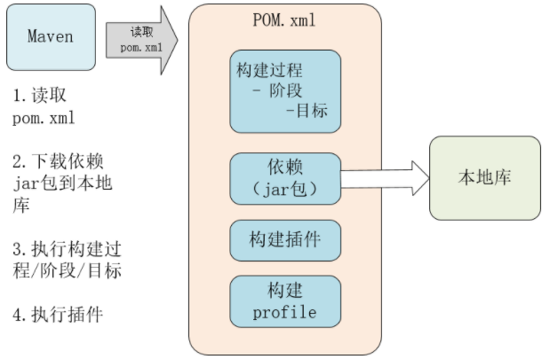

# 参考资料

[Maven教程](https://www.qikegu.com/docs/2457)

# Maven作用

Maven是一个强大的Java项目构建工具，基于POM(项目对象模型)文件，可用于`项目构建`、`依赖模块管理`和`Javadoc生成`等。

Java项目需要的东西：

- 需要确定引入哪些依赖包——`依赖包的管理`
  - 需要引用各种jar包，尤其是比较大的工程，引用的jar包往往有几十个乃至上百个， 每用到一种jar包，都需要手动引入工程目录，而且经常遇到各种让人抓狂的`jar包冲突`、`版本冲突`。

- 确定项目的目录结构
  - `src`目录存放Java源码，`resources`目录存放配置文件，`bin`目录存放编译生成的`.class`文件。
- 配置环境
  - JDK的版本，编译打包的流程，当前代码的版本号
- 通过命令行工具进行编译，让项目在一个独立的服务器上编译、测试、部署

项目从编译、测试、运行、打包、安装 ，部署整个过程都交给Maven进行管理，这个过程称为<font color=red>构建</font>。整个构建过程，使用Maven一个命令可以轻松完成整个工作。


## Maven项目的目录结构

Maven项目有标准的目录结构。如果遵循该目录结构，就不需要在POM文件中指定源代码、测试代码等目录。

```
- src
  - main
    - java
    - resources
    - webapp
  - test
    - java
    - resources

- target
```

- `src目录`是源代码和测试代码的根目录，`main目录`是项目源代码（不含测试目录）的根目录，`test目录`包含测试源代码。
- `resources目录`是资源目录。
- 如果项目是web应用程序，则`webapp目录`包含Java web应用程序。webapp目录将成为web应用程序的根目录，包含WEB-INF目录等。
- `target目录`由Maven创建，包含Maven生成的所有已编译类、JAR文件等。在执行clean构建阶段时，目标目录会被清除。

# Maven安装

要安装Maven，可以从Maven官网下载最新的Maven 3.6.x(建议使用3.3.9)，然后在本地解压。`安装Maven的前提是完成Java环境安装`，**Maven依赖于Java环境**。Maven运行时依赖Java，系统中需要安装jdk(并设置JAVA_HOME环境变量)，不能使用jre，maven需要用到Java编译器，jre不包含。

Maven为绿色软件解压后即可使用。解压后需要`设置环境变量`：


打开命令行窗口，输入`mvn -version`，应该看到Maven的版本信息：



## settings.xml 设置

Maven解压后目录下会有一个`settings.xml`文件，位置`\Maven3.5\conf\settings.xml`，用来<font color=red>配置Maven的仓库和本地Jar包存储地址</font>。

Maven仓库地址代表从哪里去下载项目中的依赖包Jar包；**Maven会将所有的Jar包统一存储到一个地址下，方便各个项目复用**。默认本地仓库位置在`C:\Users\Chenzf\.m2\repository`。

`localRepository`设置`本地存放Jar包地址`，可以根据自己的情况改动：

```xml
<!-- localRepository
 | The path to the local repository maven will use to store artifacts.
 |
 | Default: ${user.home}/.m2/repository
<localRepository>/path/to/local/repo</localRepository>
-->
  <localRepository>D:\WinSoftware\Maven\repository</localRepository>
```

<span id="mirrors">`mirrors`</span><font color=red>为仓库列表配置的下载镜像列表</font>：

```xml
<mirrors>
  <!-- mirror
   | Specifies a repository mirror site to use instead of a given repository. The repository that
   | this mirror serves has an ID that matches the mirrorOf element of this mirror. IDs are used
   | for inheritance and direct lookup purposes, and must be unique across the set of mirrors.
   |
  <mirror>
    <id>mirrorId</id>
    <mirrorOf>repositoryId</mirrorOf>
    <name>Human Readable Name for this Mirror.</name>
    <url>http://my.repository.com/repo/path</url>
  </mirror>
   -->

    <mirror>
        <id>alimaven</id>
        <mirrorOf>central</mirrorOf>
        <name>aliyun maven</name>
        <url>http://maven.aliyun.com/nexus/content/repositories/central/</url>
    </mirror>


</mirrors>
```


# Maven工作原理

Maven是一个**项目管理工具**，它包含了一个项目对象模型 (POM: Project Object Model)，一组标准集合，一个项目生命周期(Project Lifecycle)，一个依赖管理系统(Dependency Management System)和用来运行定义在生命周期阶段(phase)中插件(plugin)目标(goal)的逻辑。

* 项目对象模型(Project Object Model)
  每一个Maven工程都有一个`pom.xml`文件，通过`pom.xml`文件定义`项目的坐标、项目依赖、项目信息、插件目标`等。

* 依赖管理系统(Dependency Management System)
  通过Maven的依赖管理对项目所依赖的jar包进行统一管理。

* 一个项目生命周期(Project Lifecycle)
  使用Maven完成项目的构建，项目构建包括：清理、编译、测试、部署等过程，Maven将这些过程规范为一个生命周期。

* 一组标准集合
  Maven将整个项目管理过程定义一组标准，比如：通过Maven构建工程有标准的目录结构，有标准的生命周期阶段、依赖管理有标准的坐标定义等。

* 插件(plugin)目标(goal)
  Maven管理项目生命周期过程都是基于插件完成的。

Maven以`POM文件`(项目对象模型)为中心，是自动构建的`配置文件`，位于项目的根目录下。

下面是Maven读取POM文件执行构建过程的示意图：



当我们涉及到多模块的项目（包含成百个模块或者子项目），管理依赖就变成一项困难的任务。传统的Web项目中，我们必须将工程所依赖的jar包复制到工程中，导致了工程的变得很大。

<font color=red>Maven工程中不直接将jar包导入到工程中</font>，而是通过在`pom.xml`文件中添加所需jar包的<font color=red>坐标</font>，这样就很好的避免了jar直接引入进来。在需要用到jar包的时候，只要查找`pom.xml`文件，再通过`pom.xml`文件中的坐标，到一个专门用于“存放jar包的仓库”(Maven仓库)中根据坐标从而找到这些jar包，再把这些jar包拿去运行。


## Repository — 存储库

Maven存储库是一个存储JAR文件的仓库，Maven根据项目中`pom.xml`文件中提供的jar包依赖信息，从存储库中查找并获取需要的jar包。

Maven Repository有3种类型:

- Local Repository – 本地库
- Central Repository – 中央库
  - Maven`中央库`主要放置`公共jar包`，是由`apache maven`社区创建的，中央库的网址是[http://repo1.maven.org/maven2](https://note.youdao.com/)，可以通过网址http://search.maven.org/#browse查看有哪些公共jar包。
- Remote Repository – 远程库
  - Maven远程库也是位于网络上的存储库。例如一个公司可能有很多共享的jar包文件，就可以搭建一个公司内部的远程库，供众多开发人员使用；中央库可以认为是一个特殊的远程库。

Maven搜索依赖项时，会按照：本地库、中央库和远程库的顺序进行。如果这些库中没找到依赖项，Maven将报错。

## pom.xml 文件

POM是Project Object Model（项目对象模型）的缩写。`pom.xml`文件中包含了依赖关系、构建目录、源目录、测试源目录、插件、目标等项目信息和配置信息。Maven读取`pom.xml`文件，然后执行构建目标。

一个pom.xml文件至少需要包含以下元素：

| **元素**         | **描述**                                                     |
| ---------------- | ------------------------------------------------------------ |
| **project**      | pom文件根元素，表示一个项目                                  |
| **modelVersion** | project元素的子元素，指定modelVersion版本号，应该设置为4.0.0 |
| **groupId**      | project元素的子元素，指定项目所属的group                     |
| **artifactId**   | project元素的子元素，项目交付件（项目的最终交付文件，如jar、zip、war等）ID |
| **version**      | project元素的子元素，项目（交付件）的版本号                  |
| **packaging**    | 定义打包类型，如jar, war                                     |
| **name**         | 指定项目名称                                                 |
| **url**          | 指定项目url                                                  |
| **dependencies** | 表示项目依赖项列表                                           |
| **dependency**   | 表示单个依赖项，这个元素是依赖项列表元素的子元素             |
| **scope**        | 单个依赖项的作用域，作用域可以是compile、test、runtime、provided、system之一，作用域的意图是限定该依赖项作用范围，如test，则表明依赖项只在test时起作用 |

```xml
<?xml version="1.0" encoding="UTF-8"?>

<project xmlns="http://maven.apache.org/POM/4.0.0" xmlns:xsi="http://www.w3.org/2001/XMLSchema-instance"
  xsi:schemaLocation="http://maven.apache.org/POM/4.0.0 http://maven.apache.org/xsd/maven-4.0.0.xsd">
  <modelVersion>4.0.0</modelVersion>

  <groupId>sjtu.chenzf</groupId>
  <artifactId>hellospringboot</artifactId>
  <version>1.0-SNAPSHOT</version>
  <packaging>jar</packaging>

  <name>hellospringboot Maven Webapp</name>
  <!-- FIXME change it to the project's website -->
  <url>http://www.example.com</url>

  <!-- Inherit defaults from Spring Boot -->
  <parent>
    <groupId>org.springframework.boot</groupId>
    <artifactId>spring-boot-starter-parent</artifactId>
    <version>2.2.5.RELEASE</version>
  </parent>

    <!-- Add typical dependencies for a web application -->
    <dependencies>
        <dependency>
            <groupId>org.springframework.boot</groupId>
            <artifactId>spring-boot-starter-web</artifactId>
        </dependency>
    </dependencies>
</project>
```


## 构建生命周期、阶段、目标

项目的构建通常包含`数个相互独立的大块任务`，可以独立执行，如`生成文档`，`构建jar包`等。`单个任务的执行过程被称为一个构建生命周期`，`构建生命周期由一系列的构建阶段组成`，`每个阶段包含一系列的构建目标`。

我们可以执行构建阶段或构建目标。阶段按顺序执行，执行一个阶段则会先执行该阶段之前的所有阶段。当执行构建阶段时，将会按顺序执行其中包含的所有构建目标。构建目标可以被分配到一个或多个构建阶段。我们还可以直接执行构建目标。


### 构建生命周期

Maven构建遵循特定的生命周期来构建和部署项目。Maven有3个内置的构建生命周期：

- **default** – 编译源代码并处理打包项目相关的所有事情
- **clean** – 清理构建输出，包括生成的编译类、JAR文件等
- **site** – 为项目生成文档

每一个构建生命周期都是独立执行的，可以让Maven同时执行多个构建生命周期，它们之间彼此独立，就像独立执行Maven命令一样。


### 构建阶段

每个构建生命周期包含一系列的构建阶段，每个构建阶段又包含了一系列的构建目标。

当执行一个构建阶段时，该阶段之前的所有阶段也将被执行。例如，执行install构建阶段，首先会执行该阶段之前的所有阶段，然后执行install阶段。

`默认生命周期`的作用是`构建代码`，是最重要的构建生命周期，它不能直接执行，要通过执行它的构建阶段或目标来执行。默认生命周期包含非常多的阶段及目标，其中常用的构建阶段是：

- **validate** 验证项目是正确的，所有必要信息都可用，所有依赖项都已下载。
- **compile** 编译项目源代码。
- **test** 使用适当的单元测试框架对编译后的源代码运行测试。
- **package** 将编译后的代码打包成可发布格式，例如JAR。
- **install** 将包安装到本地存储库中，以便在本地的其他项目中作为依赖项使用。
- **deploy** 将最终包复制到远程存储库，以便与其他开发人员和项目共享。

通过将阶段名称传递给`mvn`命令，可以执行一个构建阶段：`mvn install`——执行项目的install阶段，首先会执行它之前的所有构建阶段，然后再执行install阶段。

如果标准的阶段和目标不能满足项目需要，还可以创建自定义构建插件来实现额外构建功能。


### 构建目标

每个构建阶段都包含一系列构建目标，当运行一个阶段时，所有绑定到这个阶段的目标都将按顺序执行。

`构建目标本身属于一个插件`，插件是构建目标的集合，也称为MOJO (Maven Old Java Object)。可以把插件理解为一个类，构建目标是类中的方法，构建阶段是是对这些方法的顺序调用。

构建目标可以绑定到多个构建阶段，也可以不绑定，就像类的方法可以被调用，也可以不被调用。


## 插件

Maven实际上是一个`插件执行框架`，`Maven中的所有任务都是由插件完成的`。

Maven插件是构建目标的集合，也称为MOJO (Maven Old Java Object)。`可以把插件理解为一个类，而构建目标是类中的方法`。构建阶段包含一系列的构建目标，可以理解为`按顺序调用各个插件中的构建目标`（方法），然后一系列的构建阶段组成一个构建生命周期。

构建目标可以绑定到多个构建阶段，也可以不绑定，就像类的方法可以被调用，也可以不被调用。

```xml
<build>
    <finalName>hellospringboot</finalName>

      <plugins>
          <plugin>
              <groupId>org.springframework.boot</groupId>
              <artifactId>spring-boot-maven-plugin</artifactId>
          </plugin>
      </plugins>

    <pluginManagement><!-- lock down plugins versions to avoid using Maven defaults (may be moved to parent pom) -->
      <plugins>
        <plugin>
          <artifactId>maven-clean-plugin</artifactId>
          <version>3.1.0</version>
        </plugin>
        <!-- see http://maven.apache.org/ref/current/maven-core/default-bindings.html#Plugin_bindings_for_war_packaging -->
        <plugin>
          <artifactId>maven-resources-plugin</artifactId>
          <version>3.0.2</version>
        </plugin>
        <plugin>
          <artifactId>maven-compiler-plugin</artifactId>
          <version>3.8.0</version>
        </plugin>
        <plugin>
          <artifactId>maven-surefire-plugin</artifactId>
          <version>2.22.1</version>
        </plugin>
        <plugin>
          <artifactId>maven-war-plugin</artifactId>
          <version>3.2.2</version>
        </plugin>
        <plugin>
          <artifactId>maven-install-plugin</artifactId>
          <version>2.5.2</version>
        </plugin>
        <plugin>
          <artifactId>maven-deploy-plugin</artifactId>
          <version>2.8.2</version>
        </plugin>
      </plugins>
    </pluginManagement>
  </build>
```


