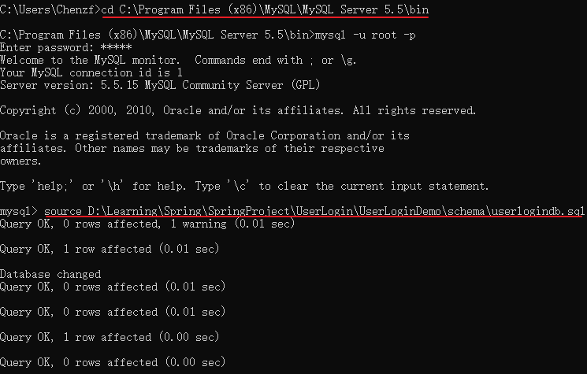
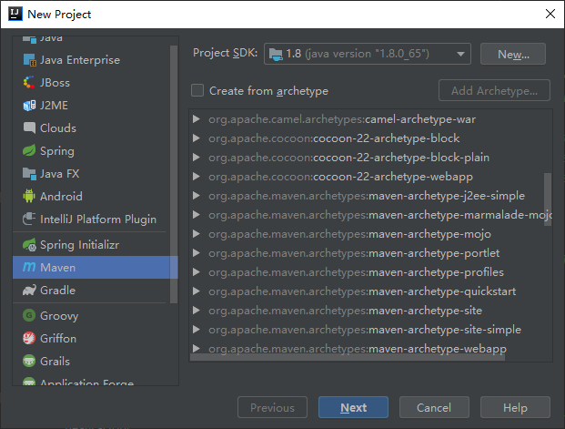
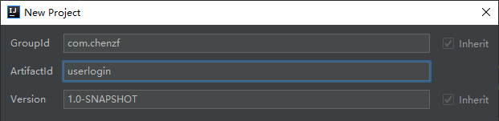
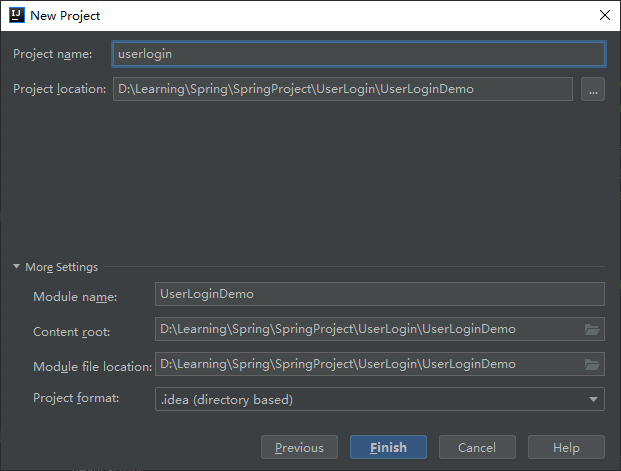
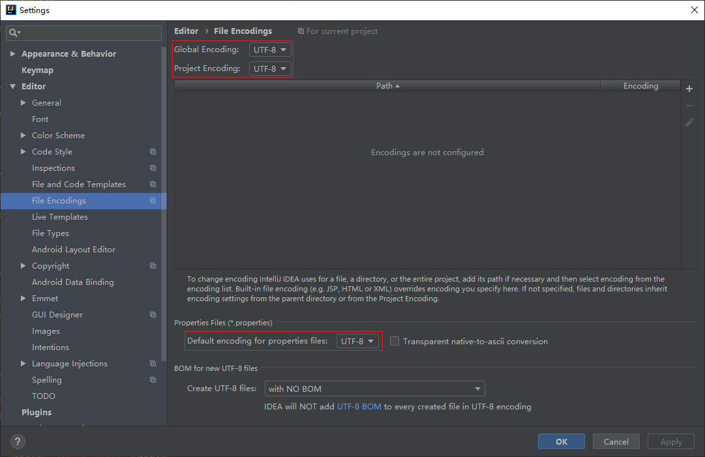
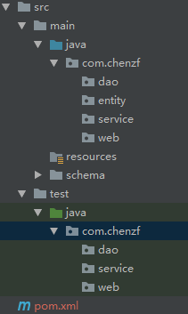
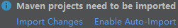
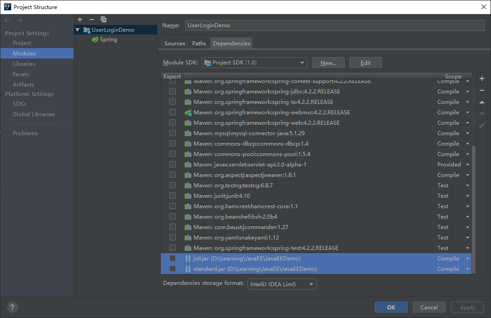

# UserLogin

参考资料：精通Spring 4.X 企业应用开发实战

## 功能简介

## 环境准备

### 创建库表

数据库登录名：root；登录密码：admin

#### 编写脚本

`D:\Learning\Spring\SpringProject\UserLogin\UserLoginDemo\schema\userlogindb.sql`

```mysql
DROP DATABASE IF EXISTS userlogindb;
CREATE DATABASE userlogindb DEFAULT CHARACTER SET utf8;
USE userlogindb;

##创建用户表
CREATE TABLE table_user (
   user_id   INT AUTO_INCREMENT PRIMARY KEY,
   user_name VARCHAR(30),
   password  VARCHAR(32),
   credits INT,
   last_visit datetime,
   last_ip  VARCHAR(23)
)ENGINE=InnoDB; 

##创建用户登录日志表
CREATE TABLE table_login_log (
   login_log_id  INT AUTO_INCREMENT PRIMARY KEY,
   user_id   INT,
   ip  VARCHAR(23),
   login_datetime datetime
)ENGINE=InnoDB; 

##插入初始化数据
INSERT INTO table_user (user_name, password) 
             VALUES('admin', '123456');
COMMIT;
```

MySQL默认使用`MyISAM`引擎，该类型的表不支持事务，仅存储数据，读、写速度快；`ENGINE=InnoDB`指定了表的引擎为`InnoDB`类型，该类型的表支持事务！

#### 运行脚本




### 创建工程

1. 创建Maven工程

   

   

   

   

2. 将IDEA工作空间编码格式设置为UTF-8

   

   

### 类包组织

单元测试的类包和程序的类包对应，但放置在不同的文件夹下：



### `pom.xml`配置

在`pom.xml`文件中配置Spring、数据源、数据库连接驱动、 Servlet类库的依赖信息：

```xml
<?xml version="1.0" encoding="UTF-8"?>
<project xmlns="http://maven.apache.org/POM/4.0.0"
         xmlns:xsi="http://www.w3.org/2001/XMLSchema-instance"
         xsi:schemaLocation="http://maven.apache.org/POM/4.0.0 http://maven.apache.org/xsd/maven-4.0.0.xsd">
    <modelVersion>4.0.0</modelVersion>

    <groupId>com.chenzf</groupId>
    <artifactId>userlogin</artifactId>
    <version>1.0-SNAPSHOT</version>

    <properties>
        <file.encoding>UTF-8</file.encoding>
        <spring.version>4.2.2.RELEASE</spring.version>
        <mysql.version>5.1.29</mysql.version>
        <servlet.version>3.0-alpha-1</servlet.version>
        <aspectj.version>1.8.1</aspectj.version>
        <commons-codec.version>1.9</commons-codec.version>
        <commons-dbcp.version>1.4</commons-dbcp.version>
        <hibernate.validator.version>5.0.2.Final</hibernate.validator.version>
        <jetty.version>8.1.8.v20121106</jetty.version>
        <slf4j.version>1.7.5</slf4j.version>
        <testng.version>6.8.7</testng.version>
    </properties>

    <dependencies>
        <!-- 依赖的Spring模块类库-->
        <dependency>
            <groupId>org.springframework</groupId>
            <artifactId>spring-beans</artifactId>
            <version>${spring.version}</version>
        </dependency>
        <dependency>
            <groupId>org.springframework</groupId>
            <artifactId>spring-context</artifactId>
            <version>${spring.version}</version>
        </dependency>
        <dependency>
            <groupId>org.springframework</groupId>
            <artifactId>spring-context-support</artifactId>
            <version>${spring.version}</version>
        </dependency>
        <dependency>
            <groupId>org.springframework</groupId>
            <artifactId>spring-jdbc</artifactId>
            <version>${spring.version}</version>
        </dependency>
        <dependency>
            <groupId>org.springframework</groupId>
            <artifactId>spring-webmvc</artifactId>
            <version>${spring.version}</version>
        </dependency>

        <!-- 依赖的数据库驱动类库-->
        <dependency>
            <groupId>mysql</groupId>
            <artifactId>mysql-connector-java</artifactId>
            <version>${mysql.version}</version>
        </dependency>
        
        <!-- 依赖的连接池类库-->
        <dependency>
            <groupId>commons-dbcp</groupId>
            <artifactId>commons-dbcp</artifactId>
            <version>${commons-dbcp.version}</version>
        </dependency>
        
        <!-- 依赖的web类库-->
        <dependency>
            <groupId>javax.servlet</groupId>
            <artifactId>servlet-api</artifactId>
            <version>${servlet.version}</version>
            <scope>provided</scope>
        </dependency>
        <dependency>
            <groupId>org.aspectj</groupId>
            <artifactId>aspectjweaver</artifactId>
            <version>${aspectj.version}</version>
        </dependency>


        <dependency>
            <groupId>org.testng</groupId>
            <artifactId>testng</artifactId>
            <version>${testng.version}</version>
            <scope>test</scope>
        </dependency>
        <dependency>
            <groupId>org.springframework</groupId>
            <artifactId>spring-test</artifactId>
            <version>${spring.version}</version>
            <scope>test</scope>
        </dependency>
    </dependencies>

    <build>
        <plugins>
            <!-- jetty插件 -->
            <plugin>
                <groupId>org.mortbay.jetty</groupId>
                <artifactId>maven-jetty-plugin</artifactId>
                <version>6.1.25</version>
                <configuration>
                    <connectors>
                        <connector implementation="org.mortbay.jetty.nio.SelectChannelConnector">
                            <port>8000</port>
                            <maxIdleTime>60000</maxIdleTime>
                        </connector>
                    </connectors>
                    <contextPath>/bbs</contextPath>
                    <scanIntervalSeconds>0</scanIntervalSeconds>
                </configuration>
            </plugin>

            <plugin>
                <groupId>org.apache.maven.plugins</groupId>
                <artifactId>maven-surefire-plugin</artifactId>
                <version>2.12</version>
                <configuration>
                    <parallel>methods</parallel>
                    <threadCount>10</threadCount>
                </configuration>
            </plugin>
        </plugins>
    </build>

</project>
```


配置完毕后，点击`Import Changes`下载相关依赖：




## 持久层

持久层负责数据的访问和操作，DAO类被上层的Service类调用，这里使用`Spring JDBC`作为持久层的实现技术。

实体类代表了业务的状态，且**贯穿展现层、业务层和持久层**，并最终**被持久化到数据库中**。实例对象不一定等同于数据库表，对于简单的应用来说，实例对象往往拥有对应的数据库表。

持久层的主要工作就是**`从数据库表中加载数据并实例化实例对象`**，或**`将实例对象持久化到数据库表中`**。

### 实例对象

创建`User、LoginLog`实例对象：`UserLoginDemo\src\main\java\com\chenzf\entity`

1. 用户对象可以看成对`table_user`表的对象映象， 每个字段对应一个对象属性。

   ```java
   package com.chenzf.entity;
   
   import java.io.Serializable;
   import java.util.Date;
   
   /**
    * @author Chenzf
    * 实例对象一般要实现Serializable揆口，以便序列化
    */
   
   public class User implements Serializable {
   
       private int userId;
       private String userName;
       private String password;
       private int credits;
       private String lastIp;
       private Date lastVisit;
   
       public int getUserId() {
           return userId;
       }
   
       public void setUserId(int userId) {
           this.userId = userId;
       }
   
       public String getUserName() {
           return userName;
       }
   
       public void setUserName(String userName) {
           this.userName = userName;
       }
   
       public String getPassword() {
           return password;
       }
   
       public void setPassword(String password) {
           this.password = password;
       }
   
       public int getCredits() {
           return credits;
       }
   
       public void setCredits(int credits) {
           this.credits = credits;
       }
   
       public String getLastIp() {
           return lastIp;
       }
   
       public void setLastIp(String lastIp) {
           this.lastIp = lastIp;
       }
   
       public Date getLastVisit() {
           return lastVisit;
       }
   
       public void setLastVisit(Date lastVisit) {
           this.lastVisit = lastVisit;
       }
   }
   ```

   

2. 用户每次登录成功后，都会记录一条登录日志。

   ```java
   package com.chenzf.entity;
   
   import java.io.Serializable;
   import java.util.Date;
   
   public class LoginLog implements Serializable {
   
       private int loginLogId;
       private int userId;
       private String ip;
       private Date loginDate;
   
       public int getLoginLogId() {
           return loginLogId;
       }
   
       public void setLoginLogId(int loginLogId) {
           this.loginLogId = loginLogId;
       }
   
       public int getUserId() {
           return userId;
       }
   
       public void setUserId(int userId) {
           this.userId = userId;
       }
   
       public String getIp() {
           return ip;
       }
   
       public void setIp(String ip) {
           this.ip = ip;
       }
   
       public Date getLoginDate() {
           return loginDate;
       }
   
       public void setLoginDate(Date loginDate) {
           this.loginDate = loginDate;
       }
   }
   ```

   

### UserDAO

首先来定义**访问User**的DAO：`com.chenzf.dao.UserDAO`

```java
package com.chenzf.dao;

import com.chenzf.entity.User;
import org.springframework.beans.factory.annotation.Autowired;
import org.springframework.jdbc.core.JdbcTemplate;
import org.springframework.jdbc.core.RowCallbackHandler;
import org.springframework.stereotype.Repository;

import java.sql.ResultSet;
import java.sql.SQLException;

/**
 * @author Chenzf
 *
 * Repository定义一个DAO Bean
 */
@Repository
public class UserDAO {

    private  final static String MATCH_COUNT_SQL = " SELECT COUNT(*) FROM table_user  " +
            "WHERE user_name = ? AND password = ?";

    private  final static String UPDATE_LOGIN_INFO_SQL = " UPDATE table_user SET " +
            "last_visit = ?, last_ip = ?, credits = ? WHERE user_id = ?";

    /**
     * 自动注人JdbcTemplate的Bean
     */
    private JdbcTemplate jdbcTemplate;

    @Autowired
    public void setJdbcTemplate(JdbcTemplate jdbcTemplate) {
        this.jdbcTemplate = jdbcTemplate;
    }

    /**
     * 根据用户名和密码获取匹配的用户数
     * @param userName 用户名
     * @param password 密码
     * @return 等于1表示用户名／密码正确；等于0表示用户名或密码错误
     */
    public int getMatchCount(String userName, String password) {
        return jdbcTemplate.queryForObject(MATCH_COUNT_SQL,
                new Object[]{userName, password}, Integer.class);
    }

    /**
     * 根据用户名获取User对象
     * @param userName 用户名
     * @return User对象
     */
    public User findUserByUserName(final String userName) {

        String sqlStr = " SELECT user_id, user_name, credits"
                + " FROM table_user WHERE user_name = ?";

        final User user = new User();

        /**
         * query(String sql, Object[] args, RowCallbackHandler rch)
         * sqlStr：查询的SQL语句，允许使用带"?"的参数占位符
         * args：SQL语句中占位符对应的参数数组
         * rch：查询结果的处理回调接口。该回调接口有方法processRow(ResultSet rs)
         *           负责将查询的结果从ResultSet装载到类似于领域对象的对象实例中。
         */
        jdbcTemplate.query(sqlStr, new Object[] { userName },
                // 通过匿名内部类的方式定义了一个RowCallbackHandler回调接口实例，将ResultSet转换为User对象
                new RowCallbackHandler() {
                    public void processRow(ResultSet rs) throws SQLException {
                        user.setUserId(rs.getInt("user_id"));
                        user.setUserName(userName);
                        user.setCredits(rs.getInt("credits"));
                    }
                });

        return user;
    }

    /**
     * 更新用户积分、最后登录IP及最后登录时间
     * @param user 用户
     */
    public void updateLoginInfo(User user) {
        jdbcTemplate.update(UPDATE_LOGIN_INFO_SQL, new Object[] { user.getLastVisit(),
                user.getLastIp(), user.getCredits(), user.getUserId()});
    }
}
```


### LoginLogDAO

`LoginLogDAO`负责记录用户的登录日志

```java
package com.chenzf.dao;

import com.chenzf.entity.LoginLog;
import org.springframework.beans.factory.annotation.Autowired;
import org.springframework.jdbc.core.JdbcTemplate;
import org.springframework.stereotype.Repository;

@Repository
public class LoginLogDAO {

    /**
     * 保存登陆日志SQL
     */
    private final static String INSERT_LOGIN_LOG_SQL=
            "INSERT INTO table_login_log(user_id, ip, login_datetime) VALUES(?, ?, ?)";

    private JdbcTemplate jdbcTemplate;

    @Autowired

    public void setJdbcTemplate(JdbcTemplate jdbcTemplate) {
        this.jdbcTemplate = jdbcTemplate;
    }

    /**
     * 记录用户的登录日志
     * @param loginLog 用户的登录日志
     */
    public void insertLoginLog(LoginLog loginLog) {
        Object[] args = { loginLog.getUserId(), loginLog.getIp(), loginLog.getLoginDate() };
        jdbcTemplate.update(INSERT_LOGIN_LOG_SQL, args);
    }
}
```


### 在userlogin.xml中装配DAO

在上两个DAO实现类中都没有`打开、释放Connection`的代码，**`DAO类如何访问数据库`**呢？

样板式的操作都被`JdbcTemplate`封装起来了，`JdbcTemplate`本身需要一个`DataSource`，这样它就可以根据需要从`DataSource`中获取或返回连接。

`UserDao`和`LoginLog`都提供了一个带`@Autowired`注解的`JdbcTemplate`变量，所以我们必须事先**`声明一个数据源`**，然后定义一个`JdbcTemplate Bean`，通过`Spring容器的上下文自动绑定机制`进行**`Bean的注入`**。

创建`UserLoginDemo\src\main\resources\userlogin.xml`

```xml
<?xml version="1.0" encoding="UTF-8"?>
<beans xmlns="http://www.springframework.org/schema/beans"
       xmlns:xsi="http://www.w3.org/2001/XMLSchema-instance"
       xmlns:context="http://www.springframework.org/schema/context"
       xmlns:p="http://www.springframework.org/schema/p"
       xsi:schemaLocation="http://www.springframework.org/schema/beans
                                            http://www.springframework.org/schema/beans/spring-beans.xsd
                                            http://www.springframework.org/schema/context
                                            http://www.springframework.org/schema/context/spring-context.xsd">

    <!-- 1.扫描类包，将标注Spring注解的类自动转化Bean，同时完成Bean的注入 -->
    <context:component-scan base-package="com.chenzf.dao"/>

    <!-- 2.配置数据源 -->
    <bean id="dataSource" class="org.apache.commons.dbcp.BasicDataSource" destroy-method="close"
          p:driverClassName="com.mysql.jdbc.Driver"
          p:url="jdbc:mysql://localhost:3306/userlogindb"
          p:username="root"
          p:password="admin"/>

    <!-- 3.配置Jdbc模板  -->
    <bean id="jdbcTemplate" class="org.springframework.jdbc.core.JdbcTemplate"
          p:dataSource-ref="dataSource"/>

</beans>
```


- 使用Spring的`<context:component-scan>`扫描指定类包下的所有类，这样**在类中定义的Spring 注解（如@Repository 、@Autowired 等）才能产生作用**。

- 在3处配置了`JdbcTemplate Bean`，**将2处声明的`dataSource`注入`JdbcTemplate`中**，而**这个`JdbcTemplate Bean`将通过`@Autowired`被自动注入`LoginLog`和`UserDao`的`Bean`中**。

  ```java
  /**
  * 自动注人JdbcTemplate的Bean
  */
  private JdbcTemplate jdbcTemplate;
  
  @Autowired
  public void setJdbcTemplate(JdbcTemplate jdbcTemplate) {
      this.jdbcTemplate = jdbcTemplate;
  }
  ```

  


## 业务层

### UserService

`UserService`负责将持久层的`UserDao`和`LoginLoginDAO`组织起来，完成`用户、密码认证`、`登录日志记录`等操作。

```java
package com.chenzf.service;

import com.chenzf.dao.LoginLogDAO;
import com.chenzf.dao.UserDAO;
import com.chenzf.entity.LoginLog;
import com.chenzf.entity.User;
import org.springframework.beans.factory.annotation.Autowired;
import org.springframework.stereotype.Service;
import org.springframework.transaction.annotation.Transactional;

/**
 * @author Chenzf
 *
 * Service：将UserService标注为一个服务层的Bean
 */
@Service
public class UserService {

    private UserDAO userDAO;

    @Autowired
    public void setUserDAO(UserDAO userDAO) {
        this.userDAO = userDAO;
    }

    private LoginLogDAO loginLogDAO;

    @Autowired
    public void setLoginLogDAO(LoginLogDAO loginLogDAO) {
        this.loginLogDAO = loginLogDAO;
    }

    /**
     * 用于检查用户名、密码的正确性；
     * @param userName 用户名
     * @param password 密码
     * @return 是否正确
     */
    public boolean hasMatchUser(String userName, String password) {
        int matchCount = userDAO.getMatchCount(userName, password);
        return matchCount > 0;
    }

    /**
     * 以用户名为条件加载User对象
     * @param userName 用户名
     * @return User对象
     */
    public User findUserByUserName(String userName) {
        return userDAO.findUserByUserName(userName);
    }

    /**
     * 在用户登录成功后调用，更新用户最后登录时间和IP信息，同时记录用户登录日志
     * @param user 用户
     */
    @Transactional
    public void loginSuccess(User user) {
        user.setCredits( 5 + user.getCredits());
        
        LoginLog loginLog = new LoginLog();
        loginLog.setUserId(user.getUserId());
        loginLog.setIp(user.getLastIp());
        loginLog.setLoginDate(user.getLastVisit());
        
        userDAO.updateLoginInfo(user);
        loginLogDAO.insertLoginLog(loginLog);
    }
}
```


`loginSuccess()`方法将两个DAO组织起来，**共同完成一个事务性的数据操作： 更新`table_user`表记录并添加`table_login_log`表记录**。


### 在userlogin.xml中装配Service

事务管理的代码虽然无须出现在程序代码中，但我们**必须以某种方式告诉Spring哪些业务类需要工作在事务环境下及事务的规则等内容**，以便Spring根据这些信息自动为目标业务类添加事务管理的功能。

```xml
<?xml version="1.0" encoding="UTF-8"?>
<beans xmlns="http://www.springframework.org/schema/beans"
       xmlns:xsi="http://www.w3.org/2001/XMLSchema-instance"
       xmlns:context="http://www.springframework.org/schema/context"
       xmlns:p="http://www.springframework.org/schema/p" 
       xmlns:aop="http://www.springframework.org/schema/aop"
       xmlns:tx="http://www.springframework.org/schema/tx"
       xsi:schemaLocation="http://www.springframework.org/schema/beans
                                            http://www.springframework.org/schema/beans/spring-beans.xsd
                                            http://www.springframework.org/schema/context
                                            http://www.springframework.org/schema/context/spring-context.xsd 
                                            http://www.springframework.org/schema/aop 
                                            http://www.springframework.org/schema/aop/spring-aop.xsd 
                                            http://www.springframework.org/schema/tx 
                                            http://www.springframework.org/schema/tx/spring-tx.xsd">

    <!-- 扫描类包，将标注Spring注解的类自动转化Bean，同时完成Bean的注入 -->
    <context:component-scan base-package="com.chenzf.dao"/>
    <context:component-scan base-package="com.chenzf.service"/>

    <!-- 配置数据源 -->
    <bean id="dataSource" class="org.apache.commons.dbcp.BasicDataSource" destroy-method="close"
          p:driverClassName="com.mysql.jdbc.Driver"
          p:url="jdbc:mysql://localhost:3306/userlogindb"
          p:username="root"
          p:password="admin"/>

    <!-- 配置Jdbc模板  -->
    <bean id="jdbcTemplate" class="org.springframework.jdbc.core.JdbcTemplate"
          p:dataSource-ref="dataSource"/>

    <!-- 配置事务管理器  -->
    <bean id="transactionManager" class="org.springframework.jdbc.datasource.DataSourceTransactionManager"
          p:dataSource-ref="dataSource"/>

    <!-- 通过AOP配置提供事务增强，让service包下所有Bean的所有方法拥有事务 -->
    <aop:config proxy-target-class="true">
        <aop:pointcut id="serviceMethod" expression="(execution(* com.chenzf.service..*(..))) and (@annotation(org.springframework.transaction.annotation.Transactional))"/>
        <aop:advisor advice-ref="txAdvice" pointcut-ref="serviceMethod"/>
    </aop:config>
    
    <tx:advice id="txAdvice" transaction-manager="transactionManager">
        <tx:attributes>
            <tx:method name="*"/>
        </tx:attributes>
    </tx:advice>

</beans>
```


- 在`<beans>`的声明处添加**`aop`和`tx`命名空间**的Schema定义文件的说明，这样，**在配置文件中就可以使用这两个空间下的配置标签**了

  ```xml
  xmlns:aop="http://www.springframework.org/schema/aop"
  xmlns:tx="http://www.springframework.org/schema/tx"
  ```

  

- 将`com.chenzf.service`添加到上下文扫描路径中，以便使`service`包中类的Spring注解生效。

  ```xml
  <context:component-scan base-package="com.chenzf.service"/>
  ```

  

- 通过`aop`及`tx`命名空间的语法，**以AOP的方式为`com.chenzf.service`包下所有类的所有标注`@Transactional`注解的方法都添加了事务增强， 即它们都将工作在事务环境**

  ```xml
  <aop:config proxy-target-class="true">
      <aop:pointcut id="serviceMethod" expression="(execution(* com.chenzf.service..*(..))) and (@annotation(org.springframework.transaction.annotation.Transactional))"/>
      <aop:advisor advice-ref="txAdvice" pointcut-ref="serviceMethod"/>
  </aop:config>
      
  <tx:advice id="txAdvice" transaction-manager="transactionManager">
      <tx:attributes>
          <tx:method name="*"/>
      </tx:attributes>
  </tx:advice>
  ```

  

### 单元测试

将`TestNG`依赖包添加到根模块`pom.xml`文件中：

```xml
        <!-- 依赖的testng类库-->
        <dependency>
            <groupId>org.testng</groupId>
            <artifactId>testng</artifactId>
            <version>${testng.version}</version>
            <scope>test</scope>
        </dependency>
        <dependency>
            <groupId>org.springframework</groupId>
            <artifactId>spring-test</artifactId>
            <version>${spring.version}</version>
            <scope>test</scope>
        </dependency>
    </dependencies>
```


在`UserLoginDemo\src\test\java\com\chenzf\service`测试目录下创建`UserService`对应的测试类`serServiceTest`：

```java
package com.chenzf.service;

import com.chenzf.entity.User;
import org.springframework.beans.factory.annotation.Autowired;
import org.springframework.test.context.ContextConfiguration;
import org.springframework.test.context.testng.AbstractTransactionalTestNGSpringContextTests;
import org.testng.annotations.Test;

import java.util.Date;

import static org.testng.Assert.assertEquals;
import static org.testng.Assert.assertTrue;

/**
 * @author Chenzf
 *
 * ContextConfiguration：指定Spring的配置文件
 */
@ContextConfiguration("classpath*:/userlogin.xml")
public class UserServiceTest extends AbstractTransactionalTestNGSpringContextTests {

    /**
     * 将Spring容器中的Bean注入测试类中
     */
    private UserService userService;
    @Autowired
    public void setUserService(UserService userService) {
        this.userService = userService;
    }

    /**
     * 将方法标注为测试方法
     */
    @Test
    public void testHasMatchUser() {
        boolean result1 = userService.hasMatchUser("admin", "123456");
        boolean result2 = userService.hasMatchUser("admin", "123");
        assertTrue(result1);
        assertTrue(result2);
    }

    @Test
    public void testFindUserByUserName() {
        for (int i = 0; i < 100; i++) {
            User user = userService.findUserByUserName("admin");
            assertEquals(user.getUserName(), "admin");
        }
    }

    @Test
    public void testAddLoginLog() {
        User user = userService.findUserByUserName("admin");
        user.setUserId(2);
        user.setUserName("admin");
        user.setLastIp("192.168.12.7");
        user.setLastVisit(new Date());
        userService.loginSuccess(user);
    }
}
```


## 展现层

### 配置Spring MVC框架

创建`UserLoginDemo\src\main\webapp\WEB-INF\web.xml`

首先需要对`web.xml`文件进行配置，以便Web容器启动时能够自动启动Spring容器：

```xml
<?xml version="1.0" encoding="UTF-8"?>
<web-app version="2.5"
         xmlns="http://java.sun.com/xml/ns/javaee"
         xmlns:xsi="http://www.w3.org/2001/XMLSchema-instance"
         xsi:schemaLocation="http://java.sun.com/xml/ns/javaee
	                                          http://java.sun.com/xml/ns/javaee/web-app_2_5.xsd">

    <!-- 1.从类路径下加载Spring配置文件， classpath关键字特指类路径下加载 -->
    <context-param>
        <param-name>contextConfigLocation</param-name>
        <param-value>classpath:userlogin.xml</param-value>
    </context-param>

    <!-- 2.负责启动Spring容器的监听器，它将引用1处的上下文参数获得Spring配置文件的地址 -->
    <listener>
        <listener-class>
            org.springframework.web.context.ContextLoaderListener
        </listener-class>
    </listener>

    <!-- 通过Servlet截获URL请求 -->
    <!-- 3.Spring MVC的主控Servlet -->
    <servlet>
        <servlet-name>chenzf</servlet-name>
        <servlet-class>
            org.springframework.web.servlet.DispatcherServlet
        </servlet-class>
        <load-on-startup>3</load-on-startup>
    </servlet>

    <!-- 4.Spring MVC处理的URL -->
    <servlet-mapping>
        <servlet-name>chenzf</servlet-name>
        <url-pattern>*.html</url-pattern>
    </servlet-mapping>

</web-app>
```


- 然后通过Web容器上下文参数指定Spring配置文件的地址，如1处所示。
- 在2处指定Spring所提供的`ContextLoaderListener`的Web容器监听器，**该监听器在Web容器启动时自动运行**，它会根据`contextConfigLocation Web`容器参数**获取Spring配置文件**，并启动Spring容器。注意，**需要将log4J.propertis日志配置文件放置在类路径（`UserLoginDemo\src\main\webapp\log4j.properties`）下，以便日志引擎自动生效**。

- 在3处声明了一个`Servlet`，Spring MVC也拥有一个**Spring配置文件**，该配置文件的文件名和此处定义的Servlet名相对应，采用`<Servlet名>-servlet.xml`的形式。

  这里，Servlet名为`chenzf`，则在`/WEB-INF`目录下必须提供一个名为`chenzf-servlet.xml`的Spring MVC配置文件，但这个配置文件无须通过`web.xml`的`contextConfigLocation`上下文参数进行声明，因为Spring MVC的Servlet会自动将`chenzf-servlet.xml`文件和Spring的其他配置文件(`chenzf-dao.xml、chenzf-service.xml`)进行拼装！

- 在4处对这个Servlet的URL路径映射进行定义，在这里让所有以html为后缀的URL都能被chenzfServlet截获，进而转由SpringMVC框架进行处理。


请求被SpringMVC截获后，首先**根据请求的URL查找到目标的处理控制器**，并将请求参数封装“ 命令” 对象一起传给控制器处理；然后，**控制器调用Spring容器中的业务Bean完成业务处理工作**并**返回结果视图**。


### 处理登录请求

#### LoginController

`LoginController`负责处理登录请求，完成登录业务，并根据登录成功与否转向`欢迎页面`或`失败页面`：

```java
package com.chenzf.controller;

import com.chenzf.entity.User;
import com.chenzf.service.UserService;
import org.springframework.beans.factory.annotation.Autowired;

import org.springframework.stereotype.Controller;
import org.springframework.web.bind.annotation.RequestMapping;
import org.springframework.web.bind.annotation.RestController;
import org.springframework.web.servlet.ModelAndView;

import javax.servlet.http.HttpServletRequest;
import java.util.Date;

/**
 * @author Chenzf
 *
 * Controller：标注成为一个Spring MVC的Controller处理HTTP请求
 */
@Controller
public class LoginController {

    private UserService userService;

    @Autowired
    public void setUserService(UserService userService) {
        this.userService = userService;
    }

    /**
     * 负贡处理/index的请求
     * @return login
     */
    @RequestMapping(value = "/index")
    public String loginPage() {
        return "login";
    }

    /**
     * 负贡处理/loginCheck的请求
     * @param request 请求
     * @param loginCommand loginCommand
     * @return ModelAndView
     */
    @RequestMapping(value = "/loginCheck")
    public ModelAndView loginCheck(HttpServletRequest request, LoginCommand loginCommand) {
        boolean isValidUser =  userService.hasMatchUser(loginCommand.getUserName(), loginCommand.getPassword());
        if (!isValidUser) {
            return new ModelAndView("login", "error", "用户名或密码错误。");
        } else {
            User user = userService.findUserByUserName(loginCommand.getUserName());
            user.setLastIp(request.getLocalAddr());
            user.setLastVisit(new Date());
            userService.loginSuccess(user);
            request.getSession().setAttribute("user", user);
            return new ModelAndView("main");
        }
    }
}
```


#### LoginCommand

```java
package com.chenzf.controller;

public class LoginCommand {
    private String userName;

    private String password;

    public String getPassword() {
        return password;
    }

    public void setPassword(String password) {
        this.password = password;
    }

    public String getUserName() {
        return userName;
    }

    public void setUserName(String userName) {
        this.userName = userName;
    }
}
```


### Spring MVC配置文件

编写好`LoginCommand`后，需要在`UserLoginDemo\src\main\webapp\WEB-INF\chenzf-servlet.xml`中**声明该控制器**，**扫描Web路径**，**指定Spring MVC的视图解析器**：

```xml
<?xml version="1.0" encoding="UTF-8" ?>
<beans xmlns="http://www.springframework.org/schema/beans"
       xmlns:xsi="http://www.w3.org/2001/XMLSchema-instance"
       xmlns:p="http://www.springframework.org/schema/p"
       xmlns:context="http://www.springframework.org/schema/context"
       xsi:schemaLocation="http://www.springframework.org/schema/beans
                           http://www.springframework.org/schema/beans/spring-beans-4.0.xsd
                           http://www.springframework.org/schema/context
                           http://www.springframework.org/schema/context/spring-context-4.0.xsd">

    <!-- 1.扫描web包，应用Spring的注解 -->
    <context:component-scan base-package="com.chenzf.controller"/>

    <!-- 2.配置视图解析器，将ModelAndView及字符串解析为具体的页面 -->
    <bean
            class="org.springframework.web.servlet.view.InternalResourceViewResolver"
            p:viewClass="org.springframework.web.servlet.view.JstlView"
            p:prefix="/WEB-INF/jsp/"
            p:suffix=".jsp" />

</beans>
```

对应于`LoginController`中

```java
return new ModelAndView("login", "error", "用户名或密码错误。");
return new ModelAndView("main");
```

如果视图逻辑名为"login"，将解析为`/WEB-INF/jsp/login.jsp`；视图逻辑名为"main"，将解析为`/WEB-INF/jsp/main.jsp`。


### JSP视图页面

论坛登录模块共包括两个JSP页面，分别是登录页面`login.jsp`和欢迎页面`main.jsp`。创建`UserLoginDemo\src\main\webapp\WEB-INF\jsp`放入两个页面

导入`jstl.jar`和`standard.jar`两个包：



#### 登录页面

```jsp
<%@ page language="java" contentType="text/html; charset=UTF-8"
	pageEncoding="UTF-8"%>
<%@ taglib uri="http://java.sun.com/jsp/jstl/core" prefix="c"%>
<html>
	<head>
		<title>论坛登录</title>
	</head>
	<body>
		<c:if test="${!empty error}">
	        <font color="red"><c:out value="${error}" /></font>
		</c:if>        
		<form action="<c:url value="loginCheck"/>" method="post">
			用户名：
			<input type="text" name="userName">
			<br>
			密 码：
			<input type="password" name="password">
			<br>
			<input type="submit" value="登录" />
			<input type="reset" value="重置" />
		</form>
	</body>
</html>
```


#### 欢迎页面

```jsp
<%@ page language="java" contentType="text/html; charset=UTF-8"
    pageEncoding="UTF-8"%>
<%@ taglib uri="http://java.sun.com/jsp/jstl/core" prefix="c" %>
<!DOCTYPE HTML PUBLIC "-//W3C//DTD HTML 4.01 Transitional//EN">
<html>
<head>
<meta http-equiv="Content-Type" content="text/html; charset=ISO-8859-1">
<title>论坛</title>
</head>
<body>
    ${user.userName},欢迎您进入论坛，您当前积分为${user.credits};
</body>
</html>
```


## 运行Web应用

配置Web应用服务插件：

```xml
<!-- jetty插件 -->
<plugin>
    <groupId>org.mortbay.jetty</groupId>
    <artifactId>maven-jetty-plugin</artifactId>
    <version>6.1.25</version>
    <configuration>
        <connectors>
            <connector implementation="org.mortbay.jetty.nio.SelectChannelConnector">
                <port>8000</port>
                <maxIdleTime>60000</maxIdleTime>
            </connector>
        </connectors>
        <contextPath>/bbs</contextPath>
        <scanIntervalSeconds>0</scanIntervalSeconds>
    </configuration>
</plugin>
```


其中

```xml
<connector implementation="org.mortbay.jetty.nio.SelectChannelConnector">
```

用于配置连接器，默认端口为8080。

```xml
<contextPath>/bbs</contextPath>
```

用于配置Web应用上下文，如果不配置，则默认上下文采用`pom.xml`中设置的`<artifactId>`名称。


在IDEA工程右边`Maven Projects`管理窗口点击`jetty:run`，访问地址http://localhost:8000/bbs/index.html