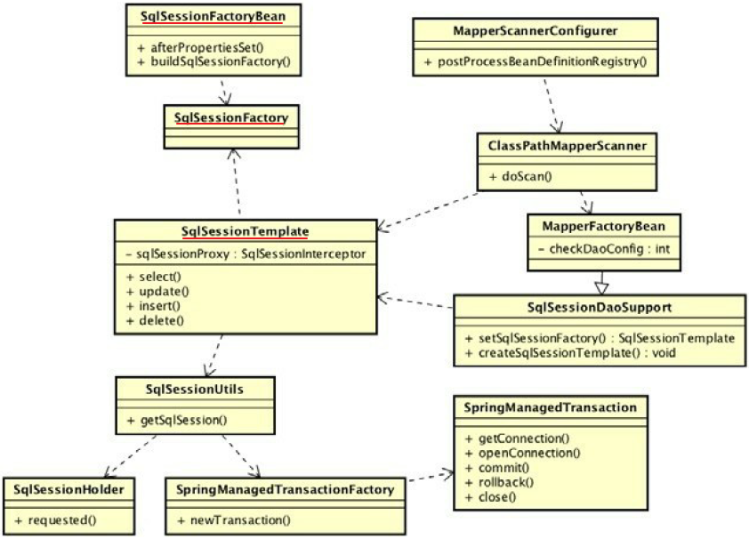

# 参考资料

Java EE 互联网轻量级框架整合开发——SSM框架和Redis实现


# 数据库连接JDBC

JDBC（Java Data Base Connectivity，Java数据库连接）是一种用于执行SQL语句的JavaAPI，可以为多种**关系数据库**提供统一访问，它由一组用Java语言编写的类和接口组成。

JDBC连接数据库的流程及其原理如下：

1. 在开发环境中**加载指定数据库的驱动程序**。MySQL支持JDBC的驱动程序，如：`mysql-connector-java-5.1.18-bin.jar`

2. 在Java程序中**加载驱动程序**：`Class.forName("com.mysql.jdbc.Driver")`

3. 创建**数据连接对象**。通过`DriverManager`类创建数据库连接对象`Connection`。`DriverManager`类**作用于Java程序和JDBC驱动程序之间**，用于检查所加载的驱动程序是否可以建立连接，然后通过它的`getConnection`方法根据数据库的URL 、用户名和密码，创建一个`JDBC Connection对象`。

   ```java
   Connection connectMySQL = DriverManager.getConnection("jdbc:mysql://localhost:3306/xxx", "root", "admin");
   ```


4. **创建Statement对象**。Statement类的主要是用于**执行静态SQL语句并返回它所生成结果的对象**。

   ```java
   Statement statement = connection.createStatement();
   ```

   

5. 调用Statement对象的相关方法**执行相对应的SQL语句**。

   ```java
   statement.excuteUpdate("INSERT INTO staff(...) VALUES (...)");
   ```


6. **关闭数据库连接**。使用完数据库或者不需要访问数据库时，通过Connection的close()方法及时关闭数据连接。


# MyBatis实例

MyBatis使用简单的XML或注解用于配置和原始映射，**将接口和Java的POJOs（Plain Old Java Objects，普通的Java对象）映射成数据库中的记录**。

项目地址：`D:\Learning\Spring\SpringDemo\MyBatisDemo`

## 组织结构

注意：需要导入`mybatis-3.5.6.jar`和`mysql-connector-java-5.1.30.jar`两个包！


## 项目文件

### 实体类

用于**对数据库中数据的映射**，使程序员更关注于对Java类的使用而不是数据库的操作！

`mybatis.entity.Role`

```java
package mybatis.entity;

public class Role {

    private Long id;
    private String roleName;
    private String note;

    public Long getId() {
        return id;
    }

    public void setId(Long id) {
        this.id = id;
    }

    public String getRoleName() {
        return roleName;
    }

    public void setRoleName(String roleName) {
        this.roleName = roleName;
    }

    public String getNote() {
        return note;
    }

    public void setNote(String note) {
        this.note = note;
    }
}
```


### Dao接口

**数据库操作的映射文件**，用于**映射数据库的操作**，可以通过**配置文件**指定方法对应的SQL语句或者直接使用Java提供的**注解方式**进行SQL指定！

`mybatis.dao.RoleDao`

```java
package mybatis.dao;

import mybatis.entity.Role;

import java.util.List;

public interface RoleDao {

    void insertRole(Role role);

    void deleteRole(Role role);

    void updateRole(Role role);

    Role getRole(Long id);

    List<Role> findRoles(String roleName);

}
```


### RoleMapper.xml

用于建立对应数据库操作接口的SQL映射。MyBatis会**将这里设定的SQL与对应的Java接口相关联**，以保证在MyBatis中调用接口的时候会到数据库中执行相应的SQL来简化开发

`resources/RoleMapper.xml`

```xml
<?xml version="1.0" encoding="UTF-8" ?>
<!DOCTYPE mapper PUBLIC "-//mybatis.org//DTD Mapper 3.0//EN" "http://mybatis.org/dtd/mybatis-3-mapper.dtd">
<mapper namespace="mybatis.dao.RoleDao">

    <insert id="insertRole" parameterType="role">
		insert into table_role(role_name, note) values(#{roleName}, #{note})
	</insert>

    <delete id="deleteRole" parameterType="long">
		delete from table_role where id= #{id}
	</delete>

    <update id="updateRole" parameterType="role">
		update table_role set role_name = #{roleName}, note = #{note} where id= #{id}
	</update>

    <select id="getRole" parameterType="long" resultType="role">
		select id, role_name as roleName, note from table_role where id = #{id}
	</select>

    <select id="findRoles" parameterType="string" resultType="role">
		select id, role_name as roleName, note from table_role
		where role_name like concat('%', #{roleName}, '%')
	</select>

</mapper>
```


### mybatis-config.xml

配置文件主要用于配置**程序中可变性高的设置**

`resources/mybatis-config.xml`

```xml
<?xml version="1.0" encoding="UTF-8" ?>
<!DOCTYPE configuration   PUBLIC "-//mybatis.org//DTD Config 3.0//EN"
        "http://mybatis.org/dtd/mybatis-3-config.dtd">

<configuration>
    <!-- 别名 -->
    <typeAliases>
        <typeAlias alias="role" type="mybatis.entity.Role"/>
    </typeAliases>

    <!-- 数据库环境 -->
    <environments default="development">
        <environment id="development">
            <transactionManager type="JDBC"/>
            <dataSource type="POOLED">
                <property name="driver" value="com.mysql.jdbc.Driver"/>
                <property name="url" value="jdbc:mysql://localhost:3306/MyBatisDemo"/>
                <property name="username" value="root"/>
                <property name="password" value="admin"/>
            </dataSource>
        </environment>
    </environments>

    <!-- 映射文件 -->
    <mappers>
        <mapper resource="resources/RoleMapper.xml"/>
    </mappers>
</configuration>
```


### SqlSessionFactoryUtils

`mybatis.utils.SqlSessionFactoryUtils`

```java
package mybatis.utils;

import org.apache.ibatis.io.Resources;
import org.apache.ibatis.session.SqlSession;
import org.apache.ibatis.session.SqlSessionFactory;
import org.apache.ibatis.session.SqlSessionFactoryBuilder;

import java.io.IOException;
import java.io.InputStream;

public class SqlSessionFactoryUtils {

    private final static Class<SqlSessionFactoryUtils> LOCK = SqlSessionFactoryUtils.class;

    private static SqlSessionFactory sqlSessionFactory = null;

    private SqlSessionFactoryUtils() {

    }

    public static SqlSessionFactory getSqlSessionFactory() {
        synchronized (LOCK) {
            if (sqlSessionFactory != null) {
                return sqlSessionFactory;
            }

            String resource = "resources/mybatis-config.xml";
            InputStream inputStream;

            try {
                inputStream = Resources.getResourceAsStream(resource);
                sqlSessionFactory = new SqlSessionFactoryBuilder().build(inputStream);
            } catch (IOException e) {
                e.printStackTrace();
            }

            return sqlSessionFactory;
        }
    }

    public static SqlSession openSqlSession() {
        if (sqlSessionFactory == null) {
            getSqlSessionFactory();
        }

        return sqlSessionFactory.openSession();
    }

}
```


### RoleTest

`mybatis.RoleTest`

```java
package mybatis;

import mybatis.entity.Role;
import mybatis.utils.SqlSessionFactoryUtils;
import org.apache.ibatis.session.SqlSession;

import mybatis.dao.RoleDao;

public class RoleTest {
    public static void main(String[] args) {
        testRoleMapper();
    }

    private static void testRoleMapper() {
        SqlSession sqlSession = null;

        try {
            sqlSession = SqlSessionFactoryUtils.openSqlSession();
            RoleDao roleDao = sqlSession.getMapper(RoleDao.class);
            Role role = roleDao.getRole(1L);
            System.out.println(role.getRoleName());
        } finally {
            if (sqlSession != null) {
                sqlSession.close();
            }
        }
    }
}
```


# MyBatis实例分析

持久层可以将业务数据存储到磁盘，具备长期存储能力。

MyBatis的核心组件分为4 个部分：

1. `SqlSessionFactoryBuilder（构造器）` ：它会根据`配置`或者`代码`来生成SqlSessionFactory，采用的是分步构建的Builder模式。
2. `SqlSessionFactory（工厂接口）`：依靠它来生成`SqlSession`，使用的是工厂模式。
3. `SqlSession（会话）`： 一个既可以`发送SQL`执行返回结果，也可以`获取Mapper`的接口。
4. `SQL Mapper（映射器）`：由一个Java接口和`XML文件`（或注解〉构成，需要给出对应的SQL和映射规则。它负责发送SQL去执行，并返回结果。


**无论是`映射器`还是`SqlSession`都可以发送SQL到数据库**执行。


## SqlSessionFactory工厂接口

`SqlSessionFactory`是MyBatis的核心类之一，其最重要的功能就是**提供创建MyBatis的核心接口`SqlSession`**，所以要**先创建`SqlSessionFactory`**，为此要**提供配置文件和相关的参数**。MyBatis是一个复杂的系统，它**采用了`Builder`模式去创建`SqlSessionFactory`**，在实际中可以**通过`SqlSessionFactoryBuilder`去构建**，其构建分为两步

1. **通过`org.apache.ibatis.builder.xml.XMLConfigBuilder`解析配置的XML文件或Java代码，读出所配置的参数，并将读取的内容存入`org.apache.ibatis.session.Configuration`类对象中**。
   - `Configuration`采用的是`单例模式`，几乎所有的MyBatis配置内容都会存放在这个单例对象中，以便后续将这些内容读出。
2. 使用`Confinguration`对象去创建`SqlSessionFactory`。
   - MyBatis中的`SqlSessionFactory是一个接口`，而不是一个实现类，为此MyBatis提供了一个默认的实现类`org.apache.ibatis.session.defaults.DefaultSqlSessionFactory`
   - **`SqlSessionFactory`是一个接口**，在MyBatis中它存在两个实现类：`SqlSessionManager`和`DefaultSqlSessionFactory `。


**每个基于MyBatis的应用都是以一个SqlSessionFactory的实例为中心**，而**`SqlSessionFactory唯一的作用就是生产MyBatis的核心接口对象SqlSession`**，所以它的责任是唯一的，往往会采用**单例模式**处理。

### 使用XML构建SqlSessionFactory

在MyBatis中的XML分为两类：

- 一类是**基础配置文件**，通常只有一个，主要是**数据源配置**和**`mapper`文件注册** 
- 另一类是**映射文件**，它可以配置映射关系、SQL、参数等信息


#### MyBatis基础配置文件

[mybatis-config.xml](# mybatis-config.xml)配置最基本的上下文参数和运行环境！

```xml
<?xml version="1.0" encoding="UTF-8" ?>
<!DOCTYPE configuration   PUBLIC "-//mybatis.org//DTD Config 3.0//EN"
        "http://mybatis.org/dtd/mybatis-3-config.dtd">

<configuration>
    <!-- 别名 -->
    <typeAliases>
        <typeAlias alias="role" type="mybatis.entity.Role"/>
    </typeAliases>

    <!-- 数据库环境 -->
    <environments default="development">
        <environment id="development">
            <transactionManager type="JDBC"/>
            <dataSource type="POOLED">
                <property name="driver" value="com.mysql.jdbc.Driver"/>
                <property name="url" value="jdbc:mysql://localhost:3306/MyBatisDemo"/>
                <property name="username" value="root"/>
                <property name="password" value="admin"/>
            </dataSource>
        </environment>
    </environments>

    <!-- 映射文件 -->
    <mappers>
        <mapper resource="resources/RoleMapper.xml"/>
    </mappers>
</configuration>
```


`<environment>`描述的是数据库：

- `<transactionManager>`元素是**配置事务管理器**，这里采用的是MyBatis的`JDBC管理器`方式
- 采用`<dataSource>`元素**配置数据库**，其中属性`type="POOLED"`代表采用**MyBatis内部提供的连接池方式**
- 最后定义一些关于JDBC的属性信息


#### 通过XML构建SqlSessionFactory

有了**基础配置文件**，就可以用一段很简短的代码来**生成SqlSessionFactory**：[SqlSessionFactoryUtils](# SqlSessionFactoryUtils)

```java
private static SqlSessionFactory sqlSessionFactory = null;

// 读取mybatis-config.xml
String resource = "resources/mybatis-config.xml";
InputStream inputStream;
// import org.apache.ibatis.io.Resources;
inputStream = Resources.getResourceAsStream(resource);

// 通过SqlSessionFactoryBuilder创建SqlSessionFactory
sqlSessionFactory = new SqlSessionFactoryBuilder().build(inputStream);
```

首先读取`mybatis-config.xml`，然后通过`SqlSessionFactoryBuilder`的`build`方法去创建`SqlSessionFactory`。MyBatis采用`Builder模式`为开发者隐藏了细节。


## SqlSession

在MyBatis中，`SqlSession`是其核心接口。在MyBatis中有两个实现类：`DefaultSqlSession`和`SqlSessionManager`。

- `DefaultSqlSession`是**单线程**使用的
- `SqlSessionManager`在**多线程**环境下使用。

`SqlSession`的作用类似于JDBC中的`Connection`对象，代表着一个连接资源的启用，它主要有3个作用：

- 获取Mapper接口
- 发送SQL给数据库
- 控制数据库事务


### 创建SqlSession

**有了`SqISessionFactory`，创建`SqlSession`就十分简单**了：

```java
SqlSession sqlSession = SqlSessionFactory.openSession();
```

`SqlSession`只是一个门面接口，它有很多方法，可以直接发送SQL。在MyBatis中，**真正干活的是`Executor`**。

`SqlSession`获取`Mapper接口`和`发送SQL`的功能需要**先实现映射器**的功能，而映射器接口也可以实现发送SQL的功能。


###  SqlSession的执行过程

**SqlSession的执行过程**是通过`Executor、StatementHandler、ParameterHandler`和`ResultSetHandler`来**完成数据库操作和结果返回**的：

- `Executor`代表执行器，由它调度`StatementHandler`、`ParameterHandler`、`ResultSetHandler`等来执行对应的SQL 。其中`StatementHandler`是最重要的。
- **`StatementHandler`的作用是使用数据库的`Statement(PreparedStatement)`执行操作**，它是四大对象的核心，起到承上启下的作用，许多重要的插件都是通过拦截它来实现的。
- `ParameterHandler`是用来处理SQL参数的。
- `ResultSetHandler`是进行**数据集(ResultSet)的封装返回处理**的


## 映射器

映射器是MyBatis中最重要、最复杂的组件，它由一个**接口（xxDAO）**和**对应的XML文件**或注解组成。

映射器的主要作用就是**将SQL查询到的结果映射为一个POJO**（Plain Ordinary Java Objec），或者**将POJO的数据插入到数据库中**，并定义一些关于缓存等的重要内容。

### 实体类

```java
package mybatis.entity;

public class Role {

    private Long id;
    private String roleName;
    private String note;

    /**setter and getter**/
}
```


### 映射器接口

[Dao接口](# Dao接口)

```java
package mybatis.dao;
import mybatis.entity.Role;
public interface RoleDao {
    Role getRole(Long id);
}
```


### 用XML实现映射器

在[MyBatis基础配置文件](# MyBatis基础配置文件)中，`<mapper resource="resources/RoleMapper.xml"/>`用于引入`RoleMapper.xml`：

```xml
<?xml version="1.0" encoding="UTF-8" ?>
<!DOCTYPE mapper PUBLIC "-//mybatis.org//DTD Mapper 3.0//EN" "http://mybatis.org/dtd/mybatis-3-mapper.dtd">
<mapper namespace="mybatis.dao.RoleDao">
    <select id="getRole" parameterType="long" resultType="role">
		select id, role_name as roleName, note from table_role where id = #{id}
	</select>
</mapper>
```


- `<mapper>`元素中的属性`namespace`所对应的是一个接口的全限定名，于是**MyBatis上下文就可以通过它找到对应的接口**。
- `<select>`元素表明这是一条查询语旬，属性`id`标识了这条SQL，属性`parameterType="long"`说明传递给SQL的是一个long型的参数，而`resultType="role"`表示返回的是一个`role类型`的返回值。而`role`是配置文件[mybatis-config.xml](# mybatis-config.xml)配置的别名（`<typeAlias alias="role" type="mybatis.entity.Role"/>`），指代的是`"mybatis.entity.Role"`。

MyBatis把SQL查询的结果通过**自动映射**的功能**映射成为一个POJO**。


### 用Mapper接口发送SQL

`SqlSession`获取`Mapper接口`，通过Mapper接口发送SQL：[RoleTest](# RoleTest)

```java
// sqlSessionFactory = new SqlSessionFactoryBuilder().build(inputStream);
// sqlSessionFactory.openSession();
sqlSession = SqlSessionFactoryUtils.openSqlSession();
RoleDao roleDao = sqlSession.getMapper(RoleDao.class);
Role role = roleDao.getRole(1L);
```


## 生命周期

所谓生命周期就是每一个对象应该存活的时间，比如一些对象一次用完后就要关闭，使它们被Java虚拟机（JVM）销毁，以**避免继续占用资源**，所以我们会根据每一个组件的作用去确定其生命周期。


1. SqlSessionFactoryBuilder

   **`SqlSessionFactoryBuilder`的作用在于创建`SqlSessionFactory`**，创建成功后，`SqlSessionFactoryBuilder`就失去了作用

2. SqlSessionFactory

   - `SqlSessionFactory`可以被认为是一个**数据库连接池**，它的作用是**创建SqlSession接口**对象。因为MyBatis的本质就是Java对数据库的操作，所以**SqlSessionFactory的生命周期存在于整个MyBatis的应用之中**。
   - 由于SqlSessionFactory是一个对数据库的连接池，所以它**占据着数据库的连接资源**。如果创建多个SqlSessionFactory ，那么就存在多个数据库连接池，这样不利于对数据库资源的控制，也会导致数据库连接资源被消耗光。因此在一般的应用中往往**希望SqlSessionFactory作为一个单例，让它在应用中被共享**。

3. SqlSession

   如果说SqlSessionFactory相当于数据库连接池，那么**SqlSession就相当于一个数据库连接（ Connection 对象）**，你可以在一个事务里面执行多条SQL ，然后通过它的`commit、rollback`等方法，提交或者回滚事务。所以它**应该`存活在一个业务请求中`，处理完整个请求后，应该关闭这条连接，让它归还给SqlSessionFactory**，否则数据库资源就很快被耗费精光，系统就会瘫痪，所以用`try...catch...finally...`语句来保证其正确关闭。

4. Mapper

   - **Mapper是一个接口，它由SqlSession所创建，由于SqlSession的关闭，它的数据库连接资源也会消失，所以它的生命周期应该小于等于SqlSession的生命周期**。
   - **Mapper代表的是一个请求中的业务处理，所以它应该在一个请求中，一旦处理完了相关的业务，就应该废弃它**。


# MyBatis构建与执行过程

参考资料：[**互联网轻量级SSM框架解密:Spring、Spring MVC、MyBatis源码深度剖析**]()

## MyBatis模块

MyBatis通过mybatis-3的应用程序接口和`ibatis-spring`向用户提供SQL访问方法，而`ibatis-spring`底层仍依赖`mybatis-3`和`spring-tx`来实现
对`SQL Mapping`和事务的支持。

mybatis-3实现了SQL映射的全部功能，通过`构建器`构建配置环境和JDBC环境，对应用程序提供接口并使用执行器执行SQL。


- `ibatis-spring`：在实际项目中，大部分应用都将Spring作为对象容器，开发者除了可以使用原生的MyBatis提供的接入方法，还可以使用
  **MyBatis团队开发的支持Spring环境的集成工具**。该项目提供了标准的模板接口、事务支持和便捷的注册映射器。

- 应用程序接口：包装了常用的SQL访问方法，向应用程序提供统一的访问接口。
- 构建器（Builder）：MyBatis运行环境的初始化构建器，**负责构建配置信息及SQL映射关系**。使用解析器解析配置，支持以`XML`和`注释`的形式进行配置。
- 执行器（Executor）：提供标准的SQL访问接口，支持缓存、动态SQL等高级特性。
- 配置（Configuration）：MyBatis 运行时的所有上下文信息，是**整个MyBatis的核心**。**构建器**最终用于**构造Configuration类的对象**，**执行器**运行过程中的所有配置、变量和构造工厂都在配置模块中。
- spring-tx：在与Spring集成的情况下，MyBatis委托Spring来管理将要执行的底层JDBC对象、自身的构建器和执行器的生命周期。
- jdbc：与数据库交互的JDBC接口、驱动。


## 构建阶段

MyBatis需要通过**初始化**来准备运行时环境。在初始化阶段**输入的是`XML`和`字节码`，输出结果是`configuration对象`**。

`XMLConfigBuilder`和`XMLMapperBuilder`这两个构建器是MyBatis构建阶段的核心：


MyBatis构建阶段主要的产出结果和参与构建的构建器如下，它们互相协作，实现了整个**MyBatis执行前的准备工作**：

- `SqlSessionFactory`：管理**`数据库会话`、`聚合configuration对象`**，是构建阶段的重要输出结果。
- `SqlSessionFactoryBuilder`：`SqlSessionFactory的构造器`，可以自己解析配置，也可以直接传入提前构建好的配置对象构建`SqlSessionFactory`。
- `Configuration`：**存储所有MyBatis运行时的配置**。
- `BaseBuilder`：构造器基类，处理configuration、typeAlias及typeHandler对象。
- **`XMLConfigBuilder`**：**解析XML定义的`configuration对象`**。
- **`XMLMapperBuilder`**：**解析XML定义的`SQL映射配置对象集合`**。
- `MapperRegistry`：configuration对象中的SQL映射配置对象的注册机。
- `MapperAnnotationBuilder`：解析注释定义的SQLMapper对象集合。


- MyBatis构建阶段的**调用入口类**是`SqlSessionFactoryBuilder`，它会**调用`XMLConfigBuilder`构建配置**。
- `XMLConfigBuilder`会**调用`XMLMapperBuilder`（以XML形式定义SQL Mapper时）构建SQL Mapper映射**。
- `SqlSessionFactoryBuilder`在**得到初始化的`configuration对象`**后**用其构建`SqlSessionFactory`**。
- `SqlSessionFactory`是**生产`SqlSession对象`的工厂**，`SqlSession`则是MyBatis**执行阶段的关键入口类**。


### SqlSessionFactoryBuilder

[SqlSessionFactoryUtils](# SqlSessionFactoryUtils)：

```java
String resource = "resources/mybatis-config.xml";
inputStream = Resources.getResourceAsStream(resource);
sqlSessionFactory = new SqlSessionFactoryBuilder().build(inputStream);
```


在`SqlSessionFactoryBuilder`中有很多重载的`build()`方法，但核心方法有以下两种：

```java
public class SqlSessionFactoryBuilder {
  //  ...
  public SqlSessionFactory build(InputStream inputStream, String environment, Properties properties) {
    try {
      // 初始化解析器
      XMLConfigBuilder parser = new XMLConfigBuilder(inputStream, environment, properties);
      // 将配置文件的文件流解析成configuration对象
      return build(parser.parse());
    } catch (Exception e) {
      throw ExceptionFactory.wrapException("Error building SqlSession.", e);
    } finally {
      ErrorContext.instance().reset();
      try {
        inputStream.close();
      } catch (IOException e) {
        // Intentionally ignore. Prefer previous error.
      }
    }
  }

  public SqlSessionFactory build(Configuration config) {
    return new DefaultSqlSessionFactory(config);
  }

}
```


- `SqlSessionFactory#build(InputStream inputStream, String environment, Properties properties)`首先生成`XMLConfigBuilder对象`，然后调用`XMLConfigBuilder#parse()`方法**将配置文件的文件流解析成`configuration对象`**。

  ```java
  public class XMLConfigBuilder extends BaseBuilder {
    // ...
    public XMLConfigBuilder(Reader reader, String environment, Properties props) {
      this(new XPathParser(reader, true, props, new XMLMapperEntityResolver()), environment, props);
    }  
    
    private XMLConfigBuilder(XPathParser parser, String environment, Properties props) {
      super(new Configuration());
      ErrorContext.instance().resource("SQL Mapper Configuration");
      this.configuration.setVariables(props);
      this.parsed = false;
      this.environment = environment;
      this.parser = parser;
    }
  
    public Configuration parse() {
      if (parsed) {
        throw new BuilderException("Each XMLConfigBuilder can only be used once.");
      }
      parsed = true;
      parseConfiguration(parser.evalNode("/configuration"));
      return configuration;
    }
  }
  ```

  

- `SqlSessionFactory#build(Configuration config)`在`configuration对象`解析完成后，**使用configuration对象构建`DefaultSqlSessionFactory`对象**


### XmlConfigBuilder的初始化


```java
String resource = "resources/mybatis-config.xml";
inputStream = Resources.getResourceAsStream(resource);
// sqlSessionFactory = new SqlSessionFactoryBuilder().build(inputStream);
XMLConfigBuilder parser = new XMLConfigBuilder(inputStream, environment, properties);

public class XMLConfigBuilder extends BaseBuilder {

  public XMLConfigBuilder(InputStream inputStream, String environment, Properties props) {
    this(new XPathParser(inputStream, true, props, new XMLMapperEntityResolver()), environment, props);
  }

}
```

1.`sqlSessionFactory = new SqlSessionFactoryBuilder().build(inputStream);`

2.`XMLConfigBuilder parser = new XMLConfigBuilder(inputStream, environment, properties);`

3.`new XPathParser(inputStream, true, props, new XMLMapperEntityResolver())`


**MyBatis只支持XML形式的Configuration配置**，`XPathParser`是XML解析的工具类：


**文件流**会被构建成XPathParser对象parser：

```java
public class XPathParser{
    public XPathParser(Reader reader, boolean validation, Properties variables, EntityResolver entityResolver) {
        commonConstructor(validation, variables, entityResolver);
    	this.document = createDocument(new InputSource(reader));
  	}
}
```

**私有的构造函数用于初始化configuration对象及赋值核心属性**：

```java
public class XMLConfigBuilder extends BaseBuilder {
  // ...
  public XMLConfigBuilder(Reader reader, String environment, Properties props) {
    this(new XPathParser(reader, true, props, new XMLMapperEntityResolver()), environment, props);
  }  
  
  private XMLConfigBuilder(XPathParser parser, String environment, Properties props) {
    super(new Configuration());
    ErrorContext.instance().resource("SQL Mapper Configuration");
    this.configuration.setVariables(props);
    this.parsed = false;
    this.environment = environment;
    this.parser = parser;
  }

  public Configuration parse() {
    if (parsed) {
      throw new BuilderException("Each XMLConfigBuilder can only be used once.");
    }
    parsed = true;
    parseConfiguration(parser.evalNode("/configuration"));
    return configuration;
  }
}
```

`XMLConfigBuilder`构建一个configuration对象，然后调用父类`BaseBuilder`的构造函数，将`properties`变量赋值到configuration对象：

```java
private XMLConfigBuilder(XPathParser parser, String environment, Properties props) {
    super(new Configuration());
  }

//
public abstract class BaseBuilder {
  protected final Configuration configuration;
  protected final TypeAliasRegistry typeAliasRegistry;
  protected final TypeHandlerRegistry typeHandlerRegistry;

  public BaseBuilder(Configuration configuration) {
    this.configuration = configuration;
    this.typeAliasRegistry = this.configuration.getTypeAliasRegistry();
    this.typeHandlerRegistry = this.configuration.getTypeHandlerRegistry();
  }
}
```


### MyBatis配置文件

**Configuration配置文件**的XML格式定义为`mybatis-3-config.dtd`：

```xml
<?xml version="1.0" encoding="UTF-8" ?>
<!DOCTYPE configuration   PUBLIC "-//mybatis.org//DTD Config 3.0//EN"
        "http://mybatis.org/dtd/mybatis-3-config.dtd">

<configuration>
    <!-- 别名 -->
    <typeAliases>
        <typeAlias alias="role" type="mybatis.entity.Role"/>
    </typeAliases>

    <!-- 数据库环境 -->
    <environments default="development">
        <environment id="development">
            <transactionManager type="JDBC"/>
            <dataSource type="POOLED">
                <property name="driver" value="com.mysql.jdbc.Driver"/>
                <property name="url" value="jdbc:mysql://localhost:3306/MyBatisDemo"/>
                <property name="username" value="root"/>
                <property name="password" value="admin"/>
            </dataSource>
        </environment>
    </environments>

    <!-- 映射文件 -->
    <mappers>
        <mapper resource="resources/RoleMapper.xml"/>
    </mappers>
</configuration>
```


具体的标签功能和配置方式详见：https://mybatis.org/mybatis-3/zh/configuration.html


### 解析配置文件构建Configuration配置

**Configuration类的对象的大部分构建是在XMLConfigBuilder中完成**的，但是运**行环境Environment**和**SQL映射**依赖其他两个Builder类实现：


**`SqlSessionFactoryBuilder`在初始化之后，会调用`XmlConfigBuilder`的`parse()方法`将配置文件初始化到`configuration对象`中**。

```java
public class XMLConfigBuilder extends BaseBuilder {
  // ...
  public XMLConfigBuilder(Reader reader, String environment, Properties props) {
    this(new XPathParser(reader, true, props, new XMLMapperEntityResolver()), environment, props);
  }  
  
  private XMLConfigBuilder(XPathParser parser, String environment, Properties props) {
    super(new Configuration());
    ErrorContext.instance().resource("SQL Mapper Configuration");
    this.configuration.setVariables(props);
    this.parsed = false;
    this.environment = environment;
    this.parser = parser;
  }

  public Configuration parse() {
    if (parsed) {
      throw new BuilderException("Each XMLConfigBuilder can only be used once.");
    }
    parsed = true;
      // 从配置文件的Configuration处开始解析配置
    parseConfiguration(parser.evalNode("/configuration"));
    return configuration;
  }
}
```


在**配置文件解析阶段**，`XPathParser的evalNode()方法`在`XmlConfigBuilder`中经常被调用，目的就是**使用`XPath接口`获取解析好的document对象中对应元素的DOM节点**，该操作在整个构建过程中被广泛应用。

```java
public class XPathPaser{
  public XNode evalNode(String expression) {
    return evalNode(document, expression);
  }

  public XNode evalNode(Object root, String expression) {
    Node node = (Node) evaluate(expression, root, XPathConstants.NODE);
    if (node == null) {
      return null;
    }
    return new XNode(this, node, variables);
  }
}
```


`parse()`通过`evalNode()`获取配置文件根节点的`configuration元素`

```java
public class XMLConfigBuilder extends BaseBuilder {

  public Configuration parse() {
    if (parsed) {
      throw new BuilderException("Each XMLConfigBuilder can only be used once.");
    }
    parsed = true;
      // 从配置文件的Configuration处开始解析配置
    parseConfiguration(parser.evalNode("/configuration"));
    return configuration;
  }
}
```

再调用`parseConfiguration()`完成解析操作：

```java
public class XMLConfigBuilder extends BaseBuilder {
    private void parseConfiguration(XNode root) {
        try {
            // 加载属性配置
      		propertiesElement(root.evalNode("properties"));
      		Properties settings = settingsAsProperties(root.evalNode("settings"));
      		loadCustomVfs(settings);
      		loadCustomLogImpl(settings);
          	typeAliasesElement(root.evalNode("typeAliases"));
          	pluginElement(root.evalNode("plugins"));
          	objectFactoryElement(root.evalNode("objectFactory"));
          	objectWrapperFactoryElement(root.evalNode("objectWrapperFactory"));
          	reflectorFactoryElement(root.evalNode("reflectorFactory"));
          	settingsElement(settings);
          	// read it after objectFactory and objectWrapperFactory issue #631
          	environmentsElement(root.evalNode("environments"));
          	databaseIdProviderElement(root.evalNode("databaseIdProvider"));
          	typeHandlerElement(root.evalNode("typeHandlers"));
            // 加载SQL Mapper
          	mapperElement(root.evalNode("mappers"));
    	} catch (Exception e) {
            throw new BuilderException("Error parsing SQL Mapper Configuration. Cause: " + e, e);
        }
  	}
}
```

**`mapperElement()方法`构建SQL Mapper**。从这个方法开始，构建过程进入第2个重要阶段：**`SQL Mapper初始化阶段`**！


### mapperElement

```java
public class XMLConfigBuilder extends BaseBuilder {

  private final XPathParser parser;

  private void mapperElement(XNode parent) throws Exception {
    if (parent != null) {
      for (XNode child : parent.getChildren()) {
        if ("package".equals(child.getName())) {
          String mapperPackage = child.getStringAttribute("name");
          configuration.addMappers(mapperPackage);
        } else {
          String resource = child.getStringAttribute("resource");
          String url = child.getStringAttribute("url");
          String mapperClass = child.getStringAttribute("class");
          if (resource != null && url == null && mapperClass == null) {
            // 使用XMLMapperBuilder构建
            ErrorContext.instance().resource(resource);
            InputStream inputStream = Resources.getResourceAsStream(resource);
            XMLMapperBuilder mapperParser = new XMLMapperBuilder(inputStream, configuration, resource, configuration.getSqlFragments());
            mapperParser.parse();
          } else if (resource == null && url != null && mapperClass == null) {
            ErrorContext.instance().resource(url);
            InputStream inputStream = Resources.getUrlAsStream(url);
            XMLMapperBuilder mapperParser = new XMLMapperBuilder(inputStream, configuration, url, configuration.getSqlFragments());
            mapperParser.parse();
          } else if (resource == null && url == null && mapperClass != null) {
            Class<?> mapperInterface = Resources.classForName(mapperClass);
            configuration.addMapper(mapperInterface);
          } else {
            throw new BuilderException("A mapper element may only specify a url, resource or class, but not more than one.");
          }
        }
      }
    }
  }
}
```


**`XMLConfigBuilder`在解析SQL Mapper配置**时如果遇到直接定义resource或URL并且mapperClass为空的情况，则会调用`XmlMapperBuilder#parse()`直接解析文件！

```java
InputStream inputStream = Resources.getResourceAsStream(resource);
XMLMapperBuilder mapperParser = new XMLMapperBuilder(inputStream, configuration, resource, configuration.getSqlFragments());
mapperParser.parse();
```


### SQL映射的构建

#### mapper配置文件

`mybatis-3-mapper.dtd`定义了**SQL Mapper配置文件**支持的内容：

```xml
<?xml version="1.0" encoding="UTF-8" ?>
<!DOCTYPE mapper PUBLIC "-//mybatis.org//DTD Mapper 3.0//EN" "http://mybatis.org/dtd/mybatis-3-mapper.dtd">
<mapper namespace="mybatis.dao.RoleDao">
    <insert id="insertRole" parameterType="role">
		insert into table_role(role_name, note) values(#{roleName}, #{note})
	</insert>
</mapper>
```


mapper元素定义的内容都是与CRUD操作相关！


#### Configuration类与mapper相关的类

MyBatis的SQL Mapping配置被保存在Configuration类的对象中，`与Configuration关联的类`和`Configuration类中与SQL Mapping有关的属
性`列表如图所示：


#### XmlMapperBuilder工作原理

`XmlMapperBuilder`在[XmlConfigBuilder.mapperElement](# mapperElement)中被调用！

**`XmlMapperBuilder#parse()`完成了大部分配置内容的加载工作，使`MapperRegistry注册机`将构建好的Mapper注册到configuration对象中**。为了支持以注释形式定义的SQL Mapper，`MapperAnnotationBuilder`也由XMLMapperBuilder调用


## 执行阶段

```java
// 构建阶段
inputStream = Resources.getResourceAsStream(resource);
sqlSessionFactory = new SqlSessionFactoryBuilder().build(inputStream);

// 执行阶段
sqlSession = sqlSessionFactory.openSession();
RoleDao roleDao = sqlSession.getMapper(RoleDao.class);
Role role = roleDao.getRole(1L);
```


执行阶段的关键类：


- `SqlSession`：MyBatis 的核心执行入口。**默认实现为`DefaultSqlSession`，该接口提供了大量的SQL调用方法**。
- `Configuration`：**保存构建阶段的结果**，也负责在执行阶段初始化需要的变量
- `MappedStatement`：配置好的映射SQL语句。
- `BoundSql`：SQL的抽象，存放执行SQL的内容。
- `Executor`：执行器。虚类`BaseExecutor`有`BatchExecutor`、`ClosedExecutor`、`ReuseExecutor`、`SimpleExecutor`等多种子类实现。
- StatementHandler：处理SQL语句的管理器接口。
- ResultSetHandler：处理结果集的管理器接口。


### SqlSession及其关联类的构建过程

MyBatis主要用工厂`SqlSessionFactory`来实现**SqlSession实例化**。

- `DefaultSqlSessionFactory`是SqlSessionFactory中的一个子类，也是**SqlSessionFactory默认的实现类**，是**构建阶段`SqlSessionFactoryBuilder`的产物**。

- 另一个子类`SqlSessionManager`利用ThreadLocal和代理拦截，保障了线程安全的、支持自动重连的SqlSession，这个类没有具体的生产使用。


`DefaultSqlSessionFactory`

```java
public class DefaultSqlSessionFactory implements SqlSessionFactory
```

只用于构造SqlSession的默认子类`DefaultSqlSession`对象

```java
public class DefaultSqlSession implements SqlSession
```

`DefaultSqlSessionFactory`提供了两种**创建`DefaultSqlSession`的方式**：`openSessionFromDataSource()`和`openSessionFromConnection()`。两者的区别只在于`TransactionFactory`生产Transaction对象的入参不同，在其他方面与Environment、Executor和SqlSession的构造方式相同。

```java
public class DefaultSqlSessionFactory implements SqlSessionFactory {

  private final Configuration configuration;

  public DefaultSqlSessionFactory(Configuration configuration) {
    this.configuration = configuration;
  }

  @Override
  public SqlSession openSession() {
    return openSessionFromDataSource(configuration.getDefaultExecutorType(), null, false);
  }

  private SqlSession openSessionFromDataSource(ExecutorType execType, TransactionIsolationLevel level, boolean autoCommit) {
    Transaction tx = null;
    try {
      // 取出构建好的环境
      final Environment environment = configuration.getEnvironment();
      // 事务工厂构建事务
      final TransactionFactory transactionFactory = getTransactionFactoryFromEnvironment(environment);
      // 从environment中获取数据源
      tx = transactionFactory.newTransaction(environment.getDataSource(), level, autoCommit);
      // 生成执行器
      final Executor executor = configuration.newExecutor(tx, execType);
      // 构建SqlSession
      return new DefaultSqlSession(configuration, executor, autoCommit);
    } catch (Exception e) {
      closeTransaction(tx); // may have fetched a connection so lets call close()
      throw ExceptionFactory.wrapException("Error opening session.  Cause: " + e, e);
    } finally {
      ErrorContext.instance().reset();
    }
  }

  private SqlSession openSessionFromConnection(ExecutorType execType, Connection connection) {
    try {
      boolean autoCommit;
      try {
        // 从数据库连接元数据中获取自动提交的参数
        autoCommit = connection.getAutoCommit();
      } catch (SQLException e) {
        // Failover to true, as most poor drivers
        // or databases won't support transactions
        autoCommit = true;
      }
      final Environment environment = configuration.getEnvironment();
      final TransactionFactory transactionFactory = getTransactionFactoryFromEnvironment(environment);
      // 直接使用传入的数据源
      final Transaction tx = transactionFactory.newTransaction(connection);
      final Executor executor = configuration.newExecutor(tx, execType);
      return new DefaultSqlSession(configuration, executor, autoCommit);
    } catch (Exception e) {
      throw ExceptionFactory.wrapException("Error opening session.  Cause: " + e, e);
    } finally {
      ErrorContext.instance().reset();
    }
  }
}
```


`Configuration#newExecutor(transaction, exectutorType)`为工厂方法，根据入参`executorType`构造`executor对象`。


**至此SqlSession及其重要属性executor和configuration都已构造完成，应用程序可以通过SqlSession执行自己定义好的SQL**。


### SqlSession执行查询操作

SqlSession在执行查询操作时，**先从configuration对象那里获取配置好的SQL Mapper**，之后的工作就交给`Executor#query()`了。

Executor类主要依赖`StatementHandler`和`ResultSetHandler`来完成查询工作，**`StatementHandler`负责查询，`ResultSetHandler`负责结果封装**。


## 小结

MyBatis对外提供功能丰富且统一的执行入口，但自身对于**查询语句（DQL）**和修改语句（DML）是分开实现的。

MyBatis会**从配置中找到用户需要执行的SQL语句`BoundSql`来创建连接、构建Statement和设置参数**。在**准备工作**做好后**Executor类会**
**执行真正的SQL**，在处理好返回的结果集后，会**将封装好的对象返回给应用程序**。


# MyBatis-Spring实例

## 创建工程

`D:\Learning\Spring\SpringDemo\SpringMyBatisDemo`


## 引入相关依赖

`pom.xml`

```xml
	<dependencies>

      <dependency>
          <groupId>org.springframework</groupId>
          <artifactId>spring-core</artifactId>
          <version>4.3.2.RELEASE</version>
      </dependency>
      <dependency>
          <groupId>org.springframework</groupId>
          <artifactId>spring-context</artifactId>
          <version>4.3.2.RELEASE</version>
      </dependency>
      <dependency>
          <groupId>org.springframework</groupId>
          <artifactId>spring-context-support</artifactId>
          <version>4.3.2.RELEASE</version>
      </dependency>

      <dependency>
          <groupId>org.springframework</groupId>
          <artifactId>spring-beans</artifactId>
          <version>4.3.2.RELEASE</version>
      </dependency>
      <dependency>
          <groupId>org.springframework</groupId>
          <artifactId>spring-expression</artifactId>
          <version>4.3.2.RELEASE</version>
      </dependency>

      <dependency>
          <groupId>org.mybatis</groupId>
          <artifactId>mybatis-spring</artifactId>
          <version>2.0.4</version>
      </dependency>

      <dependency>
          <groupId>org.springframework</groupId>
          <artifactId>spring-jdbc</artifactId>
          <version>4.3.2.RELEASE</version>
      </dependency>

      <dependency>
          <groupId>org.mybatis</groupId>
          <artifactId>mybatis</artifactId>
          <version>3.5.4</version>
      </dependency>

      <dependency>
          <groupId>mysql</groupId>
          <artifactId>mysql-connector-java</artifactId>
          <version>5.1.40</version>
      </dependency>

      <dependency>
          <groupId>com.alibaba</groupId>
          <artifactId>druid</artifactId>
          <version>1.1.19</version>
      </dependency>

    <dependency>
      <groupId>junit</groupId>
      <artifactId>junit</artifactId>
      <version>4.11</version>
      <scope>test</scope>
    </dependency>
  </dependencies>
```


## 新建库、表

```mysql
# 创建数据库
CREATE DATABASE `spring_mybatis` CHARACTER SET 'utf8';

# 创建表
CREATE TABLE `table_user` (
  `id` varchar(40) NOT NULL,
  `name` varchar(40) DEFAULT NULL,
  `age` int(3) DEFAULT NULL,
  `bir` timestamp NULL DEFAULT NULL,
  PRIMARY KEY (`id`)
) ENGINE=InnoDB DEFAULT CHARSET=utf8;
```


## 创建实体类

`entity.User`

```java
package entity;

import java.util.Date;

public class User {

    private String id;
    private String name;
    private Integer age;
    private Date birth;

    /**
     * 显式地构造无参构造
     */
    public User() {
    }

    public User(String id, String name, Integer age, Date birth) {
        this.id = id;
        this.name = name;
        this.age = age;
        this.birth = birth;
    }

    @Override
    public String toString() {
        return "User{" +
                "id='" + id + '\'' +
                ", name='" + name + '\'' +
                ", age=" + age +
                ", birth=" + birth +
                '}';
    }

    public String getId() {
        return id;
    }

    public void setId(String id) {
        this.id = id;
    }

    public String getName() {
        return name;
    }

    public void setName(String name) {
        this.name = name;
    }

    public Integer getAge() {
        return age;
    }

    public void setAge(Integer age) {
        this.age = age;
    }

    public Date getBirth() {
        return birth;
    }

    public void setBirth(Date birth) {
        this.birth = birth;
    }
}
```


## 创建UserDao接口

`dao.UserDao`

```java
package dao;

import entity.User;

import java.util.List;

public interface UserDao {
    List<User> findAllUser();
}
```

`UserDAO`接口的实现，在`Mybatis`中是通过`UserMapper.xml`完成的！

## 编写mapper配置文件实现接口

`mapper/UserMapper.xml`

```xml
<?xml version="1.0" encoding="UTF-8" ?>
<!DOCTYPE mapper PUBLIC "-//mybatis.org//DTD Mapper 3.0//EN" "http://mybatis.org/dtd/mybatis-3-mapper.dtd">
<mapper namespace="dao.UserDao">
    <select id="findAllUser" resultType="entity.User">
        SELECT  * FROM table_user;
    </select>
</mapper>
```

其中`resultType`可以使用[编写Spring-myabtis整合配置文件]()中设置的别名！

```xml
<select id="findAllUser" resultType="user">
```

一般为**类名首字母小写**！

## 编写Spring-myabtis整合配置文件


`SpringMyBatis.xml`

**<u>Mybatis提供的`SqlSessionFactoryBean`不再使用[Mybatis基础配置文件](# Mybatis基础配置文件)</u>**（该文件包含`数据源配置`和`mapper`注册），因此在`spring.xml`配置文件中，需添加上数据源等：

```xml
<?xml version="1.0" encoding="UTF-8"?>
<beans xmlns="http://www.springframework.org/schema/beans"
       xmlns:xsi="http://www.w3.org/2001/XMLSchema-instance"
       xsi:schemaLocation="http://www.springframework.org/schema/beans
                                            http://www.springframework.org/schema/beans/spring-beans.xsd">

    <!--1.创建数据源datasource-->
    <bean id="dataSource" class="com.alibaba.druid.pool.DruidDataSource">
        <property name="driverClassName" value="com.mysql.jdbc.Driver"/>
        <property name="url" value="jdbc:mysql://localhost:3306/spring_mybatis"/>
        <property name="username" value="root"/>
        <property name="password" value="admin"/>
    </bean>

    <!--2.根据数据源创建sqlSessionFactory-->
    <bean id="sqlSessionFactory" class="org.mybatis.spring.SqlSessionFactoryBean">
        <!--依赖数据源-->
        <property name="dataSource" ref="dataSource"/>
        <property name="mapperLocations" value="mapper/UserMapper.xml"/>
        <!-- 注入别名，在UserMapper.xml中使用；默认的别名是类名首字母小写 -->
        <property name="typeAliasesPackage" value="entity"/>
    </bean>

    <!--3.根据sqlSessionFactory创建DAO组件类-->
    <bean id="userDao" class="org.mybatis.spring.mapper.MapperFactoryBean">
        <!--注入sqlSessionFactory-->
        <property name="sqlSessionFactory" ref="sqlSessionFactory"/>
        <!--注入创建DAO接口类型；注入接口的全限定名：包.接口-->
        <property name="mapperInterface" value="dao.UserDao"/>
    </bean>

</beans>
```

`根据sqlSessionFactory创建DAO组件类`可使用以下方法：

使用`MapperScannerConfigurer`，让它扫描特定的包，自动帮我们**成批地创建映射器**：

```xml
    <!--3.根据sqlSessionFactory创建DAO组件类-->
    <bean class="org.mybatis.spring.mapper.MapperScannerConfigurer">
        <!--注入sqlSessionFactory-->
        <property name="sqlSessionFactoryBeanName" value="sqlSessionFactory"/>
        <!--扫描Dao接口所在包-->
        <property name="basePackage" value="dao"/>
    </bean>
```


## 测试

`Test`——从工厂中获取`sqlSessionFactory`对象：

```java
import dao.UserDao;
import org.springframework.context.ApplicationContext;
import org.springframework.context.support.ClassPathXmlApplicationContext;

public class Test {
    public static void main(String[] args) {
        ApplicationContext context = new ClassPathXmlApplicationContext("SpringMyBatis.xml");
        UserDao userDao = (UserDao) context.getBean(UserDao.class);
        userDao.findAllUser().forEach(user -> System.out.println(user));
    }
}
```


# MyBatis-Spring实例分析

[Spring-myabtis整合配置文件](# 编写Spring-myabtis整合配置文件)

```xml
<?xml version="1.0" encoding="UTF-8"?>
<beans xmlns="http://www.springframework.org/schema/beans"
       xmlns:xsi="http://www.w3.org/2001/XMLSchema-instance"
       xsi:schemaLocation="http://www.springframework.org/schema/beans
                                            http://www.springframework.org/schema/beans/spring-beans.xsd">

    <!--1.创建数据源datasource-->
    <bean id="dataSource" class="com.alibaba.druid.pool.DruidDataSource">
        <property name="driverClassName" value="com.mysql.jdbc.Driver"/>
        <property name="url" value="jdbc:mysql://localhost:3306/spring_mybatis"/>
        <property name="username" value="root"/>
        <property name="password" value="admin"/>
    </bean>

    <!--2.根据数据源创建sqlSessionFactory-->
    <bean id="sqlSessionFactory" class="org.mybatis.spring.SqlSessionFactoryBean">
        <!--依赖数据源-->
        <property name="dataSource" ref="dataSource"/>
        <property name="mapperLocations" value="mapper/UserMapper.xml"/>
        <!-- 注入别名，在UserMapper.xml中使用；默认的别名是类名首字母小写 -->
        <property name="typeAliasesPackage" value="entity"/>
    </bean>
    
    <!--3.根据sqlSessionFactory创建DAO组件类-->
    <bean id="userDao" class="org.mybatis.spring.mapper.MapperFactoryBean">
        <!--注入sqlSessionFactory-->
        <property name="sqlSessionFactory" ref="sqlSessionFactory"/>
        <!--注入创建DAO接口类型；注入接口的全限定名：包.接口-->
        <property name="mapperInterface" value="dao.UserDao"/>
    </bean>
	
    <!--或者使用下列方式-->
    <!--3.根据sqlSessionFactory创建DAO组件类-->
    <bean class="org.mybatis.spring.mapper.MapperScannerConfigurer">
        <!--注入sqlSessionFactory-->
        <property name="sqlSessionFactoryBeanName" value="sqlSessionFactory"/>
        <!--扫描Dao接口所在包-->
        <property name="basePackage" value="dao"/>
    </bean>

</beans>
```


## sqlSessionFactory创建

Spring通过`org.mybatis.spring.SqlSessionFactoryBean`封装了MyBatis中的实现：


- `InitializingBean`： 实现此接口的bean会在初始化时调用其`afterPropertiesSet`方法来进行**bean的逻辑初始化**。
- `FactoryBean`：一旦某个bean实现此接口，那么通过`getBean方法`获取bean时其实是获取此类的`getObject()`返回的实例。


### SqlSessionFactoryBean的初始化

```xml
	<!--2.根据数据源创建sqlSessionFactory-->
    <bean id="sqlSessionFactory" class="org.mybatis.spring.SqlSessionFactoryBean">
        <!--依赖数据源-->
        <property name="dataSource" ref="dataSource"/>
        <property name="mapperLocations" value="mapper/UserMapper.xml"/>
        <!-- 注入别名，在UserMapper.xml中使用；默认的别名是类名首字母小写 -->
        <property name="typeAliasesPackage" value="entity"/>
    </bean>
```


`org.mybatis.spring.SqlSessionFactoryBean#afterPropertiesSet`

```java
public class SqlSessionFactoryBean
    implements FactoryBean<SqlSessionFactory>, InitializingBean, ApplicationListener<ApplicationEvent> {

  @Override
  public void afterPropertiesSet() throws Exception {
    notNull(dataSource, "Property 'dataSource' is required");
    notNull(sqlSessionFactoryBuilder, "Property 'sqlSessionFactoryBuilder' is required");
    state((configuration == null && configLocation == null) || !(configuration != null && configLocation != null),
        "Property 'configuration' and 'configLocation' can not specified with together");

    this.sqlSessionFactory = buildSqlSessionFactory();
  }


  protected SqlSessionFactory buildSqlSessionFactory() throws Exception {

    final Configuration targetConfiguration;

    XMLConfigBuilder xmlConfigBuilder = null;
    if (this.configuration != null) {
      targetConfiguration = this.configuration;
      if (targetConfiguration.getVariables() == null) {
        targetConfiguration.setVariables(this.configurationProperties);
      } else if (this.configurationProperties != null) {
        targetConfiguration.getVariables().putAll(this.configurationProperties);
      }
    } else if (this.configLocation != null) {  // 从configLocation开始加载
      // 初始化builder
      xmlConfigBuilder = new XMLConfigBuilder(this.configLocation.getInputStream(), null, this.configurationProperties);
      // 构建configuration
      targetConfiguration = xmlConfigBuilder.getConfiguration();
    } else {
      LOGGER.debug(
          () -> "Property 'configuration' or 'configLocation' not specified, using default MyBatis Configuration");
      targetConfiguration = new Configuration();
      Optional.ofNullable(this.configurationProperties).ifPresent(targetConfiguration::setVariables);
    }

    // ......
        
    if (xmlConfigBuilder != null) {
      try {
        // 解析XML文件
        xmlConfigBuilder.parse();
        LOGGER.debug(() -> "Parsed configuration file: '" + this.configLocation + "'");
      } catch (Exception ex) {
        throw new NestedIOException("Failed to parse config resource: " + this.configLocation, ex);
      } finally {
        ErrorContext.instance().reset();
      }
    }

    targetConfiguration.setEnvironment(new Environment(this.environment,
        this.transactionFactory == null ? new SpringManagedTransactionFactory() : this.transactionFactory,
        this.dataSource));

    if (this.mapperLocations != null) {
      if (this.mapperLocations.length == 0) {
        LOGGER.warn(() -> "Property 'mapperLocations' was specified but matching resources are not found.");
      } else {
        // 遍历mapper
        for (Resource mapperLocation : this.mapperLocations) {
          if (mapperLocation == null) {
            continue;
          }
          try {
            // 初始化mapper构造器
            XMLMapperBuilder xmlMapperBuilder = new XMLMapperBuilder(mapperLocation.getInputStream(),
                targetConfiguration, mapperLocation.toString(), targetConfiguration.getSqlFragments());
            // 解析mapper文件
            xmlMapperBuilder.parse();
          } catch (Exception e) {
            throw new NestedIOException("Failed to parse mapping resource: '" + mapperLocation + "'", e);
          } finally {
            ErrorContext.instance().reset();
          }
          LOGGER.debug(() -> "Parsed mapper file: '" + mapperLocation + "'");
        }
      }
    } else {
      LOGGER.debug(() -> "Property 'mapperLocations' was not specified.");
    }

    // 使用工厂构建sqlSession对象
    return this.sqlSessionFactoryBuilder.build(targetConfiguration);
  }
}
```

此函数主要目的就是对于`sqlSessionFactory`进行初始化：

```java
  /**
   * Build a {@code SqlSessionFactory} instance.
   *
   * @return SqlSessionFactory
   * @throws Exception
   *           if configuration is failed
   */
  protected SqlSessionFactory buildSqlSessionFactory() throws Exception {

    final Configuration targetConfiguration;

    XMLConfigBuilder xmlConfigBuilder = null;
    
    // configLocation, typeAliases, mapperLocations
      else if (this.configLocation != null) {
      xmlConfigBuilder = new XMLConfigBuilder(this.configLocation.getInputStream(), null, this.configurationProperties);
      targetConfiguration = xmlConfigBuilder.getConfiguration();
    }

    return this.sqlSessionFactoryBuilder.build(targetConfiguration);
  }
```

**根据`configLocation`构造`XMLConfigBuilder`并进行解析**。

Spring还整合了MyBatis中其他属性的注入，并**通过实例`configuration`来承载每一步所获取的信息并最终使用`sqlSessionFactoryBuilder`实例根据解析到的configuration创建`sqlSessionFactory`实例**。


### 获取SqlSessionFactoryBean实例

由于`SqlSessionFactoryBean`实现了**`FactoryBean`接口**

```java
public class SqlSessionFactoryBean
    implements FactoryBean<SqlSessionFactory>, InitializingBean, ApplicationListener<ApplicationEvent>
```

所以当通过`getBean方法`获取对应实例时，其实是获取该类的`getObject()函数`返回的实例，也就是获取初始化后的`sqISessionFactory`属性：

```java
  @Override
  public SqlSessionFactory getObject() throws Exception {
    if (this.sqlSessionFactory == null) {
      afterPropertiesSet();
    }

    return this.sqlSessionFactory;
  }
```


## MapperFactoryBean的创建

```xml
    <!--3.根据sqlSessionFactory创建DAO组件类-->
    <bean id="userDao" class="org.mybatis.spring.mapper.MapperFactoryBean">
        <!--注入sqlSessionFactory-->
        <property name="sqlSessionFactory" ref="sqlSessionFactory"/>
        <!--注入创建DAO接口类型；注入接口的全限定名：包.接口-->
        <property name="mapperInterface" value="dao.UserDao"/>
    </bean>
```

为了使用MyBatis功能，Spring配置文件提供了两个bean

- `SqlSessionFactoryBean`类型的bean
- `MapperFactoryBean`类型的bean


1. 单独使用MyBatis的时候调用数据库接口的方式是：

   ```java
   UserMapper userMapper = sqlSession getMapper(UserMapper.class);
   ```

   在这一过程中，其实是MyBatis在获取映射的过程中根据配置信息为UserMapper类型动态创建了代理类。


2. Spring的创建方式：

   ```java
   UserMapper userMapper = (UserMapper)context.getBean("userMapper");
   ```

   

**Spring中**获取的名为`userMapper`的bean，其实是与单独使用MyBatis完成了一样的功能！`Spring-MyBatis`在bean的创建过程中使用了MyBatis中的原生方法`sqlSession.getMapper(UserMapper.class)`进行了再次封装。


### MapperFactoryBean的初始化

因为实现了`InitializingBean`接口，Spring会保证在bean初始化时首先调用`afterPropertiesSet方法`来完成其初始化逻辑。追踪父类，发现`afterPropertiesSet方法`是在`DaoSupport`类中实现：


```java
	@Override
	public final void afterPropertiesSet() throws IllegalArgumentException, BeanInitializationException {
		// Let abstract subclasses check their configuration.
		checkDaoConfig();

		// Let concrete implementations initialize themselves.
		try {
			initDao();
		}
		catch (Exception ex) {
			throw new BeanInitializationException("Initialization of DAO failed", ex);
		}
	}
```

`MapperFactoryBean`的初始化包括**对DAO配置的验证**以及对**DAO的初始化工作**！

### 获取MapperFactoryBean的实例

由于`MapperFactoryBean`实现了`FactoryBean接口`， 所以当通过`getBean方法`获取对应实例的时候其实是获取该类的`getObject()`函数返回的实例：


```java
@Override
public T getObject() throws Exception {
    return getSqlSession().getMapper(this.mapperInterface);
}
```

这段代码正是我们在提供MyBatis独立使用的时候的一个代码调用。


# Spring整合MyBatis源码

`mybatis-spring`是项目的主要类，`SqlSessionFactory`和`SqlSessionTemplate`是其中的核心类：



## SqlSessionFactoryBean

`SqlSessionFactoryBean`是MyBatis**配置初始化的入口**。

SqlSessionFactoryBean首先初始化MyBatis的一个配置对象configuration，默认会建立空配置，只设置configuration Properties。如果应用程序设置了`configLocation`，**SqlSessionFactoryBean就会使用configLocation定位到的配置文件执行MyBatis的构建功能，进而得到configuration对象**。

需要注意的是，SqlSessionFactoryBean在构建environment时，事务工厂使用的是`SpringManagedTransactionFactory`，最后调用`sqlSessionFactoryBuilder#build(configuration)`返回一个`DefaultSqlSessionFactory`。

```java
public class SqlSessionFactoryBean
    implements FactoryBean<SqlSessionFactory>, InitializingBean, ApplicationListener<ApplicationEvent> {

  @Override
  public void afterPropertiesSet() throws Exception {
    notNull(dataSource, "Property 'dataSource' is required");
    notNull(sqlSessionFactoryBuilder, "Property 'sqlSessionFactoryBuilder' is required");
    state((configuration == null && configLocation == null) || !(configuration != null && configLocation != null),
        "Property 'configuration' and 'configLocation' can not specified with together");

    this.sqlSessionFactory = buildSqlSessionFactory();
  }


  protected SqlSessionFactory buildSqlSessionFactory() throws Exception {

    final Configuration targetConfiguration;

    XMLConfigBuilder xmlConfigBuilder = null;
    if (this.configuration != null) {
      targetConfiguration = this.configuration;
      if (targetConfiguration.getVariables() == null) {
        targetConfiguration.setVariables(this.configurationProperties);
      } else if (this.configurationProperties != null) {
        targetConfiguration.getVariables().putAll(this.configurationProperties);
      }
    } else if (this.configLocation != null) {  // 从configLocation开始加载
      // 初始化builder
      xmlConfigBuilder = new XMLConfigBuilder(this.configLocation.getInputStream(), null, this.configurationProperties);
      // 构建configuration
      targetConfiguration = xmlConfigBuilder.getConfiguration();
    } else {
      LOGGER.debug(
          () -> "Property 'configuration' or 'configLocation' not specified, using default MyBatis Configuration");
      targetConfiguration = new Configuration();
      Optional.ofNullable(this.configurationProperties).ifPresent(targetConfiguration::setVariables);
    }

    // ......
        
    if (xmlConfigBuilder != null) {
      try {
        // 解析XML文件
        xmlConfigBuilder.parse();
        LOGGER.debug(() -> "Parsed configuration file: '" + this.configLocation + "'");
      } catch (Exception ex) {
        throw new NestedIOException("Failed to parse config resource: " + this.configLocation, ex);
      } finally {
        ErrorContext.instance().reset();
      }
    }

    targetConfiguration.setEnvironment(new Environment(this.environment,
        this.transactionFactory == null ? new SpringManagedTransactionFactory() : this.transactionFactory,
        this.dataSource));

    if (this.mapperLocations != null) {
      if (this.mapperLocations.length == 0) {
        LOGGER.warn(() -> "Property 'mapperLocations' was specified but matching resources are not found.");
      } else {
        // 遍历mapper
        for (Resource mapperLocation : this.mapperLocations) {
          if (mapperLocation == null) {
            continue;
          }
          try {
            // 初始化mapper构造器
            XMLMapperBuilder xmlMapperBuilder = new XMLMapperBuilder(mapperLocation.getInputStream(),
                targetConfiguration, mapperLocation.toString(), targetConfiguration.getSqlFragments());
            // 解析mapper文件
            xmlMapperBuilder.parse();
          } catch (Exception e) {
            throw new NestedIOException("Failed to parse mapping resource: '" + mapperLocation + "'", e);
          } finally {
            ErrorContext.instance().reset();
          }
          LOGGER.debug(() -> "Parsed mapper file: '" + mapperLocation + "'");
        }
      }
    } else {
      LOGGER.debug(() -> "Property 'mapperLocations' was not specified.");
    }

    // 使用工厂构建sqlSession对象
    return this.sqlSessionFactoryBuilder.build(targetConfiguration);
  }
}
```


## MapperScannerConfigurer

SqlSessionFactoryBean使用`MapperScannerConfigurer`扫描Mapper接口：

```java
public class MapperScannerConfigurer
    implements BeanDefinitionRegistryPostProcessor, InitializingBean, ApplicationContextAware, BeanNameAware {

  @Override
  public void postProcessBeanDefinitionRegistry(BeanDefinitionRegistry registry) {
    if (this.processPropertyPlaceHolders) {
      processPropertyPlaceHolders();
    }
	// 初始化扫描器
    ClassPathMapperScanner scanner = new ClassPathMapperScanner(registry);
    scanner.setAddToConfig(this.addToConfig);
    scanner.setAnnotationClass(this.annotationClass);
    scanner.setMarkerInterface(this.markerInterface);
    scanner.setSqlSessionFactory(this.sqlSessionFactory);
    scanner.setSqlSessionTemplate(this.sqlSessionTemplate);
    scanner.setSqlSessionFactoryBeanName(this.sqlSessionFactoryBeanName);
    scanner.setSqlSessionTemplateBeanName(this.sqlSessionTemplateBeanName);
    scanner.setResourceLoader(this.applicationContext);
    scanner.setBeanNameGenerator(this.nameGenerator);
    scanner.setMapperFactoryBeanClass(this.mapperFactoryBeanClass);
    if (StringUtils.hasText(lazyInitialization)) {
      scanner.setLazyInitialization(Boolean.valueOf(lazyInitialization));
    }
    scanner.registerFilters();
    scanner.scan(
        StringUtils.tokenizeToStringArray(this.basePackage, ConfigurableApplicationContext.CONFIG_LOCATION_DELIMITERS));
  }
}
```

初始化好的Bean对象会被注册到`applicationContext`上下文中。


## MapperFactoryBean

`MapperFactoryBean`的父类`SqlSessionDaoSupport`继承了`spring-tx`中的`DaoSupport`。实现的`checkDaoConfig()方法`可以检查`sqlSession`是否已经被初始化，**并检查在配置中是否有SQL Mapper**。`getObject()`实现了其工厂Bean的功能，能返回mapper对象，为`MapperScannerConfigurer`提供Mapper接口自动注入功能。