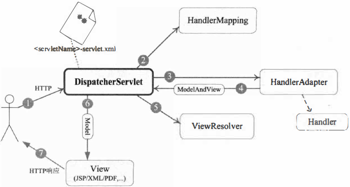

# Spring MVC 概述

大部分Java应用都是Web应用，**展现层**是Web应用不可忽略的重要环节。Spring为展现层提供了一个优秀的Web框架——SpringMVC。

## 体系结构

Spring MVC框架围绕`DispatcherServlet`这个**核心**展开，它负责**接收HTTP请求**并将其**分派给相应的处理器**处理（**协调Spring MVC的各个组件完成请求处理的工作**）。

Spring MVC是基于Model 2实现的技术框架，Model 2是经典的`MVC(Model、View、Control)`模型在Web应用中的变体。

Spring MVC通过一个前端Servlet接收所有的请求，并将具体工作委托给其他组件进行处理，`DispatcherServlet`就是SpringMVC的前端Servlet。

1. 客户端发出一个HTTP请求，Web应用服务器接收到这个请求。如果**匹配`DispatcherServlet`的请求映射路径**（在`web.xml`中指定），则Web容器将该请
   求转交给`DispatcherServlet`处理。
2. `DispatcherServlet`接收到这个请求后，将根据请求的信息（包括URL、HTTP方法、请求报文头、请求参数、Cookie等）及`HandlerMapping`的配置找到**`处理请求的处理器`**（Handler）。可将HandlerMapping看作路由控制器，将Handler看作目标主机。值得注意的是， 在SpringMVC中并没有定义一个Handler接口，实际上，任何一个Object都可以成为请求处理器。
3. 当DispatcherServlet根据HandlerMapping得到**对应当前请求的Handler**后， 通过`HandlerAdapter`对Handler进行封装，再以统一的适配器接口调用Handler。
4. 处理器完成业务逻辑的处理后将返回一个`ModelAndView`给DispatcherServlet，ModelAndYiew包含了**`视图逻辑名`和`模型数据信息`**。
5. ModelAndView中包含的是`逻辑视图名`并非真正的视图对象，DispatcherServlet借由`ViewResolver`完成**逻辑视图名到`真实视图对象`的解析工作**。
6. 当得到**`真实的视图对象View`**后，DispatcherServlet就**使用这个View对象对ModelAndView中的`模型数据`进行视图渲染**。
7. 最终客户端得到的响应消息可能是一个普通的HTML页面，也可能是一个XML或JSON串， 甚至是一张图片或一个PDF文档等不同的**媒体形式**。

## 配置DispatcherServlet

