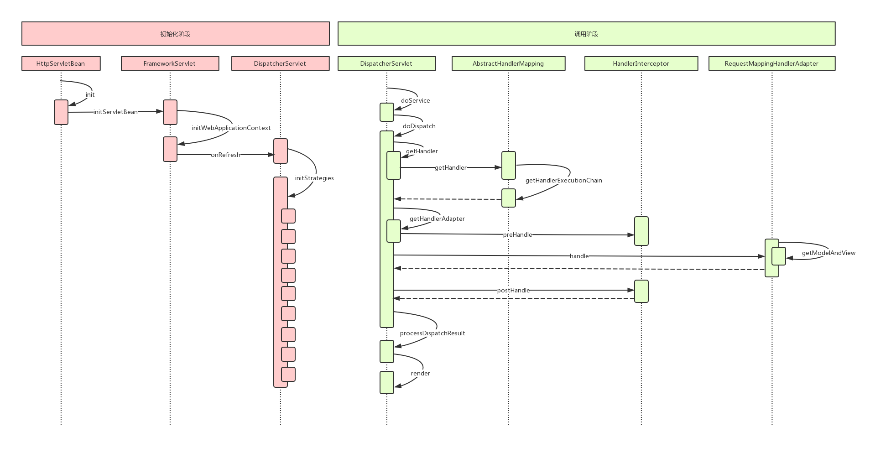

# 参考资料

[SpringMVC示例及源码分析](https://www.cnblogs.com/chenyanbin/p/11930086.html)

精通Spring4.X——企业应用开发实战


# 三层架构

开发架构一般都是基于两种形式，一种**C/S架构**，也就是**客户端/服务器**；另一种是**B/S架构**，也就是**浏览器/服务器**。在B/S架构中，系统标准的**三层架构**包括：**表现层、业务层、持久层**。

## 表现层

表现层即**web层**。负责接收客户端请求，向客户端响应结果，通常客户端使用http协议请求web层，web需要接收http请求，完成http响应。

表现层包括**展示层**和**控制层**：**控制层**负责**接收请求，展示层负责结果的展示**。

**表现层**依赖业务层，接收到客户端请求一般会调用业务层进行业务处理，并将处理结果响应给客户端。

**表现层的设计一般都是使用MVC模型**（MVC是表现层的设计模型，和其他层没有关系）

## 业务层

业务层即**service层**。它负责业务逻辑处理，与开发项目的需求息息相关。web层依赖业务层，但是业务层不依赖web层。

业务层在业务处理时可能会依赖持久层，如果要对数据持久化需要保证事务一致性。也就是，事务应该放到业务层来控制！

## 持久层

持久层即DAO层。负责数据持久化，包括数据层即数据库和数据访问层，数据库是对数据进行持久化的载体，数据访问层是业务层和持久层交互的接口，业务层需要通过数据访问层将数据持久化到数据库中。通俗的讲，持久层就是和数据交互，对数据库表进行增删改查的。

# MVC设计模式

MVC全名是Model（模型）、View（视图）、Controller（控制器），是一种用于设计创建web应用程序**表现层**的模式。

- 模型包含业务模型和数据模型，数据模型用于封装数据，业务模型用于处理业务。
- 视图通常指的就是jsp或者html。作用一般就是展示数据的，通过视图是依据模型数据创建的。
- 控制器是应用程序中处理用户交互的部分。作用一般就是处理程序逻辑的。


# 示例

访问`/queryItem`，返回商品列表页面，商品数据暂时使用静态数据（不从数据库查询并返回）。

## 创建Maven项目


项目结构：


## 引入依赖

`pom.xml`

```xml
	  <!-- spring ioc组件需要的依赖包 -->
      <dependency>
          <groupId>org.springframework</groupId>
          <artifactId>spring-beans</artifactId>
          <version>5.2.1.RELEASE</version>
      </dependency>
      <dependency>
          <groupId>org.springframework</groupId>
          <artifactId>spring-core</artifactId>
          <version>5.2.1.RELEASE</version>
      </dependency>
      <dependency>
          <groupId>org.springframework</groupId>
          <artifactId>spring-context</artifactId>
          <version>5.2.1.RELEASE</version>
      </dependency>
      <dependency>
          <groupId>org.springframework</groupId>
          <artifactId>spring-expression</artifactId>
          <version>5.2.1.RELEASE</version>
      </dependency>

      <!-- spring MVC依赖包 -->
      <dependency>
          <groupId>org.springframework</groupId>
          <artifactId>spring-webmvc</artifactId>
          <version>5.2.1.RELEASE</version>
      </dependency>
      <dependency>
          <groupId>org.springframework</groupId>
          <artifactId>spring-web</artifactId>
          <version>5.2.1.RELEASE</version>
      </dependency>

      <!-- jstl -->
      <dependency>
          <groupId>javax.servlet</groupId>
          <artifactId>jstl</artifactId>
          <version>1.2</version>
      </dependency>

      <!-- servlet -->
      <dependency>
          <groupId>javax.servlet</groupId>
          <artifactId>servlet-api</artifactId>
          <version>2.5</version>
          <scope>provided</scope>
      </dependency>
```


## 配置SpringMVC的核心web.xml

`WEB-INF/web.xml`

```xml
<!DOCTYPE web-app PUBLIC
 "-//Sun Microsystems, Inc.//DTD Web Application 2.3//EN"
 "http://java.sun.com/dtd/web-app_2_3.dtd" >

<web-app>
    <display-name>Archetype Created Web Application</display-name>

    <!-- 配置前端控制器 -->
    <servlet>
        <servlet-name>SpringMVC</servlet-name>
        <servlet-class>org.springframework.web.servlet.DispatcherServlet</servlet-class>

        <!-- 设置spring配置文件路径 -->
        <!-- 如果不设置初始化参数，那么DispatcherServlet会读取默认路径下的配置文件 -->
        <!-- 默认配置文件路径：/WEB-INF/springmvc-servlet.xml -->
        <init-param>
            <param-name>contextConfigLocation</param-name>
            <param-value>classpath:SpringMVC.xml</param-value>
        </init-param>

        <!-- 指定初始化时机，设置为2，表示Tomcat启动时，它会跟随着启动，DispatcherServlet会跟随着初始化 -->
        <!-- 如果没有指定初始化时机，DispatcherServlet就会在第一次被请求的时候，才会初始化，而且只会被初始化一次(单例模式) -->
        <load-on-startup>2</load-on-startup>
    </servlet>
    
    <servlet-mapping>
        <servlet-name>SpringMVC</servlet-name>
        <!-- url-pattern的设置 -->
        <!-- 不要配置为/*，否则报错 -->
        <!-- 通俗解释：会拦截整个项目中的资源访问，包含JSP和静态资源的访问,对于JS的访问，SpringMVC提供了默认Handler处理器 -->
        <!-- 但是对于JSP来讲，SpringMVC没有提供默认的处理器，我们也没有手动编写对应的处理器，此时按照SpringMVC的处理流程分析得知，它down了 -->
        <url-pattern>/</url-pattern>
    </servlet-mapping>
</web-app>
```


## 编写Spring配置文件SpringMVC.xml

`SpringMVC.xml`

```xml
<?xml version="1.0" encoding="UTF-8"?>

<beans xmlns="http://www.springframework.org/schema/beans"
       xmlns:context="http://www.springframework.org/schema/context"
       xmlns:xsi="http://www.w3.org/2001/XMLSchema-instance"
       xsi:schemaLocation="http://www.springframework.org/schema/context
                                            https://www.springframework.org/schema/context/spring-context.xsd
                                            http://www.springframework.org/schema/beans
                                            http://www.springframework.org/schema/beans/spring-beans.xsd">
    <!--http://www.springframework.org/schema/beans和http://www.springframework.org/schema/beans/spring-beans.xsd">很重要-->
    
    <!--开启注解扫描，扫描处理器-->
    <context:component-scan base-package="controller"/>

    <!-- 注解映射器@Controller和@RequestMapping组合这种方式的注解映射的解析 -->
    <!--注册处理器映射器-->
    <!-- <bean class="org.springframework.web.servlet.mvc.method.annotation.RequestMappingHandlerMapping"></bean> -->
    <!--注册处理器适配器-->
    <!-- <bean class="org.springframework.web.servlet.mvc.method.annotation.RequestMappingHandlerAdapter"></bean> -->

    <!-- 配置注释的适配器和映射器，同时还注入其他很多的bean -->
    <!--注册处理器映射器和处理器适配器，以及参数类型转换，跳转和响应处理等-->
    <!-- <mvc:annotation-driven></mvc:annotation-driven> -->

    <!-- 显示配置视图解析器 -->
    <bean class="org.springframework.web.servlet.view.InternalResourceViewResolver">
        <!--注入文件的前缀和后缀-->
        <property name="prefix" value="WEB-INF/jsp/item/"/>
        <property name="suffix" value=".jsp"/>
    </bean>

</beans>
```

注意：==第28行==`<property name="prefix" value="WEB-INF/jsp/item/"/>`中，`item`后需加`/`！！！

## 创建实例

`entity.Item`

```java
package entity;

public class Item {
    private String name;
    private double price;
    private String detail;

    public String getName() {
        return name;
    }

    public void setName(String name) {
        this.name = name;
    }

    public double getPrice() {
        return price;
    }

    public void setPrice(double price) {
        this.price = price;
    }

    public String getDetail() {
        return detail;
    }

    public void setDetail(String detail) {
        this.detail = detail;
    }
}
```


## 开发控制器

`controller.ItemController`

```java
package controller;

import entity.Item;
import org.springframework.stereotype.Controller;
import org.springframework.web.bind.annotation.RequestMapping;
import org.springframework.web.servlet.ModelAndView;

import java.util.ArrayList;
import java.util.List;

/**
 * 处理器的开发方式有多种，比如实现HttpRequestHandler接口、Controller接口的方式、还有注解的方式
 * 建议使用注解的方式
 * 注解的注意事项
 *  1. 类上加上@Controller注解
 *  2. 类上或者方法上面要加上@RequestMapping(必须)
 *  
 * @author Chenzf 
 */

@Controller
public class ItemController {
    /**
     * RequestMapping填写的是url
     * @return ModelAndView
     *                  Model标识的是数据类型，View最终要展示给用户的视图
     */
    @RequestMapping("queryItem")
    public ModelAndView queryItem() {
        // 用静态数据模型
        List<Item> itemList = new ArrayList<>();

        Item item1 = new Item();
        item1.setName("苹果手机");
        item1.setPrice(5000);
        item1.setDetail("iphoneX苹果手机！");
        itemList.add(item1);

        Item item2 = new Item();
        item2.setName("华为手机");
        item2.setPrice(6000);
        item2.setDetail("华为5G网速就是快！");
        itemList.add(item2);

        ModelAndView modelAndView = new ModelAndView();
        // 设置数据模型，相当于request的setAttribute方法。实质上，底层确实也是转成了request()
        //先将k/v数据放入map中，最终根据视图对象不同，再进行后续处理
        modelAndView.addObject("itemList", itemList);

        // 设置View视图
        modelAndView.setViewName("item-list");
        
        return modelAndView;
    }
}
```


## item-list.jsp

`WEB-INF/jsp/item/item-list.jsp`：**一定要加上`isELIgnored="false"`**！！！！

```jsp
<%@ page language="java" contentType="text/html; charset=UTF-8"
	pageEncoding="UTF-8" isELIgnored="false"%>
<%@ taglib uri="http://java.sun.com/jsp/jstl/core" prefix="c"%>
<%@ taglib uri="http://java.sun.com/jsp/jstl/fmt" prefix="fmt"%>
<!DOCTYPE html PUBLIC "-//W3C//DTD HTML 4.01 Transitional//EN" "http://www.w3.org/TR/html4/loose.dtd">
<html>
<head>
<meta http-equiv="Content-Type" content="text/html; charset=UTF-8">
<title>查询商品列表</title>
</head>
<body>
	<form action="${pageContext.request.contextPath }/itemList.do"
		method="post">
		查询条件：
		<table width="100%" border=1>
			<tr>
				<td><input type="submit" value="查询" /></td>
			</tr>
		</table>
		商品列表：
		<table width="100%" border=1>
			<tr>
				<td>商品名称</td>
				<td>商品价格</td>
				<td>商品描述</td>
				<td>操作</td>
			</tr>
			<c:forEach items="${itemList }" var="item">
				<tr>
					<td>${item.name }</td>
					<td>${item.price }</td>
					<td>${item.detail }</td>
					<td><a
						href="${pageContext.request.contextPath }/itemEdit.do?id=${item.name}">修改</a></td>
				</tr>
			</c:forEach>

		</table>
	</form>
</body>

</html>
```


### isELIgnored作用

`<%@ page isELIgnored＝"true|false"%>`：**如果设定为真，那么JSP中的表达式被当成字符串处理**。

比如表达式`${2000 % 20}`

- 在`isELIgnored＝"true"`时输出为`${2000 % 20}`
- 在`isELIgnored＝"false"`时输出为`100`


## 部署项目，启动项目测试

### 配置Tomcat

1. 点击`run`中的`Edit Configurations`：也许看不到`Tomcat Server`，点击`34items more(irrelevant)`，里面有`Tomcat Server`。


2. 指定Tomcat路径

   

3. 设置部署：点击`+`+`Artifact`

   


## 测试

测试链接：http://localhost:8090/queryItem


# Spring MVC源码解析

大部分Java应用都是Web应用，**表现层**是Web应用不可忽略的重要环节。SpringMVC已经成为**目前最主流的MVC框架**之一。


## 体系结构

Spring MVC框架围绕`DispatcherServlet`这个**核心**展开，它负责**接收HTTP请求**并将其**分派给相应的处理器**处理（**协调Spring MVC的各个组件完成请求处理的工作**）。

Spring MVC是基于Model 2实现的技术框架，Model 2是经典的`MVC(Model、View、Control)`模型在Web应用中的变体。

Spring MVC通过一个前端Servlet接收所有的请求，并将具体工作委托给其他组件进行处理，`DispatcherServlet`就是SpringMVC的前端Servlet。


1. 客户端发出一个HTTP请求，Web应用服务器接收到这个请求。如果**匹配`DispatcherServlet`的请求映射路径**（在`web.xml`中指定），则Web容器将该请求转交给`DispatcherServlet`处理。

2. `DispatcherServlet`负责接收`Request`并将`Request`转发给对应的处理组件。

   接收到这个请求后，将根据请求的信息（包括URL、HTTP方法、请求报文头、请求参数、Cookie等）及`HandlerMapping`的配置找到**`处理请求的处理器`**（Handler）——从`HandlerMapping`查找处理`Request`的`Controller`。可将HandlerMapping看作路由控制器，将Handler看作目标主机。值得注意的是， 在SpringMVC中并没有定义一个Handler接口，实际上，任何一个Object都可以成为请求处理器。

3. 当DispatcherServlet根据HandlerMapping得到**对应当前请求的Handler**后， 通过`HandlerAdapter`对Handler进行封装，再以统一的适配器接口调用Handler——`Controller`处理`Request`。

4. 处理器完成业务逻辑的处理后将返回一个`ModelAndView`给DispatcherServlet，ModelAndView包含了**`视图逻辑名`和`模型数据信息`**——ModelAndView是封装结果视图的组件 。

5. ModelAndView中包含的是`逻辑视图名`并非真正的视图对象，DispatcherServlet借由`ViewResolver`完成**逻辑视图名到`真实视图对象`的解析工作**。

6. 当得到**`真实的视图对象View`**后，DispatcherServlet就**使用这个View对象对ModelAndView中的`模型数据`进行视图渲染**。

7. 最终客户端得到的响应消息可能是一个普通的HTML页面，也可能是一个XML或JSON串， 甚至是一张图片或一个PDF文档等不同的**媒体形式**。


容器初始化时会建立所有URL和Controller中方法的对应关系，保存到Handler Mapping中。用户请求时，根据请求的URL快速定位到Controller中的某个方法 。 

在Spring中先将URL和Controller的对应关系保存到`Map<url, Controller>`中。Web容器启动时会通知Spring初始化容器（ 加载Bean的定义信息和初始化所有单例Bean），然后Spring MVC会遍历容器中的Bean，获取每一个Controller中的所有方法访问的URL，将URL和Controller保存到一个Map中。这样就可以根据请求快速定位到Controller，因为最终处理请求的是Controller中的方法，Map中只保留了URL和Controller的对应关系，所以要根据请求的URL进一步确认Controller中的方法 。原理就是拼接Controller的URL（Controller上＠RequestMapping的值）和方法的URL（Method上@RequestMapping的值），与请求的URL进行匹配，找到匹配的方法 。确定处理请求的方法后，接下来的任务就是参数绑定，把请求中的参数绑定到方法的形式参数上，这是整个请求处理过程中最复杂的一步 。


SpringMVC的处理过程可分为如下三步：

1. ApplicationContext初始化时用Map保存所有URL和Controller类的对应关系 
2. 根据请求URL找到对应的Controller，并从Controller中找到处理请求的方法
3. 将Request参数绑定到方法的形参上，执行方法处理请求，并返回结果视图 


## 初始化阶段


首先找到`DispatcherServlet`类 ，寻找`init()方法` 。`init()`方法其实在父类`HttpServletBean`中：


```java
public abstract class HttpServletBean extends HttpServlet implements EnvironmentCapable, EnvironmentAware {
    @Override
	public final void init() throws ServletException {

		// Set bean properties from init parameters.
		PropertyValues pvs = new ServletConfigPropertyValues(getServletConfig(), this.requiredProperties);
		if (!pvs.isEmpty()) {
			try {
                // 定位资源
				BeanWrapper bw = PropertyAccessorFactory.forBeanPropertyAccess(this);
                // 加载配置信息
				ResourceLoader resourceLoader = new ServletContextResourceLoader(getServletContext());
				bw.registerCustomEditor(Resource.class, new ResourceEditor(resourceLoader, getEnvironment()));
				initBeanWrapper(bw);
				bw.setPropertyValues(pvs, true);
			}
			catch (BeansException ex) {
				if (logger.isErrorEnabled()) {
					logger.error("Failed to set bean properties on servlet '" + getServletName() + "'", ex);
				}
				throw ex;
			}
		}

		// Let subclasses do whatever initialization they like.
        // 调用HttpServletBean.initServletBean()
		initServletBean();
	}
    
    /**
	 * Subclasses may override this to perform custom initialization.
	 * All bean properties of this servlet will have been set before this method is invoked.
	 */
	protected void initServletBean() throws ServletException {
	}
}
```

==第27行==调用了`initServletBean`，该方法在`FrameworkServlet`中实现：

```java
public abstract class FrameworkServlet extends HttpServletBean implements ApplicationContextAware {
    /**
	 * Overridden method of {@link HttpServletBean}, invoked after any bean properties
	 * have been set. Creates this servlet's WebApplicationContext.
	 */
	@Override
	protected final void initServletBean() throws ServletException {
		getServletContext().log("Initializing Spring " + getClass().getSimpleName() + " '" + getServletName() + "'");
		if (logger.isInfoEnabled()) {
			logger.info("Initializing Servlet '" + getServletName() + "'");
		}
		long startTime = System.currentTimeMillis();

		try {
			this.webApplicationContext = initWebApplicationContext();
			initFrameworkServlet();
		}
		catch (ServletException | RuntimeException ex) {
			logger.error("Context initialization failed", ex);
			throw ex;
		}

		if (logger.isDebugEnabled()) {
			String value = this.enableLoggingRequestDetails ?
					"shown which may lead to unsafe logging of potentially sensitive data" :
					"masked to prevent unsafe logging of potentially sensitive data";
			logger.debug("enableLoggingRequestDetails='" + this.enableLoggingRequestDetails +
					"': request parameters and headers will be " + value);
		}

		if (logger.isInfoEnabled()) {
			logger.info("Completed initialization in " + (System.currentTimeMillis() - startTime) + " ms");
		}
	}
    
    /**
	 * This method will be invoked after any bean properties have been set and
	 * the WebApplicationContext has been loaded. The default implementation is empty;
	 * subclasses may override this method to perform any initialization they require.
	 * @throws ServletException in case of an initialization exception
	 */
	protected void initFrameworkServlet() throws ServletException {
	}
    
    /**
	 * Refresh this servlet's application context, as well as the dependent state of the servlet.
	 * @see #getWebApplicationContext()
	 * @see org.springframework.context.ConfigurableApplicationContext#refresh()
	 */
	public void refresh() {
		WebApplicationContext wac = getWebApplicationContext();
		if (!(wac instanceof ConfigurableApplicationContext)) {
			throw new IllegalStateException("WebApplicationContext does not support refresh: " + wac);
		}
		((ConfigurableApplicationContext) wac).refresh();
	}
    
    /**
	 * Template method which can be overridden to add servlet-specific refresh work.
	 * Called after successful context refresh.
	 * <p>This implementation is empty.
	 * @param context the current WebApplicationContext
	 * @see #refresh()
	 */
	protected void onRefresh(ApplicationContext context) {
		// For subclasses: do nothing by default.
	}
}
```


上面这段代码主要就是**初始化IoC容器**，最终会调用refresh()方法！在IoC容器初始化之后，又调用了`onRefresh()`==第65行==方法，它是在`DispatcherServlet`类中实现的：

 ```java
public class DispatcherServlet extends FrameworkServlet {
    @Override
	protected void onRefresh(ApplicationContext context) {
		initStrategies(context);
	}
    
    /**
	 * Initialize the strategy objects that this servlet uses.
	 * <p>May be overridden in subclasses in order to initialize further strategy objects.
	 */
	protected void initStrategies(ApplicationContext context) {
        // 多文件上传的组件
		initMultipartResolver(context);
        // 初始化本地语言环境
		initLocaleResolver(context);
        // 初始化模板处理器
		initThemeResolver(context);
        
        // 初始化 handler啊apping
		initHandlerMappings(context);
        // 初始化参数适配器
		initHandlerAdapters(context);
        
        // 初始化异常拦截器
		initHandlerExceptionResolvers(context);
        // 初始化视图预处理器
		initRequestToViewNameTranslator(context);
        
        // 初始化视图转换器
		initViewResolvers(context);
        // 初始化FlashMap管理器
		initFlashMapManager(context);
	}
}
 ```

到这就完成了Spring MVC的九大组件的初始化！


接下来，我们来看URL和Controller的关系是如何建立的。

HandlerMapping的子类`AbstractDetectingUrlHandlerMapping`实现了`initApplicationContext()`方法，直接看子类中的初始化容器方法：


```java
public abstract class AbstractDetectingUrlHandlerMapping extends AbstractUrlHandlerMapping {
    @Override
	public void initApplicationContext() throws ApplicationContextException {
		super.initApplicationContext();
		detectHandlers();
	}
    
    /**
	 * Register all handlers found in the current ApplicationContext.
	 * <p>The actual URL determination for a handler is up to the concrete
	 * {@link #determineUrlsForHandler(String)} implementation. A bean for
	 * which no such URLs could be determined is simply not considered a handler.
	 * @throws org.springframework.beans.BeansException if the handler couldn't be registered
	 * @see #determineUrlsForHandler(String)
	 * 建立当前ApplicationContext中的所有Controller和URL的对应关系
	 */
	protected void detectHandlers() throws BeansException {
		ApplicationContext applicationContext = obtainApplicationContext();
        // 获取ApplicationContext容器中所有Bean的名字
		String[] beanNames = (this.detectHandlersInAncestorContexts ?
				BeanFactoryUtils.beanNamesForTypeIncludingAncestors(applicationContext, Object.class) :
				applicationContext.getBeanNamesForType(Object.class));

		// Take any bean name that we can determine URLs for.
        // 遍历beanNames，并找到这些Bean对应的URL
		for (String beanName : beanNames) {
            // 查找Bean上的所有URL(Controller上的URL+方法上的URL)，该方法由对应的子类实现
			String[] urls = determineUrlsForHandler(beanName);
			if (!ObjectUtils.isEmpty(urls)) {
				// URL paths found: Let's consider it a handler.
                // 保存urls和beanName的对应关系，放入Map<urls,beanName>
                // 该方法在父类 AbstractUrlHandlerMapper中实现
				registerHandler(urls, beanName);
			}
		}

		if ((logger.isDebugEnabled() && !getHandlerMap().isEmpty()) || logger.isTraceEnabled()) {
			logger.debug("Detected " + getHandlerMap().size() + " mappings in " + formatMappingName());
		}
	}
    
    protected abstract String[] determineUrlsForHandler(String beanName);	
}
```


==第28行==`determineUrlsForHandler(beanName)`方法的作用是**获取每个Controller中的URL**，不同的子类有不同的实现，这是典型的模板模式 。

因为开发中用得最多的就是用注解来配置Controller中的URL，`BeanNameUrlHandlerMapping`是`AbstractDetectingUrlHandlerMapping`的子类，用于处理注解形式的URL映射 。


以`BeanNameUrlHandlerMapping`为例来进行分析，看看如何查找beanName上所有映射的URL：

```java
public class BeanNameUrlHandlerMapping extends AbstractDetectingUrlHandlerMapping {

	/**
	 * Checks name and aliases of the given bean for URLs, starting with "/".
	 * 获取Controller中所有的URL
	 */
	@Override
	protected String[] determineUrlsForHandler(String beanName) {
		List<String> urls = new ArrayList<>();
		if (beanName.startsWith("/")) {
			urls.add(beanName);
		}
		String[] aliases = obtainApplicationContext().getAliases(beanName);
		for (String alias : aliases) {
			if (alias.startsWith("/")) {
				urls.add(alias);
			}
		}
		return StringUtils.toStringArray(urls);
	}
}
```


到这里`HandlerMapping`组件己经建立了所有URL和Controller的对应关系。


## 运行调用阶段


**运行调用是由请求触发的**，所以入口为`DispatcherServlet`的核心方法`doService()`，`doService()`中的核心由`doDispatch()`实现：

```java
public class DispatcherServlet extends FrameworkServlet {
    @Override
	protected void doService(HttpServletRequest request, HttpServletResponse response) throws Exception {
		logRequest(request);

		// Keep a snapshot of the request attributes in case of an include,
		// to be able to restore the original attributes after the include.
		Map<String, Object> attributesSnapshot = null;
		...
		try {
			doDispatch(request, response);
		}
		...
	}
    
    /**
	 * Process the actual dispatching to the handler.
	 * <p>The handler will be obtained by applying the servlet's HandlerMappings in order.
	 * The HandlerAdapter will be obtained by querying the servlet's installed HandlerAdapters
	 * to find the first that supports the handler class.
	 * <p>All HTTP methods are handled by this method. It's up to HandlerAdapters or handlers
	 * themselves to decide which methods are acceptable.
	 * @param request current HTTP request
	 * @param response current HTTP response
	 * @throws Exception in case of any kind of processing failure
	 */
	protected void doDispatch(HttpServletRequest request, HttpServletResponse response) throws Exception {
		HttpServletRequest processedRequest = request;
		HandlerExecutionChain mappedHandler = null;
		boolean multipartRequestParsed = false;

		WebAsyncManager asyncManager = WebAsyncUtils.getAsyncManager(request);

		try {
			ModelAndView mv = null;
			Exception dispatchException = null;

			try {
                // 1.检查是否是文件上传的请求
				processedRequest = checkMultipart(request);
				multipartRequestParsed = (processedRequest != request);

				// Determine handler for the current request.
                // 2. 取得处理当前请求的Controller，这里也称为Hanlder即处理器
                // 第一步的意义就在这里体现了。这里并不是直接返回Controller，
                // 而是返回Handler、ExecutionChain请求处理器链对象，该对象封装了Handler、和interceptor
				mappedHandler = getHandler(processedRequest);
				if (mappedHandler == null) {
					noHandlerFound(processedRequest, response);
					return;
				}

				// Determine handler adapter for the current request.
                // 3. 获取处理请求的处理器适配器HandlerAdapter
				HandlerAdapter ha = getHandlerAdapter(mappedHandler.getHandler());

				// Process last-modified header, if supported by the handler.
				String method = request.getMethod();
				boolean isGet = "GET".equals(method);
				if (isGet || "HEAD".equals(method)) {
					long lastModified = ha.getLastModified(request, mappedHandler.getHandler());
					if (new ServletWebRequest(request, response).checkNotModified(lastModified) && isGet) {
						return;
					}
				}

				if (!mappedHandler.applyPreHandle(processedRequest, response)) {
					return;
				}

				// Actually invoke the handler.
                // 4. 实际处理器处理请求，返回结果视图对象
				mv = ha.handle(processedRequest, response, mappedHandler.getHandler());

				if (asyncManager.isConcurrentHandlingStarted()) {
					return;
				}

                // 结果视图对象的处理
				applyDefaultViewName(processedRequest, mv);
				mappedHandler.applyPostHandle(processedRequest, response, mv);
			}
			catch (Exception ex) {
				dispatchException = ex;
			}
			catch (Throwable err) {
				// As of 4.3, we're processing Errors thrown from handler methods as well,
				// making them available for @ExceptionHandler methods and other scenarios.
				dispatchException = new NestedServletException("Handler dispatch failed", err);
			}
			processDispatchResult(processedRequest, response, mappedHandler, mv, dispatchException);
		}
		catch (Exception ex) {
			triggerAfterCompletion(processedRequest, response, mappedHandler, ex);
		}
		catch (Throwable err) {
			triggerAfterCompletion(processedRequest, response, mappedHandler,
					new NestedServletException("Handler processing failed", err));
		}
		finally {
			if (asyncManager.isConcurrentHandlingStarted()) {
				// Instead of postHandle and afterCompletion
				if (mappedHandler != null) {
                    // 请求成功响应之后的方法
					mappedHandler.applyAfterConcurrentHandlingStarted(processedRequest, response);
				}
			}
			else {
				// Clean up any resources used by a multipart request.
				if (multipartRequestParsed) {
					cleanupMultipart(processedRequest);
				}
			}
		}
	}
}
```

==第47行==`getHandler(processedRequest)`方法实际上从`HandlerMapping`中找到URL和Controller的对应关系，也就是`Map<url, Controller>`。


最终处理请求的是Controller中的方法，现在只是知道了Controller，如何确认Controller中处理请求的方法呢？


从`Map<urls, beanName>`中取得Controller后，经过拦截器的预处理方法，再通过反射获取该方法上的注解和参数，解析方法和参数上的注解，然后反射调用方法获取`ModelAndView`结果视图。最后调用`RequestMappingHandlerAdapter`的`handle()`中的核心代码，由`handleInternal(request, response, handler)`实现 ：

```java
public class RequestMappingHandlerAdapter extends AbstractHandlerMethodAdapter
		implements BeanFactoryAware, InitializingBean {
    @Override
	protected ModelAndView handleInternal(HttpServletRequest request,
			HttpServletResponse response, HandlerMethod handlerMethod) throws Exception {

		ModelAndView mav;
		checkRequest(request);

		// Execute invokeHandlerMethod in synchronized block if required.
		if (this.synchronizeOnSession) {
			HttpSession session = request.getSession(false);
			if (session != null) {
				Object mutex = WebUtils.getSessionMutex(session);
				synchronized (mutex) {
					mav = invokeHandlerMethod(request, response, handlerMethod);
				}
			}
			else {
				// No HttpSession available -> no mutex necessary
				mav = invokeHandlerMethod(request, response, handlerMethod);
			}
		}
		else {
			// No synchronization on session demanded at all...
			mav = invokeHandlerMethod(request, response, handlerMethod);
		}

		if (!response.containsHeader(HEADER_CACHE_CONTROL)) {
			if (getSessionAttributesHandler(handlerMethod).hasSessionAttributes()) {
				applyCacheSeconds(response, this.cacheSecondsForSessionAttributeHandlers);
			}
			else {
				prepareResponse(response);
			}
		}

		return mav;
	}
}
```


整个处理过程中最核心的步骤其实就是拼接Controller的URL和方法的URL，与Request的URL进行匹配，找到匹配的方法。


```java
public abstract class AbstractHandlerMapping extends WebApplicationObjectSupport
		implements HandlerMapping, Ordered, BeanNameAware {
    public final HandlerExecutionChain getHandler(HttpServletRequest request) throws Exception {
		Object handler = getHandlerInternal(request);
		...
	}
    
    protected abstract Object getHandlerInternal(HttpServletRequest request) throws Exception;
    
    protected HandlerExecutionChain getHandlerExecutionChain(Object handler, HttpServletRequest request) {
		HandlerExecutionChain chain = (handler instanceof HandlerExecutionChain ?
				(HandlerExecutionChain) handler : new HandlerExecutionChain(handler));

		String lookupPath = this.urlPathHelper.getLookupPathForRequest(request, LOOKUP_PATH);
		for (HandlerInterceptor interceptor : this.adaptedInterceptors) {
			if (interceptor instanceof MappedInterceptor) {
				MappedInterceptor mappedInterceptor = (MappedInterceptor) interceptor;
				if (mappedInterceptor.matches(lookupPath, this.pathMatcher)) {
					chain.addInterceptor(mappedInterceptor.getInterceptor());
				}
			}
			else {
				chain.addInterceptor(interceptor);
			}
		}
		return chain;
	}
}


public abstract class AbstractHandlerMethodMapping<T> extends AbstractHandlerMapping implements InitializingBean {
    @Override
    // 根据URL获取处理请求的方法
	protected HandlerMethod getHandlerInternal(HttpServletRequest request) throws Exception {
        // 如果请求URL为http://localhost:8080/web/hello.json，则lookupPath=web/hello.json
		String lookupPath = getUrlPathHelper().getLookupPathForRequest(request);
		request.setAttribute(LOOKUP_PATH, lookupPath);
		this.mappingRegistry.acquireReadLock();
		try {
            // 遍历Controller上的所有方法，获取URL匹配的方法
			HandlerMethod handlerMethod = lookupHandlerMethod(lookupPath, request);
			return (handlerMethod != null ? handlerMethod.createWithResolvedBean() : null);
		}
		finally {
			this.mappingRegistry.releaseReadLock();
		}
	}
}

```

通过上面的代码分析，己经找到处理请求的Controller中的方法了，下面看如何解析该方法上的参数 ，井反射调用该方法：

```java
// 取处理请求的方法，执行并返回结果视图
public class RequestMappingHandlerAdapter extends AbstractHandlerMethodAdapter
		implements BeanFactoryAware, InitializingBean {
    protected ModelAndView invokeHandlerMethod(HttpServletRequest request,
			HttpServletResponse response, HandlerMethod handlerMethod) throws Exception {

		ServletWebRequest webRequest = new ServletWebRequest(request, response);
		try {
			WebDataBinderFactory binderFactory = getDataBinderFactory(handlerMethod);
			ModelFactory modelFactory = getModelFactory(handlerMethod, binderFactory);

			ServletInvocableHandlerMethod invocableMethod = createInvocableHandlerMethod(handlerMethod);
			if (this.argumentResolvers != null) {
				invocableMethod.setHandlerMethodArgumentResolvers(this.argumentResolvers);
			}
			if (this.returnValueHandlers != null) {
				invocableMethod.setHandlerMethodReturnValueHandlers(this.returnValueHandlers);
			}
			invocableMethod.setDataBinderFactory(binderFactory);
			invocableMethod.setParameterNameDiscoverer(this.parameterNameDiscoverer);

			ModelAndViewContainer mavContainer = new ModelAndViewContainer();
			mavContainer.addAllAttributes(RequestContextUtils.getInputFlashMap(request));
			modelFactory.initModel(webRequest, mavContainer, invocableMethod);
			mavContainer.setIgnoreDefaultModelOnRedirect(this.ignoreDefaultModelOnRedirect);

			AsyncWebRequest asyncWebRequest = WebAsyncUtils.createAsyncWebRequest(request, response);
			asyncWebRequest.setTimeout(this.asyncRequestTimeout);

			WebAsyncManager asyncManager = WebAsyncUtils.getAsyncManager(request);
			asyncManager.setTaskExecutor(this.taskExecutor);
			asyncManager.setAsyncWebRequest(asyncWebRequest);
			asyncManager.registerCallableInterceptors(this.callableInterceptors);
			asyncManager.registerDeferredResultInterceptors(this.deferredResultInterceptors);

			if (asyncManager.hasConcurrentResult()) {
				Object result = asyncManager.getConcurrentResult();
				mavContainer = (ModelAndViewContainer) asyncManager.getConcurrentResultContext()[0];
				asyncManager.clearConcurrentResult();
				LogFormatUtils.traceDebug(logger, traceOn -> {
					String formatted = LogFormatUtils.formatValue(result, !traceOn);
					return "Resume with async result [" + formatted + "]";
				});
				invocableMethod = invocableMethod.wrapConcurrentResult(result);
			}

            // 完成请求中的参数和方法参数上数据的绑定 
			invocableMethod.invokeAndHandle(webRequest, mavContainer);
			if (asyncManager.isConcurrentHandlingStarted()) {
				return null;
			}

			return getModelAndView(mavContainer, modelFactory, webRequest);
		}
		finally {
			webRequest.requestCompleted();
		}
	}
}
```

==第48行==`invocableMethod.invokeAndHandle`：完成请求中的参数和方法参数上数据的绑定。


Spring MVC中提供两种从请求参数到方法中参数的绑定方式：

- 通过注解进行绑定，`＠RequestParam`
- 通过参数名称进行绑定 

通过注解进行绑定， 只要在方法的参数前面声明`＠RequestParam("name")`，就可以将请求中参数name的值绑定到方法的该参数上。


## 总结

SpringMVC核心组件关系图：


Spring MVC运行时序图：




