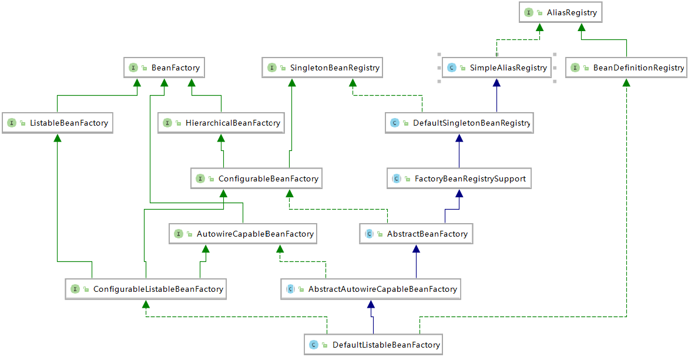

参考资料

[廖雪峰Spring](https://www.liaoxuefeng.com/wiki/1252599548343744/1266263217140032)

互联网轻量级SSM框架解密Spring、Spring MVC、MyBatis源码深度剖析

Spring 5核心原理与30个类手写实战

[Spring源码分析](# https://www.cnblogs.com/chenyanbin/p/11756034.html)https://www.cnblogs.com/chenyanbin/p/11756034.html

# Spring引言

Spring最早是由Rod Johnson提出的用来取代EJB的轻量级框架。随着Spring越来越受欢迎，在`Spring Framework`基础上，又诞生了Spring Boot、Spring Cloud、Spring Data、Spring Security等一系列基于Spring Framework的项目。

Spring认为一切Java类都是资源，而**`资源都是Bean`，容纳这些Bean的是Spring所提供的`IoC容器`**，所以Spring是一种基于Bean的编程。

# 示例

## 未使用Spring

在`D:\Learning\Spring\SpringDemo`目录下创建项目！

该项目展示了，不使用`Spring`时，该如何创建、使用和销毁组件！

1. 创建项目

   

   

   

   

2. 完善目录结构

   在`main`目录下新建`java`和`resources`，并分别设置`Mark Directory as`：`Sources Root`和`Resources Root`；或创建好后，点击`Import Changes`

   

3. 在`main.java`下新建`init`目录

   - 创建`UserDAO`接口

     ```java
     package init;
     
     public interface UserDAO {
         void save(String name);
     }
     ```

     

   - 创建`UserDAOImpl`实现类

     ```java
     package init;
     
     public class UserDAOImpl implements UserDAO {
         @Override
         public void save(String name) {
             System.out.println("name: " + name);
         }
     }
     ```

     

   - 编写`TestUserDAO`——创建组件对象并使用

     ```java
     package init;
     
     public class TestUserDAO {
         public static void main(String[] args) {
             // 创建组件对象
             UserDAOImpl user = new UserDAOImpl();
     
             // 使用组件
             user.save("China");
     
             // 由JVM销毁对象
         }
     }
     ```

     

## 使用Spring

### 创建项目

与未使用Spring中[创建项目](# 未使用Spring)过程类似：


完善项目结构：在`main`目录下新建`java`和`resources`，并分别设置`Mark Directory as`：`Sources Root`和`Resources Root`

### 引入项目依赖

在`pom.xml`中[引入Spring核心和依赖模块](https://mvnrepository.com/search?q=Spring)，并点击`Import Changes`：

```xml
    <dependency>
      <groupId>org.springframework</groupId>
      <artifactId>spring-core</artifactId>
      <version>4.3.2.RELEASE</version>
    </dependency>

    <dependency>
      <groupId>org.springframework</groupId>
      <artifactId>spring-beans</artifactId>
      <version>4.3.2.RELEASE</version>
    </dependency>

    <dependency>
      <groupId>org.springframework</groupId>
      <artifactId>spring-web</artifactId>
      <version>4.3.2.RELEASE</version>
    </dependency>

    <dependency>
      <groupId>org.springframework</groupId>
      <artifactId>spring-expression</artifactId>
      <version>4.3.2.RELEASE</version>
    </dependency>

    <dependency>
      <groupId>org.springframework</groupId>
      <artifactId>spring-context</artifactId>
      <version>4.3.2.RELEASE</version>
    </dependency>

    <dependency>
      <groupId>org.springframework</groupId>
      <artifactId>spring-context-support</artifactId>
      <version>4.3.2.RELEASE</version>
    </dependency>

    <dependency>
      <groupId>org.springframework</groupId>
      <artifactId>spring-aspects</artifactId>
      <version>4.3.2.RELEASE</version>
    </dependency>

    <dependency>
      <groupId>org.springframework</groupId>
      <artifactId>spring-jdbc</artifactId>
      <version>4.3.2.RELEASE</version>
    </dependency>

    <dependency>
      <groupId>org.springframework</groupId>
      <artifactId>spring-aop</artifactId>
      <version>4.3.2.RELEASE</version>
    </dependency>
```


### 创建组件

1. 在`main.java.init`目录下创建`UserDAO`接口：

   ```java
   package init;
   
   public interface UserDAO {
       void save(String name);
   }
   ```

   

2. 在`main.java.init`目录下创建`UserDAOImpl`实现类：

   ```java
   package init;
   
   public class UserDAOImpl implements UserDAO {
       @Override
       public void save(String name) {
           System.out.println("name: " + name);
       }
   }
   ```

   

### 引入Spring框架配置文件——工厂管理

- 工厂管理比手动（`new`）创建要轻量：工厂创建对象默认是`单例模式`，无论从工厂中获取多少个对象，获得的都是`同一个对象`；
- 通过`new`创建对象，每`new`一次，就在`JVM`中创建了一个新的对象！

1. 配置文件名称：任意名称
   
- `applicationContext.xml`或`Spring.xml`
  
2. 配置文件位置：项目中根下任意位置
   
- `resources.init`目录下
  
3. 配置文件内容

   通过`springInit.xml`配置文件来管理组件：**使用`bean`标签来创建组件对象**

   ```xml
   <?xml version="1.0" encoding="UTF-8"?>
   <beans xmlns="http://www.springframework.org/schema/beans"
          xmlns:xsi="http://www.w3.org/2001/XMLSchema-instance"
          xsi:schemaLocation="http://www.springframework.org/schema/beans http://www.springframework.org/schema/beans/spring-beans.xsd">
       
       <!--通过Spring管理组件
                   bean: 用来管理组件对象的创建
                   class: 用来指定管理组件对象的全限定名 包.类
                           肯定是实现类，只有实现类才能创建对象
                   id: 用来指定Spring框架创建的当前组件在Spring框架（容器、工厂）中的（全局）唯一标识，
                       方便获取Spring框架中已经创建好的对象
                       推荐使用当前实现类的接口首字母小写userDAO-->
       <bean class="iocdi.IoCDIDAOImpl" id="ioCDIDAO"/>
       
   </beans>
   ```

   

### 测试

在`main.java.init`下创建`TestSpring.java`

```java
package init;

import org.springframework.context.ApplicationContext;
import org.springframework.context.support.ClassPathXmlApplicationContext;

public class TestSpring {
    public static void main(String[] args) {
        /*
         * 启动工厂
         * 读取配置文件，根据指定的类创建组件对象，并为其取了唯一的标识
         */
        ApplicationContext context = new ClassPathXmlApplicationContext("/init/SpringInit.xml");

        /*
         * 获取对象
         * 参数：获取工厂中指定的唯一标识
         * context.getBean("UserDAO") 返回Object，需要强制转换
         */
        UserDAO userDAO = (UserDAO) context.getBean("userDAO");
        System.out.println(userDAO);
        userDAO.save("China");
    }
}
```


输出：

```
init.UserDAOImpl@12108b5
name: China
```


## [IDEA+Maven+Spring5.X项目创建](https://www.cnblogs.com/chenyanbin/p/13302036.html)

### 创建maven


### 添加依赖

[Spring核心结构](# Spring核心结构)：`beans, core, context`

`pom.xml`

```xml
<?xml version="1.0" encoding="UTF-8"?>
<project xmlns="http://maven.apache.org/POM/4.0.0"
         xmlns:xsi="http://www.w3.org/2001/XMLSchema-instance"
         xsi:schemaLocation="http://maven.apache.org/POM/4.0.0 http://maven.apache.org/xsd/maven-4.0.0.xsd">
    <modelVersion>4.0.0</modelVersion>

    <groupId>com.chenzf</groupId>
    <artifactId>demo_spring5</artifactId>
    <version>1.0-SNAPSHOT</version>

    <dependencies>
        <dependency>
            <groupId>org.springframework</groupId>
            <artifactId>spring-beans</artifactId>
            <version>5.2.5.RELEASE</version>
        </dependency>
        <dependency>
            <groupId>org.springframework</groupId>
            <artifactId>spring-core</artifactId>
            <version>5.2.5.RELEASE</version>
        </dependency>
        <dependency>
            <groupId>org.springframework</groupId>
            <artifactId>spring-context</artifactId>
            <version>5.2.5.RELEASE</version>
        </dependency>
    </dependencies>

</project>
```


### 创建组件

`Video.java`

```java
public class Video {
    private int id;
    private String title;

    public int getId() {
        return id;
    }

    public void setId(int id) {
        this.id = id;
    }

    public String getTitle() {
        return title;
    }

    public void setTitle(String title) {
        this.title = title;
    }
}
```

`App.java`

```java
import org.springframework.context.ApplicationContext;
import org.springframework.context.support.ClassPathXmlApplicationContext;

public class App {
    public static void main(String[] args) {
        ApplicationContext context = new ClassPathXmlApplicationContext("applicationContext.xml");
        Video video = (Video) context.getBean("video");
        System.out.println(video.getTitle());
    }
}
```


### 配置文件applicationContext.xml

```xml
<?xml version="1.0" encoding="UTF-8"?>
<beans xmlns="http://www.springframework.org/schema/beans"
       xmlns:xsi="http://www.w3.org/2001/XMLSchema-instance"
       xsi:schemaLocation="http://www.springframework.org/schema/beans
        http://www.springframework.org/schema/beans/spring-beans.xsd">
    <bean id="video" class="Video">
        <property name="id" value="1"></property>
        <property name="title" value="Spring5"></property>
    </bean>
</beans>
```


# 实例解释：控制反转与依赖注入

## IoC容器

**容器是一种为某种特定组件的运行提供必要支持的一个`软件环境`。**

例如，Tomcat就是一个Servlet容器，它可以为Servlet的运行提供运行环境。类似Docker这样的软件也是一个容器，它提供了必要的Linux环境以便运行一个特定的Linux进程。

**使用容器运行组件，除了提供一个组件运行环境之外，容器还提供了许多`底层服务`。**

例如，Servlet容器底层实现了TCP连接，解析HTTP协议等非常复杂的服务，如果没有容器来提供这些服务，我们就无法编写像Servlet这样代码简单，功能强大的组件。早期的JavaEE服务器提供的EJB容器最重要的功能就是通过声明式事务服务，使得EJB组件的开发人员不必自己编写冗长的事务处理代码，所以极大地简化了事务处理。

Spring的核心就是提供了一个IoC容器，它可以管理所有轻量级的JavaBean组件，提供的底层服务包括组件的生命周期管理、配置和组装服务、AOP支持，以及建立在AOP基础上的声明式事务服务等。

### IoC原理

**`IoC全称为Inversion of Control（控制反转）`**。控制反转是一种**通过描述**（在Java中可以是**XML**或者注解）并**通过第三方去产生或获取特定对象**的方式。

控制反转（**控制权力反转**）：将对象的创建由原来(`new`)的方式（在任意地方随意创建）转移到`配置文件`中，交给`Spring工厂`来创建对象。在此基础上，还需通过`DI`的方式**维护组件与组件之间的调用关系**！

1. 设计一个在线书店，通过`BookService`获取书籍：

   ```java
   public class BookService {
       private HikariConfig config = new HikariConfig();
       private DataSource dataSource = new HikariDataSource(config);
   
       public Book getBook(long bookId) {
           try (Connection conn = dataSource.getConnection()) {
               ...
               return book;
           }
       }
   }
   ```

   为了从数据库查询书籍，`BookService`持有一个`DataSource`。为了实例化一个`HikariDataSource`，又不得不实例化一个`HikariConfig`。

2. 编写`UserService`获取用户：

   ```java
   public class UserService {
       private HikariConfig config = new HikariConfig();
       private DataSource dataSource = new HikariDataSource(config);
   
       public User getUser(long userId) {
           try (Connection conn = dataSource.getConnection()) {
               ...
               return user;
           }
       }
   }
   ```

   因为`UserService`也需要访问数据库，因此，我们不得不也实例化一个`HikariDataSource`。

3. 在处理用户购买的`CartServlet`中，我们需要实例化`UserService`和`BookService`：

   ```java
   public class CartServlet extends HttpServlet {
       private BookService bookService = new BookService();
       private UserService userService = new UserService();
   
       protected void doGet(HttpServletRequest req, HttpServletResponse resp) throws ServletException, IOException {
           long currentUserId = getFromCookie(req);
           User currentUser = userService.getUser(currentUserId);
           Book book = bookService.getBook(req.getParameter("bookId"));
           cartService.addToCart(currentUser, book);
           ...
       }
   }
   ```


4. 在购买历史`HistoryServlet`中，也需要实例化`UserService`和`BookService`：

   ```java
   public class HistoryServlet extends HttpServlet {
       private BookService bookService = new BookService();
       private UserService userService = new UserService();
   }
   ```

   

上述**每个组件都采用了通过`new`创建实例并持有的方式**。该方法存在以下**缺点**：

1. 实例化一个组件其实很难，例如，`BookService`和`UserService`要创建`HikariDataSource`，实际上需要读取配置，才能先实例化`HikariConfig`，再实例化`HikariDataSource`。
2. 没有必要让`BookService`和`UserService`分别创建`DataSource`实例，完全可以共享同一个`DataSource`，但谁负责创建`DataSource`，谁负责获取其他组件已经创建的`DataSource`，不好处理。类似的，`CartServlet`和`HistoryServlet`也应当共享`BookService`实例和`UserService`实例，但也不好处理。
3. 很多组件需要销毁以便释放资源，例如`DataSource`，但如果该组件被多个组件共享，如何确保它的使用方都已经全部被销毁？
4. 随着更多的组件被引入，例如，书籍评论，需要共享的组件写起来会更困难，这些**组件的依赖关系会越来越复杂**。


**核心问题**是：

1. 谁负责创建组件？
2. 谁负责根据依赖关系组装组件？
3. 销毁时，如何按依赖顺序正确销毁？


在IoC模式下，**控制权发生了反转**，即**从应用程序转移到了IoC容器，所有组件不再由应用程序自己创建和配置，而是由IoC容器负责**，这样，应用程序只需要直接使用已经创建好并且配置好的组件。

为了能让组件在IoC容器中被“装配”出来，需要某种“**注入**”机制，例如，`BookService`自己并不会创建`DataSource`，而是等待外部通过`setDataSource()`方法来注入一个`DataSource`：

```java
public class BookService {
    private DataSource dataSource;

    public void setDataSource(DataSource dataSource) {
        this.dataSource = dataSource;
    }
}
```

不直接`new`一个`DataSource`，而是注入一个`DataSource`，这个小小的改动虽然简单，却带来了一系列**好处**：

1. `BookService`不再关心如何创建`DataSource`，因此，不必编写读取数据库配置之类的代码；
2. `DataSource`实例被注入到`BookService`，同样也可以注入到`UserService`，因此，共享一个组件非常简单；


### 控制反转过程

在项目`demo_with_spring`中的`java`目录下新建`iocdi`

1. `IoCDIDAO`

   - 创建`IoCDIDAO`接口并实现

     ```java
     package iocdi;
     
     public interface IoCDIDAO {
         void save(String name);
     }
     
     package iocdi;
     
     public class IoCDIDAOImpl implements IoCDIDAO {
         @Override
         public void save(String name) {
             System.out.println("实现控制反转（IoCDIDAOImpl）：name = " + name);
         }
     }
     ```

     

   - 在`resources`下新建`iocdi`目录，然后创建`springIoCDI.xml`，管理`DAO`组件

     ```xml
     <?xml version="1.0" encoding="UTF-8"?>
     <beans xmlns="http://www.springframework.org/schema/beans"
            xmlns:xsi="http://www.w3.org/2001/XMLSchema-instance"
            xsi:schemaLocation="http://www.springframework.org/schema/beans http://www.springframework.org/schema/beans/spring-beans.xsd">
     
         <!--通过Spring管理组件
             bean: 用来管理组件对象的创建
             class: 用来指定管理组件对象的全限定名 包.类
             id: 用来指定Spring框架创建的当前组件在Spring框架（容器、工厂）中的（全局）唯一标识，
                 方便获取Spring框架中已经创建好的对象
                 推荐使用当前实现类的接口首字母小写userDAO-->
         <bean class="iocdi.IoCDIDAOImpl" id="ioCDIDAO"/>
     
     </beans>
     ```

     

   - 在`java.iocdi`下创建`TestIoCDI.java`

     ```java
     package iocdi;
     
     import org.springframework.context.ApplicationContext;
     import org.springframework.context.support.ClassPathXmlApplicationContext;
     
     public class TestIoCDI {
         public static void main(String[] args) {
             /*
              * 启动工厂
              * 读取配置文件，根据指定的类创建组件对象，并为其取了唯一的标识
              */
             ApplicationContext context = new ClassPathXmlApplicationContext("/iocdi/SpringIoCDI.xml");
     
             /*
              * 获取对象
              * 参数：获取工厂中指定的唯一标识
              * context.getBean("ioCDIDAO") 返回Object，需要强制转换
              */
             IoCDIDAOImpl ioCDIDAO = (IoCDIDAOImpl) context.getBean("ioCDIDAO");
     
             System.out.println(ioCDIDAO);
             ioCDIDAO.save("Spring");
         }
     }
     
     ```

     

   - 测试结果

     ```
     iocdi.IoCDIDAOImpl@12108b5
     实现控制反转（IoCDIDAOImpl）：name = Spring
     ```

     

2. `IoCDIService`

   - 创建`IoCDIService`接口并实现

     ```java
     package iocdi;
     
     public interface IoCDIService {
         void save(String name);
     }
     
     package iocdi;
     
     public class IoCDIServiceImpl implements IoCDIService {
         @Override
         public void save(String name) {
             System.out.println("实现控制反转（IoCDIServiceImpl）：name = " + name);
         }
     }
     ```

     

   - 在`resources/iocdi`目录下`springIoCDI.xml`中管理`Service`组件

     ```xml
     <bean class="iocdi.IoCDIServiceImpl" id="ioCDIService"/>
     ```

     

   - 修改`TestIoCDI.java`

     ```java
     package iocdi;
     
     import org.springframework.context.ApplicationContext;
     import org.springframework.context.support.ClassPathXmlApplicationContext;
     
     public class TestIoCDI {
         public static void main(String[] args) {
             /*
              * 启动工厂
              * 读取配置文件，根据指定的类创建组件对象，并为其取了唯一的标识
              */
             ApplicationContext context = new ClassPathXmlApplicationContext("/iocdi/SpringIoCDI.xml");
     
             /*
              * 获取对象
              * 参数：获取工厂中指定的唯一标识
              * context.getBean("ioCDIDAO") 返回Object，需要强制转换
              */
             IoCDIServiceImpl ioCDIService = (IoCDIServiceImpl) context.getBean("ioCDIService");
     
             System.out.println(ioCDIService);
             ioCDIService.save("Spring");
         }
     }
     ```

     

   - 测试结果

     ```
     iocdi.IoCDIServiceImpl@1a5c39e
     实现控制反转（IoCDIServiceImpl）：name = Spring
     ```

     


## DI

IoC又称为**依赖注入（DI：Dependency Injection）**，它解决了一个最主要的问题：将**`组件的创建、配置`**与**`组件的使用`**相分离，并且，**由IoC容器负责管理组件的生命周期**。

**依赖注入**让**`调用类对某一接口实现类的依赖关系由第三方（容器或协作类）注入`**， 以移除调用类对某一接口实现类的依赖。

通过DI，对象的依赖关系将由**系统中负责协调各对象的第三方组件在创建对象的时候进行设定**。对象无需自行创建或管理它们的依赖关系。**依赖注入会将所依赖的关系自动交给目标对象，而不是让对象自己去获取依赖**。

因为IoC容器要负责实例化所有的组件，因此，有必要**`告诉容器如何创建组件，以及各组件的依赖关系`**。一种最简单的配置是**`通过XML文件来实现`**，例如：

```xml
<beans>
    <bean id="dataSource" class="HikariDataSource"/>
    
    <bean id="bookService" class="BookService">
        <property name="dataSource" ref="dataSource"/>
    </bean>
    
    <bean id="userService" class="UserService">
        <property name="dataSource" ref="dataSource"/>
    </bean>
</beans>
```

上述XML配置文件指示IoC容器创建3个`JavaBean组件`，并**把id为`dataSource`的组件通过属性`dataSource`（即调用`setDataSource()`方法）注入到另外两个组件中**。

在Spring的IoC容器中，我们把所有组件统称为JavaBean，即**配置一个组件就是配置一个Bean**。


### 基于控制反转的依赖注入

Spring不仅要**`创建对象`**，还要在创建对象时**`维护组件与组件的依赖关系`**！

**依赖注入**：解决**`组件之间的调用`**关系问题；**为组件中成员变量完成赋值过程**。

**语法**：

- 组件对象中需要哪个组件，就将该组件声明为**成员变量**并提供公开的`SET`方法
- 在Spring的**配置文件**里对应的`组件标签`内使用`property`完成属性的`赋值操作`


基于[控制反转过程](# 控制反转过程)中的代码，实现`Service`组件对`DAO`组件的调用：

1. 原始方式

   - 在`iocdi.IoCDIServiceImpl`中创建`IoCDIDAOImpl`对象：==第7、12行==

     ```java
     package iocdi;
     
     public class IoCDIServiceImpl implements IoCDIService {
         /**
          * 依赖DAO组件
          */
         private IoCDIDAO ioCDIDAO = new IoCDIDAOImpl();
         
         @Override
         public void save(String name) {
             System.out.println("实现控制反转（IoCDIServiceImpl）：name = " + name);
             ioCDIDAO.save("Spring");
         }
     }
     ```

     

   - 运行`TestIoCDI.java`

     ```
     iocdi.IoCDIServiceImpl@1a5c39e
     实现控制反转（IoCDIServiceImpl）：name = Spring
     实现控制反转（IoCDIDAOImpl）：name = Spring
     ```


2. 工厂中已经有了`IoCDIDAO`对象，无需再使用`new`方式创建，`依赖注入即向需要的对象赋值`

   - 组件对象中需要哪个组件，就将该组件声明为成员变量并提供公开的`SET`方法（`ALT`+`INS`）

     ```java
     package iocdi;
     
     public class IoCDIServiceImpl implements IoCDIService {
         /**
          * 依赖DAO组件
          */
         private IoCDIDAO ioCDIDAO;
     
         /**
          * 公开的Set方法
          * @param ioCDIDAO 注入的组件
          */
         public void setIoCDIDAO(IoCDIDAO ioCDIDAO) {
             this.ioCDIDAO = ioCDIDAO;
             System.out.println("实现依赖注入");
         }
     
         @Override
         public void save(String name) {
             System.out.println("实现控制反转（IoCDIServiceImpl）：name = " + name);
             ioCDIDAO.save("Spring");
         }
     }
     ```

     此时运行会出现`空指针`（`private DeptDAO deptDAO;`）！

     

   - 在Spring的配置文件里对应的`组件标签`内完成属性的`赋值操作`

     创建应用组件之间协作的行为通常称为**装配**（wiring）。Spring有多种装配bean的方式，**采用XML是很常见的一种装配方式**。

     ```xml
     <?xml version="1.0" encoding="UTF-8"?>
     <beans xmlns="http://www.springframework.org/schema/beans"
            xmlns:xsi="http://www.w3.org/2001/XMLSchema-instance"
            xsi:schemaLocation="http://www.springframework.org/schema/beans http://www.springframework.org/schema/beans/spring-beans.xsd">
     
         <!--通过Spring管理组件
             bean: 用来管理组件对象的创建
             class: 用来指定管理组件对象的全限定名 包.类
             id: 用来指定Spring框架创建的当前组件在Spring框架（容器、工厂）中的（全局）唯一标识，
                 方便获取Spring框架中已经创建好的对象
                 推荐使用当前实现类的接口首字母小写userDAO-->
         <bean class="iocdi.IoCDIDAOImpl" id="ioCDIDAO"/>
     
         <bean class="iocdi.IoCDIServiceImpl" id="ioCDIService">
             <!--依赖的注入
                 property: 用来给组件中的属性进行赋值
                 name: 用来指定给组件中哪个属性名进行赋值
                 ref: 用来指定赋值对象在工厂中的唯一标识，即DAO组件bean的id-->
             <property name="ioCDIDAO" ref="ioCDIDAO"/>
         </bean>
     </beans>
     ```

     Spring容器是通过**读取XML文件**后**使用`反射`**完成的。


​     

   - 运行结果

     Spring通过应用上下文（Application Context）装载bean的定义并把它们组装起来。Spring应用上下文全权负责对象的创建和组装。

     ```java
     package iocdi;
     
     import org.springframework.context.ApplicationContext;
     import org.springframework.context.support.ClassPathXmlApplicationContext;
     
     public class TestIoCDI {
         public static void main(String[] args) {
             /*
              * 启动工厂
              * 读取配置文件，根据指定的类创建组件对象，并为其取了唯一的标识
              */
             ApplicationContext context = new ClassPathXmlApplicationContext("/iocdi/SpringIoCDI.xml");
     
             /*
              * 获取对象
              * 参数：获取工厂中指定的唯一标识
              * context.getBean("ioCDIDAO") 返回Object，需要强制转换
              */
             IoCDIServiceImpl ioCDIService = (IoCDIServiceImpl) context.getBean("ioCDIService");
     
             System.out.println(ioCDIService);
          	ioCDIService.save("Spring");
         }
     }
     ```

     创建一个Spring的IoC容器实例，然后加载配置文件，让Spring容器为我们创建并装配好配置文件中指定的所有Bean

     ```java
     ApplicationContext context = new ClassPathXmlApplicationContext("/iocdi/SpringIoCDI.xml");
     ```

     

     ```
     实现依赖注入
     iocdi.IoCDIServiceImpl@bf3bbf
     实现控制反转（IoCDIServiceImpl）：name = Spring
     实现控制反转（IoCDIDAOImpl）：name = Spring
     ```


​     


## 初识ApplicationContext与BeanFactory

从**创建`Spring容器`**的代码可知：

```java
ApplicationContext context = new ClassPathXmlApplicationContext("/iocdi/SpringIoCDI.xml");
```

**Spring容器就是`ApplicationContext`**，它是一个**接口**，有很多实现类，这里我们选择`ClassPathXmlApplicationContext`，表示它会自动从`classpath`中查找指定的XML配置文件。

**获得了`ApplicationContext`的实例，就获得了IoC容器的引用**。从`ApplicationContext`中我们可以**根据Bean的ID获取Bean**：

```java
IoCDIServiceImpl ioCDIService = (IoCDIServiceImpl) context.getBean("ioCDIService");
```

但更多的时候我们**根据Bean的类型获取Bean的引用**：

```java
IoCDIServiceImpl ioCDIService = context.getBean(IoCDIServiceImpl.class);
```


**Spring还提供另一种IoC容器叫`BeanFactory`**，使用方式和`ApplicationContext`类似：

```java
BeanFactory factory = new XmlBeanFactory(new ClassPathResource("/iocdi/SpringIoCDI.xml"));
IoCDIServiceImpl ioCDIService = factory.getBean(IoCDIServiceImpl.class);
```

`BeanFactory`和`ApplicationContext`的区别在于，`BeanFactory`的实现是**按需创建，即第一次获取Bean时才创建这个Bean**；而`ApplicationContext`会**一次性创建所有的Bean**。

实际上，`ApplicationContext`接口是从`BeanFactory`接口继承而来的，并且，`ApplicationContext`提供了一些额外的功能，包括国际化支持、事件和通知机制等。通常情况下，我们**总是使用`ApplicationContext`**，**很少会考虑使用`BeanFactory`**。


**Bean工厂**（`com.springframework.beans.factory.BeanFactory`）是Spring框架最核心的接口，它提供了高级IoC的配置机制。**BeanFactory**使管理不同类型的Java对象成为可能

**应用上下文**（`com.springframework.context.ApplicationContext`）**建立在BeanFactory基础之上，提供了更多面向应用的功能**，它提供了国际化支持和框架事件体系，更**易于创建实际应用**。

一般**称BeanFactory为`IoC容器`**，而**称ApplicationContext为应用上下文**或**`Spring容器`**。

- `BeanFactory`是Spring框架的基础设施，**面向Spring本身**； 
- `ApplicationContext`**面向使用Spring框架的开发者**，几乎所有的应用场合都可以**直接使用ApplicationContext**而非**底层的BeanFactory**。


# Spring核心结构


1. 数据处理模块（Data Access）

   - JDBC模块提供了不需要编写冗长的JDBC代码和解析数据库厂商特有的错误代码的JDBC-抽象层
   - Transactions模块支持编程和声明式事务管理
   - ORM模块提供了流行的Object-Relational Mapping（对象-关系映射）API集成层
   - OXM模块提供抽象层，用于支持Object/XML mapping（对象/XML映射）的实现
   - JMS模块（Java Messaging Service）包含生产和消费信息的功能。

2. Web模块

   - Web模块提供了面向Web开发的集成功能
   - WebSocket模块提供了面向WebSocket开发的集成功能
   - Servlet 模块（也被称为**SpringMVC模块**）包含Spring的Model-View-Controller（模型-视图-控制器，简称MVC）和REST Web Services实现的Web应用程序。
   - Portlet模块（也被称为Portlet MVC 模块）是基于Web和Servlet模块的MVC实现

3. AOP模块

   - 该模块是Spring的代理模块，也是Spring的核心模块，它巧妙地利用了JVM动态代理和CGLIB动态代理面向过程编程，来实现业务零侵入、低耦合的效果。

4. Aspects模块

   - 该模块提供了与 AspectJ（一个功能强大并且成熟的面向切面编程的框架）的集成，它扩展了Java语言，定义了 AOP语法

5. Instrumentation模块

   - 该模块是Spring对其他容器的集成及对类加载器的扩展实现，其子模块spring-instr ument-tomcat实现了Tomcat Instrumentation代理功能。

6. Messaging模块

   - 该模块是从Spring集成项目（例如 Message、MessageChannel、MessageHandler及其他基于消息应用的基础模块）中抽象出来的，类似于基于注解的Spring MVC编程模块，包含一系列消息与方法的映射注解。

7. Core Container模块

   - `Beans模块`和`Core模块`提供框架的基础部分，包含IoC（Inversion of Control，控制反转）和DI（Dependency Injection，依赖注入）功能，**使用BeanFactory基本概念来实现容器对Bean的管理**，是所有Spring应用的核心。Spring本身的运行都是由这种Bean的核心模型进行加载和执行的，是Spring其他模块的核心支撑，是运行的根本保证。
   - `Context`（**包含Spring-Context和Spring-Context-Support两个子模块**）模块建立在Core模块和Beans模块的坚实基础之上
     - `ApplicationContext`接口是Context模块的焦点。
     - `Spring-Context-Support`模块支持集成第三方常用库到Spring应用上下文中，例如缓存

   - SpEL模块（Spring-Expression Language）提供了强大的**表达式语言**来查询和操作运行时的对象。

8. Test模块

   - 该模块支持通过组合JUnit或TestNG来进行单元测试和集成测试


## 什么是IoC容器

IoC容器就是指的是Spring中**Bean工厂**里面的**Map存储结构**（**存储了Bean的实例**）。

## Spring中工厂有哪些

1. ApplicationContext接口

   实现了BeanFactory接口，实现ApplicationContext接口的工厂，可以获取到容器中具体的Bean对象

2. BeanFactory工厂（是Spring架构早期的创建Bean对象的工厂接口）

   实现BeanFactory接口的工厂也可以获取到Bean对象


通过源码分析，不管是`BeanFactory`还是`ApplicationContext`，其实最终的底层BeanFactory都是`DefaultListableBeanFactory`

　　

### ApplicationContext和BeanFactory的区别

创建Bean对象的时机不同：

- BeanFactory采取延迟加载，第一次getBean时才会初始化Bean。
- ApplicationContext是加载完applicationContext.xml时，就创建具体的Bean对象的实例。（只对BeanDefition中描述为时单例的Bean，才进行饿汉堡式加载）


# Spring IoC运行原理

IoC（Inversion of Control，控制反转）就是**把原来代码里需要实现的对象创建、依赖，反转给容器来帮忙实现**。

我们需要**创建一个容器**，同时**需要一种描述来让容器知道要创建的对象与对象的关系**。这个描述最具体的表现就是我们所看到的**配置文件**。


## Spring核心容器类图

### BeanFactory

Spring中Bean的创建是典型的工厂模式，**这一系列的Bean工厂，即IoC容器**，为开发者管理对象之间的依赖关系提供了很多便利和基础服务，**在Spring中有许多IoC容器的实现**供用户选择：


- `BeanFactory`作为最顶层的一个接口类，定义了IoC容器的基本功能规范
- **最终的默认实现类是`DefaultListableBeanFactory`，它实现了所有的接口** 


在BeanFactory里只对IoC容器的基本行为做了定义，根本不关心Bean是如何定义及怎样加载的。要知道工厂是如何产生对象的，我们需要看**具体的IoC容器实现**，**Spring提供了许多IoC容器实现**，比如`GenericApplicationContext`、`ClasspathXmlApplicationContext`等。


#### DefaultListableBeanFactory

`DefaultListableBeanFactory`是整个bean加载的核心部分，是Spring注册及加载bean的默认实现！

### BeanDefinition

Spring IoC容器管理我们定义的各种Bean对象及其相互关系，**Bean对象在Spring实现中是以BeanDefinition来描述的**。


### BeanDetinitionReader

**Bean的解析主要就是对Spring配置文件的解析**，这个解析过程主要通过`BeanDefinitionReader`来完成：


## 资源文件读取、解析及注册过程

XML配置文件的读取是Spring中重要的功能，因为Spring的大部分功能都是以配置作为切入点的，那么我们可以从XmlBeanDefinitionReader中梳理一下**资源文件读取、解析及注册**的大致脉络：


1. 通过继承自`AbstractBeanDefinitionReader`中的方法，来**使用`ResourceLoader`将资源文件路径转换为对应的`Resource文件`**。
2. 通过`DocumentLoader`对`Resource`文件进行转换，**将`Resource`文件转换为`Document`文件**。
3. 通过实现接口`BeanDefinitionDocumentReader`的`DefaultBeanDefinitionDocumentReader`类**对`Document`进行解析**，并使用`BeanDefinitionParserDelegate`**对`Element`进行解析**。


## 基于XML的IoC容器的初始化

IoC容器的初始化包括**BeanDefinition的Resource`定位`、`加载`和`注册`**三个基本的过程！


以`ApplicationContext系列容器`为例：

```java
ApplicationContext context = new ClassPathXmlApplicationContext("/iocdi/SpringIoCDI.xml");
IoCDIServiceImpl ioCDIService = (IoCDIServiceImpl) context.getBean("ioCDIService");
```


1. ApplicationContext

   ApplicationContext是整个容器的**`基本功能定义类`**，**继承了BeanFactory**，这说明容器也是工厂的多态实现。其实它利用了**代理**的设计方法，**内部持有一个 BeanFactory实例，这个实例替它执行BeanFactory接口定义的功能**。

2. AbstractApplicationContext

   **AbstractApplicationContext是整个容器的`核心处理类`，是真正的Spring容器的`执行者`**，在内部使用了模板方法，实现了Spring的启动、停止、刷新、事件推送、`BeanFactory方法的默认实现`及虚拟机回调的注册等。

3. GenericApplicationContext

   GenericApplicationContext是Spring Context模块中最容易构建Spring环境的实体类，涵盖了Spring Context的核心功能，适于扩展业务，如AnnotationConfigApplicationContext


### 定位


#### *主流程入口

```java
ApplicationContext context = new ClassPathXmlApplicationContext("/iocdi/SpringIoCDI.xml");
```

先看其构造函数的调用：

```java
public class ClassPathXmlApplicationContext extends AbstractXmlApplicationContext {

	public ClassPathXmlApplicationContext(String configLocation) throws BeansException {
		this(new String[] {configLocation}, true, null);
	}
}
```

**实际调用的构造函数为**：**初始化spring容器的核心代码**

```java
public class ClassPathXmlApplicationContext extends AbstractXmlApplicationContext {

    /**
	 * Create a new ClassPathXmlApplicationContext with the given parent,
	 * loading the definitions from the given XML files.
	 * @param configLocations array of resource locations
	 * @param refresh whether to automatically refresh the context,
	 * loading all bean definitions and creating all singletons.
	 * Alternatively, call refresh manually after further configuring the context.
	 * @param parent the parent context
	 * @throws BeansException if context creation failed
	 * @see #refresh()
	 */
    public ClassPathXmlApplicationContext(String[] configLocations, boolean refresh, ApplicationContext parent) 
        throws BeansException {
        
        super(parent);
		setConfigLocations(configLocations);
		if (refresh) {
			refresh();
		}
	}
}
```


在创建`ClassPathXmlApplicationContext`容器时，构造方法做了以下两项重要工作：

- 首先，调用父容器的构造方法`super(parent)`**为容器设置好Bean资源加载器** 。
- 然后，调用父类`AbstractRefreshableConfigApplicationContext`的`setConfigLocations(configLocations)`方法**设置Bean配置信息的定位路径** 。


通过追踪`ClassPathXmlApplicationContext`的继承体系，发现其父类的父类`AbstractApplicationContext`中**初始化IoC容器**的主要源码如下：


```java
public abstract class AbstractXmlApplicationContext extends AbstractRefreshableConfigApplicationContext {
    /**
	 * Create a new AbstractXmlApplicationContext with the given parent context.
	 * @param parent the parent context
	 */
	public AbstractXmlApplicationContext(ApplicationContext parent) {
		super(parent);
	}
}

public abstract class AbstractRefreshableConfigApplicationContext extends AbstractRefreshableApplicationContext
		implements BeanNameAware, InitializingBean {
    /**
	 * Create a new AbstractRefreshableConfigApplicationContext with the given parent context.
	 * @param parent the parent context
	 */
	public AbstractRefreshableConfigApplicationContext(ApplicationContext parent) {
		super(parent);
	}
}

public abstract class AbstractRefreshableApplicationContext extends AbstractApplicationContext {
    /**
	 * Create a new AbstractRefreshableApplicationContext with the given parent context.
	 * @param parent the parent context
	 */
	public AbstractRefreshableApplicationContext(ApplicationContext parent) {
		super(parent);
	}
}

public abstract class AbstractApplicationContext extends DefaultResourceLoader
		implements ConfigurableApplicationContext, DisposableBean {
    /**
	 * Create a new AbstractApplicationContext with the given parent context.
	 * @param parent the parent context
	 */
	public AbstractApplicationContext(ApplicationContext parent) {
		this();
		setParent(parent);
	}
    // 获取一个Spring Source的加载器用于读入Spring Bean配置信息
    protected ResourcePatternResolver getResourcePatternResolver() {
		return new PathMatchingResourcePatternResolver(this);
	}
}
```


在`AbstractApplicationContext`的默认构造方法中调用`PathMatchingResourcePatternResolver`的构造方法**创建Spring资源加载器**：

```java
public class PathMatchingResourcePatternResolver implements ResourcePatternResolver {
    /**
	 * Create a new PathMatchingResourcePatternResolver.
	 * <p>ClassLoader access will happen via the thread context class loader.
	 * @param resourceLoader the ResourceLoader to load root directories and
	 * actual resources with
	 */
	public PathMatchingResourcePatternResolver(ResourceLoader resourceLoader) {
		Assert.notNull(resourceLoader, "ResourceLoader must not be null");
        // 设置Spring的资源加载器
		this.resourceLoader = resourceLoader;
	}
}
```


在[设置容器的资源加载器](# 寻找入口)(`调用父容器的构造方法super(parent)为容器设置好Bean资源加载器`)之后

```java
public class ClassPathXmlApplicationContext extends AbstractXmlApplicationContext
    public ClassPathXmlApplicationContext(String[] configLocations, boolean refresh, ApplicationContext parent) 
        throws BeansException {
        
        super(parent);
		setConfigLocations(configLocations);
		if (refresh) {
			refresh();
		}
	}
}
```

ClassPathXmlApplicationContext执行setConfigLocations方法，通过调用其父类AbstractRefreshableConfigApplicationContext的方法**进行Bean配置信息的定位**

```java
public abstract class AbstractRefreshableConfigApplicationContext extends AbstractRefreshableApplicationContext
		implements BeanNameAware, InitializingBean {
    /**
	 * Set the config locations for this application context in init-param style,
	 * i.e. with distinct locations separated by commas, semicolons or whitespace.
	 * <p>If not set, the implementation may use a default as appropriate.
	 * 处理单个资源文件路径为一个字符串的情况
	 */
	public void setConfigLocation(String location) {
		setConfigLocations(StringUtils.tokenizeToStringArray(location, CONFIG_LOCATION_DELIMITERS));
	}

	/**
	 * Set the config locations for this application context.
	 * <p>If not set, the implementation may use a default as appropriate.
	 * 解析Bean定义资源文件的路径，处理多个资源文件字符串数组
	 */
	public void setConfigLocations(String... locations) {
		if (locations != null) {
			Assert.noNullElements(locations, "Config locations must not be null");
			this.configLocations = new String[locations.length];
			for (int i = 0; i < locations.length; i++) {
				this.configLocations[i] = resolvePath(locations[i]).trim();
			}
		}
		else {
			this.configLocations = null;
		}
	}
}
```


**至此，Spring IoC容器在初始化时`将配置的Bean信息定位为Spring封装的Resource`**。


#### 开始启动refresh

**Spring IoC容器对Bean配置资源的载入是从`refresh()`方法开始的**。

```java
public class ClassPathXmlApplicationContext extends AbstractXmlApplicationContext {

    public ClassPathXmlApplicationContext(String[] configLocations, boolean refresh, ApplicationContext parent) 
        throws BeansException {
        
        super(parent);
		setConfigLocations(configLocations);
		if (refresh) {
			refresh(); // 调用AbstractApplicationContext的refresh()方法
		}
	}
}
```


`refresh()`方法是一个模板方法，规定了IoC容器的启动流程，有些逻辑要交给其子类实现。它**`对Bean配置资源进行载入`**，**`ClassPathXmlApplicationContext`通过调用其父类`AbstractApplicationContext`的`refresh()`方法启动整个IoC容器对Bean定义的载入过程**：

```java
public abstract class AbstractApplicationContext extends DefaultResourceLoader
		implements ConfigurableApplicationContext, DisposableBean {
    // refresh方法
    @Override
	public void refresh() throws BeansException, IllegalStateException {
		synchronized (this.startupShutdownMonitor) {
			// 1.Prepare this context for refreshing.
			prepareRefresh();
            
            // 2.Tell the subclass to refresh the internal bean factory.
            
            // 创建DefaultListableBeanFactory（真正生产和管理bean的容器）
            // 加载BeanDefition并注册到BeanDefitionRegistry
            // 通过NamespaceHandler解析自定义标签的功能（比如:context标签、aop标签、tx标签）
            
            // 告诉子类启动refreshBeanFactory()方法，
            // Bean定义资源文件的载入从子类的refreshBeanFactory()方法启动
            
			ConfigurableListableBeanFactory beanFactory = obtainFreshBeanFactory();
            
			// 3.Prepare the bean factory for use in this context.
			prepareBeanFactory(beanFactory);

			try {
				// 4.Allows post-processing of the bean factory in context subclasses.
				postProcessBeanFactory(beanFactory);
				// Invoke factory processors registered as beans in the context.
				invokeBeanFactoryPostProcessors(beanFactory);
				// Register bean processors that intercept bean creation.
				registerBeanPostProcessors(beanFactory);
				// Initialize message source for this context.
				initMessageSource();
				// Initialize event multicaster for this context.
				initApplicationEventMulticaster();
				// Initialize other special beans in specific context subclasses.
				onRefresh();
				// Check for listener beans and register them.
				registerListeners();
                // 创建Bean流程入口
				// Instantiate all remaining (non-lazy-init) singletons.
				finishBeanFactoryInitialization(beanFactory);
				// Last step: publish corresponding event.
                // 初始化容器的生命周期事件处理器，并发布容器的生命周期事件
				finishRefresh();
			}

			catch (BeansException ex) {
				if (logger.isWarnEnabled()) {
					logger.warn("Exception encountered during context initialization - " +
							"cancelling refresh attempt: " + ex);
				}
				// Destroy already created singletons to avoid dangling resources.
				destroyBeans();
				// Reset 'active' flag.
				cancelRefresh(ex);
				// Propagate exception to caller.
				throw ex;
			}

			finally {
				// Reset common introspection caches in Spring's core, since we
				// might not ever need metadata for singleton beans anymore...
				resetCommonCaches();
			}
		}
	}
}
```


`refresh()`方法的主要作用是：**在创建IoC容器前，如果己经有容器存在，需要把已有的容器销毁和关闭，以保证在refresh()方法之后使用的是新创建的IoC容器**：

```java
if (refresh) {refresh();}
```


refresh()方法主要为IoC容器Bean的生命周期管理提供条件，**Spring IoC容器`载入Bean配置信息`从其子类容器的`refreshBeanFactory()`方法启动**，所以**整个refresh()方法中`ConfigurableListableBeanFactory beanFactory = obtainFreshBeanFactory();载入就通过这句代码启动`**，以后的代码都是在`注册容器的信息源和生命周期事件`。


#### *创建BeanFactory载入Bean配置

**obtainFreshBeanFactory()方法调用子类容器的refreshBeanFactory()方法，启动容器载入Bean配置信息的过程**：

```java
public abstract class AbstractApplicationContext extends DefaultResourceLoader
		implements ConfigurableApplicationContext, DisposableBean {
    public void refresh() throws BeansException, IllegalStateException {
        // 2.Tell the subclass to refresh the internal bean factory.
            
    	// 创建DefaultListableBeanFactory（真正生产和管理bean的容器）
    	// 加载BeanDefition并注册到BeanDefitionRegistry
    	// 通过NamespaceHandler解析自定义标签的功能（比如:context标签、aop标签、tx标签）
            
    	// 告诉子类启动refreshBeanFactory()方法，
    	// Bean定义资源文件的载入从子类的refreshBeanFactory()方法启动
            
		ConfigurableListableBeanFactory beanFactory = obtainFreshBeanFactory();
    	...
    }
    
    /**
	 * Tell the subclass to refresh the internal bean factory.
	 * @return the fresh BeanFactory instance
	 * @see #refreshBeanFactory()
	 * @see #getBeanFactory()
	 */ 
	protected ConfigurableListableBeanFactory obtainFreshBeanFactory() {
        // 具体实现调用子类容器的refreshBeanFactory()方法
		refreshBeanFactory();
		ConfigurableListableBeanFactory beanFactory = getBeanFactory();
		if (logger.isDebugEnabled()) {
			logger.debug("Bean factory for " + getDisplayName() + ": " + beanFactory);
		}
		return beanFactory;
	}
    
    /**
	 * Subclasses must implement this method to perform the actual configuration load.
	 * The method is invoked by {@link #refresh()} before any other initialization work.
	 * <p>A subclass will either create a new bean factory and hold a reference to it,
	 * or return a single BeanFactory instance that it holds. In the latter case, it will
	 * usually throw an IllegalStateException if refreshing the context more than once.
	 * @throws BeansException if initialization of the bean factory failed
	 * @throws IllegalStateException if already initialized and multiple refresh
	 * attempts are not supported
	 */
	protected abstract void refreshBeanFactory() throws BeansException, IllegalStateException;
}
```


AbstractApplicationContext类中只抽象定义了refreshBeanFactory()方法，容器真正调用的是其**子类AbstractRefreshableApplicationContext实现的refreshBeanFactory()**方法：

[第17行`DefaultListableBeanFactory beanFactory = createBeanFactory();`**返回一个底层的BeanFactory实例**！！](https://www.cnblogs.com/chenyanbin/p/11756034.html)

```java
public abstract class AbstractRefreshableApplicationContext extends AbstractApplicationContext {
	/**
	 * This implementation performs an actual refresh of this context's underlying
	 * bean factory, shutting down the previous bean factory (if any) and
	 * initializing a fresh bean factory for the next phase of the context's lifecycle.
	 */
	@Override
	protected final void refreshBeanFactory() throws BeansException {
        // 如果已经有容器，销毁容器中的Bean，关闭容器
		if (hasBeanFactory()) {
			destroyBeans();
			closeBeanFactory();
		}
		try {
            // 创建 IoC 容器
            // 返回一个底层的BeanFactory实例
			DefaultListableBeanFactory beanFactory = createBeanFactory();
			beanFactory.setSerializationId(getId());
            // 对 IoC 容器进行定制化，如设置启动参数、开启注解的自动装配等
			customizeBeanFactory(beanFactory);
            
            // 调用载入 Bean 定义的方法
            // 在当前类中只定义了抽象的loadBeanDefinitions方法，调用子类容器实现
			loadBeanDefinitions(beanFactory);
			synchronized (this.beanFactoryMonitor) {
				this.beanFactory = beanFactory;
			}
		}
		catch (IOException ex) {
			throw new ApplicationContextException("I/O error parsing bean definition source for " + getDisplayName(), ex);
		}
	}
    
    /**
	 * Load bean definitions into the given bean factory, typically through
	 * delegating to one or more bean definition readers.
	 * @param beanFactory the bean factory to load bean definitions into
	 * @throws BeansException if parsing of the bean definitions failed
	 * @throws IOException if loading of bean definition files failed
	 * @see org.springframework.beans.factory.support.PropertiesBeanDefinitionReader
	 * @see org.springframework.beans.factory.xml.XmlBeanDefinitionReader
	 */
	protected abstract void loadBeanDefinitions(DefaultListableBeanFactory beanFactory)
			throws BeansException, IOException;
}
```


先判断beanFactory是否存在，如果存在则先销毁Bean并关闭beanFactory，接着**创建DefaultListableBeanFactory**(`DefaultListableBeanFactory beanFactory = createBeanFactory();`)，并**调用loadBeanDefinitions()方法(`loadBeanDefinitions(beanFactory);`)装载Bean定义**，**Bean对象在Spring实现中是以BeanDefinition来描述的**。


#### *载入配置路径、加载解析BeanDefinition

在AbstractRefreshableApplicationContext中只定义了抽象父类的loadBeanDefinitions()方法：==第18、28行==

[`loadBeanDefinitions(beanFactory);`加载整个应用上下文的BeanDefinition信息！！](https://www.cnblogs.com/chenyanbin/p/11756034.html)

```java
public abstract class AbstractRefreshableApplicationContext extends AbstractApplicationContext {
	@Override
	protected final void refreshBeanFactory() throws BeansException {
		if (hasBeanFactory()) {
			destroyBeans();
			closeBeanFactory();
		}
		try {
            // 创建 IoC 容器
            // 返回一个底层的BeanFactory实例
			DefaultListableBeanFactory beanFactory = createBeanFactory();
			beanFactory.setSerializationId(getId());
            // 对 IoC 容器进行定制化，如设置启动参数、开启注解的自动装配等
			customizeBeanFactory(beanFactory);
            
            // 调用载入Bean定义的方法；加载整个应用上下文的BeanDefinition信息
            // 在当前类中只定义了抽象的loadBeanDefinitions方法，调用子类容器实现
			loadBeanDefinitions(beanFactory);
			synchronized (this.beanFactoryMonitor) {
				this.beanFactory = beanFactory;
			}
		}
		catch (IOException ex) {
			throw new ApplicationContextException("I/O error parsing bean definition source for " + getDisplayName(), ex);
		}
	}
    
	protected abstract void loadBeanDefinitions(DefaultListableBeanFactory beanFactory)
			throws BeansException, IOException;
}
```

[此处依次调用多个类的`loadBeanDefinitions`方法，一直调用到XmlBeanDefinitionReader类的doLoadBeanDefinitions方法](https://www.cnblogs.com/chenyanbin/p/11756034.html)，见[读取配置内容](# 读取配置内容)

**容器真正调用的是其子类AbstractXmlApplicationContext对该方法的实现**：

```java
public abstract class AbstractXmlApplicationContext extends AbstractRefreshableConfigApplicationContext {
    /**
	 * Loads the bean definitions via an XmlBeanDefinitionReader.
	 * @see org.springframework.beans.factory.xml.XmlBeanDefinitionReader
	 * @see #initBeanDefinitionReader
	 * @see #loadBeanDefinitions
	 * 实现父类抽象的载入Bean定义方法
	 */
	@Override
	protected void loadBeanDefinitions(DefaultListableBeanFactory beanFactory) throws BeansException, IOException {
		// Create a new XmlBeanDefinitionReader for the given BeanFactory.
        // 创建Bean读取器
		XmlBeanDefinitionReader beanDefinitionReader = new XmlBeanDefinitionReader(beanFactory);

		// Configure the bean definition reader with this context's resource loading environment.
		beanDefinitionReader.setEnvironment(this.getEnvironment());
		beanDefinitionReader.setResourceLoader(this);
		beanDefinitionReader.setEntityResolver(new ResourceEntityResolver(this));

		// Allow a subclass to provide custom initialization of the reader,
		// then proceed with actually loading the bean definitions.
		initBeanDefinitionReader(beanDefinitionReader);
		loadBeanDefinitions(beanDefinitionReader);
	}
    
    /**
	 * Load the bean definitions with the given XmlBeanDefinitionReader.
	 * <p>The lifecycle of the bean factory is handled by the {@link #refreshBeanFactory}
	 * method; hence this method is just supposed to load and/or register bean definitions.
	 * @param reader the XmlBeanDefinitionReader to use
	 * @throws BeansException in case of bean registration errors
	 * @throws IOException if the required XML document isn't found
	 * @see #refreshBeanFactory
	 * @see #getConfigLocations
	 * @see #getResources
	 * @see #getResourcePatternResolver
	 * xml Bean读取器加载Bean配置资源
	 */
	protected void loadBeanDefinitions(XmlBeanDefinitionReader reader) throws BeansException, IOException {
        // 获取 Bean 配置资源的定位
		Resource[] configResources = getConfigResources();
		if (configResources != null) {
			reader.loadBeanDefinitions(configResources);
		}
		String[] configLocations = getConfigLocations();
		if (configLocations != null) {
			reader.loadBeanDefinitions(configLocations);
		}
	}

	/**
	 * Return an array of Resource objects, referring to the XML bean definition
	 * files that this context should be built with.
	 * <p>The default implementation returns {@code null}. Subclasses can override
	 * this to provide pre-built Resource objects rather than location Strings.
	 * @return an array of Resource objects, or {@code null} if none
	 * @see #getConfigLocations()
	 */
	protected Resource[] getConfigResources() {
		return null;
	}
}
```


以XmlBean读取器的一种策略[XmlBeanDefinitionReader](# BeanDefinitionReader)为例，**`XmlBeanDefinitionReader`调用其父类`AbstractBeanDefinitionReader`的`reader.loadBeanDefinitions()`方法`读取Bean配置资源`**——==第13行==。

```java
// Create a new XmlBeanDefinitionReader for the given BeanFactory.
// 创建Bean读取器
XmlBeanDefinitionReader beanDefinitionReader = new XmlBeanDefinitionReader(beanFactory);
```


由于我们使用`ClassPathXmlApplicationContext`作为例子，`getConfigResources()`方法的返回值为null，因此程序执行`reader.loadBeanDefinitions(configLocations)`分支。


在XmlBeanDefinitionReader的抽象父类AbstractBeanDefinitionReader中定义了载入过程


```JAVA
public abstract class AbstractBeanDefinitionReader implements EnvironmentCapable, BeanDefinitionReader {
    @Override
	public int loadBeanDefinitions(String location) throws BeanDefinitionStoreException {
		return loadBeanDefinitions(location, null);
	}
    
    public int loadBeanDefinitions(String location, Set<Resource> actualResources) throws BeanDefinitionStoreException {
        // 获取在 IoC 容器初始化过程中设置的资源加载器
		ResourceLoader resourceLoader = getResourceLoader();
		if (resourceLoader == null) {
			throw new BeanDefinitionStoreException(
					"Cannot import bean definitions from location [" + location + "]: no ResourceLoader available");
		}

		if (resourceLoader instanceof ResourcePatternResolver) {
			// Resource pattern matching available.
            // 将指定位置的 Bean 配置信息解析为Spring IoC容器封装的资源
            // 加载多个指定位置的 Bean 配置信息
			try {
				Resource[] resources = ((ResourcePatternResolver) resourceLoader).getResources(location);
				int loadCount = loadBeanDefinitions(resources);
				if (actualResources != null) {
					for (Resource resource : resources) {
						actualResources.add(resource);
					}
				}
				if (logger.isDebugEnabled()) {
					logger.debug("Loaded " + loadCount + " bean definitions from location pattern [" + location + "]");
				}
				return loadCount;
			}
			catch (IOException ex) {
				throw new BeanDefinitionStoreException(
						"Could not resolve bean definition resource pattern [" + location + "]", ex);
			}
		}
		else {
			// Can only load single resources by absolute URL.
            // 将指定位置的 Bean 配置信息解析为Spring IoC容器封装的资源
            // 加载单个指定位置的 Bean 配置信息
			Resource resource = resourceLoader.getResource(location);
			int loadCount = loadBeanDefinitions(resource);
			if (actualResources != null) {
				actualResources.add(resource);
			}
			if (logger.isDebugEnabled()) {
				logger.debug("Loaded " + loadCount + " bean definitions from location [" + location + "]");
			}
			return loadCount;
		}
	}

	@Override
	public int loadBeanDefinitions(String... locations) throws BeanDefinitionStoreException {
		Assert.notNull(locations, "Location array must not be null");
		int counter = 0;
		for (String location : locations) {
			counter += loadBeanDefinitions(location);
		}
		return counter;
	}
}
```


从AbstractBeanDefinitionReader的loadBeanDefinitions()方法的源码分析可以看出，该方法就做了两件事：

- 首先，调用资源加载器的获取资源方法`resourceLoader.getResource(location)`，**获取要加载的资源**；
- 其次，真正**执行加载功能**，**由其子类XmlBeanDefinitionReader的loadBeanDefinitions()方法完成**。


在loadBeanDefinitions()方法中调用了AbstractApplicationContext的getResources()方法，getResources()方法其实在ResourcePatternResolver中定义：


#### 解析配置文件路径DefaultResourceLoader

**XmlBeanDefinitionReader通过调用ClassPathXmlApplicationContext的父类`DefaultResourceLoader`的getResource()方法获取要加载的资源**：


```java
public class DefaultResourceLoader implements ResourceLoader {
    // 获取 Resource 的具体实现方法
    @Override
	public Resource getResource(String location) {
		Assert.notNull(location, "Location must not be null");

		for (ProtocolResolver protocolResolver : this.protocolResolvers) {
			Resource resource = protocolResolver.resolve(location, this);
			if (resource != null) {
				return resource;
			}
		}

        // 如果是类路径的方式，使用 ClassPathResource 来得到 Bean 文件的资源对象
		if (location.startsWith("/")) {
			return getResourceByPath(location);
		}
		else if (location.startsWith(CLASSPATH_URL_PREFIX)) {
			return new ClassPathResource(location.substring(CLASSPATH_URL_PREFIX.length()), getClassLoader());
		}
		else {
			try {
				// Try to parse the location as a URL...
				URL url = new URL(location);
				return new UrlResource(url);
			}
			catch (MalformedURLException ex) {
				// No URL -> resolve as resource path.
				return getResourceByPath(location);
			}
		}
	}
}
```


在ClassPathResource中完成了对整个路径的解析。这样，就可以**从类路径上对IoC配置文件进行加载**，当然我们可以按照这个逻辑从任何地方加载 。在Spring中提供了各种资源抽象，比如ClassPathResource、UrlResource、FileSystemResource等供我们使用。


#### 读取配置内容

**XmlBeanDefinitionReader的loadBeanDefinitions()方法**实现了[加载解析BeanDefinition](# *载入配置路径、加载解析BeanDefinition)：

```java
public class XmlBeanDefinitionReader extends AbstractBeanDefinitionReader {
    /**
	 * Load bean definitions from the specified XML file.
	 * @param resource the resource descriptor for the XML file
	 * @return the number of bean definitions found
	 * @throws BeanDefinitionStoreException in case of loading or parsing errors
	 */
	@Override
	public int loadBeanDefinitions(Resource resource) throws BeanDefinitionStoreException {
        // 将读入的 XML 资源进行特殊编码处理
		return loadBeanDefinitions(new EncodedResource(resource));
	}

	/**
	 * Load bean definitions from the specified XML file.
	 * @param encodedResource the resource descriptor for the XML file,
	 * allowing to specify an encoding to use for parsing the file
	 * @return the number of bean definitions found
	 * @throws BeanDefinitionStoreException in case of loading or parsing errors
	 * 载入 XML 形式 Bean 配置信息方法
	 */
	public int loadBeanDefinitions(EncodedResource encodedResource) throws BeanDefinitionStoreException {
		...
		try {
            // 将资源文件转为InputStream的I/O流
			InputStream inputStream = encodedResource.getResource().getInputStream();
			try {
                // 从 InputStream 中得到 XML 的解析源
				InputSource inputSource = new InputSource(inputStream);
				if (encodedResource.getEncoding() != null) {
					inputSource.setEncoding(encodedResource.getEncoding());
				}
                // 具体的读取过程
				return doLoadBeanDefinitions(inputSource, encodedResource.getResource());
			}
			finally {
				inputStream.close();
			}
		}
		catch (IOException ex) {
			throw new BeanDefinitionStoreException(
					"IOException parsing XML document from " + encodedResource.getResource(), ex);
		}
		finally {
			currentResources.remove(encodedResource);
			if (currentResources.isEmpty()) {
				this.resourcesCurrentlyBeingLoaded.remove();
			}
		}
	}
...
    // 从特定 XML 文件中实际载入 Bean 配置资源的方法
    protected int doLoadBeanDefinitions(InputSource inputSource, Resource resource)
			throws BeanDefinitionStoreException {
		try {
            // 将XML文件转换为DOM对象，解析过程由documentLoader()方法实现
			Document doc = doLoadDocument(inputSource, resource);
            // 这里启动对Bean定义解析的详细过程， 该解析过程会用到Spring的Bean配置规则
			return registerBeanDefinitions(doc, resource);
		}
	}
    
    protected Document doLoadDocument(InputSource inputSource, Resource resource) throws Exception {
		return this.documentLoader.loadDocument(inputSource, getEntityResolver(), this.errorHandler,
				getValidationModeForResource(resource), isNamespaceAware());
	}
    
    public int registerBeanDefinitions(Document doc, Resource resource) throws BeanDefinitionStoreException {
		BeanDefinitionDocumentReader documentReader = createBeanDefinitionDocumentReader();
		int countBefore = getRegistry().getBeanDefinitionCount();
		documentReader.registerBeanDefinitions(doc, createReaderContext(resource));
		return getRegistry().getBeanDefinitionCount() - countBefore;
	}
}
```

[第57行doLoadDocument将XML文件中的信息保存到Document对象中](https://www.cnblogs.com/chenyanbin/p/11756034.html)：

```java
// 将XML文件转换为DOM对象，解析过程由documentLoader()方法实现
Document doc = doLoadDocument(inputSource, resource);
// 这里启动对Bean定义解析的详细过程， 该解析过程会用到Spring的Bean配置规则
return registerBeanDefinitions(doc, resource);
```


通过源码分析可知，**载入Bean配置信息的最后一步是`将Bean配置信息转换为文档对象` ，该过程由`documentLoader()`方法实现**，具体过程见[准备文档对象](# 准备文档对象)。

```java
public class XmlBeanDefinitionReader extends AbstractBeanDefinitionReader {
    
	Document doc = doLoadDocument(inputSource, resource);

	protected Document doLoadDocument(InputSource inputSource, Resource resource) throws Exception {
		return this.documentLoader.loadDocument(inputSource, getEntityResolver(), this.errorHandler,
				getValidationModeForResource(resource), isNamespaceAware());
	}
}

public interface DocumentLoader {
    Document loadDocument();
}

public class DefaultDocumentLoader implements DocumentLoader {
    @Override
	public Document loadDocument(InputSource inputSource, EntityResolver entityResolver,
			ErrorHandler errorHandler, int validationMode, boolean namespaceAware) throws Exception {}
}
```


[第59行registerBeanDefinitions解析Document获取BeanDefinition信息，并进行注册](https://www.cnblogs.com/chenyanbin/p/11756034.html)，具体过程见[解析](# 解析)部分！！

```java
return registerBeanDefinitions(doc, resource);// 将XML文件转换为DOM对象，解析过程由documentLoader()方法实现
Document doc = doLoadDocument(inputSource, resource);
// 这里启动对Bean定义解析的详细过程， 该解析过程会用到Spring的Bean配置规则
return registerBeanDefinitions(doc, resource);
```


#### 准备文档对象


**DocumentLoader将Bean配置信息转换成文档对象**：

```java
public class DefaultDocumentLoader implements DocumentLoader {
    /**
	 * Load the {@link Document} at the supplied {@link InputSource} using the standard JAXP-configured XML parser.
	 */
	@Override
	public Document loadDocument(InputSource inputSource, EntityResolver entityResolver,
			ErrorHandler errorHandler, int validationMode, boolean namespaceAware) throws Exception {

        // 创建文件解析器工厂
		DocumentBuilderFactory factory = createDocumentBuilderFactory(validationMode, namespaceAware);
		if (logger.isDebugEnabled()) {
			logger.debug("Using JAXP provider [" + factory.getClass().getName() + "]");
		}
        // 创建文档解析器
		DocumentBuilder builder = createDocumentBuilder(factory, entityResolver, errorHandler);
		return builder.parse(inputSource);
	}

	/**
	 * Create the {@link DocumentBuilderFactory} instance.
	 * @param validationMode the type of validation: {@link XmlValidationModeDetector#VALIDATION_DTD DTD}
	 * or {@link XmlValidationModeDetector#VALIDATION_XSD XSD})
	 * @param namespaceAware whether the returned factory is to provide support for XML namespaces
	 * @return the JAXP DocumentBuilderFactory
	 * @throws ParserConfigurationException if we failed to build a proper DocumentBuilderFactory
	 */
	protected DocumentBuilderFactory createDocumentBuilderFactory(int validationMode, boolean namespaceAware)
			throws ParserConfigurationException {

        // 创建文档解析工厂
		DocumentBuilderFactory factory = DocumentBuilderFactory.newInstance();
		factory.setNamespaceAware(namespaceAware);

        // 设置解析 XML 的校验
		if (validationMode != XmlValidationModeDetector.VALIDATION_NONE) {
			factory.setValidating(true);
			if (validationMode == XmlValidationModeDetector.VALIDATION_XSD) {
				// Enforce namespace aware for XSD...
				factory.setNamespaceAware(true);
				try {
					factory.setAttribute(SCHEMA_LANGUAGE_ATTRIBUTE, XSD_SCHEMA_LANGUAGE);
				}
				catch (IllegalArgumentException ex) {
					ParserConfigurationException pcex = new ParserConfigurationException(
							"Unable to validate using XSD: Your JAXP provider [" + factory +
							"] does not support XML Schema. Are you running on Java 1.4 with Apache Crimson? " +
							"Upgrade to Apache Xerces (or Java 1.5) for full XSD support.");
					pcex.initCause(ex);
					throw pcex;
				}
			}
		}

		return factory;
	}
}
```

**至此`Spring IoC容器根据定位的Bean配置信息将其读入`，并`转换成为文档对象`**！

接下来我们要继续分析Spring IoC 容器**将载入的Bean配置信息转换为文档对象**之后，是如何将其**解析为SpringIoC管理的Bean对象**并**将其注册到容器中**的！


### 解析

#### 分配解析策略

[XmlBeanDefinitionReader类中的doLoadBeanDefinition()方法](# 读取配置内容)实际上**从特定 XML文件中载入Bean配置信息**的方法，**该方法在载入Bean配置信息之后将其转换为文档对象** 。 

接下来**调用registerBeanDefinitions()方法启动Spring IoC容器对Bean定义的解析过程**：

```java
/**
	 * Register the bean definitions contained in the given DOM document. Called by {@code loadBeanDefinitions}.
	 * <p>Creates a new instance of the parser class and invokes {@code registerBeanDefinitions} on it.
	 * @param doc the DOM document
	 * @param resource the resource descriptor (for context information)
	 * @return the number of bean definitions found
	 * @throws BeanDefinitionStoreException in case of parsing errors
	 * @see #loadBeanDefinitions
	 * @see #setDocumentReaderClass
	 * @see BeanDefinitionDocumentReader#registerBeanDefinitions
	 * 按照Spring的 Bean 语义要求将 Bean 配置信息解析并转换为容器内部数据结构
	 */
	public int registerBeanDefinitions(Document doc, Resource resource) throws BeanDefinitionStoreException {
        // 得到 BeanDefinitionDocumentReader来对 XML 格式的 BeanDefinition 进行解析
		BeanDefinitionDocumentReader documentReader = createBeanDefinitionDocumentReader();
        // 获得容器中注册的 Bean 数量
		int countBefore = getRegistry().getBeanDefinitionCount();
        // 具体的解析过程由实现类 DefaultBeanDefinitionDocumentReader完成
		documentReader.registerBeanDefinitions(doc, createReaderContext(resource));
        // 统计解析的 Bean 数量
		return getRegistry().getBeanDefinitionCount() - countBefore;
	}
```


==第19行==中，

- `documentReader.registerBeanDefinitions`通过获取到的`NamespaceResolve`，查找合适的`NamespaceHandler`完成文档解析，得到`BeanDefinition`，完成注册
- `createReaderContext(resource)`主要是获取`NamespaceResolve`


```java
public class XmlBeanDefinitionReader extends AbstractBeanDefinitionReader {
    documentReader.registerBeanDefinitions(doc, createReaderContext(resource));
    
    /**
	 * Create the {@link XmlReaderContext} to pass over to the document reader.
	 */
	public XmlReaderContext createReaderContext(Resource resource) {
		return new XmlReaderContext(resource, this.problemReporter, this.eventListener,
				this.sourceExtractor, this, getNamespaceHandlerResolver());
	}
    
    public NamespaceHandlerResolver getNamespaceHandlerResolver() {
		if (this.namespaceHandlerResolver == null) {
			this.namespaceHandlerResolver = createDefaultNamespaceHandlerResolver();
		}
		return this.namespaceHandlerResolver;
	}
    
    protected NamespaceHandlerResolver createDefaultNamespaceHandlerResolver() {
		ClassLoader cl = (getResourceLoader() != null ? getResourceLoader().getClassLoader() : getBeanClassLoader());
		return new DefaultNamespaceHandlerResolver(cl);
	}
}
```


#### Bean配置信息的载入和解析过程

首先，通过调用XML解析器将Bean配置信息转换为文档对象，但是这些文档对象并没有按照Spring的Bean规则进行解析。这一步是载入的过程。

其次，在完成通用的XML解析之后，按照Spring Bean的定义规则对文档对象进行解析，其解析过程在接口`BeanDefinitionDocumentReader`的实现类`DefaultBeanDefinitionDocurnentReader`中实现 。


BeanDefinitionDocumentReader接口通过registerBeanDefinitions()方法调用其实现类DefaultBeanDefinitionDocumentReader对文档对象进行解析：


```java
public class DefaultBeanDefinitionDocumentReader implements BeanDefinitionDocumentReader {
    /**
	 * This implementation parses bean definitions according to the "spring-beans" XSD (or DTD, historically).
	 * <p>Opens a DOM Document; then initializes the default settings
	 * specified at the {@code <beans/>} level; then parses the contained bean definitions.
	 */
	@Override
	public void registerBeanDefinitions(Document doc, XmlReaderContext readerContext) {
        // 获得 XML 描述符
		this.readerContext = readerContext;
		logger.debug("Loading bean definitions");
        // 获得 Document 的根元素
		Element root = doc.getDocumentElement();
		doRegisterBeanDefinitions(root);
	}
    
    /**
	 * Register each bean definition within the given root {@code <beans/>} element.
	 */
	protected void doRegisterBeanDefinitions(Element root) {
        // 具体的解析过程由 BeanDefinitionParserDelegate 实现
        // BeanDefinitionParserDelegate中定义了SpringBean定义XML文件的各种元素
		BeanDefinitionParserDelegate parent = this.delegate;
		this.delegate = createDelegate(getReaderContext(), root, parent);

		if (this.delegate.isDefaultNamespace(root)) {
			String profileSpec = root.getAttribute(PROFILE_ATTRIBUTE);
			if (StringUtils.hasText(profileSpec)) {
				String[] specifiedProfiles = StringUtils.tokenizeToStringArray(
						profileSpec, BeanDefinitionParserDelegate.MULTI_VALUE_ATTRIBUTE_DELIMITERS);
				if (!getReaderContext().getEnvironment().acceptsProfiles(specifiedProfiles)) {
					if (logger.isInfoEnabled()) {
						logger.info("Skipped XML bean definition file due to specified profiles [" + profileSpec +
								"] not matching: " + getReaderContext().getResource());
					}
					return;
				}
			}
		}

		preProcessXml(root);
        // 从文档的根元素开始进行 Bean 定义的文档对象的解析
		parseBeanDefinitions(root, this.delegate);
		postProcessXml(root);

		this.delegate = parent;
	}
    
    // 创建 BeanDefinitionParserDelegate，用于完成真正的解析过程
    protected BeanDefinitionParserDelegate createDelegate(
			XmlReaderContext readerContext, Element root, BeanDefinitionParserDelegate parentDelegate) {

		BeanDefinitionParserDelegate delegate = new BeanDefinitionParserDelegate(readerContext);
		delegate.initDefaults(root, parentDelegate);
		return delegate;
	}
    
    /**
	 * Parse the elements at the root level in the document:
	 * "import", "alias", "bean".
	 * @param root the DOM root element of the document
	 */
	protected void parseBeanDefinitions(Element root, BeanDefinitionParserDelegate delegate){}
    
    /**
	 * Parse an "import" element and load the bean definitions
	 * from the given resource into the bean factory.
	 */
	protected void importBeanDefinitionResource(Element ele) {}
    
    /**
	 * Process the given alias element, registering the alias with the registry.
	 */
	protected void processAliasRegistration(Element ele){}
}
```


`registerBeanDefinitions`-> `doRegisterBeanDefinitions(root)`-> `parseBeanDefinitions(root, this.delegate);`(==43行==)

```java
public class DefaultBeanDefinitionDocumentReader implements BeanDefinitionDocumentReader {
    /**
	 * Parse the elements at the root level in the document:
	 * "import", "alias", "bean".
	 * @param root the DOM root element of the document
	 */
	protected void parseBeanDefinitions(Element root, BeanDefinitionParserDelegate delegate) {
		if (delegate.isDefaultNamespace(root)) {
			NodeList nl = root.getChildNodes();
			for (int i = 0; i < nl.getLength(); i++) {
				Node node = nl.item(i);
				if (node instanceof Element) {
					Element ele = (Element) node;
					if (delegate.isDefaultNamespace(ele)) {
						parseDefaultElement(ele, delegate);
					}
					else {
						delegate.parseCustomElement(ele);
					}
				}
			}
		}
		else {
			delegate.parseCustomElement(root);
		}
	}
}
```


==第15行==：`parseDefaultElement(ele, delegate)`解析默认元素——`import, bean`等标签；

```java
public class DefaultBeanDefinitionDocumentReader implements BeanDefinitionDocumentReader {
    private void parseDefaultElement(Element ele, BeanDefinitionParserDelegate delegate) {
		if (delegate.nodeNameEquals(ele, IMPORT_ELEMENT)) {
			importBeanDefinitionResource(ele);
		}
		else if (delegate.nodeNameEquals(ele, ALIAS_ELEMENT)) {
			processAliasRegistration(ele);
		}
		else if (delegate.nodeNameEquals(ele, BEAN_ELEMENT)) {
			processBeanDefinition(ele, delegate);
		}
		else if (delegate.nodeNameEquals(ele, NESTED_BEANS_ELEMENT)) {
			// recurse
			doRegisterBeanDefinitions(ele);
		}
	}
}
```


通过上述 Spring IoC 容器对载入的 Bean 定义的文档解析可以看出，在Spring配置文件中可以使用`<import>`元素来导入IoC容器所需要的其他资源，Spring IoC容器在解析时首先将指定的资源加载到容器中。使用`<alias>`别名时，Spring IoC容器首先将别名元素所定义的别名注册到容器中。


==第18行==：`delegate.parseCustomElement(ele)`解析自定义元素——`aop, mvc, tx`等标签。

```java
public class BeanDefinitionParserDelegate {
    /**
	 * Parse a custom element (outside of the default namespace).
	 * @param ele the element to parse
	 * @return the resulting bean definition
	 */
	@Nullable
	public BeanDefinition parseCustomElement(Element ele) {
		return parseCustomElement(ele, null);
	}

	/**
	 * Parse a custom element (outside of the default namespace).
	 * @param ele the element to parse
	 * @param containingBd the containing bean definition (if any)
	 * @return the resulting bean definition
	 */
	@Nullable
	public BeanDefinition parseCustomElement(Element ele, @Nullable BeanDefinition containingBd) {
		String namespaceUri = getNamespaceURI(ele);
		if (namespaceUri == null) {
			return null;
		}
		NamespaceHandler handler = this.readerContext.getNamespaceHandlerResolver().resolve(namespaceUri);
		if (handler == null) {
			error("Unable to locate Spring NamespaceHandler for XML schema namespace [" + namespaceUri + "]", ele);
			return null;
		}
		return handler.parse(ele, new ParserContext(this.readerContext, this, containingBd));
	}
}
```


==第20行==`getNamespaceURI(ele)`：根据指定元素，查找beans根标签中`xmlns:xxx`属性值，如根据`aop:xxx`找到`xmlns:aop`；

==第24行==`resolve(namespaceUri)`：根据名称空间URI解析对应的`NamespaceHandler`

==第29行==`handler.parse`：执行解析


进入`DefaultNamespaceHandlerResolver`类的`resolve`方法：

```java
public interface NamespaceHandlerResolver {
    NamespaceHandler resolve(String namespaceUri);
}

public class DefaultNamespaceHandlerResolver implements NamespaceHandlerResolver {
    public NamespaceHandler resolve(String namespaceUri) {
		Map<String, Object> handlerMappings = getHandlerMappings();
		Object handlerOrClassName = handlerMappings.get(namespaceUri);
		if (handlerOrClassName == null) {
			return null;
		}
		else if (handlerOrClassName instanceof NamespaceHandler) {
			return (NamespaceHandler) handlerOrClassName;
		}
		else {
			String className = (String) handlerOrClassName;
			try {
				Class<?> handlerClass = ClassUtils.forName(className, this.classLoader);
				if (!NamespaceHandler.class.isAssignableFrom(handlerClass)) {
					throw new FatalBeanException("Class [" + className + "] for namespace [" + namespaceUri +
							"] does not implement the [" + NamespaceHandler.class.getName() + "] interface");
				}
				NamespaceHandler namespaceHandler = (NamespaceHandler) BeanUtils.instantiateClass(handlerClass);
				namespaceHandler.init();
				handlerMappings.put(namespaceUri, namespaceHandler);
				return namespaceHandler;
			}
			catch (ClassNotFoundException ex) {
				throw new FatalBeanException("Could not find NamespaceHandler class [" + className +
						"] for namespace [" + namespaceUri + "]", ex);
			}
			catch (LinkageError err) {
				throw new FatalBeanException("Unresolvable class definition for NamespaceHandler class [" +
						className + "] for namespace [" + namespaceUri + "]", err);
			}
		}
	}
}
```


==第8行==`Object handlerOrClassName = handlerMappings.get(namespaceUri);`：查找`NamespaceHandler`；

==第24行==`namespaceHandler.init();`：调用对应的`NamespaceHandler`的子类方法，初始化自定义标签对应的功能处理组件

`NamespaceHandler`是一个接口，**具体的`init`方法需要不同的实现类进行实现**，通过`AopNamespaceHandler`了解一下`init`的作用，其中**`aop:config标签`是由`ConfigBeanDefinitionParser`类进行处理**：

```java
public class AopNamespaceHandler extends NamespaceHandlerSupport {
    public AopNamespaceHandler() {
    }

    public void init() {
        this.registerBeanDefinitionParser("config", new ConfigBeanDefinitionParser());
        this.registerBeanDefinitionParser("aspectj-autoproxy", new AspectJAutoProxyBeanDefinitionParser());
        this.registerBeanDefinitionDecorator("scoped-proxy", new ScopedProxyBeanDefinitionDecorator());
        this.registerBeanDefinitionParser("spring-configured", new SpringConfiguredBeanDefinitionParser());
    }
}
```


至此，我们了解到了xml中的aop标签都是由哪些类进行处理的了。

不过init方法只是注册了标签和处理类的对应关系，那么**什么时候调用处理类进行解析的呢**？

再回到BeanDefinitionParserDelegate类的parseCustomElement方法看看：

```java
public class BeanDefinitionParserDelegate {

	public BeanDefinition parseCustomElement(Element ele) {
		return parseCustomElement(ele, null);
	}

	public BeanDefinition parseCustomElement(Element ele, @Nullable BeanDefinition containingBd) {
		String namespaceUri = getNamespaceURI(ele);
		if (namespaceUri == null) {
			return null;
		}
		NamespaceHandler handler = this.readerContext.getNamespaceHandlerResolver().resolve(namespaceUri);
		if (handler == null) {
			error("Unable to locate Spring NamespaceHandler for XML schema namespace [" + namespaceUri + "]", ele);
			return null;
		}
		return handler.parse(ele, new ParserContext(this.readerContext, this, containingBd));
	}
}
```


第17行`handler.parse`：

```java
public interface NamespaceHandler {
	void init();
	BeanDefinition parse(Element element, ParserContext parserContext);
}
```


由继承关系可知，`AopNamespaceHandler`继承了该方法：

```java
public class AopNamespaceHandler extends NamespaceHandlerSupport {
	@Override
	public void init() {
		// In 2.0 XSD as well as in 2.5+ XSDs
		registerBeanDefinitionParser("config", new ConfigBeanDefinitionParser());
		registerBeanDefinitionParser("aspectj-autoproxy", new AspectJAutoProxyBeanDefinitionParser());
		registerBeanDefinitionDecorator("scoped-proxy", new ScopedProxyBeanDefinitionDecorator());

		// Only in 2.0 XSD: moved to context namespace in 2.5+
		registerBeanDefinitionParser("spring-configured", new SpringConfiguredBeanDefinitionParser());
	}
}
```


在`NamespaceHandlerSupport`中：

```java
public abstract class NamespaceHandlerSupport implements NamespaceHandler {
    /**
	 * Parses the supplied {@link Element} by delegating to the {@link BeanDefinitionParser} that is
	 * registered for that {@link Element}.
	 */
	@Override
	@Nullable
	public BeanDefinition parse(Element element, ParserContext parserContext) {
		BeanDefinitionParser parser = findParserForElement(element, parserContext);
		return (parser != null ? parser.parse(element, parserContext) : null);
	}

	/**
	 * Locates the {@link BeanDefinitionParser} from the register implementations using
	 * the local name of the supplied {@link Element}.
	 */
	@Nullable
	private BeanDefinitionParser findParserForElement(Element element, ParserContext parserContext) {
		String localName = parserContext.getDelegate().getLocalName(element);
		BeanDefinitionParser parser = this.parsers.get(localName);
		if (parser == null) {
			parserContext.getReaderContext().fatal(
					"Cannot locate BeanDefinitionParser for element [" + localName + "]", element);
		}
		return parser;
	}
}
```


==第10行==`return (parser != null ? parser.parse(element, parserContext) : null);`：调用`BeanDefinitionParser`的`parse`方法，处理自定义标签——==第20行==`BeanDefinitionParser parser = this.parsers.get(localName);`：`this.parsers`的值由`init`方法初始化的，根据标签名称，找到对应的处理器！


至此，**整个XML文档的解析工作**，包括bean标签以及自定义标签如何**解析为BeanDefinition信息**的过程，我们已经了解了。

后续具体想了解哪个**自定义标签**的处理逻辑，可以自行去查找`xxxNamespaceHandler类`进行分析。


对于既不是`<import>`元素又不是`<alias>`元素的元素， 即 Spring 配置文件中普通的`<bean>`元素，由`BeanDefinitionParserDelegate`类的`parseBeanDefinitionElement()`方法实现解析 ：

```java
public class BeanDefinitionParserDelegate {
    /**
	 * Parses the supplied {@code <bean>} element. May return {@code null}
	 * if there were errors during parse. Errors are reported to the
	 * {@link org.springframework.beans.factory.parsing.ProblemReporter}.
	 * 解析Bean配置信息中的<bean>元素，这个方法中主要处理<bean>元素的id、name和别名属性
	 */
	public BeanDefinitionHolder parseBeanDefinitionElement(Element ele, BeanDefinition containingBean){}
    
    /**
	 * Parse a property element.
	 */
	public void parsePropertyElement(Element ele, BeanDefinition bd) {}
}
```

**在解析`<bean>`元素的过程中没有创建和实例化Bean对象 ，只是创建了Bean对象的定义类BeanDefinition**，将`<bean>`元素中的配直信息设置到`BeanDefinition`中作为记录 ，**当依赖注入时才使用这些记录信息创建和实例化具体的Bean对象**。

**ref被封装为指向依赖对象的一个引用**；value被封装成一个字符串类型的对象。


**经过对Spring Bean配置信息转换文档对象中的元素的层层解析，Spring IoC现在己经`将XML形式定义的Bean配置信息转换为Spring IoC所识别的数据结构——BeanDefinition`。它是Bean配置信息中配置的POJO对象在SpringIoC容器中的映射**。

**通过Spring loC容器对Bean配置信息的解析，Spring IoC容器大致完成了管理Bean对象的准备工作，即初始化过程** 。 

**但是最重要的依赖注入还没有发生，在Spring loC容器中BeanDefinition存储的还只是一些静态信息**，接下来需要**向容器注册Bean定义信息**，才能真正完成Spring loC容器的初始化。


### 注册

所谓注册：**DefaultListableBeanFactory中`使用一个HashMap的集合对象存放SpringIoC容器中注册解析的BeanDefinition`**！！！

#### 向容器注册Bean定义信息

在DefaultBeanDefinitionDocumentReader对Bean定义转换的文档对象解析的流程中，**在parseDefaultElement()方法中完成对文档对象的解析后得到封装BeanDefinition的BeanDefinitionHold对象**，

```java
public class DefaultBeanDefinitionDocumentReader implements BeanDefinitionDocumentReader {
    private void parseDefaultElement(Element ele, BeanDefinitionParserDelegate delegate) {
		if (delegate.nodeNameEquals(ele, IMPORT_ELEMENT)) {
			importBeanDefinitionResource(ele);
		}
		else if (delegate.nodeNameEquals(ele, ALIAS_ELEMENT)) {
			processAliasRegistration(ele);
		}
		else if (delegate.nodeNameEquals(ele, BEAN_ELEMENT)) {
			processBeanDefinition(ele, delegate);
		}
		else if (delegate.nodeNameEquals(ele, NESTED_BEANS_ELEMENT)) {
			// recurse
			doRegisterBeanDefinitions(ele);
		}
	}
}
```


然后调用`BeanDefinitionReaderUtils`的`registerBeanDefinition()`方法向Spring IoC容器注册解析的Bean：

```java
public class BeanDefinitionReaderUtils {
    /**
	 * Register the given bean definition with the given bean factory.
	 * @param definitionHolder the bean definition including name and aliases
	 * @param registry the bean factory to register with
	 * @throws BeanDefinitionStoreException if registration failed
	 */
	public static void registerBeanDefinition(
			BeanDefinitionHolder definitionHolder, BeanDefinitionRegistry registry)
			throws BeanDefinitionStoreException {

		// Register bean definition under primary name.
        // 获取解析的 BeanDefinition 的名称
		String beanName = definitionHolder.getBeanName();
        // 向 SpringIoC 容器注册 BeanDefinition
		registry.registerBeanDefinition(beanName, definitionHolder.getBeanDefinition());

		// Register aliases for bean name, if any.
		String[] aliases = definitionHolder.getAliases();
		if (aliases != null) {
			for (String alias : aliases) {
				registry.registerAlias(beanName, alias);
			}
		}
	}
}
```

当调用`BeanDefinitionReaderUtils`向Spring loC容器注册解析的BeanDefinition时，真正完成注册功能的是DefaultListableBeanFactory。

**DefaultListableBeanFactory中`使用一个HashMap的集合对象存放SpringIoC容器中注册解析的BeanDefinition`**：




```java
public class DefaultListableBeanFactory extends AbstractAutowireCapableBeanFactory
		implements ConfigurableListableBeanFactory, BeanDefinitionRegistry, Serializable {
    /** Map of bean definition objects, keyed by bean name */
    // 存储注册信息的 BeanDefinition
	private final Map<String, BeanDefinition> beanDefinitionMap = new ConcurrentHashMap<String, BeanDefinition>(256);
    
    // 向 Spring IoC容器注册解析的 BeanDefinition
    @Override
	public void registerBeanDefinition(String beanName, BeanDefinition beanDefinition)
			throws BeanDefinitionStoreException {}
    
}
```


至此，**Bean配置信息中配置的Bean被解析后已经注册到SpringIoC容器中**，被容器管理起来，真正完成了Spring IoC容器初始化的全部工作。 

现在Spring IoC容器中已经建立了所有Bean的配置信息，Bean定义信息已经可以使用，并且可以被检索。

SpringIoC容器的作用就是对这些注册的Bean定义信息进行处理和维护。注册的Bean定义信息是Spring IoC容器控制反转的基础，正是有了这些信息 ，容器才可以进行依赖注入 。


## IoC容器初始化总结

IoC容器初始化的基本步骤：

- 初始化的入口由容器实现中的refresh()方法调用来完成
- 对Bean定义载入IoC容器使用的方法是loadBeanDefinition()

过程为：

- **通过`ResourceLoader`来完成`资源文件的定位`**，`DefaultResourceLoader`是默认的实现，同时**上下文本身就给出了`ResourceLoader`的实现**，可以通过类路径、文件系统、 URL等方式来定位资源 
- **`Bean定义文件时通过抽象成Resource来被IoC容器处理`**，**容器通过BeanDefinitionReader来完成定义信息的解析和Bean信息的注册**，往往使用`XmlBeanDefinitionReader`来解析Bean的XML定义文件一一实际的处理过程是委托给`BeanDefinitionParserDelegate`来完成的，从而得到Bean的定义信息，**这些信息在Spring中使用`BeanDefinition`来表示**
- **`容器解析得到BeanDefinition以后，需要在IoC容器中注册，这由IoC实现BeanDefinitionRegistry接口来实现`** 。**`注册过程就是在IoC容器内部维护的一个HashMap来保存得到的BeanDefinition的过程`**。这个HashMap是IoC容器持有Bean信息的场所，以后对Bean的操作都是围绕这个HashMap来实现的。
- 之后我们就可以通过BeanFactory和ApplicationContext来享受SpringIoC的服务了


# Spring 依赖注入运行原理

Bean的依赖注入主要分为两个步骤，**首先调用`createBeaninstance()`方法生成Bean所包含的Java对象实例**，**然后调用`populateBean()`方法对Bean属性的依赖注入进行处理**！

## 依赖注入发生的时间

```java
ApplicationContext context = new ClassPathXmlApplicationContext("/init/SpringInit.xml");
UserDAO userDAO = (UserDAO) context.getBean("userDAO");
```

当Spring IoC容器完成了**`Bean定义资源的定位、载入和解析注册`**，IoC容器就可以管理Bean定义的相关数据了，但是此时IoC容器还没有对所管理的Bean进行依赖注入（DI），依赖注入在以下两种情况下发生：

- 用户第一次调用getBean()方法时，IoC容器触发依赖、注入
- 当用户在配置文件中将`<bean>`元素配置了`lazy-init = false`属性时，即**让容器在解析注册Bean定义时进行预实例化，触发依赖注入**。


### 创建Bean流程入口

由[开始启动refresh](# 开始启动refresh)中`refresh`方法：

```java
public abstract class AbstractApplicationContext extends DefaultResourceLoader
		implements ConfigurableApplicationContext, DisposableBean {
    @Override
	public void refresh() throws BeansException, IllegalStateException {
		synchronized (this.startupShutdownMonitor) {
			// 1.Prepare this context for refreshing.
			prepareRefresh();
            
            // 2.Tell the subclass to refresh the internal bean factory.
            
            // 创建DefaultListableBeanFactory（真正生产和管理bean的容器）
            // 加载BeanDefition并注册到BeanDefitionRegistry
            // 通过NamespaceHandler解析自定义标签的功能（比如:context标签、aop标签、tx标签）
            
            // 告诉子类启动refreshBeanFactory()方法，
            // Bean定义资源文件的载入从子类的refreshBeanFactory()方法启动
            
			ConfigurableListableBeanFactory beanFactory = obtainFreshBeanFactory();
            
			// 3.Prepare the bean factory for use in this context.
			prepareBeanFactory(beanFactory);

			try {
				...
                // 创建Bean流程入口
				// Instantiate all remaining (non-lazy-init) singletons.
				finishBeanFactoryInitialization(beanFactory);
                
                
				// Last step: publish corresponding event.
                // 初始化容器的生命周期事件处理器，并发布容器的生命周期事件
				finishRefresh();
			}
			...
			finally {
				// Reset common introspection caches in Spring's core, since we
				// might not ever need metadata for singleton beans anymore...
				resetCommonCaches();
			}
		}
	}
}
```


==第27行==`finishBeanFactoryInitialization(beanFactory)`：

```java
public abstract class AbstractApplicationContext extends DefaultResourceLoader
		implements ConfigurableApplicationContext, DisposableBean {
    /**
	 * Finish the initialization of this context's bean factory,
	 * initializing all remaining singleton beans.
	 */
	protected void finishBeanFactoryInitialization(ConfigurableListableBeanFactory beanFactory) {
		// Initialize conversion service for this context.
		if (beanFactory.containsBean(CONVERSION_SERVICE_BEAN_NAME) &&
				beanFactory.isTypeMatch(CONVERSION_SERVICE_BEAN_NAME, ConversionService.class)) {
			beanFactory.setConversionService(
					beanFactory.getBean(CONVERSION_SERVICE_BEAN_NAME, ConversionService.class));
		}

		// Register a default embedded value resolver if no bean post-processor
		// (such as a PropertyPlaceholderConfigurer bean) registered any before:
		// at this point, primarily for resolution in annotation attribute values.
		if (!beanFactory.hasEmbeddedValueResolver()) {
			beanFactory.addEmbeddedValueResolver(strVal -> getEnvironment().resolvePlaceholders(strVal));
		}

		// Initialize LoadTimeWeaverAware beans early to allow for registering their transformers early.
		String[] weaverAwareNames = beanFactory.getBeanNamesForType(LoadTimeWeaverAware.class, false, false);
		for (String weaverAwareName : weaverAwareNames) {
			getBean(weaverAwareName);
		}

		// Stop using the temporary ClassLoader for type matching.
		beanFactory.setTempClassLoader(null);

		// Allow for caching all bean definition metadata, not expecting further changes.
		beanFactory.freezeConfiguration();

		// Instantiate all remaining (non-lazy-init) singletons.
		beanFactory.preInstantiateSingletons();
	}
}
```


==第35行==`beanFactory.preInstantiateSingletons()`：

进入`DefaultListableBeanFactory`类的`preInstantiateSingletons`方法，找到下面部分的代码，看到工厂Bean或者普通Bean，最终都是通过`getBean`的方法获取实例的：

```java
public interface ConfigurableListableBeanFactory
		extends ListableBeanFactory, AutowireCapableBeanFactory, ConfigurableBeanFactory {
    void preInstantiateSingletons() throws BeansException;
}

public class DefaultListableBeanFactory extends AbstractAutowireCapableBeanFactory
		implements ConfigurableListableBeanFactory, BeanDefinitionRegistry, Serializable {
    @Override
	public void preInstantiateSingletons() throws BeansException {
        ...
        // Trigger initialization of all non-lazy singleton beans...
		for (String beanName : beanNames) {
			RootBeanDefinition bd = getMergedLocalBeanDefinition(beanName);
			if (!bd.isAbstract() && bd.isSingleton() && !bd.isLazyInit()) {
				if (isFactoryBean(beanName)) {
					Object bean = getBean(FACTORY_BEAN_PREFIX + beanName);
					if (bean instanceof FactoryBean) {
						FactoryBean<?> factory = (FactoryBean<?>) bean;
						boolean isEagerInit;
						if (System.getSecurityManager() != null && factory instanceof SmartFactoryBean) {
							isEagerInit = AccessController.doPrivileged(
									(PrivilegedAction<Boolean>) ((SmartFactoryBean<?>) factory)::isEagerInit,
									getAccessControlContext());
						}
						else {
							isEagerInit = (factory instanceof SmartFactoryBean &&
									((SmartFactoryBean<?>) factory).isEagerInit());
						}
						if (isEagerInit) {
							getBean(beanName);
						}
					}
				}
				else {
					getBean(beanName);
				}
			}
		}
    }
}
```


==第35行==`getBean(beanName)`：实际上创建Bean实例的操作是由`getBean`方法实现的！

继续跟踪下去，进入到了`AbstractBeanFactory类`的`doGetBean方法`：

BeanFactory接口定义了Spring IoC容器的基本功能规范，是Spring IoC容器所应遵守的最低层和最基本的编程规范。BeanFactory接口中定义了几个getBean()方法。


在BeanFactory中可以看到`Object getBean(String name)`方法，但它的具体实现在`AbstractBeanFactory`中：

```java
public abstract class AbstractBeanFactory extends FactoryBeanRegistrySupport implements ConfigurableBeanFactory {
    //---------------------------------------------------------------------
	// Implementation of BeanFactory interface
	//---------------------------------------------------------------------

    // 获取IoC容器中指定名称的Bean
	@Override
	public Object getBean(String name) throws BeansException {
        // doGetBean才真正向IoC容器获取被管理的Bean
		return doGetBean(name, null, null, false);
	}
    
    // 获取IoC容器中指定名称和类型的Bean
    public <T> T getBean(String name, Class<T> requiredType, Object... args) throws BeansException {
		return doGetBean(name, requiredType, args, false);
	}
    ...
    
    // 真正实现向IoC容器获取Bean的功能，也是触发依赖注入的地方
    protected <T> T doGetBean(
        final String name, final Class<T> requiredType, final Object[] args, boolean typeCheckOnly)
			throws BeansException {
        ...
        		// Create bean instance.
            	// 创建单例模式的 Bean 的实例对象
				if (mbd.isSingleton()) {
					sharedInstance = getSingleton(beanName, () -> {
						try {
							return createBean(beanName, mbd, args);
						}
						catch (BeansException ex) {
							// Explicitly remove instance from singleton cache: It might have been put there
							// eagerly by the creation process, to allow for circular reference resolution.
							// Also remove any beans that received a temporary reference to the bean.
							destroySingleton(beanName);
							throw ex;
						}
					});
					bean = getObjectForBeanInstance(sharedInstance, name, beanName, mbd);
				}
				
        		// 创建原型模式的Bean的实例对象
				else if (mbd.isPrototype()) {
					// It's a prototype -> create a new instance.
					Object prototypeInstance = null;
					try {
						beforePrototypeCreation(beanName);
						prototypeInstance = createBean(beanName, mbd, args);
					}
					finally {
						afterPrototypeCreation(beanName);
					}
					bean = getObjectForBeanInstance(prototypeInstance, name, beanName, mbd);
				}
    }
}
```


通过对向IoC容器获Bean的方法的分析，我们可以看到，在Spring中

- **如果Bean定义为单例模式(Singleton)，则容器在创建之前先从缓存中查找，以确保整个容器中只存在一个实例对象**。
- **如果Bean定义为原型模式(Prototype)，则容器每次都会创建一个新的实例对象**。 
- 除此之外，Bean定义还可以指定其生命周期范围 


## 开始实例化

上面的源码只定义了根据Bean定义的不同模式采取的创建Bean实例对象的不同策略，具体的Bean实例对象的创建过程由`AbstractAutowireCapableBeanFactory`完成：

`createBean`-> `doCreateBean`(==67==)：`createBeanInstance`(==76==)；`populateBean`(==111==)

```java
// AbstractBeanFactory.java
public abstract class AbstractBeanFactory extends FactoryBeanRegistrySupport implements ConfigurableBeanFactory {
    if (mbd.isSingleton()) {
        sharedInstance = getSingleton(beanName, () -> {
            try {
                return createBean(beanName, mbd, args);
            }
         ...
}
                                      
// AbstractAutowireCapableBeanFactory.java

public abstract class AbstractAutowireCapableBeanFactory extends AbstractBeanFactory
		implements AutowireCapableBeanFactory {
    //---------------------------------------------------------------------
	// Implementation of relevant AbstractBeanFactory template methods
	//---------------------------------------------------------------------

	/**
	 * Central method of this class: creates a bean instance,
	 * populates the bean instance, applies post-processors, etc.
	 * @see #doCreateBean
	 */
	@Override
	protected Object createBean(String beanName, RootBeanDefinition mbd, @Nullable Object[] args)
			throws BeanCreationException {

		if (logger.isTraceEnabled()) {
			logger.trace("Creating instance of bean '" + beanName + "'");
		}
		RootBeanDefinition mbdToUse = mbd;

		// Make sure bean class is actually resolved at this point, and
		// clone the bean definition in case of a dynamically resolved Class
		// which cannot be stored in the shared merged bean definition.
		Class<?> resolvedClass = resolveBeanClass(mbd, beanName);
		if (resolvedClass != null && !mbd.hasBeanClass() && mbd.getBeanClassName() != null) {
			mbdToUse = new RootBeanDefinition(mbd);
			mbdToUse.setBeanClass(resolvedClass);
		}

		// Prepare method overrides.
		try {
			mbdToUse.prepareMethodOverrides();
		}

		try {
			// Give BeanPostProcessors a chance to return a proxy instead of the target bean instance.
			Object bean = resolveBeforeInstantiation(beanName, mbdToUse);
			if (bean != null) {
				return bean;
			}
		}

		try {
            // 创建Bean的入口
			Object beanInstance = doCreateBean(beanName, mbdToUse, args);
			if (logger.isTraceEnabled()) {
				logger.trace("Finished creating instance of bean '" + beanName + "'");
			}
			return beanInstance;
		}
		catch (BeanCreationException | ImplicitlyAppearedSingletonException ex) {...}
	}
            
    // 真正创建Bean的方法
    protected Object doCreateBean(String beanName, RootBeanDefinition mbd, @Nullable Object[] args)
			throws BeanCreationException {

		// Instantiate the bean.
		BeanWrapper instanceWrapper = null;
		if (mbd.isSingleton()) {
			instanceWrapper = this.factoryBeanInstanceCache.remove(beanName);
		}
		if (instanceWrapper == null) {
            // createBeanInstance 创建Bean实例，但并未设置属性
			instanceWrapper = createBeanInstance(beanName, mbd, args);
		}
		Object bean = instanceWrapper.getWrappedInstance();
		Class<?> beanType = instanceWrapper.getWrappedClass();
		if (beanType != NullBean.class) {
			mbd.resolvedTargetType = beanType;
		}

		// Allow post-processors to modify the merged bean definition.
		synchronized (mbd.postProcessingLock) {
			if (!mbd.postProcessed) {
				try {
					applyMergedBeanDefinitionPostProcessors(mbd, beanType, beanName);
				}
                ...
				mbd.postProcessed = true;
			}
		}

		// Eagerly cache singletons to be able to resolve circular references
		// even when triggered by lifecycle interfaces like BeanFactoryAware.
		boolean earlySingletonExposure = (mbd.isSingleton() && this.allowCircularReferences &&
				isSingletonCurrentlyInCreation(beanName));
		if (earlySingletonExposure) {
			if (logger.isTraceEnabled()) {
				logger.trace("Eagerly caching bean '" + beanName +
						"' to allow for resolving potential circular references");
			}
			addSingletonFactory(beanName, () -> getEarlyBeanReference(beanName, mbd, bean));
		}

		// Initialize the bean instance.
        // Bean对象的初始化，依赖注入在此触发
		Object exposedObject = bean;
		try {
            // populateBean
			populateBean(beanName, mbd, instanceWrapper);
            // 与AOP相关
			exposedObject = initializeBean(beanName, exposedObject, mbd);
		}
		

		if (earlySingletonExposure) {
			Object earlySingletonReference = getSingleton(beanName, false);
			if (earlySingletonReference != null) {
				if (exposedObject == bean) {
					exposedObject = earlySingletonReference;
				}
				else if (!this.allowRawInjectionDespiteWrapping && hasDependentBean(beanName)) {
					String[] dependentBeans = getDependentBeans(beanName);
					Set<String> actualDependentBeans = new LinkedHashSet<>(dependentBeans.length);
					for (String dependentBean : dependentBeans) {
						if (!removeSingletonIfCreatedForTypeCheckOnly(dependentBean)) {
							actualDependentBeans.add(dependentBean);
						}
					}
					...
				}
			}
		}

		// Register bean as disposable.
        // 注册完成依赖注入的Bean
		try {
			registerDisposableBeanIfNecessary(beanName, bean, mbd);
		}

		return exposedObject;
	}
}
```


通过源码可以看到，具体的依赖注入实现其实就在以下两个方法中：

1. `createBeanlnstance()`(==76==)方法，**生成Bean所包含的Java对象实例** 。

   - 在`createBeanlnstance()`方法中，根据指定的初始化策略，使用简单工厂、工厂方法或者容器的自动装配特性生成Java实例对象：`createBeanlnstance()`->`instantiateBean`->`getInstantiationStrategy`

   ```java
   public abstract class AbstractAutowireCapableBeanFactory extends AbstractBeanFactory
   		implements AutowireCapableBeanFactory {
       ...
       // Create a new instance for the specified bean, using an appropriate instantiation strategy: factory method, constructor autowiring, or simple instantiation.
       protected BeanWrapper createBeanInstance(String beanName, RootBeanDefinition mbd, @Nullable Object[] args) {
           ...
           return instantiateBean(beanName, mbd);
       }
       
       // Instantiate the given bean using its default constructor.
       // 使用默认的无参构造方法进行实例化
       protected BeanWrapper instantiateBean(String beanName, RootBeanDefinition mbd) {
   		try {
   			Object beanInstance;
   			if (System.getSecurityManager() != null) {
   				beanInstance = AccessController.doPrivileged(
   						(PrivilegedAction<Object>) () -> getInstantiationStrategy().instantiate(mbd, beanName, this),
   						getAccessControlContext());
   			}
   			else {
                   // 将实例化的对象封装起来
   				beanInstance = getInstantiationStrategy().instantiate(mbd, beanName, this);
   			}
   			BeanWrapper bw = new BeanWrapperImpl(beanInstance);
   			initBeanWrapper(bw);
   			return bw;
   		}
   		...
   	}
   }
   ```

   

   - 从上面的代码可以看出，对使用工厂方法和自动装配特性的Bean，调用相应的工厂方法或者参数匹配的构造方法即可完成实例化对象的工作
   - 但是最常使用的默认无参构造方法就需要使用相应的初始化策略(JDK的反射机制)来进行初始化，在`getInstantiationStrategy().instantiate`方法中实现了实例化 。

   ```java
   public interface InstantiationStrategy {
       Object instantiate(RootBeanDefinition bd, @Nullable String beanName, BeanFactory owner)
   			throws BeansException;
   }
   
   public class SimpleInstantiationStrategy implements InstantiationStrategy {
       @Override
   	public Object instantiate(RootBeanDefinition bd, @Nullable String beanName, BeanFactory owner) {
   		// Don't override the class with CGLIB if no overrides.
   		if (!bd.hasMethodOverrides()) {
   			Constructor<?> constructorToUse;
   			synchronized (bd.constructorArgumentLock) {
   				constructorToUse = (Constructor<?>) bd.resolvedConstructorOrFactoryMethod;
   				if (constructorToUse == null) {
   					final Class<?> clazz = bd.getBeanClass();
   					if (clazz.isInterface()) {
   						throw new BeanInstantiationException(clazz, "Specified class is an interface");
   					}
   					try {
   						if (System.getSecurityManager() != null) {
   							constructorToUse = AccessController.doPrivileged(
   									(PrivilegedExceptionAction<Constructor<?>>) clazz::getDeclaredConstructor);
   						}
   						else {
   							constructorToUse = clazz.getDeclaredConstructor();
   						}
   						bd.resolvedConstructorOrFactoryMethod = constructorToUse;
   					}
   					catch (Throwable ex) {
   						throw new BeanInstantiationException(clazz, "No default constructor found", ex);
   					}
   				}
   			}
   			return BeanUtils.instantiateClass(constructorToUse);
   		}
   		else {
   			// Must generate CGLIB subclass.
   			return instantiateWithMethodInjection(bd, beanName, owner);
   		}
   	}
   }
   ```

   


2. `populateBean()`(==113==)方法，**对Bean属性的依赖注入进行处理**。

   ```java
   public abstract class AbstractAutowireCapableBeanFactory extends AbstractBeanFactory
   		implements AutowireCapableBeanFactory {
       protected Object initializeBean(String beanName, Object bean, @Nullable RootBeanDefinition mbd) {
   		if (System.getSecurityManager() != null) {
   			AccessController.doPrivileged((PrivilegedAction<Object>) () -> {
   				invokeAwareMethods(beanName, bean);
   				return null;
   			}, getAccessControlContext());
   		}
   		else {
   			invokeAwareMethods(beanName, bean);
   		}
   
   		Object wrappedBean = bean;
   		if (mbd == null || !mbd.isSynthetic()) {
   			wrappedBean = applyBeanPostProcessorsBeforeInitialization(wrappedBean, beanName);
   		}
   
   		try {
   			invokeInitMethods(beanName, wrappedBean, mbd);
   		}
   		catch (Throwable ex) {
   			throw new BeanCreationException(
   					(mbd != null ? mbd.getResourceDescription() : null),
   					beanName, "Invocation of init method failed", ex);
   		}
   		if (mbd == null || !mbd.isSynthetic()) {
   			wrappedBean = applyBeanPostProcessorsAfterInitialization(wrappedBean, beanName);
   		}
   
   		return wrappedBean;
   	}
   }
   ```

   ==第28行==`wrappedBean = applyBeanPostProcessorsAfterInitialization(wrappedBean, beanName);`：AOP动态代理在此处发生！


## 准备依赖注入

Bean的依赖注入主要分为两个步骤，**首先调用`createBeaninstance()`方法生成Bean所包含的Java对象实例**，**然后调用`populateBean()`方法对Bean属性的依赖注入进行处理**！

前面己经分析了容器初始化生成Bean所包含的Java实例对象的过程，下面继续分析生成对象后，**Spring IoC容器是如何将Bean的属性依赖关系注入Bean实例对象中并设置好的**。

```java
public abstract class AbstractAutowireCapableBeanFactory extends AbstractBeanFactory
		implements AutowireCapableBeanFactory {
    /**
	 * Populate the bean instance in the given BeanWrapper with the property values from the bean definition.
	 * @param beanName the name of the bean
	 * @param mbd the bean definition for the bean
	 * @param bw the BeanWrapper with bean instance
	 */
	@SuppressWarnings("deprecation")  // for postProcessPropertyValues
    // 将Bean属性设置到生成的实例对象上
	protected void populateBean(String beanName, RootBeanDefinition mbd, @Nullable BeanWrapper bw) {
        ...
        // 获取容器在解析Bean定义资源时为BeanDefinition设置的属性值
        PropertyValues pvs = (mbd.hasPropertyValues() ? mbd.getPropertyValues() : null);
        ...
        if (pvs != null) {
            // 对属性进行注入
			applyPropertyValues(beanName, mbd, bw, pvs);
		}
    }
    
    /**
	 * Apply the given property values, resolving any runtime references
	 * to other beans in this bean factory. Must use deep copy, so we don't permanently modify this property.
	 * @param beanName the bean name passed for better exception information
	 * @param mbd the merged bean definition
	 * @param bw the BeanWrapper wrapping the target object
	 * @param pvs the new property values
	 * 解析并注入依赖属性的过程
	 */
	protected void applyPropertyValues(String beanName, BeanDefinition mbd, BeanWrapper bw, PropertyValues pvs) {
        ...
        // 封装属性值
        MutablePropertyValues mpvs = null;
		List<PropertyValue> original;
        
        if (pvs instanceof MutablePropertyValues) {
			mpvs = (MutablePropertyValues) pvs;
			if (mpvs.isConverted()) {
				// Shortcut: use the pre-converted values as-is.
				try {
                    // 为实例化对象设置属性值
					bw.setPropertyValues(mpvs);
					return;
				}
				...
			}
            // 获取属性值对象的原始类型值
			original = mpvs.getPropertyValueList();
		}
		else {
			original = Arrays.asList(pvs.getPropertyValues());
		}
        ...
            
        // 转换属性值，例如将引用转换为IoC容器中实例化的对象引用
        Object resolvedValue = valueResolver.resolveValueIfNecessary(pv, originalValue);
        ...
        
        // Set our (possibly massaged) deep copy.
        // 进行属性的依赖注入
		try {
			bw.setPropertyValues(new MutablePropertyValues(deepCopy));
		}
		catch (BeansException ex) {
			throw new BeanCreationException(
					mbd.getResourceDescription(), beanName, "Error setting property values", ex);
		}
    }
}
```


从上述代码可以看出，属性的注入过程分以下两种情况：

1. 属性值类型不需要强制转换时，不需要解析属性值，直接进行依赖注入。
2. 属性值类型需要进行强制转换时，如对其他对象的引用等，首先需要解析属性值，然后对解析后的属性值进行依赖注入。

**对属性值的解析**是在`BeanDefinitionValueResolver`类的`resolveValueIfNecessary`方法中进行的。**对属性值的依赖注入**是通过`bw.setPropertyValues`方法实现的 。

## 属性值解析与依赖注入

**对属性值的解析**是在`BeanDefinitionValueResolver`类的`resolveValueIfNecessary`方法中进行的。

容器对属性进行依赖注入时，如果**发现属性值需要进行类型转换**，例如属性值是容器中另一个Bean实例对象的引用，则容器首先需要根据属性值解析出所引用的对象，然后才能将该引用对象注入到目标实例对象的属性上。

```java
class BeanDefinitionValueResolver {
    public Object resolveValueIfNecessary(Object argName, @Nullable Object value) {
        ...
    }
}
```

上面的代码描述的是Spring是如何对引用类型、内部类及集合类型的属性进行解析的，解析完成后就可以进行依赖注入了。

依赖注入的过程就是将Bean对象实例设置到它所依赖的Bean对象属性上。真正的依赖注入是通过`bw.setPropertyValues`方法实现的，~~该方法也使用了委派模式，在BeanWrapper接口中至少定义了方法声明，依赖注入的具体实现交由其实现类BeanWrapperlmpl完成~~（实际是由`PropertyAccessor`的抽象类`AbstractNestablePropertyAccessor`实现）：


```java
public interface PropertyAccessor {
    void setPropertyValues(PropertyValues pvs) throws BeansException;
}

public abstract class AbstractPropertyAccessor extends TypeConverterSupport implements ConfigurablePropertyAccessor {
    @Override
    public abstract void setPropertyValue(String propertyName, @Nullable Object value) throws BeansException;
}

public abstract class AbstractNestablePropertyAccessor extends AbstractPropertyAccessor {
    // 实现属性依赖注入功能
    protected void setPropertyValue(PropertyTokenHolder tokens, PropertyValue pv) throws BeansException {
		if (tokens.keys != null) {
			processKeyedProperty(tokens, pv);
		}
		else {
			processLocalProperty(tokens, pv);
		}
	}

    // 实现属性依赖注入功能
	@SuppressWarnings("unchecked")
	private void processKeyedProperty(PropertyTokenHolder tokens, PropertyValue pv) {}
    
    private void processLocalProperty(PropertyTokenHolder tokens, PropertyValue pv) {}
}
```


依赖注入代码解释了Spring IoC容器是**如何将属性值注入Bean实例对象上**的：

1. 对于集合类型的属性，将属性值解析为目标类型的集合后直接赋值给属性 
2. 对于非集合类型的属性，使用JDK的反射机制，通过属性的getter()方法获取指定属性注入前的值 ，同时调用属性的setter()方法为属性设置注入后的值


至此，Spring IoC容器对Bean定义资源的定位、载入、解析和依赖注入已经全部分析完毕。

Spring IoC容器中管理了一系列靠依赖关系联系起来的Bean，不需要手动创建所需的对象，SpringIoC容器会自动为我们创建，并且为我们注入好相关的依赖。


