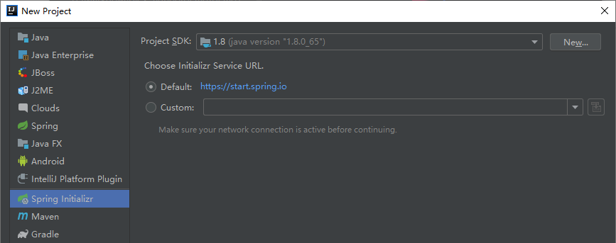
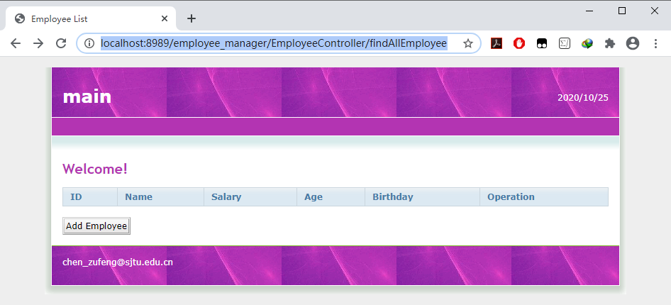

# 1 基于thymeleaf与mybatis的员工管理

项目位置：`D:\Learning\SpringBoot\SpringBootProject\EmployeeManager\EmployeeManagerDemo`

项目结构：

[开启热部署：参考文档——使用devtools开启热部署](../../SpringBoot笔记/使用devtools开启热部署.md)


## 1.1 使用Spring Initializer搭建环境

1. 点击`New->Project`，选择`Spring Initializer`：



注意：`Artifact`无法使用大写字母：


2. 选择依赖


3. 项目位置


4. 增加`mysql`版本号以及添加`druid`依赖：

```xml
<dependency>
    <groupId>mysql</groupId>
    <artifactId>mysql-connector-java</artifactId>
    <version>5.1.38</version>
    <!--<scope>runtime</scope>-->
</dependency>

<!--连接池依赖-->
<dependency>
    <groupId>com.alibaba</groupId>
    <artifactId>druid</artifactId>
    <version>1.1.19</version>
</dependency>
```

点击`Import Changes`：


5. 修改配置文件——`main\resources\application.properties`

```properties
server.port=8989
server.servlet.context-path=/employee_manager

spring.datasource.type=com.alibaba.druid.pool.DruidDataSource
spring.datasource.driver-class-name=com.mysql.jdbc.Driver
spring.datasource.url=jdbc:mysql://localhost:3306/employee_manager?characterEncoding=UTF-8
spring.datasource.username=root
spring.datasource.password=admin

mybatis.mapper-locations=classpath:/com/example/mapper/*.xml
mybatis.type-aliases-package=com.example.entity

spring.resources.static-locations=classpath:/templates/,classpath:/static/
```


6. 修改入口类——`com.example.EmployeeManagerApplication`

```java
package com.example;

import org.mybatis.spring.annotation.MapperScan;
import org.springframework.boot.SpringApplication;
import org.springframework.boot.autoconfigure.SpringBootApplication;

@SpringBootApplication
@MapperScan("com.example.dao")
public class EmployeeManagerApplication {

    public static void main(String[] args) {
        SpringApplication.run(EmployeeManagerApplication.class, args);
    }

}
```


7. 创建目录——要用`/`不要用`.`：`com/example/dao`


## 1.2 库表设计

### 1.2.1 需求与表结构分析

- 需求分析
  - 用户
    - 用户登录
    - 用户注册：先生成验证码
  - 员工
    - CRUD
- 库表结构分析
  - `table_user`
    - `id, username, realname, password, sexual`
  - `table_employee`
    - `id, name, salary, age, birthday`


### 1.2.2 使用Navicat新建库表

```mysql
CREATE DATABASE `employee_manager` CHARACTER SET 'utf8';
```


**新建查询**，创建表：


```mysql
CREATE TABLE table_user (
	id VARCHAR ( 40 ) PRIMARY KEY,
	username VARCHAR ( 40 ),
	realname VARCHAR ( 40 ),
	userpassword VARCHAR ( 40 ),
	sexual VARCHAR ( 8 ) 
);

CREATE TABLE table_employee (
	id VARCHAR ( 40 ) PRIMARY KEY,
	employeename VARCHAR ( 40 ),
	salary DOUBLE ( 7, 2 ), 
	age INT ( 3 ),
	birthday date 
);
```

点击`运行`。

可以将上述代码放置在`main/resources/com/example/sql`下`init.sql`文件中。


## 1.3 将页面引入到项目中

### 1.3.1 直接引用

在`main/resources/templates`下添加5个`html`文件；然后将`css`和`img`文件夹至于`main/resources/static`下。


运行项目，访问地址http://localhost:8989/employee_manager/login.html：


### 1.3.2 使用thymeleaf方式引用

- 在`login.html`中添加：`<html lang="en" xmlns:th="http://www.thymeleaf.org">`

- 将`href="css/style.css"`修改为**动态获取的方式**`th:href="@{/css/style.css}"`

  - 可以通过在配置文件中添加`spring.resources.static-locations=classpath:/templates/,classpath:/static/`，将`templates`模板变成静态资源。如果想使用`thymeleaf`来引用，则必须经过[控制器](# 1.4 编写控制器)。

    

## 1.4 编写控制器

- 在`main\java\com\example\controller`下编写`IndexController.java`：

```java
package com.example.controller;

import org.springframework.stereotype.Controller;
import org.springframework.web.bind.annotation.GetMapping;

/**
 * @author Chenzf
 */

@Controller
public class IndexController {
    @GetMapping("/index")
    public String toLogin() {
        return "/login";
    }
}
```

访问地址：http://localhost:8989/employee_manager/index


点击页面中`Regist`按钮，可以跳转到注册页面。

从`login.html`中可以看出(`onclick="location.href='./register.html'"`)，点击`Regist`时，是直接跳转到`templates/register.html`文件的，需要在`login.html`中**设置成跳转到控制器**：` onclick="location.href='/employee_manager/toRegisterController'"`。

- 在`IndexController`控制器添加：

```java
@GetMapping("/toRegisterController")
public String toRegisterController() {
    return "/register";
}
```

- 测试

访问地址：http://localhost:8989/employee_manager/index，点击页面中`Regist`按钮，可以跳转到注册页面：


## 1.5 注册页面的图片验证码

### 1.5.1 编写验证码生成函数

新建`com.example.utils`文件夹，放入`ValidateImageCodeUtils.java`：

```java
package com.example.utils;

import javax.imageio.ImageIO;
import java.awt.*;
import java.awt.image.BufferedImage;
import java.io.FileOutputStream;
import java.io.IOException;
import java.util.Arrays;
import java.util.Random;

public class ValidateImageCodeUtils {

    public enum SecurityCodeLevel {
        /**
         * 验证码难度级别 Simple-数字 Medium-数字和小写字母 Hard-数字和大小写字母
         */
        Simple, Medium, Hard
    };

    /**
     * 产生默认验证码，4位中等难度
     * @return 返回验证码
     */
    public static String getSecurityCode() {
        return getSecurityCode(4, SecurityCodeLevel.Medium, false);
    }

    /**
     * 产生长度和难度任意的验证码
     * @param length 验证码长度
     * @param level 验证码等级
     * @param isCanRepeat 验证码是否可重复
     * @return 返回验证码
     */
    public static String getSecurityCode(int length, SecurityCodeLevel level, boolean isCanRepeat) {
        // 随机抽取len个字符
        int len = length;
        // 字符集合（--除去易混淆的数字0,1,字母l,o,O）
        char[] codes = {
                '0', '1', '2', '3', '4', '5', '6', '7', '8', '9',
                'a', 'b', 'c', 'd', 'e', 'f', 'g', 'h', 'i', 'j', 'k', 'l', 'm', 'n', 'o', 'p', 'q', 'r', 's', 't', 'u', 'v', 'w', 'x', 'y', 'z',
                'A', 'B', 'C', 'D', 'E', 'F', 'G', 'H', 'I', 'J', 'K', 'L', 'M', 'N', 'O', 'P', 'Q', 'R', 'S', 'T', 'U', 'V', 'W', 'X', 'Y', 'Z'
        };
        // 根据不同难度截取字符串
        if (level == SecurityCodeLevel.Simple) {
            codes = Arrays.copyOfRange(codes, 0, 10);
        } else if (level == SecurityCodeLevel.Medium) {
            codes = Arrays.copyOfRange(codes, 0, 36);
        } else {
            codes = Arrays.copyOfRange(codes, 0, codes.length);
        }
        // 字符集和长度
        int n = codes.length;
        // 抛出运行时异常
        if (len > n && isCanRepeat == false) {
            throw new RuntimeException(String.format("调用SecurityCode.getSecurityCode(%1$s,%2$s,%3$s)出现异常，"
                    + "当isCanRepeat为%3$s时，传入参数%1$s不能大于%4$s", len, level, isCanRepeat, n));
        }
        // 存放抽取出来的字符
        char[] result = new char[len];
        // 判断能否出现重复字符
        if (isCanRepeat) {
            for (int i = 0; i < result.length; i++) {
                // 索引0 and n-1
                int r = (int) (Math.random() * n);
                // 将result中的第i个元素设置为code[r]存放的数值
                result[i] = codes[r];
            }
        } else {
            for (int i = 0; i < result.length; i++) {
                // 索引0 and n-1
                int r = (int) (Math.random() * n);
                // 将result中的第i个元素设置为code[r]存放的数值
                result[i] = codes[r];
                // 必须确保不会再次抽取到那个字符，这里用数组中最后一个字符改写code[r],并将n-1
                codes[r] = codes[n - 1];
                n--;
            }
        }
        return String.valueOf(result);
    }

    /**
     * 生成验证码图片
     * @param securityCode 输入验证码
     * @return 返回验证码图片
     */
    public static BufferedImage createImage(String securityCode){
        // 验证码长度
        int codeLength = securityCode.length();
        // 字体大小
        int fontSize = 18;
        int fontWidth = fontSize + 1;
        //图片宽高
        int width = codeLength * fontWidth + 6;
        int height = fontSize * 2 + 1;

        //图片
        BufferedImage image = new BufferedImage(width, height, BufferedImage.TYPE_INT_RGB);
        Graphics2D g = image.createGraphics();
        // 设置背景色
        g.setColor(Color.WHITE);
        // 填充背景
        g.fillRect(0, 0, width, height);
        // 设置边框颜色
        g.setColor(Color.LIGHT_GRAY);
        // 边框字体样式
        g.setFont(new Font("Arial", Font.BOLD, height - 2));
        // 绘制边框
        g.drawRect(0, 0, width - 1, height - 1);

        //绘制噪点
        Random rand = new Random();
        g.setColor(Color.LIGHT_GRAY);
        for (int i = 0; i < codeLength * 6; i++) {
            int x = rand.nextInt(width);
            int y = rand.nextInt(height);
            // 绘制1*1大小的矩形
            g.drawRect(x, y, 1, 1);
        }

        // 绘制验证码
        int codeY = height - 10;
        g.setColor(new Color(19,148,246));
        g.setFont(new Font("Georgia", Font.BOLD, fontSize));
        for(int i = 0; i < codeLength; i++) {
            double deg = new Random().nextDouble() * 20;
            g.rotate(Math.toRadians(deg), i * 16 + 13,codeY - 7.5);
            g.drawString(String.valueOf(securityCode.charAt(i)), i * 16 + 5, codeY);
            g.rotate(Math.toRadians(-deg), i * 16 + 13,codeY - 7.5);
        }
        g.dispose();//关闭资源
        return image;
    }

    public static void main(String[] args) throws IOException {

        String securityCode = ValidateImageCodeUtils.getSecurityCode();
        System.out.println(securityCode);

        BufferedImage image = ValidateImageCodeUtils.createImage(securityCode);
        ImageIO.write(image,"png", new FileOutputStream("validateCode.png"));
    }
}
```


### 1.5.2 开发控制器`UserController`

```java
package com.example.controller;

import com.example.utils.ValidateImageCodeUtils;
import org.springframework.stereotype.Controller;
import org.springframework.web.bind.annotation.GetMapping;
import org.springframework.web.bind.annotation.RequestMapping;

import javax.imageio.ImageIO;
import javax.servlet.ServletOutputStream;
import javax.servlet.http.HttpServletResponse;
import javax.servlet.http.HttpSession;
import java.awt.image.BufferedImage;
import java.io.IOException;

/**
 * @author Chenzf
 */

@Controller
@RequestMapping("/UserController")

public class UserController {

    @GetMapping("/validateCode")
    public void getImage(HttpSession session, HttpServletResponse response) throws IOException {
        // 生成验证码
        String validateCode = ValidateImageCodeUtils.getSecurityCode();
        BufferedImage image = ValidateImageCodeUtils.createImage(validateCode);
        // 存入session作用域
        session.setAttribute("validateCode", validateCode);
        // 响应图片
        ServletOutputStream outputStream = response.getOutputStream();
        ImageIO.write(image, "png", outputStream);
    }
}
```


访问地址：http://localhost:8989/employee_manager/UserController/validateCode


刷新页面时会更新！


### 1.5.3 将验证码放置在注册页面上

1. 使用`Thymeleaf`

   在`register.html`页面中加入如下[命名空间](# 3.6-Thymeleaf语法)：

   ```html
   <html lang="en" xmlns:th="http://www.thymeleaf.org">
   ```

   其中，`th`为`别名`！

2. 修改`register.html`页面中验证码的路径

   ```html
   验证码:
   <!--    -->
   
   ```

3. 访问地址：http://localhost:8989/employee_manager/toRegisterController会出现验证码，点击刷新按钮验证码会更新，但**点击`换一张`时，则无法刷新**！

4. 修改`register.html`页面中“换一张”：

   将

   ```html
   <a href="javascript:;" onclick="document.getElementById('num').src = 'image?'+(new Date()).getTime()">换一张</a>
   ```

   修改为：路径为`/employee_manager/UserController/validateCode`

   ```html
   <a href="javascript:;" onclick="document.getElementById('num').src = '/employee_manager/UserController/validateCode?'+(new Date()).getTime()">换一张</a>
   ```

   此时`换一张`功能正常！

   


## 1.6 注册功能

注册功能本质就是**`将用户的信息保存至数据库中`**。

### 1.6.1 创建User

在`com.example.entity`下创建`User`类：

```java
package com.example.entity;

import lombok.AllArgsConstructor;
import lombok.Data;
import lombok.NoArgsConstructor;
import lombok.ToString;

/**
 * @author Chenzf
 */

@Data
@AllArgsConstructor
@NoArgsConstructor
@ToString

public class User {
    private String id;
    private String username;
    private String realname;
    private String userpassword;
    private String sexual;
}
```


### 1.6.2 创建UserDAO接口添加保存方法

在`com.example.dao`下创建`UserDAO`接口：

```java
package com.example.dao;

import com.example.entity.User;

/**
 * @author Chenzf
 * @date 2020/10/25
 */

public interface UserDAO {
    /**
     * @param user 待保存用户
     */
    void saveUser(User user);
}
```


### 1.6.3 创建mapper配置文件

在`resources/com/example/mapper`（注意文件夹的创建方式为`/`）下创建`UserDAOMapper.xml`：

```xml
<?xml version="1.0" encoding="UTF-8" ?>
<!DOCTYPE mapper PUBLIC "-//mybatis.org//DTD Mapper 3.0//EN" "http://mybatis.org/dtd/mybatis-3-mapper.dtd">
<mapper namespace="com.example.dao.UserDAO">

    <!--saveUser-->
    <!--id和方法名一致，参数使用别名User-->
    <insert id="saveUser" parameterType="User">
        INSERT INTO table_user VALUES (#{id}, #{username}, #{realname}, #{userpassword}, #{sexual});
    </insert>

</mapper>
```

注意：`INSERT INTO table_user VALUES (#{id}...);`需要与数据库里表元素相匹配！

### 1.6.4 开发业务层service

在`com.example.service`下创建`UserService`接口：

```java
package com.example.service;

import com.example.entity.User;

/**
 * @author Chenzf 
 * @date 2020/10/25
 */

public interface UserService {
    /**
     * 注册用户
     * @param user 待注册用户
     */
    void register(User user);
}
```


创建实现类`UserServiceImpl`：

```java
package com.example.service;

import com.example.dao.UserDAO;
import com.example.entity.User;
import org.springframework.beans.factory.annotation.Autowired;
import org.springframework.stereotype.Service;
import org.springframework.transaction.annotation.Transactional;

import java.util.UUID;

/**
 * @author Chenzf
 * @date 2020/10/25
 */

@Service
@Transactional
public class UserServiceImpl implements UserService {

    @Autowired
    private UserDAO userDAO;

    @Override
    public void register(User user) {
        user.setId(UUID.randomUUID().toString());
        userDAO.saveUser(user);
    }
}
```


### 1.6.5 向UserController注入对象

==第31-40行：==

```java
package com.example.controller;

import com.example.entity.User;
import com.example.service.UserService;
import com.example.utils.ValidateImageCodeUtils;
import org.springframework.beans.factory.annotation.Autowired;
import org.springframework.stereotype.Controller;
import org.springframework.web.bind.annotation.GetMapping;
import org.springframework.web.bind.annotation.PostMapping;
import org.springframework.web.bind.annotation.RequestMapping;

import javax.imageio.ImageIO;
import javax.servlet.ServletOutputStream;
import javax.servlet.http.HttpServletResponse;
import javax.servlet.http.HttpSession;
import java.awt.image.BufferedImage;
import java.io.IOException;

/**
 * @author Chenzf
 */

@Controller
@RequestMapping("/UserController")

public class UserController {

    @Autowired
    private UserService userService;

    /**
     * 用户注册
     * @param user 待注册用户
     * @return 跳转至登录页面
     */
    @PostMapping("/register")
    public String register(User user) {
        userService.register(user);
        return "redirect:/index";
    }
    
    @GetMapping("/validateCode")
    public void getImage(HttpSession session, HttpServletResponse response) throws IOException {
        // 生成验证码
        String validateCode = ValidateImageCodeUtils.getSecurityCode();
        BufferedImage image = ValidateImageCodeUtils.createImage(validateCode);
        // 存入session作用域
        session.setAttribute("validateCode", validateCode);
        // 响应图片
        ServletOutputStream outputStream = response.getOutputStream();
        ImageIO.write(image, "png", outputStream);
    }
}
```


### 1.6.6 修改`register.html`注册部分

将原`注册`部分（原先的设置为：直接跳转至`login.html`）：

```html
<h1>
    注册
</h1>
<form action="login.html" method="post">
```

根据`UserController.java`

```java
@RequestMapping("/UserController")
@PostMapping("/register")
```

修改为：注意这里是`method`

```html
<form th:action="@{/UserController/register}" method="post">
```

其余部分做适当修改：

```html
用户名:name="username"
真实姓名:name="realname"
密码:name="userpassword"
性别:name="sexual" value="男"  name="sexual" value="女"
```


### 1.6.7 实现注册界面验证码验证功能

1. 修改`register.html`中`验证码`部分：

   将原来的

   ```html
   <input type="text" class="inputgri" name="number" />
   ```

   修改为：

   ```html
   <input type="text" class="inputgri" name="validateCode" />
   ```


2. 修改`UserController.java`中`register`方法：将`输入的验证码`与`sessionCode`比较

   ```java
   	/**
        * 用户注册
        * @param user 待注册用户
        * @return 跳转至登录页面或注册页面
        */
       @PostMapping("/register")
       public String register(User user, String validateCode, HttpSession session) {
           String seeeionCode = (String) session.getAttribute("validateCode");
           if (seeeionCode.equalsIgnoreCase(validateCode)) {
               userService.register(user);
               // 注册成功，跳转至登录页面
               return "redirect:/index";
           } else {
               // 注册失败，跳转至注册页面
               return "redirect:/toRegisterController";
           }
       }
   ```

   

### 1.6.8 注册功能测试

访问地址：http://localhost:8989/employee_manager/toRegisterController，填写相关信息后，点击`Submit`跳转到**登录页面**（`UserController.java`）：http://localhost:8989/employee_manager/index

数据库数据更新：


## 1.7 登录功能

### 1.7.1 在UserDAO接口中增加登录方法

==第18-19行==

```java
package com.example.dao;

import com.example.entity.User;
import org.apache.ibatis.annotations.Param;

/**
 * @author Chenzf
 * @date 2020/10/25
 */

public interface UserDAO {
    /**
     * 保存用户
     * @param user 待保存用户
     */
    void saveUser(User user);
    
    // 在mybatis中传递多个参数，需要参数绑定
    User login(@Param("username") String username, @Param("userpassword") String userpassword);
}
```


### 1.7.2 修改mapper配置文件

添加数据库登录语句：==第5-9行==

```xml
<?xml version="1.0" encoding="UTF-8" ?>
<!DOCTYPE mapper PUBLIC "-//mybatis.org//DTD Mapper 3.0//EN" "http://mybatis.org/dtd/mybatis-3-mapper.dtd">
<mapper namespace="com.example.dao.UserDAO">
    
    <!--登录-->
    <select id="login" resultType="User">
        SELECT id, username, realname, userpassword, sexual FROM table_user
        WHERE username = #{username} AND userpassword = #{userpassword};
    </select>

    <!--saveUser-->
    <!--id和方法名一致，参数使用别名User-->
    <insert id="saveUser" parameterType="User">
        INSERT INTO table_user VALUES (#{id}, #{username}, #{realname}, #{userpassword}, #{sexual});
    </insert>

</mapper>
```


### 1.7.3 修改业务层

1. 在`UserService`接口中添加==第17行==：

   ```java
   package com.example.service;
   
   import com.example.entity.User;
   
   /**
    * @author Chenzf
    * @date 2020/10/25
    */
   
   public interface UserService {
       /**
        * 注册用户
        * @param user 待注册用户
        */
       void register(User user);
       
       User login(String username, String userpassword);
   }
   ```

   

2. 在`UserServiceImpl`类中添加==第29-31行==：

   ```java
   package com.example.service;
   
   import com.example.dao.UserDAO;
   import com.example.entity.User;
   import org.springframework.beans.factory.annotation.Autowired;
   import org.springframework.stereotype.Service;
   import org.springframework.transaction.annotation.Transactional;
   
   import java.util.UUID;
   
   /**
    * @author Chenzf
    * @date 2020/10/25
    */
   
   @Service
   @Transactional
   public class UserServiceImpl implements UserService {
   
       @Autowired
       private UserDAO userDAO;
   
       @Override
       public void register(User user) {
           user.setId(UUID.randomUUID().toString());
           userDAO.saveUser(user);
       }
   
       @Override
       public User login(String username, String userpassword) {
           return userDAO.login(username, userpassword);
       }
   }
   ```

   

### 1.7.4 修改控制器

在`UserController.java`中添加：

```java
    /**
     * 登录功能
     * @param username 用户名
     * @param userpassword 用户密码
     * @return
     */
    @PostMapping("/login")
    public String login(String username, String userpassword) {
        User user = userService.login(username, userpassword);
        if (user != null) {
            // 跳转至员工列表
            return "redirect:/EmployeeController/findAllEmployee";
        } else {
            // 跳转至登录页面
            return "redirect:/index";
        }
    }
```


### 1.7.5 修改`login.html`

将原来的

```html
<html lang="en" xmlns:th="http://www.thymeleaf.org">
    <link rel="stylesheet" type="text/css" th:href="@{/css/style.css}" />
    
<form action="employeeList.html" method="post">
    username:<input type="text" class="inputgri" name="name" />
    password:<input type="password" class="inputgri" name="pwd" />
```

修改为

```html
<html lang="en" xmlns:th="http://www.thymeleaf.org">
    <link rel="stylesheet" type="text/css" th:href="@{/css/style.css}" />
    
    <form th:action="@{/UserController/login}" method="post"/>
    username:<input type="text" class="inputgri" name="username"/>
    password:<input type="password" class="inputgri" name="userpassword"/>
```


### 1.7.6 登录测试

访问：http://localhost:8989/employee_manager/index

- 输入用户信息并提交，页面跳转至http://localhost:8989/employee_manager/EmployeeController/findAllEmployee。
- 点击`Regist`，页面跳转至http://localhost:8989/employee_manager/toRegisterController


## 1.8 查询所有员工

### 1.8.1 创建员工实体

在`com/example/entity`下创建`Employee`类：

```java
package com.example.entity;

import lombok.AllArgsConstructor;
import lombok.Data;
import lombok.NoArgsConstructor;
import lombok.ToString;

import java.util.Date;

@Data
@AllArgsConstructor
@NoArgsConstructor
@ToString

public class Employee {
    private String id;
    private String employeename;
    private Double salary;
    private Integer age;
    private Date birthday;
}
```


### 1.8.2 创建EmployeeDAO

```java
package com.example.dao;

import com.example.entity.Employee;

import java.util.List;

/**
 * @author Chenzf 
 * @date 2020/10/26
 */

public interface EmployeeDAO {
    /**
     * 查询所有员工信息
      * @return 所有员工信息
     */
    List<Employee> findAllEmployee();
}
```


### 1.8.3 创建EmployeeDAOMapper配置文件

注意命名空间：`<mapper namespace="com.example.dao.EmployeeDAO">`

```xml
<?xml version="1.0" encoding="UTF-8" ?>
<!DOCTYPE mapper PUBLIC "-//mybatis.org//DTD Mapper 3.0//EN" "http://mybatis.org/dtd/mybatis-3-mapper.dtd">
<mapper namespace="com.example.dao.EmployeeDAO">

    <!--findAllEmployee-->
    <select id="findAllEmployee" resultType="Employee">
        SELECT * FROM table_employee;
    </select>

</mapper>
```


### 1.8.4 开发业务层

1. 创建`EmployeeService`接口：

   ```java
   package com.example.service;
   
   import com.example.entity.Employee;
   
   import java.util.List;
   
   /**
    * @author Chenzf 
    * @date 2020/10/26
    */
   
   public interface EmployeeService {
       /**
        * 查询所有员工信息
        * @return 所有员工信息
        */
       List<Employee> findAllEmployee();
   }
   ```


2. 创建接口实现类`EmployeeServiceImpl`：

   ```java
   package com.example.service;
   
   import com.example.dao.EmployeeDAO;
   import com.example.entity.Employee;
   import org.springframework.beans.factory.annotation.Autowired;
   import org.springframework.stereotype.Service;
   import org.springframework.transaction.annotation.Propagation;
   import org.springframework.transaction.annotation.Transactional;
   
   import java.util.List;
   
   /**
    * @author Chenzf 
    * @date 2020/10/26
    */
   
   @Service
   @Transactional
   public class EmployeeServiceImpl implements EmployeeService {
       
       @Autowired
       private EmployeeDAO employeeDAO;
       
       @Override
       @Transactional(propagation = Propagation.SUPPORTS)
       public List<Employee> findAllEmployee() {
           return employeeDAO.findAllEmployee();
       }
   }
   ```


### 1.8.5 创建控制器`EmployeeController`

```java
package com.example.controller;

import com.example.entity.Employee;
import com.example.service.EmployeeService;
import org.springframework.beans.factory.annotation.Autowired;
import org.springframework.stereotype.Controller;
import org.springframework.ui.Model;
import org.springframework.web.bind.annotation.GetMapping;
import org.springframework.web.bind.annotation.RequestMapping;

import java.util.List;

@Controller
@RequestMapping("/EmployeeController")
public class EmployeeController {

    @Autowired
    private EmployeeService employeeService;

    @GetMapping("/findAllEmployee")
    public String findAllEmployee(Model model) {
        List<Employee> employees = employeeService.findAllEmployee();
        model.addAttribute("employees", employees);
        return "/employeeList";
    }
}
```


### 1.8.6 修改`employeeList.html`

1. 引入命名空间`<html lang="en" xmlns:th="http://www.thymeleaf.org">`

2. 解析样式`<link rel="stylesheet" type="text/css" th:href="@{/css/style.css}" />`

3. 对结果进行遍历

   ```html
   <tr class="row1" th:each="employee:${employees}">
       <td>
           <span th:text="${employee.id}"/>
       </td>
   	<td>
   		<span th:text="${employee.employeename}"/>
   	</td>
   	<td>
   		<span th:text="${employee.salary}"/>
   	</td>
   	<td>
   		<span th:text="${employee.age}"/>
   	</td>
   	<td>
   		<span th:text="${#dates.format(employee.birthday, 'yyyy-MM-dd')}"/>
   	</td>
   	<td>
   		<a th:href="emplist.html">delete</a>&nbsp;
   		<a th:href="updateEmployee.html">update</a>
   	</td>
   </tr>
   ```


### 1.8.7 查询所有员工测试

访问地址：http://localhost:8989/employee_manager/EmployeeController/findAllEmployee




## 1.9 添加员工

### 1.9.1 通过`IndexController`控制器访问`EmployeeList`模板

1. 在`EmployeeList.html`页面中添加`Add Employee`按钮：

   将原来的

   ```html
   <input type="button" class="button" value="Add Employee" onclick="location='addEmployee.html'"/>
   ```

   修改为

   ```html
   <input type="button" class="button" value="Add Employee" onclick="location.href='/employee_manager/AddEmployee'"/>
   ```

   **向控制器发起请求，然后由控制器跳转到对应的模板**（`thymeleaf`必须通过控制器来访问模板视图）！

2. 在`IndexController.java`添加控制语句：

   ```java
   @GetMapping("/AddEmployee")
   public String addEmployee() {
       return "/addEmployee";
   }
   ```


3. 访问地址：http://localhost:8989/employee_manager/EmployeeController/findAllEmployee，点击`Add Employee`按钮，进入添加员工界面

   


### 1.9.2 将添加的员工信息添加至数据库

1. 修改`EmployeeDAO`，添加`addEmployee`方法：==第23行==

   ```java
   package com.example.dao;
   
   import com.example.entity.Employee;
   
   import java.util.List;
   
   /**
    * @author Chenzf
    * @date 2020/10/26
    */
   
   public interface EmployeeDAO {
       /**
        * 查询所有员工信息
         * @return 所有员工信息
        */
       List<Employee> findAllEmployee();
   
       /**
        * 添加员工
        * @param employee 待添加员工
        */
       void addEmployee(Employee employee);
   }
   ```


2. 在`EmployeeDAOMapper.xml`中添加`mysql`语句（==第10-13行==）：

   ```xml
   <!--addEmployee-->
   <insert id="addEmployee" parameterType="Employee">
       INSERT INTO table_employee VALUES (#{id}, #{employeename}, #{salary}, #{age}, #{birthday});
   </insert>
   ```

   

3. 开发业务层

   - 在`EmployeeService.java`添加`void addEmployee(Employee employee);`
   - 在`EmployeeServiceImpl`实现上述方法

   ```java
   @Override
   public void addEmployee(Employee employee) {
       employee.setId(UUID.randomUUID().toString());
       employeeDAO.addEmployee(employee);
   }
   ```


4. 修改`EmployeeController`

   ```java
   @PostMapping("/AddEmployee")
   public String addEmployee(Employee employee) {
       employeeService.addEmployee(employee);
       // 跳转到当前控制器findAllEmployee，由控制器去访问模板
       return "redirect:/EmployeeController/findAllEmployee";
   }
   ```

   

5. 修改`addEmplyee.html`

   将原来的

   ```html
   <link rel="stylesheet" type="text/css" href="css/style.css" />
   
   <h1>
       Add Employee Information:
   </h1>
   <form action="employeeList.html" method="post">
   ```

   修改为

   ```html
   <html lang="en" xmlns:th="http://www.thymeleaf.org">
       
   <link rel="stylesheet" type="text/css" th:href="@{/css/style.css}" />
       
   <form th:action="@{/EmployeeController/AddEmployee}" method="post">
   ```

   并修改属性：

   ```html
   <tr>
       <td valign="middle" align="right">
           name:
   	</td>
   	<td valign="middle" align="left">
           <input type="text" class="inputgri" name="employeename" />
   	</td>
   </tr>
   ```

   

### 1.9.3 测试添加功能

访问地址：http://localhost:8989/employee_manager/AddEmployee（不是去访问http://localhost:8989/employee_manager/EmployeeController/AddEmployee），填写相关信息后，点击`Confirm`按钮，进入员工列表界面：


## 1.10 修改员工信息

### 1.10.1 删除员工信息

1. 修改`employeeList.html`中`delete`所对应的连接

   将原来的

   ```html
   <td>
       <a href="emplist.html">delete</a>&nbsp;
   	<a href="updateEmployee.html">update</a>
   </td>
   ```

   修改为

   ```html
   <a th:href="@{/EmployeeController/DeleteEmployee(id=${employee.id})}">delete</a>&nbsp;
   ```


2. 修改`EmployeeDAO`，添加`deleteEmployee`方法：`void deleteEmployee(String id);`

3. 在`EmployeeDAOMapper.xml`中添加`mysql`语句：

   ```xml
   <!--deleteEmployee-->
   <delete id="deleteEmployee" parameterType="String">
       DELETE FROM table_employee WHERE id = #{id};
   </delete>
   ```


4. 开发业务层

   - 在`EmployeeService.java`添加`void deleteEmployee(String id);`
   - 在`EmployeeServiceImpl`实现上述方法

   ```java
   @Override
   public void deleteEmployee(String id) {
       employeeDAO.deleteEmployee(id);
   }
   ```


5. 修改`EmployeeController`

   ```java
   @GetMapping("/DeleteEmployee")
   public String deleteEmployee(String id) {
       employeeService.deleteEmployee(id);
       // 跳转到当前控制器findAllEmployee，由控制器去访问模板
       return "redirect:/EmployeeController/findAllEmployee";
   }
   ```


6. 测试

   测试地址：http://localhost:8989/employee_manager/EmployeeController/findAllEmployee，点击`delete`。


### 1.10.2 更新员工信息

#### 1.10.2.1 先查

1. 修改`employeeList.html`中`update`所对应的连接

   将原来的

   ```html
   <a href="updateEmployee.html">update</a>
   ```

   修改为

   ```html
   <a th:href="@{/EmployeeController/FindEmployee(id=${employee.id})}">update</a>
   ```

   

2. 修改`EmployeeDAO`，添加`findEmployee`方法（根据`id`先找到对应的员工）：`Employee findEmployee(String id);`

3. 在`EmployeeDAOMapper.xml`中添加`mysql`语句：

   ```xml
   <!--findEmployee根据id查询员工-->
   <select id="findEmployee" parameterType="String" resultType="Employee">
       SELECT id, employeename, salary, age, birthday FROM table_employee
       WHERE id = #{id};
   </select>
   ```


4. 开发业务层

   - 在`EmployeeService.java`添加`Employee findEmployee(String id);`

   - 在`EmployeeServiceImpl`实现上述方法

     ```java
     @Override
     @Transactional(propagation = Propagation.SUPPORTS)
     public Employee findEmployee(String id) {
         return employeeDAO.findEmployee(id);
     }
     ```

     

5. 修改`EmployeeController`

   ```java
   /**
   * 根据id查找员工
   * @param id 待查找员工id
   * @param model
   * @return updateEmployee.html
   */
   @GetMapping("/FindEmployee")
   public String findEmployee(String id, Model model) {
       Employee employee = employeeService.findEmployee(id);
       model.addAttribute("employee", employee);
       return "updateEmployee";
   }
   ```


6. 修改`updateEmployee.html`

   - 命名空间：`<html lang="en" xmlns:th="http://www.thymeleaf.org">`

   - 修改样式引用：`th:href="@{/css/style.css}"`

   - 将原属性

     ```html
     <table cellpadding="0" cellspacing="0" border="0"
            class="form_table">
         <tr>
             <td valign="middle" align="right">
                 id:
             </td>
     		<td valign="middle" align="left">
                 1
     		</td>
     	</tr>
     	<tr>
             <td valign="middle" align="right">
                 name:
     		</td>
     		<td valign="middle" align="left">
                 <input type="text" class="inputgri" name="name" value="zhangshan"/>
     		</td>
     	</tr>
     	<tr>
             <td valign="middle" align="right">
                 salary:
             </td>
     		<td valign="middle" align="left">
                 <input type="text" class="inputgri" name="salary" value="20000"/>
             </td>
     	</tr>
     	<tr>
             <td valign="middle" align="right">
                 age:
             </td>
     		<td valign="middle" align="left">
                 <input type="text" class="inputgri" name="age" value="20"/>
     		</td>
     	</tr>
     	<tr>
             <td valign="middle" align="right">
                 birthday:
             </td>
     		<td valign="middle" align="left">
                 <input type="text" class="inputgri" name="birthday" value="1993/11/10"/>
     		</td>
     	</tr>
     </table>
     ```

     修改为

     ```html
     <table cellpadding="0" cellspacing="0" border="0"
            class="form_table">
         <tr>
             <td valign="middle" align="right">
                 id:
             </td>
     		<td valign="middle" align="left">
                 <span th:text="${employee.id}"/>
     		</td>
     	</tr>
     	<tr>
             <td valign="middle" align="right">
                 name:
     		</td>
     		<td valign="middle" align="left">
                 <input type="text" class="inputgri" name="employeename" th:value="${employee.employeename}"/>
     		</td>
     	</tr>
     	<tr>
             <td valign="middle" align="right">
                 salary:
             </td>
     		<td valign="middle" align="left">
                 <input type="text" class="inputgri" name="salary" th:value="${employee.salary}"/>
             </td>
     	</tr>
     	<tr>
             <td valign="middle" align="right">
                 age:
             </td>
     		<td valign="middle" align="left">
                 <input type="text" class="inputgri" name="age" th:value="${employee.age}"/>
     		</td>
     	</tr>
     	<tr>
             <td valign="middle" align="right">
                 birthday:
             </td>
     		<td valign="middle" align="left">
                 <input type="text" class="inputgri" name="birthday" th:value="${#dates.format(employee.birthday, 'yyyy/MM/dd')}"/>
     		</td>
     	</tr>
     </table>
     ```


7. 测试地址：http://localhost:8989/employee_manager/EmployeeController/findAllEmployee，点击`update`按钮：

   


#### 1.10.2.2 后改

1. 修改`updateEmployee.html`

   - 将原来的提交路径

     ```html
     <form action="employeeList.html" method="post">
     ```

     修改为

     ```html
     <form th:action="@{/EmployeeController/Update}" method="post">
     ```

   

   - 对`id`属性进行修改，添加==第2行==

     ```html
     <span th:text="${employee.id}"/>
     <input type="hidden" th:value="${employee.id}" name="id">
     ```

     

2. 修改`EmployeeDAO`，添加`update`方法：`void update(Employee employee);`

3. 在`EmployeeDAOMapper.xml`中添加`mysql`语句：

   ```xml
   <!--update更新员工信息-->
   <update id="update" parameterType="Employee">
       UPDATE table_employee SET employeename = #{employeename}, salary = #{salary}, age = #{age}, birthday = #{birthday}
       WHERE id = #{id};
   </update>
   ```


4. 开发业务层

   - 在`EmployeeService.java`添加`void update(Employee employee);`

   - 在`EmployeeServiceImpl`实现上述方法

     ```java
     @Override
     public void update(Employee employee) {
         employeeDAO.update(employee);
     }
     ```

     

5. 修改`EmployeeController`

   ```java
   /**
   * 更新员工信息
   * @param employee 待更新员工
   * @return 员工信息列表
   */
   @PostMapping("/Update")
   public String update(Employee employee) {
       employeeService.update(employee);
       return "redirect:/EmployeeController/findAllEmployee";
   }
   ```

   

6. 测试

   1. 访问http://localhost:8989/employee_manager/EmployeeController/findAllEmployee

   2. 点击`update`，进入链接http://localhost:8989/employee_manager/EmployeeController/FindEmployee?id=f9952d7b-76ca-4980-add2-9c1e3871676a，修改信息并点击`Confirm`

      