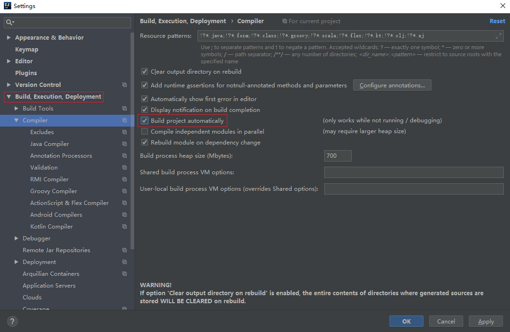
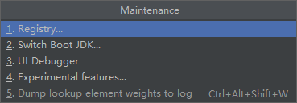
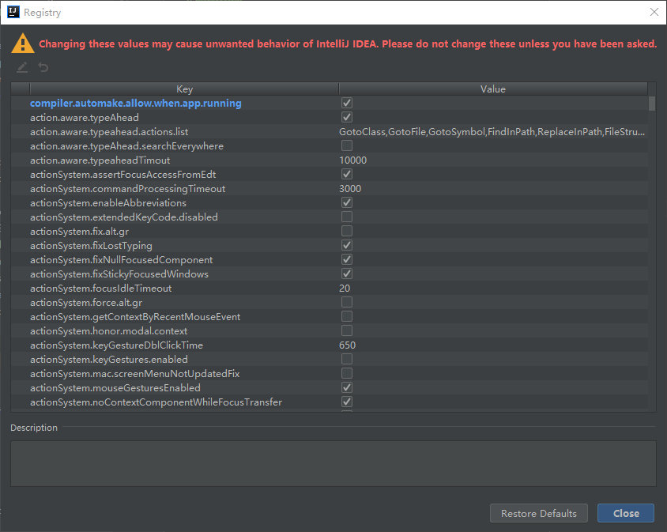
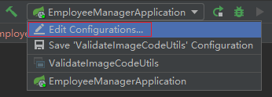
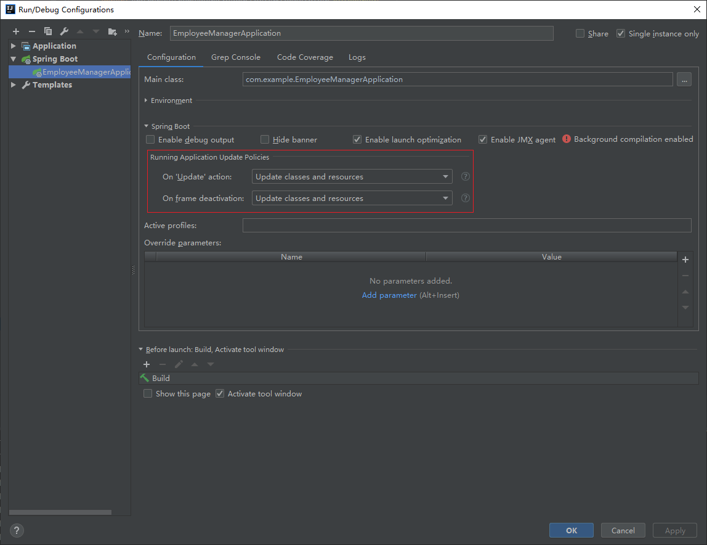

# 使用devtools开启热部署

为了进一步提高开发效率，Spring Boot为我们提供了`全局项目热部署`，日后在开发过程中修改了部分代码以及相关配置文件后，`不需要每次重启使修改生效`，在项目中开启了Spring Boot全局热部署之后只需要在修改之后等待几秒即可使修改生效。

## 热部署原理

使用热部署后会在`JVM`中产生两个类加载器（默认只有一个）：`ClassLoader1、ClassLoader2`，`devtools`会进行循环地切换两个类加载器来实现热部署。

两个类加载器会对`JVM`产生一定的影响，因此`仅在开发时使用热部署`！

## 开启热部署

### 在项目中引入依赖

在`pom.xml`中添加：

```xml
<dependency>
   <groupId>org.springframework.boot</groupId>
   <artifactId>spring-boot-devtools</artifactId>
   <optional>true</optional>
</dependency>
```

然后点击`Import Changes`。

### 将IDEA设置为支持自动编译

1. **开启自动编译**：`IDEA`是在运行时才编译一次`class`，不会随着修改自动进行编译



2. 开启允许在过程中修改文件——切换`ClassLoader`

   - 快捷键：`Ctrl` + `Alt` + `Shift` + `/`，然后选择`1.Registry`

   

   - 勾选`compiler.automake.allow.when.app.running`

   

3. 日志出现`restartedMain`代表已经生效！`重新启动IDEA`方能使用！

4. 解决热部署时而有效时而不起作用的现象

   

   