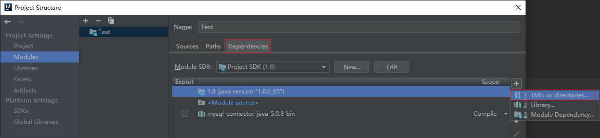

# junit作用

一般会采用`main`函数来进行运行，测试所写的代码：

```java
public class SumMain {
    public static int sum(int i, int j) {
        return i + j;
    }
    
    public static void main(String[] args) {
        int result = sum(1, 2);
        System.out.println(result);
    }
}
```

通过main方法来进行测试的问题是显而易见的。

比如新开发了一个方法，是对3个数求和，那么至少有两个问题：

1. 要在原来测试的基础上修改，可能破坏原来的测试逻辑
2. 测试成功了，还是测试失败了，都无法知晓。只能通过肉眼进行观察，如果测试的量很大，该方法不合适！


为了应付这种测试的需求，我们就需要使用 junit 测试框架来进行测试工作。

首先下载`jar`包，导入到项目中：需要导入两个`jar`包（`junit-4.13.1.jar`和`hamcrest-core-1.3.jar`）



导入成功：


编写测试方法：

```java
import org.junit.Assert;
import org.junit.Test;

public class JunitTest {
    @Test
    public void testSum() {
        int result = SumMain.sum(1, 2);
        System.out.println(result);
        Assert.assertEquals(result, 32);
    }
}
```

输出

```java
3

java.lang.AssertionError: 
Expected :3
Actual   :32
```

